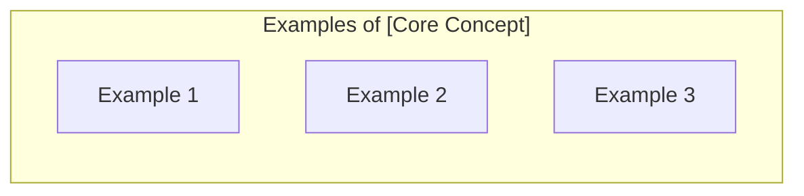
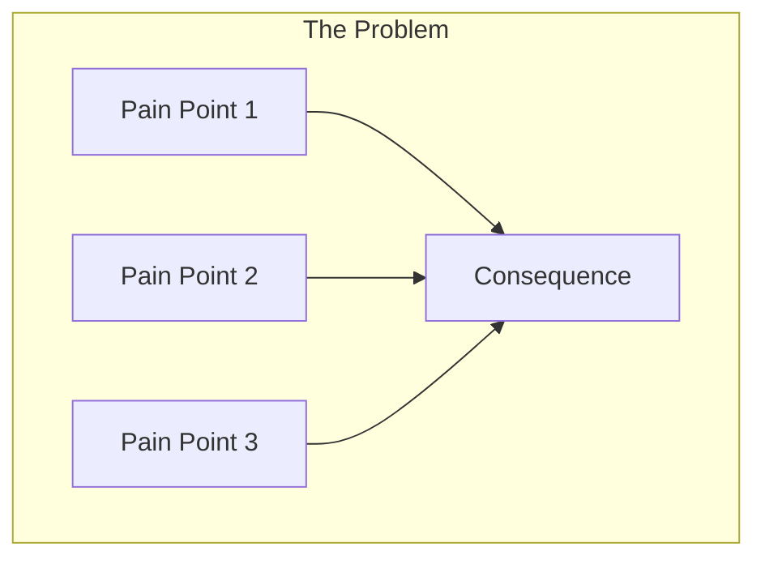
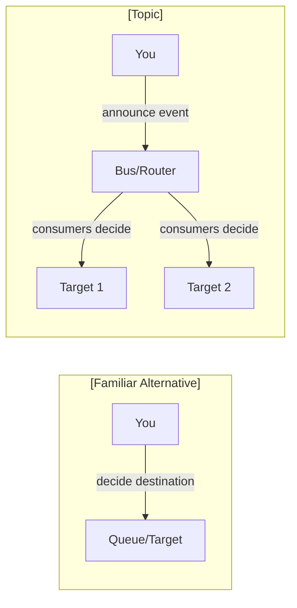
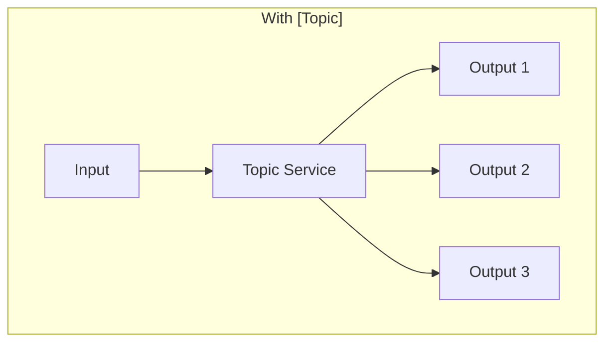

# [Chapter Title]: [Compelling Subtitle]

<!--
=== CHAPTER OVERVIEW GUIDELINES ===

This is REAL TEACHING CONTENT, not a table of contents.

THE WIKIPEDIA TEST: Could someone read ONLY this page and understand the topic
well enough to discuss it intelligently? If no, the page is too thin.

THE "TEACH, DON'T SUMMARIZE" PRINCIPLE: A sentence or two is NOT enough when
explaining complex services. Every section must explain concepts THOROUGHLY
with multiple paragraphs, examples, and context.

Target length: 2500-4000 words

MUST INCLUDE:
1. What is it? (400-600 words) - THOROUGH definition with examples and analogies
2. Why does it exist? (400-600 words) - The problem it solves with story
3. How would you solve this WITHOUT it? (500-800 words) - Manual approach with CODE
4. How does it work? (500-800 words) - Core mechanism with diagram AND explanation
5. How is it different? (400-600 words) - DETAILED comparison with alternatives
6. What you'll learn (200-300 words) - Chapter roadmap with context

EXPLANATION DEPTH:
- Simple concepts: 2-3 sentences + example
- Medium concepts: 1-2 paragraphs + diagram or code
- Complex concepts: 3-5 paragraphs + diagram + example + comparison

THE "EXPLAIN IT THREE WAYS" TECHNIQUE:
1. State it - What is it? (definition)
2. Illustrate it - What does it look like? (example, diagram, or analogy)
3. Contrast it - What is it NOT? (comparison with familiar concepts)

RELATIONSHIP TO SUB-CHAPTERS:
- This page TEACHES the concept completely at a high level
- Sub-chapters DEEPEN understanding with implementation details
- Someone could skip sub-chapters and still "get it" from this page
-->

## What is [Topic]?

<!--
THOROUGH EXPLANATION REQUIRED (400-600 words)

Start with the SIMPLEST definition. Assume zero knowledge.
Then BUILD understanding with:
1. An everyday analogy that makes the concept click
2. Multiple concrete examples
3. What it looks like in practice
4. The key insight that ties it together

DO NOT just give a definition and move on. EXPLAIN until the reader
truly understands, even if they've never heard of this before.
-->

**[Topic] is [one sentence definition that a smart 12-year-old could understand].**

Think about it this way: [analogy to everyday experience - EXPAND this into a full
paragraph that really explains the analogy, not just a sentence].

[Add another paragraph explaining WHY this analogy works and what aspects of
the technology it captures. Help the reader's mental model form correctly.]



In software, [Topic] shows up whenever:
- **[Example 1]**: [2-3 sentences explaining HOW this relates to the concept, not just THAT it does]
- **[Example 2]**: [2-3 sentences with specific details]
- **[Example 3]**: [2-3 sentences showing a different angle]

Here's what [Topic] actually looks like in practice:

```json
{
    // Show actual data/code with comments explaining each part
    // Don't just show structure - explain what each field means
}
```

[Explain what we're looking at in the code/JSON above. What do readers need to notice?
What's important? What might surprise them?]

**The key insight:** [One paragraph capturing the fundamental concept in a memorable way.
This should be the "aha" moment that ties everything together.]

---

## The Problem: Why [Topic] Exists

<!--
THOROUGH PROBLEM DESCRIPTION REQUIRED (400-600 words)

Show a relatable scenario. Use the story. Make it emotional.
The reader should think "yes, I've felt that pain!"

But don't just state the problem - EXPLORE it:
- What specifically goes wrong?
- Why can't you just do X or Y?
- What are the consequences?
- Why do smart people still fall into this trap?
-->

[Protagonist] at [Company] learned about [topic] the hard way.

[Story setup - 3-4 paragraphs describing the situation in DETAIL. Don't just say
"things went wrong" - describe specifically what happened, what the symptoms were,
what the team tried, and why those attempts didn't work.]

[Include specific numbers and details: "38,000 messages lost" not "many messages lost";
"Response time jumped from 200ms to 12 seconds" not "the app slowed down"]



[Explain the diagram - what are readers looking at? Why does this architecture
lead to these problems? What's the root cause?]

The core issues were:

1. **[Pain Point 1]:** [2-3 sentences explaining this specific problem in detail.
   Include an example of what this looks like in practice.]

2. **[Pain Point 2]:** [2-3 sentences. Be specific about the consequences.]

3. **[Pain Point 3]:** [2-3 sentences. Connect to real developer experience.]

"[Quote expressing frustration]," [Protagonist] said. "[Additional context that
shows they understood WHY it was frustrating, not just THAT it was frustrating.]"

---

## "But Why Not Just Use [Familiar Alternative]?"

<!--
THOROUGH COMPARISON REQUIRED (400-600 words)

ADDRESS THE SKEPTICISM EARLY. Readers know something simpler. Why learn this?
This is about MENTAL MODELS, not just feature comparison.

Don't just list differences - EXPLAIN the paradigm shift:
- What changes in how you THINK about the problem?
- Why does that mental shift matter in practice?
- Give concrete scenarios where each approach shines

Readers should finish this section thinking "Oh, NOW I see why this exists!"
-->

Good question. Most developers ask this because they already know [Familiar Alternative]
and it seems to solve a similar problem. Let's break down what's actually different.

**[Familiar Alternative]** works like this:
- You [action the reader already knows]
- [What happens as a result]
- **You (the publisher/sender) decide** [what decision you make]

[Add a paragraph explaining WHY [Familiar Alternative] was designed this way.
What problem was IT solving? This context helps readers understand the evolution.]

**[Topic]** works differently:
- You [different action]
- [Different result]
- **[Someone else] decides** [what decision they make]

[Add a paragraph explaining the PARADIGM SHIFT. Don't just say "it's different" -
explain what changes in how you think about the problem. Use an analogy if it helps.]

**The fundamental shift:** [One sentence paradigm change - this is the "aha" moment]

[Now expand on that shift with 2-3 sentences explaining WHY this matters.
Connect it to real-world consequences like maintainability, flexibility, debugging.]



[Explain the diagram in 2-3 sentences. What should readers notice? What's the key
visual takeaway that makes the difference click?]

| Aspect | [Familiar Alternative] | [Topic] |
|--------|------------------------|---------|
| **Who decides routing?** | Publisher | Consumer |
| **Coupling** | Tight | Loose |
| **Adding consumers** | Change publisher | Add a rule |
| **[Aspect 4]** | [Old way] | [New way] |
| **[Aspect 5]** | [Old way] | [New way] |

[Add a paragraph interpreting this table. Don't assume the reader will draw the
right conclusions. What's the most important row and why?]

**Use [Familiar Alternative] when:** [specific scenarios - be concrete, not vague.
"When you have 1-3 known consumers" not "when it's simpler"]

**Use [Topic] when:** [specific scenarios - be concrete. "When consumers might be
added without changing the publisher" not "when you need flexibility"]

---

## How You'd Solve This Without [Topic]

<!--
THOROUGH "BEFORE" PICTURE REQUIRED (500-800 words)

THIS SECTION IS CRITICAL. Show the "before" picture.
Be specific - show actual approaches, not just vague descriptions.

For each approach:
1. Show real code (not pseudocode) - at least 10-20 lines
2. Explain what the code is doing (don't assume it's obvious)
3. Explain the specific pain points with concrete examples
4. Include numbers where possible ("this adds 200ms latency")

The goal: readers should feel the pain BEFORE seeing the solution.
-->

Before [Topic], you'd handle this problem by:

### Approach 1: [Manual Method]

[Start with 2-3 sentences explaining what this approach involves at a high level.
Set the context before showing code.]

```[language]
// Example code showing the manual approach
// Include at least 15-20 lines of realistic code
// Add comments explaining what each section does
// Show enough detail that readers see the complexity
```

[Explain the code above in 2-3 sentences. What are we looking at? What should
readers notice about this approach?]

**The problems with this approach:**

1. **[Specific Pain 1]:** [2-3 sentences with a concrete example. "Every time you
   add a new service, you need to modify the publisher code. Last month this meant
   changing 47 files when we added analytics."]

2. **[Specific Pain 2]:** [2-3 sentences. Include metrics where possible. "Testing
   this requires mocking 8 different dependencies, taking 3-4 hours per new integration."]

### Approach 2: [Alternative Service/Method]

[Start with 2-3 sentences explaining what this approach involves and why it seems
like it might work.]

```[language]
// Example showing alternative approach
// Include at least 15-20 lines of realistic code
// Show how this is different from Approach 1
```

[Explain the code. What's the idea here? Why do teams try this approach?]

**The problems with this approach:**

1. **[Specific Pain 1]:** [2-3 sentences explaining why this approach still falls short]

2. **[Specific Pain 2]:** [2-3 sentences with concrete consequences]

### Why These Approaches Hurt

[Add a paragraph synthesizing the problems. What's the COMMON underlying issue
that makes all manual approaches painful? Help readers see the pattern.]

| Pain Point | Impact | Real-World Example |
|------------|--------|-------------------|
| **[Pain 1]** | [Specific consequence] | [Brief concrete example] |
| **[Pain 2]** | [Specific consequence] | [Brief concrete example] |
| **[Pain 3]** | [Specific consequence] | [Brief concrete example] |
| **[Pain 4]** | [Specific consequence] | [Brief concrete example] |

[Add 2-3 sentences after the table connecting these pains to what's coming next.
Build anticipation for the solution.]

---

## How [Topic] Solves This

<!--
THOROUGH SOLUTION EXPLANATION REQUIRED (500-800 words)

Now reveal the solution. Show the contrast with what came before.
Include a diagram showing the improved architecture.

This is the PAYOFF section - don't rush it:
1. Start with the core insight that makes [Topic] work
2. Show a clear architecture diagram with explanation
3. Walk through HOW it works step by step
4. Show the dramatic "before and after" contrast
5. Include code showing how simple the new approach is
-->

"What you need," [Mentor] explained, "is [simple description of solution]."

[Add 2-3 sentences expanding on this insight. Why does this approach work where
the others failed? What's the key architectural change?]



[Explain the diagram in 3-4 sentences. Walk readers through the flow. Point out
what's DIFFERENT from the manual approaches shown earlier. Help them see the
simplification.]

### How It Works (The Simple Version)

[Before listing steps, add 2-3 sentences providing context. What's the mental
model readers should have? What should they be thinking about as they read these steps?]

1. **[Step 1]** - [2-3 sentences explaining what happens and why it's better.
   Don't just state what happens - explain the benefit.]

2. **[Step 2]** - [2-3 sentences. Connect to the problems shown earlier - how
   does this step address a specific pain point?]

3. **[Step 3]** - [2-3 sentences. Emphasize what the developer DOESN'T have to
   do anymore.]

### What the Code Looks Like Now

```[language]
// Show the equivalent code using [Topic]
// This should be DRAMATICALLY simpler than the manual approaches
// Include comments highlighting the simplification
```

[Explain the code in 2-3 sentences. Contrast with the earlier manual code.
Make the simplification explicit: "Instead of 47 lines managing connections,
we now have 5 lines that just publish the event."]

### The Before and After

| Aspect | Without [Topic] | With [Topic] |
|--------|-----------------|--------------|
| **[Aspect 1]** | [Old way with details] | [New way with details] |
| **[Aspect 2]** | [Old way with details] | [New way with details] |
| **[Aspect 3]** | [Old way with details] | [New way with details] |
| **[Aspect 4]** | [Old way with details] | [New way with details] |
| **[Aspect 5]** | [Old way with details] | [New way with details] |

[Add 2-3 sentences interpreting the table. What's the most dramatic improvement?
What should readers take away from this comparison?]

---

## What Makes [Topic] Different from [Alternative]?

<!--
THOROUGH SERVICE COMPARISON REQUIRED (400-600 words)

Compare with the most common alternative. Explain WHEN to use each.

This is often the EXAM GOLD - comparison questions are common.
Don't just list features - explain the DESIGN PHILOSOPHY behind each service.
Help readers understand WHY they're different, not just HOW.
-->

"Wait," [Character] asked, "how is this different from [Alternative]?"

Great question. This is one of the most common points of confusion, so let's break it down.

[Add a paragraph explaining that both services exist for a reason - they're not
competing, they're designed for different problems. Set up the comparison as
"choosing the right tool" not "one is better."]

### [Alternative]: Built for [Primary Purpose]

**[Alternative]** is designed for [use case]. It [2-3 sentences explaining HOW
it works at a conceptual level - not features, but the core mechanism].

[Add another paragraph explaining the design philosophy. WHY was it built this way?
What problem was AWS solving? What trade-offs did they make?]

### [Topic]: Built for [Different Purpose]

**[Topic]** is designed for [different use case]. It [2-3 sentences explaining
HOW it works - the core mechanism that makes it different].

[Add another paragraph explaining THIS service's design philosophy. What trade-offs
are different? What's the key insight that led to this design?]

### Side-by-Side Comparison

| Feature | [Alternative] | [Topic] |
|---------|---------------|---------|
| **Primary purpose** | [Core use case] | [Core use case] |
| **Message routing** | [How it routes] | [How it routes] |
| **[Feature 1]** | [Value with brief explanation] | [Value with brief explanation] |
| **[Feature 2]** | [Value with brief explanation] | [Value with brief explanation] |
| **[Feature 3]** | [Value with brief explanation] | [Value with brief explanation] |
| **[Feature 4]** | [Value with brief explanation] | [Value with brief explanation] |

[Add 2-3 sentences interpreting the most important rows. What pattern should
readers notice? What's the key differentiator that determines which to use?]

### Decision Framework

**Use [Alternative] when:**
- [Specific scenario 1 with example: "You have exactly 3 known consumers and they
  won't change" not "it's simpler"]
- [Specific scenario 2 with example]
- [Specific scenario 3 with example]

**Use [Topic] when:**
- [Specific scenario 1 with example: "New subscribers might be added without
  changing publisher code"]
- [Specific scenario 2 with example]
- [Specific scenario 3 with example]

**Can you use both?** [2-3 sentences explaining whether and how they complement
each other. Often the answer is yes - explain the pattern.]

---

## What You'll Learn in This Chapter

By the end of this chapter, you'll be able to:

| Skill | What You'll Learn | Why It Matters |
|-------|-------------------|----------------|
| **[Skill 1]** | [Description] | [Real-world application] |
| **[Skill 2]** | [Description] | [Real-world application] |
| **[Skill 3]** | [Description] | [Real-world application] |
| **[Skill 4]** | [Description] | [Real-world application] |

### Chapter Roadmap

**Deep Dives (Expanding on this overview):**
1. **[Concept] Deep Dive** - [What new value this adds beyond the overview]
2. **The Problem in Detail** - [Real code, real debugging scenarios]
3. **[Topic] Architecture** - [How it works under the hood]

**Core Features:**
4. **[Feature 1]** - [Brief description]
5. **[Feature 2]** - [Brief description]
6. **[Feature 3]** - [Brief description]

**Advanced Topics:**
7. **[Advanced 1]** - [Brief description]
8. **[Advanced 2]** - [Brief description]

**Conclusion:**
9. **[Protagonist]'s Solution** - Putting it all together

---

## Why This Matters for the Exam

<!--
For certification courses. Adjust or remove for non-cert courses.
-->

The [Certification] exam tests [Topic] frequently. Expect:

- **[X] direct questions** about [Topic] concepts
- **Architecture questions** where [Topic] is the solution
- **Comparison questions** ([Topic] vs [Alternative])

| Exam Topic | What They Ask |
|------------|---------------|
| **[Concept 1]** | [Question pattern] |
| **[Concept 2]** | [Question pattern] |
| **[Concept 3]** | [Question pattern] |

---

*Ready to go deeper? The sub-chapters expand on everything above with implementation details, real code examples, and hands-on practice. Start with **[First Sub-chapter Title]** to explore [concept] in depth.*

