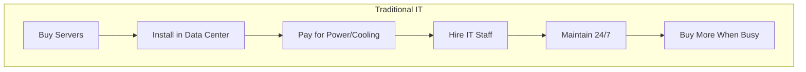
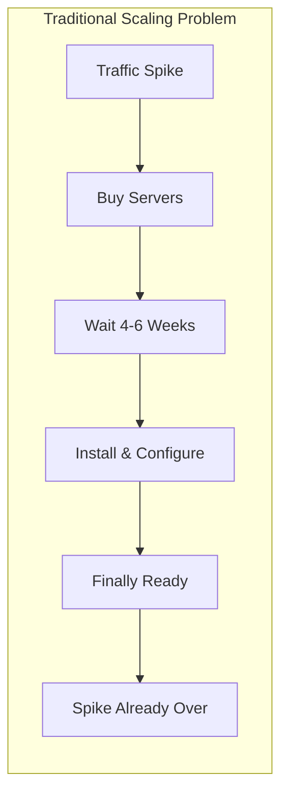
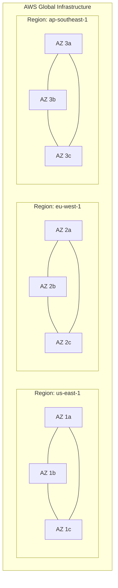
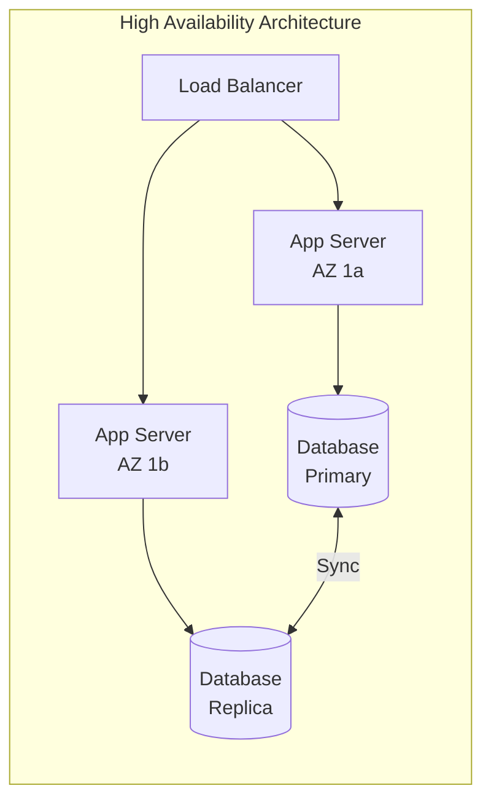
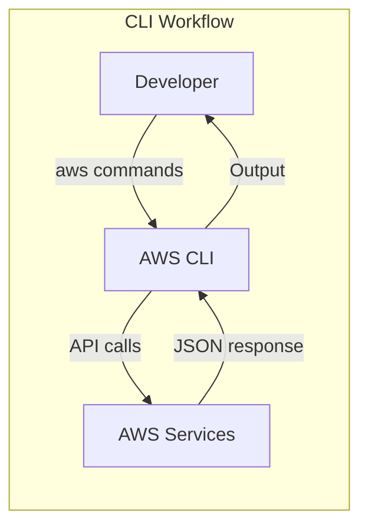

# AWS Fundamentals and Developer Tools: Your First Day in the Cloud

## What is AWS?

**AWS (Amazon Web Services) is a collection of computing services that let you rent infrastructure instead of buying and maintaining your own servers.**

Think of it like the difference between owning a car and using Uber. When you own a car, you pay for the vehicle upfront, handle maintenance, pay for insurance whether you drive or not, and worry about parking. With Uber, you pay only when you need a ride, someone else handles the vehicle, and you can get a sedan for groceries or an SUV for moving day.

:::floating:right:1/2


This is exactly what AWS offers for computing. Instead of buying servers, you rent them by the hour. Instead of guessing how much capacity you'll need in three years, you scale up when traffic spikes and scale down when it's quiet. You pay for what you use, not what you might need.
:::

AWS started in 2006 when Amazon realized they'd built something valuable while scaling their own e-commerce platform. They'd solved problems like: How do you handle Black Friday traffic without wasting money on idle servers the rest of the year? How do you deploy globally without building data centers on every continent? How do you let developers provision infrastructure in minutes instead of weeks?

The answer was to offer these capabilities as services anyone could use. Today, AWS offers over 200 services covering everything from virtual servers to machine learning to satellite ground stations.

**The key insight:** AWS isn't just "someone else's computers." It's a fundamentally different way of building software where infrastructure becomes code, scaling becomes automatic, and global deployment becomes trivial.

---

## The Problem: Why Cloud Computing Exists

Alex, a developer with a brilliant idea, wanted to build **PetTracker** - an app that helps pet owners track their pets' health records, vaccination schedules, location (via GPS collars), and daily activities. Alex had built applications before, but always on traditional servers. Now, with dreams of scaling to millions of pet owners worldwide, Alex faced a familiar set of problems.

"Okay," Alex thought, opening a spreadsheet. "I need to figure out how many servers to buy."

The math was daunting. PetTracker would have features like real-time GPS tracking (high traffic), vaccination reminders (predictable spikes), and photo sharing (storage-heavy). How do you size servers for all of that? If Alex bought for average traffic, the app would crash during peak hours. If Alex bought for peak traffic, money would be wasted on idle servers 90% of the time.

Then there was the location problem. Alex lived in Seattle, but PetTracker users could be anywhere. A server in Seattle means 200ms latency for users in London and 300ms for users in Sydney. That's noticeable - especially for real-time GPS tracking. Building data centers on multiple continents wasn't exactly in the startup budget.

:::floating:left:1/2


And then there was the timeline. Alex needed to launch in 3 months. Traditional server procurement takes 4-6 weeks just to get hardware delivered, then weeks more to install, configure, and test. By the time infrastructure was ready, the launch window would be gone.
:::

"There has to be a better way," Alex said, typing "how to deploy app without buying servers" into a search engine.

The first result: **Amazon Web Services**.

---

## "But Why Not Just Buy Servers?"

This is the question every developer asks when they first encounter cloud computing. It seems simpler to just buy some servers and own them forever. Let's examine why this falls apart at scale.

**The buy-your-own-servers approach:**

1. Estimate your capacity needs for the next 3-5 years
2. Purchase servers with headroom for growth
3. Find a data center (or build your own)
4. Hire staff to manage hardware 24/7
5. Handle failures, replacements, and upgrades yourself

This works fine when you're running a small internal application with predictable traffic. But here's what happens as you try to scale:

**Problem 1: Capacity planning is impossible.** You're essentially predicting the future. Buy too little and your app crashes when it gets popular. Buy too much and you're paying for servers that sit idle. Most companies aim for 60-70% average utilization, which means 30-40% of their hardware cost is waste.

**Problem 2: Hardware fails constantly.** At scale, server failures aren't rare events - they're Tuesday. With 1,000 servers and a 4% annual failure rate, you're replacing 40 servers per year. That's almost one per week. You need spare capacity, monitoring systems, and on-call staff just to maintain status quo.

**Problem 3: Global deployment is expensive.** Want to serve users in Europe and Asia with low latency? That's at least two more data centers, each with its own hardware, staff, and operational overhead. For a startup, this is simply impossible.

**Problem 4: Scaling up takes months.** Black Friday is coming and you need 10x capacity. The order-to-operational timeline for new servers is 6-8 weeks minimum. If you didn't plan months ahead, you're stuck.

| Concern | Own Servers | AWS |
|---------|-------------|-----|
| **Upfront cost** | $50,000-500,000+ | $0 |
| **Time to first server** | 4-8 weeks | 2 minutes |
| **Scaling speed** | Weeks to months | Minutes |
| **Global presence** | Build data centers | Click a dropdown |
| **Hardware failures** | Your problem | AWS's problem |
| **Utilization** | 60-70% typical | Pay for actual use |

**When to own servers:** When you have very predictable, very stable workloads, regulatory requirements that prohibit cloud, or when you've already invested in data centers and staff.

**When to use AWS:** When you need flexibility, global reach, or the ability to scale. For most startups and modern applications, this is the clear choice.

---

## How AWS's Global Infrastructure Works

When Alex first opened the AWS Console, one of the first choices was: "Select a Region." This seemed confusing - wasn't AWS supposed to be "the cloud"? Why does location matter if everything is virtual?

:::floating:right:2/3


The answer is physics. Data travels at the speed of light, and light takes about 70ms to cross the Atlantic Ocean. No amount of cloud magic can change that. So AWS built data centers around the world, giving you the choice of where to run your applications.
:::

### Regions: Where Your Data Lives

A **Region** is a geographic area containing multiple data centers. As of 2024, AWS has 33 Regions globally, with names like `us-east-1` (Northern Virginia), `eu-west-1` (Ireland), and `ap-southeast-1` (Singapore).

When you launch a resource in a Region, it stays there. Your data doesn't automatically replicate worldwide - you choose where it lives. This matters for:

- **Latency:** Users in Tokyo get faster responses from `ap-northeast-1` than from `us-east-1`
- **Compliance:** Some regulations require data to stay in specific countries
- **Pricing:** Different Regions have different costs (Virginia is typically cheapest)

For PetTracker, Alex chose `us-west-2` (Oregon) for development because it's close to Seattle and has all the latest services.

### Availability Zones: Surviving Disasters

Within each Region, AWS has multiple **Availability Zones (AZs)** - physically separate data centers with independent power, cooling, and networking. They're connected by high-bandwidth, low-latency links, but they're far enough apart that a local disaster (fire, flood, power outage) won't affect multiple AZs.

This is how you build resilient applications. Instead of running everything in one data center and hoping nothing goes wrong, you spread your application across multiple AZs. If one goes down, the others keep running.



"So if I put my app in two AZs," Alex asked Dr. Chen, "and one goes down, my app stays up?"

"Exactly," Dr. Chen confirmed. "AWS's SLA guarantees 99.99% uptime for multi-AZ deployments. That's less than an hour of downtime per year."

### Edge Locations: Getting Closer to Users

Even with Regions around the world, there's still latency between users and the nearest Region. AWS addresses this with **Edge Locations** - smaller facilities that cache content close to users.

When someone in Buenos Aires loads a PetTracker profile picture, they don't need to fetch it from Oregon every time. CloudFront (AWS's CDN) caches it at an Edge Location in Argentina. The first request goes to Oregon; subsequent requests are served locally in milliseconds.

AWS has over 400 Edge Locations globally - far more than Regions. This gives you geographic reach without deploying full applications everywhere.

| Concept | What It Is | How Many | Use Case |
|---------|-----------|----------|----------|
| **Region** | Geographic area with full AWS services | 33 | Primary application deployment |
| **Availability Zone** | Independent data center within a Region | 2-6 per Region | High availability, disaster recovery |
| **Edge Location** | Cache/CDN node | 400+ | Low-latency content delivery |

---

## Developer Tools: How You Actually Use AWS

With the infrastructure concepts understood, Alex faced the next question: How do you actually use all of this? AWS offers several ways to interact with its services.

### The AWS Console: Point-and-Click

The **AWS Console** is a web-based interface where you can create and manage resources by clicking through menus and forms. It's great for exploration and one-off tasks.

Alex's first experience was creating an S3 bucket through the Console:
1. Navigate to S3 service
2. Click "Create bucket"
3. Enter a name, select a region
4. Configure options via checkboxes
5. Click "Create"

For learning and experimentation, the Console is invaluable. You can see all available options, read inline help, and visualize relationships between resources.

**The catch:** The Console doesn't scale. Creating one S3 bucket by clicking is fine. Creating 50 buckets with identical configurations across 5 regions is tedious and error-prone. You'll forget a checkbox somewhere.

### The AWS CLI: Automation Starts Here

The **AWS CLI (Command Line Interface)** lets you interact with AWS from your terminal. Every action possible in the Console is available as a CLI command.

```bash
# Create an S3 bucket
aws s3 mb s3://pettracker-photos-prod --region us-west-2

# List all buckets
aws s3 ls

# Upload a file
aws s3 cp local-file.jpg s3://pettracker-photos-prod/

# Create multiple buckets in a loop
for region in us-west-2 eu-west-1 ap-southeast-1; do
  aws s3 mb s3://pettracker-photos-$region --region $region
done
```

:::floating:left:1/2


The CLI transforms AWS from a GUI product into a programmable platform. You can script deployments, automate backups, and integrate AWS into your CI/CD pipelines.
:::

Alex quickly realized the power of this approach:

"Instead of clicking through 47 screens to set up a new environment," Alex noted, "I write a script once and run it whenever I need a new environment. Development, staging, production - same script, different parameters."

### AWS SDKs: Building Cloud-Native Applications

While the CLI is great for operations, you'll use **AWS SDKs** when building applications. SDKs are libraries for programming languages that let your code interact directly with AWS services.

```python
import boto3

# Create S3 client
s3 = boto3.client('s3', region_name='us-west-2')

# Upload a file
s3.upload_file(
    'local-photo.jpg',
    'pettracker-photos-prod',
    'pets/max-the-dog.jpg'
)

# Generate a signed URL (expires in 1 hour)
url = s3.generate_presigned_url(
    'get_object',
    Params={'Bucket': 'pettracker-photos-prod', 'Key': 'pets/max-the-dog.jpg'},
    ExpiresIn=3600
)
```

SDKs are available for:
- Python (boto3)
- JavaScript/Node.js
- Java
- Go
- .NET
- Ruby
- PHP
- And more...

### CloudShell: Browser-Based CLI

**AWS CloudShell** provides a terminal directly in your browser, pre-authenticated and pre-configured with the AWS CLI. No installation required.

This is perfect for quick tasks when you're on a machine without the CLI installed, or when you need to run commands without configuring credentials locally.

### Cloud9: Full IDE in the Browser

**AWS Cloud9** is a complete development environment that runs in your browser. It includes:
- Code editor with syntax highlighting
- Terminal with AWS CLI pre-installed
- Debugger for multiple languages
- Collaboration features (pair programming)

For PetTracker, Alex found Cloud9 useful for quick Lambda function edits and for onboarding new team members who didn't have development environments set up yet.

| Tool | Best For | Runs Where |
|------|----------|------------|
| **Console** | Exploration, learning, one-off tasks | Browser |
| **CLI** | Automation, scripting, CI/CD | Local terminal |
| **SDKs** | Application code | Your applications |
| **CloudShell** | Quick CLI access without local setup | Browser |
| **Cloud9** | Full development environment | Browser |

---

## Configuring the AWS CLI

Before you can use the CLI, you need to tell it who you are. AWS uses access keys for authentication.

### Step 1: Create an IAM User

In the AWS Console:
1. Navigate to IAM (Identity and Access Management)
2. Create a new user with programmatic access
3. Attach appropriate permissions
4. Save the Access Key ID and Secret Access Key

**Never use your root account for daily work.** Create an IAM user with limited permissions instead.

### Step 2: Configure the CLI

```bash
# Run the configuration wizard
aws configure

# You'll be prompted for:
# AWS Access Key ID: AKIA...
# AWS Secret Access Key: wJalrXUtnFEMI/K7MDENG...
# Default region name: us-west-2
# Default output format: json
```

The CLI stores these credentials in `~/.aws/credentials` and settings in `~/.aws/config`.

### Step 3: Test Your Configuration

```bash
# Should return your IAM user info
aws sts get-caller-identity

# Expected output:
{
    "UserId": "AIDA...",
    "Account": "123456789012",
    "Arn": "arn:aws:iam::123456789012:user/alex"
}
```

### Named Profiles for Multiple Accounts

Most developers work with multiple AWS accounts (development, staging, production). Named profiles let you switch between them:

```bash
# Configure a profile
aws configure --profile production

# Use a profile
aws s3 ls --profile production

# Or set as environment variable
export AWS_PROFILE=production
aws s3 ls  # Now uses production credentials
```

---

## What You'll Learn in This Chapter

By the end of this chapter, you'll be able to:

| Skill | What You'll Learn | Why It Matters |
|-------|-------------------|----------------|
| **Region Selection** | How to choose the right region for your use case | Latency, compliance, and cost optimization |
| **CLI Mastery** | Configure and use the AWS CLI effectively | Foundation for all automation |
| **SDK Integration** | Call AWS services from your application code | Build cloud-native features |
| **Credential Management** | Handle access keys and profiles securely | Security and multi-environment workflows |

### Chapter Roadmap

**Foundations:**
1. **AWS Global Infrastructure** - Regions, AZs, and Edge Locations in depth
2. **Setting Up Your Environment** - CLI, SDKs, and IDE configuration

**Core Skills:**
3. **The AWS CLI Deep Dive** - Commands, scripting, and automation patterns
4. **Working with SDKs** - boto3, AWS SDK for JavaScript, and best practices
5. **Browser-Based Tools** - CloudShell and Cloud9 workflows

**Best Practices:**
6. **Credential Security** - Roles, policies, and avoiding key exposure
7. **Multi-Account Strategies** - Development, staging, production workflows

---

## Why This Matters for the Exam

The DVA-C02 exam expects you to understand:

- **Region selection criteria** - When to choose specific regions based on latency, compliance, services availability
- **CLI and SDK patterns** - How to configure credentials, use profiles, and integrate with applications
- **Infrastructure concepts** - The relationship between Regions, AZs, and Edge Locations
- **Best practices** - Secure credential handling, avoiding root account usage

| Topic | What the Exam Asks |
|-------|-------------------|
| **Regions & AZs** | High availability architectures, data residency requirements |
| **CLI Configuration** | Credential setup, profile usage, common commands |
| **SDK Usage** | When to use which SDK, authentication patterns |
| **CloudShell/Cloud9** | Use cases, limitations, security considerations |

This foundational knowledge appears throughout the exam. Understanding these concepts early makes every subsequent chapter easier.

---

*Ready to dive in? The first lesson explores AWS's global infrastructure in detail - how to select regions, design for high availability, and understand the physical reality behind "the cloud."*
