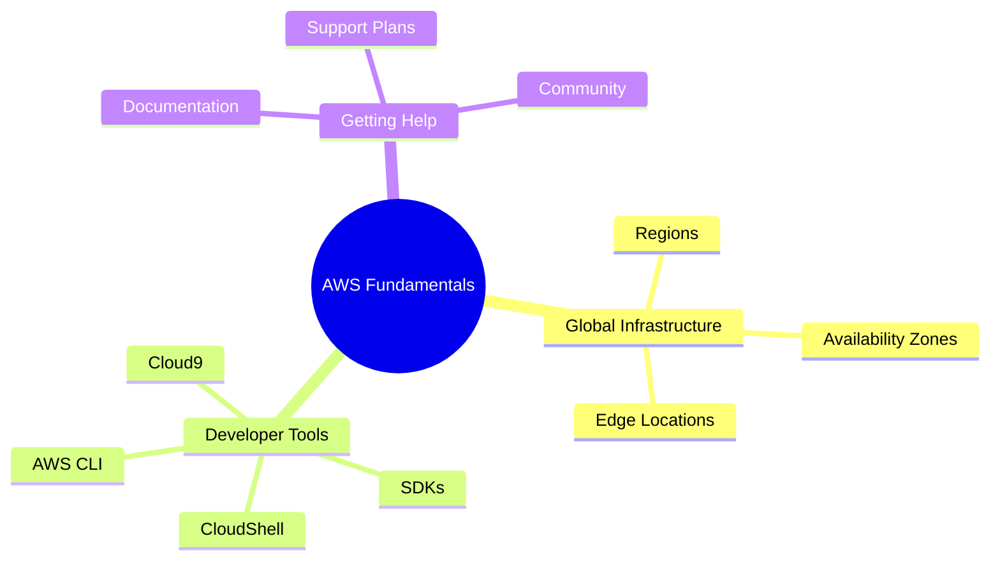
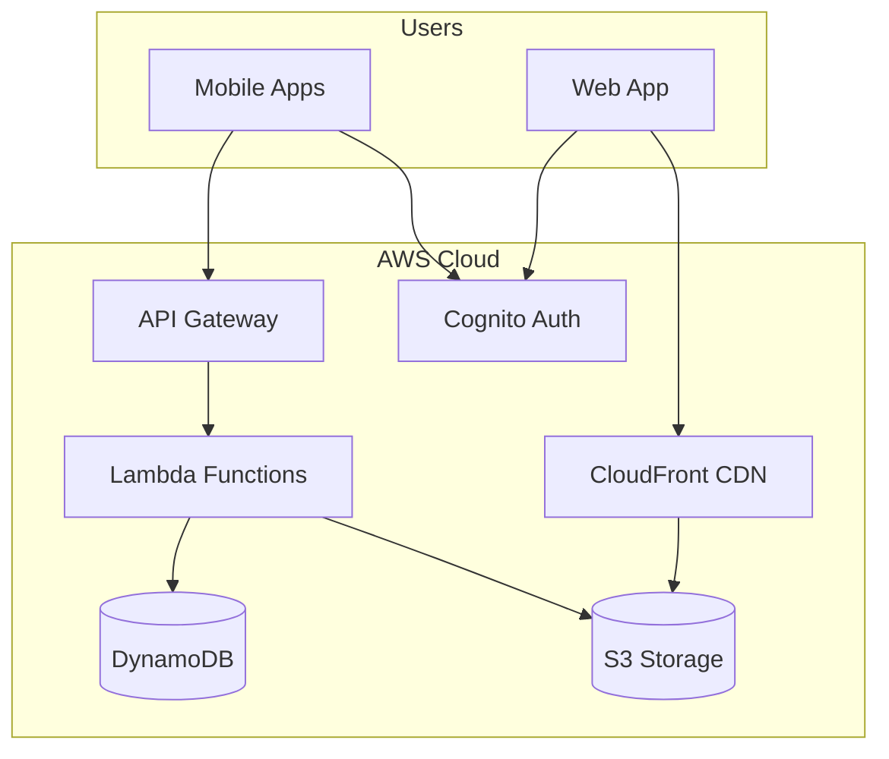

# AWS Fundamentals and Developer Tools

Welcome to your AWS journey! In this chapter, you'll learn the foundational concepts and tools that every AWS developer needs to know. We'll explore AWS's global infrastructure, set up the command-line tools, and get comfortable with the development environment.

## Alex's Story: The Beginning

Meet Alex, a developer with a brilliant idea: **PetTracker** - an app that helps pet owners track their pets' health records, vaccination schedules, location (via GPS collars), and daily activities. Alex has built applications before, but always on traditional servers. Now, with dreams of scaling to millions of pet owners worldwide, Alex decides to build PetTracker on AWS.

"How hard can it be?" Alex thinks, opening the AWS Console for the first time...

## What You'll Learn

By the end of this chapter, you'll understand:

- How AWS's global infrastructure enables worldwide deployments
- The difference between Regions, Availability Zones, and Edge Locations
- How to install and configure the AWS CLI
- Working with AWS SDKs in your favorite programming language
- Using browser-based development environments
- Where to find help and documentation

## Chapter Architecture

## Why This Matters for the Exam

The DVA-C02 exam expects you to understand:

- How to select appropriate Regions for deployment
- CLI and SDK usage patterns
- Best practices for development environments
- Where to find AWS documentation and resources

This foundational knowledge appears throughout the exam, so mastering these concepts early will help you in every subsequent chapter.

## PetTracker Architecture Preview

Throughout this course, you'll see PetTracker evolve from a simple idea to a production-ready application. Here's a sneak peek at the final architecture:

But first, let's start with the basics...
