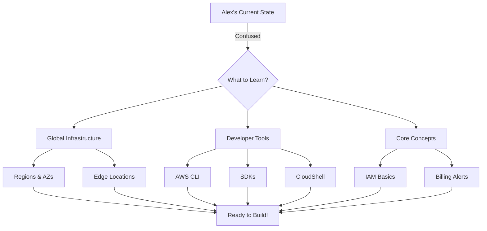

# Alex's Challenge: Where Do I Even Start?

## The Overwhelming Console

Alex stares at the AWS Management Console, cursor hovering over the search bar. There are over 200 services listed. The left sidebar seems endless. A notification badge shows 3 unread messages about account setup.

"I just want to deploy an app," Alex mutters. "Why are there so many services?"

Alex clicks on a few services randomly:
- **Amazon SageMaker** - "Machine learning? Not yet..."
- **AWS IoT Core** - "Maybe for the GPS collars later?"
- **Amazon Redshift** - "Data warehousing? I don't even have data yet!"

After 30 frustrating minutes of clicking around, Alex hasn't accomplished anything. The documentation seems endless, and every page links to five more pages.

## The First Mistake

Determined to make progress, Alex decides to just start clicking. They create an EC2 instance without really understanding what they're doing:

```mistakes
Launched in us-east-1 (didn't know there were other regions)
Used the default VPC (didn't know what a VPC was)
Left SSH open to 0.0.0.0/0 (security risk!)
Chose a t2.micro (correct, but by accident)
```

The instance launches! Alex feels accomplished... for about 5 minutes. Then the questions start:

- "How do I connect to this thing?"
- "Where do I put my code?"
- "Why is my terminal asking for a .pem file?"
- "What's an Elastic IP and why does my instance have a different address now?"

## The Realization

Alex takes a step back. Clearly, jumping in without understanding the basics was a mistake. The instance is terminated (after Googling how to do that), and Alex decides to learn properly.

"Okay," Alex thinks, "let me understand how AWS actually works before I touch anything else."

## What Alex Needs to Learn



## The Questions Alex Has

Before diving into PetTracker development, Alex writes down the questions that need answers:

1. **Where should I deploy?** - There seem to be different "regions" around the world
2. **How do I interact with AWS?** - Clicking around the console is slow and error-prone
3. **How do I automate things?** - Real developers don't click buttons all day, right?
4. **How do I not get a huge bill?** - Alex has heard horror stories about surprise AWS charges
5. **Where do I get help?** - The documentation is overwhelming

## Your Challenge

As you follow Alex through this chapter, you'll answer all these questions. By the end, you'll have:

- A clear mental model of AWS infrastructure
- The AWS CLI installed and configured
- Working knowledge of at least one AWS SDK
- Billing alerts set up to avoid surprises
- Bookmarks to the best documentation resources

Let's start by understanding where AWS actually runs your code...

## Key Takeaway

> **"Every AWS expert was once a confused beginner staring at the console."**
>
> The key is to build a solid foundation before trying to build applications. Understanding AWS infrastructure and tools will save you hours of debugging later.

---

*Next: Alex learns about AWS Global Infrastructure and finally understands why there are so many "regions" to choose from.*

---
*v2.0*
