# AWS Global Infrastructure

## Alex Discovers the World Map

After the initial confusion, Alex finds something interesting in the AWS Console footer: a link to "AWS Global Infrastructure." Clicking it reveals a world map dotted with locations.

"So AWS isn't just one big computer somewhere," Alex realizes. "It's everywhere!"

## The Three Pillars of AWS Infrastructure


### 1. Regions

A **Region** is a physical location in the world where AWS has data centers. Each Region is completely independent and isolated from other Regions.

**Current Regions include:**

| Region Code | Region Name | Launched |
|-------------|-------------|----------|
| us-east-1 | N. Virginia | 2006 |
| us-west-2 | Oregon | 2011 |
| eu-west-1 | Ireland | 2007 |
| ap-southeast-1 | Singapore | 2010 |
| ap-northeast-1 | Tokyo | 2011 |
| sa-east-1 | São Paulo | 2011 |
| ... | ... | ... |

**Why Multiple Regions?**

1. **Latency** - Deploy closer to your users
2. **Compliance** - Keep data in specific geographic areas
3. **Availability** - Survive regional disasters
4. **Pricing** - Costs vary by region

### 2. Availability Zones (AZs)

Each Region contains multiple **Availability Zones** - physically separate data centers with independent power, cooling, and networking.


**Key Facts about AZs:**
- Connected via high-speed, low-latency private fiber
- Far enough apart to survive localized disasters
- Close enough for synchronous replication (< 2ms latency)
- Each AZ can have multiple physical data centers

### 3. Edge Locations

**Edge Locations** are smaller sites used for caching content closer to users. They're used by:

- **CloudFront** - CDN for static and dynamic content
- **Route 53** - DNS with edge-based routing
- **Global Accelerator** - Network optimization
- **Lambda@Edge** - Run code at the edge

## Alex's First Big Decision: Which Region?

Alex needs to choose a Region for PetTracker. Here's the thought process:

```mermaid
flowchart TD
    A[Choose a Region] --> B{Where are users?}
    B -->|Mostly US| C{East or West Coast?}
    B -->|Global| D[Consider Multi-Region]
    B -->|Europe| E[eu-west-1 or eu-central-1]

    C -->|East| F[us-east-1]
    C -->|West| G[us-west-2]

    F --> H{Any compliance needs?}
    H -->|Yes| I[Check regional compliance]
    H -->|No| J[Consider pricing]

    J --> K[us-east-1 often cheapest]
    K --> L[✓ Decision Made!]
```



**Alex's reasoning:**
1. Initial users will be in the US
2. No specific compliance requirements yet
3. us-east-1 has the most services and often the lowest prices
4. Can expand to other regions later

**Decision: `us-east-1` (N. Virginia)**

## Common Mistakes Alex Almost Made

### Mistake 1: Not Considering Latency

Alex almost picked `ap-southeast-1` (Singapore) because it sounded cool. But with users in the US, that would mean 200+ ms latency for every request!

```mermaid
sequenceDiagram
    participant U as 🇺🇸 US User
    participant S as 🇸🇬 Singapore
    participant D as 💾 Database

    U->>S: Request
    Note right of U: ~100ms
    S->>D: Query
    Note right of S: ~5ms
    D->>S: Data
    S->>U: Response
    Note left of S: ~100ms

    Note over U,D: Total: ~205ms ❌
```



### Mistake 2: Assuming All Services Are Everywhere

Alex wanted to use Amazon Bedrock (AI service), but discovered it's not available in all regions. Always check service availability!

```bash
# Some services launch in us-east-1 first
# Then roll out to other regions over months
```

### Mistake 3: Forgetting About Data Residency 🔒

While not relevant for PetTracker yet, Alex learned that some industries (healthcare, finance, government) have strict rules about where data can be stored.

| Industry | Compliance | Requirement |
|----------|------------|-------------|
| 🏥 Healthcare | HIPAA | Specific regions only |
| 🏦 Finance | PCI-DSS | Specific regions only |
| 🏛️ Government | FedRAMP | GovCloud regions |

## Infrastructure Comparison

| Component | Quantity | Purpose | Example |
|-----------|----------|---------|---------|
| Regions | 33+ | Geographic isolation | us-east-1 |
| AZs | 100+ | Fault tolerance | us-east-1a |
| Edge Locations | 400+ | Content caching | New York PoP |
| Local Zones | 30+ | Ultra-low latency | Los Angeles |
| Wavelength | 20+ | 5G edge computing | Verizon Boston |

## Exam Tips

**What you need to know for the DVA-C02:**

1. Regions are isolated; data doesn't automatically replicate between them
2. AZs within a region have low-latency connections
3. Not all services are available in all regions
4. Edge Locations are for CloudFront, Route 53, and Lambda@Edge
5. Region selection affects latency, compliance, and cost

**Common exam question patterns:**

- "Which provides fault tolerance within a region?" → Multiple AZs
- "Which provides lowest latency for global users?" → Edge Locations/CloudFront
- "How to comply with data residency laws?" → Choose appropriate Region

## Hands-On: Explore AWS Regions

```bash
# List all available regions with AWS CLI
aws ec2 describe-regions --output table

# Check which AZs are available in a region
aws ec2 describe-availability-zones --region us-east-1

# See the current region in your CLI config
aws configure get region
```

## Key Takeaways

1. **Regions** = Geographic locations (pick based on users, compliance, services)
2. **Availability Zones** = Fault-tolerant data centers within a region
3. **Edge Locations** = Caching points for low-latency content delivery
4. Always verify service availability in your chosen region
5. Design for multi-AZ from the start for production workloads

---

*Next: Alex dives deeper into Regions and Availability Zones, learning how to design for high availability.*

---
*v2.0*
