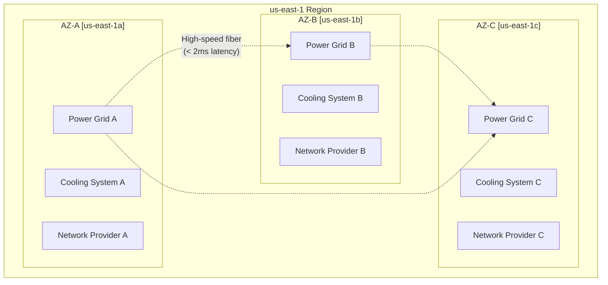
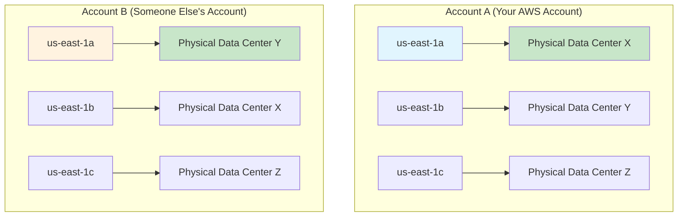
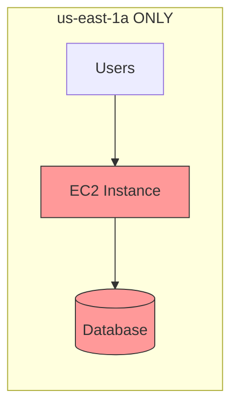
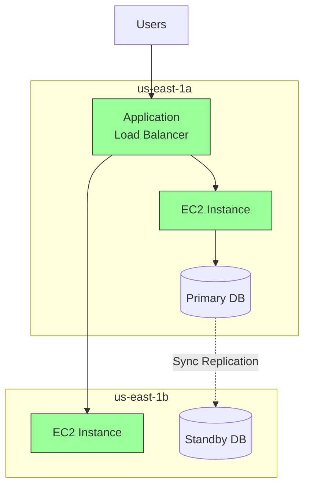
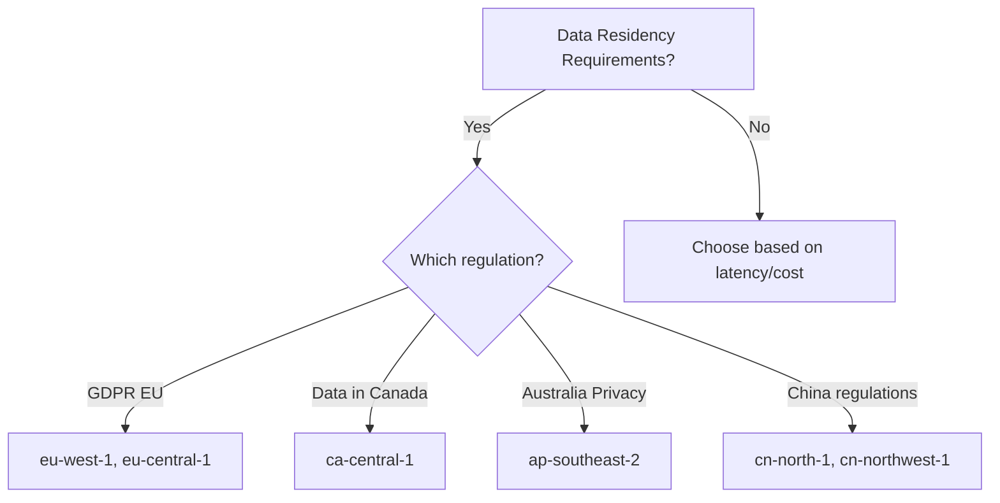
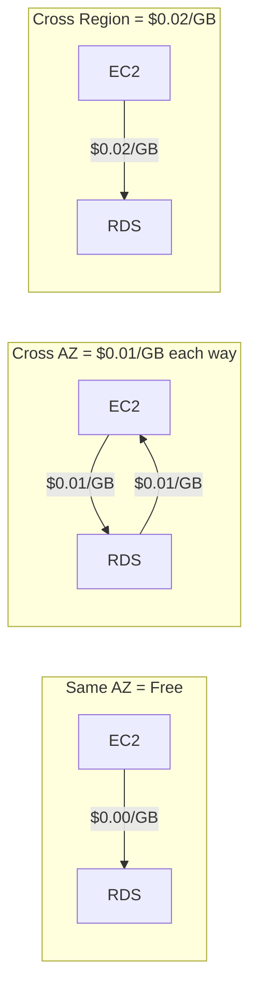

# Regions and Availability Zones Deep Dive

## Alex's High Availability Epiphany

A week after launching PetTracker's first test server, Alex gets a panicked message from a friend: "Your app is down!"

Alex checks - the EC2 instance is unreachable. After 20 stressful minutes, it comes back online. AWS status page shows: "Increased error rates in us-east-1a."

"Wait," Alex thinks, "my entire app went down because ONE data center had issues? That's terrible!"

This is when Alex learns the importance of **multi-AZ deployments**.

## Understanding Availability Zones

### Physical Separation

Each Availability Zone is designed to be isolated from failures in other AZs:



### AZ Naming: The Gotcha

Alex discovers something surprising: **AZ names are randomized per account!**

What does this mean? When you create an AWS account, AWS randomly assigns which physical data centers map to which AZ names (`us-east-1a`, `us-east-1b`, etc.). This mapping is different for every AWS account.

So `us-east-1a` in your account might point to Physical Data Center X, while `us-east-1a` in your colleague's account points to Physical Data Center Y - a completely different building!



> **Notice:** Both accounts have `us-east-1a`, but they point to **different physical locations**!

#### Why Does AWS Do This?

Without randomization, everyone would instinctively pick `us-east-1a` (because "a" comes first), causing:
- Uneven load distribution across data centers
- One AZ becoming overloaded while others sit idle
- Potential capacity issues in the "popular" AZ

By randomizing the mapping, AWS ensures even distribution across all physical data centers.

#### The Problem This Creates

Imagine you're coordinating with a partner company and you say "Deploy to us-east-1a". Because AZ names are randomized per account, you might end up in different physical data centers!

#### The Solution: AZ IDs

To solve this problem, AWS provides **AZ IDs** (Availability Zone Identifiers).

**What are AZ IDs?** They are unique identifiers that refer directly to a physical data center, not a randomized name. Unlike AZ names (like `us-east-1a`), AZ IDs (like `use1-az1`) are the same across ALL AWS accounts.

The format is: `{region-code}-az{number}` — for example, `use1-az1` means "US East 1, Availability Zone 1".

**Why does this help?** When you and a partner both use `use1-az1`, you're guaranteed to be talking about the exact same physical data center.

```bash
# Find the AZ ID for each AZ name in your account
$ aws ec2 describe-availability-zones --region us-east-1 \
    --query 'AvailabilityZones[*].[ZoneName,ZoneId]' \
    --output table
```

**Example Output:**

| Zone Name | Zone ID |
|-----------|---------|
| us-east-1a | use1-az1 |
| us-east-1b | use1-az2 |
| us-east-1c | use1-az4 |
| us-east-1d | use1-az6 |
| us-east-1e | use1-az3 |
| us-east-1f | use1-az5 |

Now that you know about AZ IDs, here's the difference:

| Scenario | Your Account | Partner's Account | Result |
|----------|-------------|-------------------|--------|
| You say "Deploy to us-east-1a" | Data Center X | Data Center Y | **Different locations!** |
| You say "Deploy to use1-az1" | Data Center X | Data Center X | **Same location!** |

> **Key Insight:** The Zone ID (like `use1-az1`) is the same across ALL AWS accounts. Use this when coordinating deployments with external teams!

## Alex Redesigns for High Availability

### Before: Single AZ (Bad)



**Problems:**
- Single point of failure
- Downtime during AZ issues
- No fault tolerance

### After: Multi-AZ (Good)



**Benefits:**
- Automatic failover
- Zero downtime during AZ failures
- Better user experience

## Region Selection Factors

Alex creates a decision matrix for choosing regions:

### Factor 1: Latency

```bash
# Approximate latency from US East Coast:
us-east-1:    < 50ms  ★★★★★
us-west-2:    ~70ms   ★★★★
eu-west-1:    ~80ms   ★★★
ap-northeast-1: ~150ms ★★
ap-southeast-1: ~200ms ★
```

### Factor 2: Service Availability

Not all services are in all regions. Alex checks for required services:

```python
# Services Alex needs for PetTracker
required_services = [
    'lambda',           # ✓ All regions
    'dynamodb',         # ✓ All regions
    'api-gateway',      # ✓ All regions
    'cognito',          # ✓ Most regions
    'bedrock',          # ✗ Limited regions!
]
```

### Factor 3: Pricing

Prices vary by region:

| Service | us-east-1 | us-west-2 | eu-west-1 | ap-northeast-1 |
|---------|-----------|-----------|-----------|----------------|
| EC2 t3.medium | $0.0416/hr | $0.0416/hr | $0.0456/hr | $0.0544/hr |
| S3 (GB/mo) | $0.023 | $0.023 | $0.024 | $0.025 |
| Lambda (1M req) | $0.20 | $0.20 | $0.20 | $0.20 |

**us-east-1 is often cheapest** - it's the oldest and largest region.

### Factor 4: Compliance



## Practical: Multi-AZ RDS Setup

Alex sets up a database that survives AZ failures:

```bash
# Create Multi-AZ RDS instance
$ aws rds create-db-instance \
    --db-instance-identifier pettracker-db \
    --db-instance-class db.t3.micro \
    --engine postgres \
    --master-username admin \
    --master-user-password SecurePass123! \
    --allocated-storage 20 \
    --multi-az \
    --region us-east-1
```

**What `--multi-az` does:**
1. Creates primary in one AZ
2. Creates synchronous standby in another AZ
3. Automatic failover if primary fails
4. Single endpoint that points to current primary

## Alex's Costly Lesson: Data Transfer

Alex deploys EC2 in us-east-1a and RDS in us-east-1b. The bill arrives:

| Line Item | Calculation | Cost |
|-----------|-------------|------|
| Inter-AZ data transfer | 500 GB × $0.01/GB | $5.00 |
| Wait, it's charged **both ways** | $5.00 × 2 | $10.00 |
| This happened every week... | $10.00 × 4.7 weeks | **$47.00** |

**Lesson learned:** Cross-AZ data transfer isn't free! Design to minimize it when possible, but don't sacrifice availability for small savings.



## Regional Services vs Global Services

Alex learns that not everything is regional:

### Global Services (No Region Selection)
- **IAM** - Users, roles, policies
- **Route 53** - DNS
- **CloudFront** - CDN
- **WAF** - Web Application Firewall (when used with CloudFront)
- **Organizations** - Account management

### Regional Services (Must Select Region)
- **EC2** - Compute
- **RDS** - Databases
- **Lambda** - Serverless functions
- **S3** - Storage (buckets are regional, though globally unique names)
- **DynamoDB** - NoSQL database

## Exam Tips

**Key concepts for DVA-C02:**

1. **Multi-AZ** = High availability within a region
2. **Multi-Region** = Disaster recovery and global reach
3. AZ names are account-specific; use AZ IDs for coordination
4. Cross-AZ data transfer has costs
5. Not all services are available in all regions

**Tricky exam scenarios:**

> "An application needs to survive the failure of a single data center..."
> → Answer: Deploy across multiple AZs

> "An application needs to survive a regional disaster..."
> → Answer: Deploy across multiple Regions

> "Which is TRUE about Availability Zones?"
> → AZ names map differently per account
> → AZs have low-latency connections within a region

## Hands-On Challenge

Try these commands to explore your region:

```bash
# List all AZs in your region
$ aws ec2 describe-availability-zones \
    --query 'AvailabilityZones[*].[ZoneName,State,ZoneId]' \
    --output table

# Check which AZs support specific instance types
$ aws ec2 describe-instance-type-offerings \
    --location-type availability-zone \
    --filters Name=instance-type,Values=t3.micro \
    --query 'InstanceTypeOfferings[*].[Location,InstanceType]' \
    --output table
```

## Key Takeaways

1. **Always design for multi-AZ** in production
2. AZ names are randomized per account - use AZ IDs when coordinating
3. Cross-AZ transfer costs money but is worth it for availability
4. Choose regions based on: latency, services, cost, compliance
5. Some services are global, most are regional

---

*Next: Alex learns about Edge Locations and how to make PetTracker fast for users everywhere.*

---
*v2.0*
