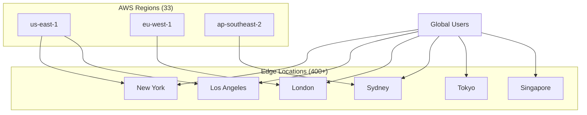
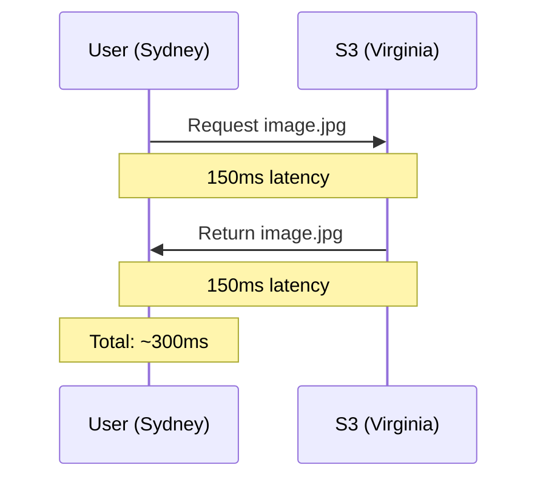
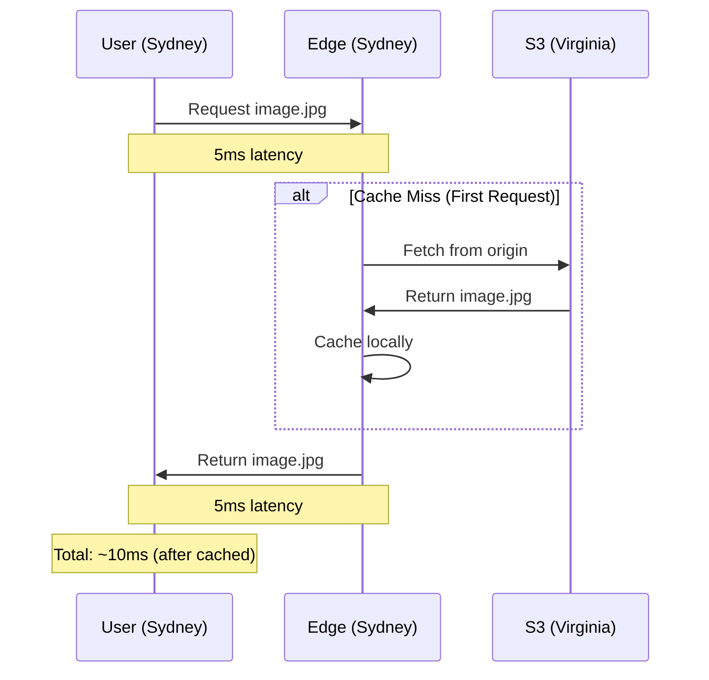
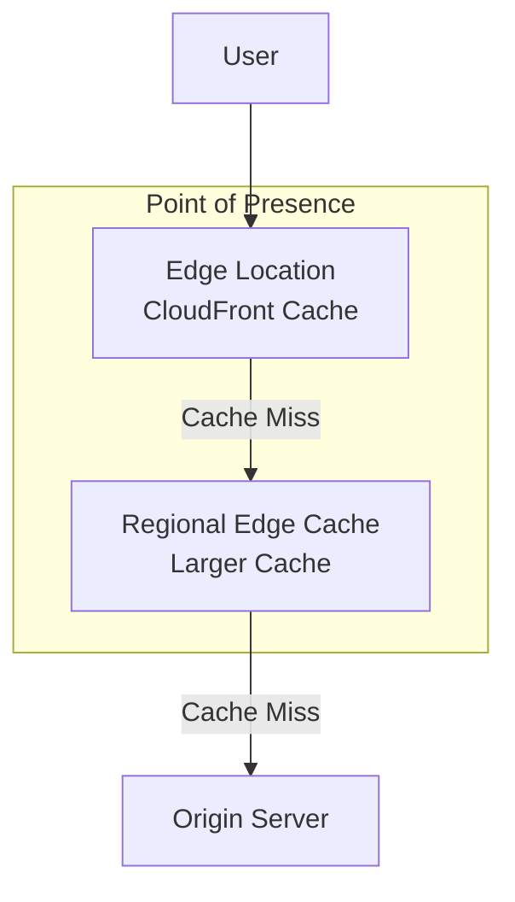
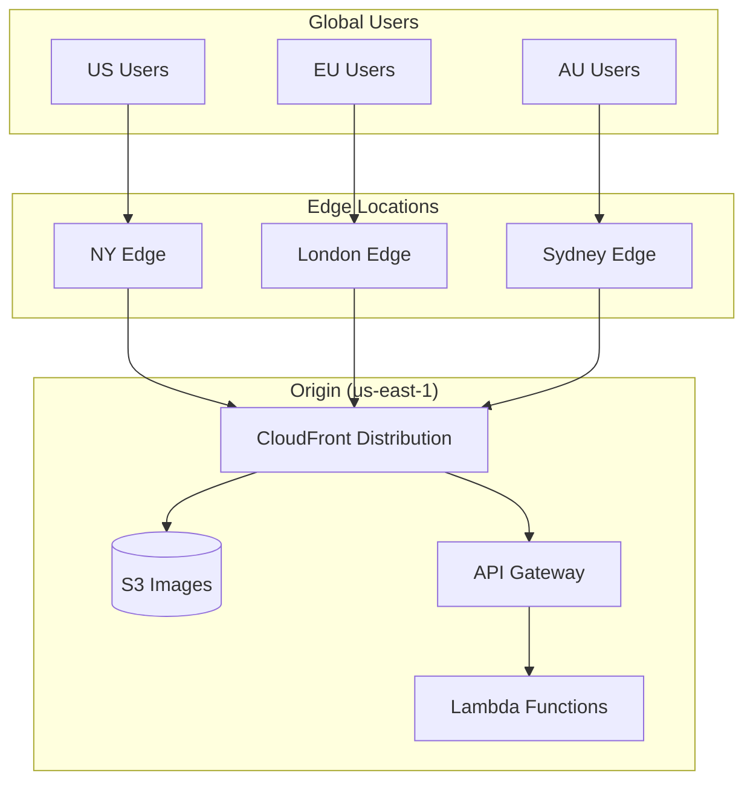
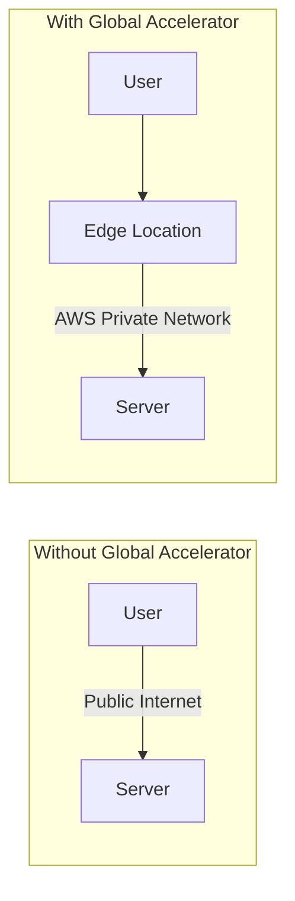

# Edge Locations and Points of Presence

## Alex Gets a Complaint from Australia

PetTracker is gaining users! But then Alex receives feedback from an Australian user:

> "Love the app, but it takes forever to load the pet photos. Like 4-5 seconds sometimes!"

Alex checks the setup:
- App server: us-east-1
- Images: S3 bucket in us-east-1
- Australian user distance: ~15,000 km

```
User in Sydney → S3 in Virginia → Back to Sydney
     ~150ms    +    ~150ms     =   ~300ms per image

     Loading 10 pet photos = 3+ seconds just for images!
```

"There has to be a better way," Alex thinks. That's when Alex discovers **Edge Locations**.

## What Are Edge Locations?

Edge Locations are AWS's globally distributed network of servers designed for:

1. **Caching content** closer to users (CloudFront)
2. **DNS resolution** with lowest latency (Route 53)
3. **Running code at the edge** (Lambda@Edge, CloudFront Functions)
4. **Accelerating network traffic** (Global Accelerator)



## Edge Location vs Region: The Difference

| Aspect | Region | Edge Location |
|--------|--------|---------------|
| **Purpose** | Run compute, store data | Cache content, run edge code |
| **Services** | 200+ services | CloudFront, Route 53, Lambda@Edge |
| **Number** | 33 | 400+ |
| **Your Data** | Original storage | Cached copies |
| **Compute** | Full EC2, Lambda | Lambda@Edge (limited) |

## Alex Implements CloudFront

### Before: Direct S3 Access



### After: CloudFront CDN



### The CloudFront Setup

```bash
# Alex creates a CloudFront distribution
aws cloudfront create-distribution \
    --origin-domain-name pettracker-images.s3.amazonaws.com \
    --default-root-object index.html
```

**Result:**
- First Australian user: ~350ms (cache miss, fetches from origin)
- Second Australian user: ~15ms (cache hit!)
- Subsequent users: ~15ms

**Alex's Australian user:** "Wow, the app is SO much faster now!"

## Points of Presence (PoPs)

AWS uses the term **Points of Presence** to describe their edge infrastructure:



### Regional Edge Caches

Between Edge Locations and your origin, AWS has **Regional Edge Caches**:

- Larger storage capacity
- Longer cache retention
- Reduces origin fetches
- Located in major metro areas

```
User Request Flow:
1. Edge Location (closest) - Miss
2. Regional Edge Cache - Miss
3. Origin (your server/S3) - Fetch
4. Response cached at both levels
```

## Lambda@Edge: Code at the Edge

Alex discovers you can run code at Edge Locations:

```javascript
// Lambda@Edge function to resize images on the fly
exports.handler = async (event) => {
    const request = event.Records[0].cf.request;
    const uri = request.uri;

    // Add image dimensions to request
    if (uri.includes('/thumbnails/')) {
        request.uri = uri.replace('/thumbnails/', '/originals/');
        request.headers['x-resize'] = [{ value: '200x200' }];
    }

    return request;
};
```

**Use cases for Lambda@Edge:**
- Image resizing on demand
- A/B testing
- Authentication at the edge
- URL rewrites
- Header manipulation

### Lambda@Edge vs CloudFront Functions

| Feature | Lambda@Edge | CloudFront Functions |
|---------|-------------|---------------------|
| **Runtime** | Node.js, Python | JavaScript only |
| **Execution time** | Up to 30 sec | Up to 1 ms |
| **Memory** | Up to 10 GB | 2 MB |
| **Network access** | Yes | No |
| **Pricing** | Higher | Lower (1/6th cost) |
| **Use case** | Complex logic | Simple transforms |

## Alex's Edge Architecture

After implementing CloudFront and Lambda@Edge:



## Global Accelerator: Beyond Caching

Alex learns about another edge service: **AWS Global Accelerator**

Unlike CloudFront (which caches content), Global Accelerator:
- Provides static IP addresses
- Routes traffic over AWS's private network
- Works for non-HTTP traffic (TCP, UDP)
- Ideal for gaming, IoT, VoIP



**When to use each:**
- **CloudFront**: Static content, APIs, websites
- **Global Accelerator**: Non-HTTP, gaming, real-time apps

## Cost Considerations

Alex checks the pricing:

### CloudFront Pricing
```
Data Transfer Out (per GB):
- First 10 TB/month:   $0.085
- Next 40 TB/month:    $0.080
- Next 100 TB/month:   $0.060

HTTP Requests:
- $0.0075 per 10,000 requests
```

### Alex's Cost Analysis

```
Before CloudFront:
- S3 data transfer: 500 GB × $0.09 = $45/month
- S3 requests: 1M × $0.0004 = $0.40/month
- Total: ~$45/month

After CloudFront:
- CloudFront: 500 GB × $0.085 = $42.50/month
- S3 transfer to CloudFront: Often free (same region)
- Requests: 1M × $0.00075 = $0.75/month
- Total: ~$43/month

Plus: 10x faster for global users! Worth it.
```

## Exam Tips

**Key points for DVA-C02:**

1. **Edge Locations** cache CloudFront content
2. **Regional Edge Caches** sit between edge and origin
3. **Lambda@Edge** runs code at viewer request/response and origin request/response
4. **CloudFront Functions** are lightweight and cheaper but limited
5. **Global Accelerator** uses AWS network for non-cacheable traffic

**Common exam questions:**

> "How to reduce latency for a global audience accessing static content?"
> → CloudFront with S3 origin

> "How to run authentication logic before content is served from CloudFront?"
> → Lambda@Edge at viewer request

> "Which provides static IP addresses for a global application?"
> → Global Accelerator

## Hands-On Challenge

```bash
# List CloudFront edge locations
aws cloudfront list-distributions

# Create a simple CloudFront distribution for your S3 bucket
aws cloudfront create-distribution \
    --distribution-config file://cf-config.json

# Check cache hit ratio
aws cloudfront get-distribution \
    --id YOUR_DISTRIBUTION_ID \
    --query 'Distribution.DomainName'
```

## Key Takeaways

1. **400+ Edge Locations** worldwide for low-latency content delivery
2. **CloudFront** caches static and dynamic content at the edge
3. **Lambda@Edge** runs code in response to CloudFront events
4. **CloudFront Functions** are simpler and cheaper for basic transforms
5. **Global Accelerator** accelerates non-HTTP traffic
6. Edge caching dramatically improves global user experience

---

*Next: Alex sets up the AWS CLI and learns to stop clicking through the console.*
