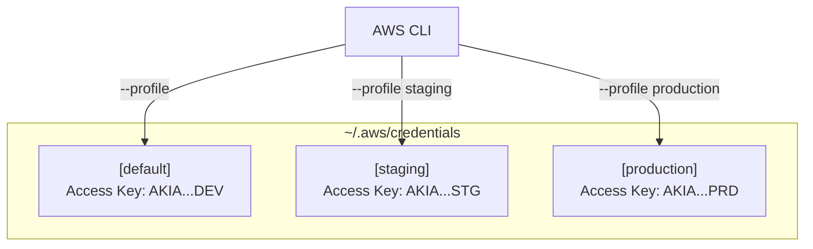
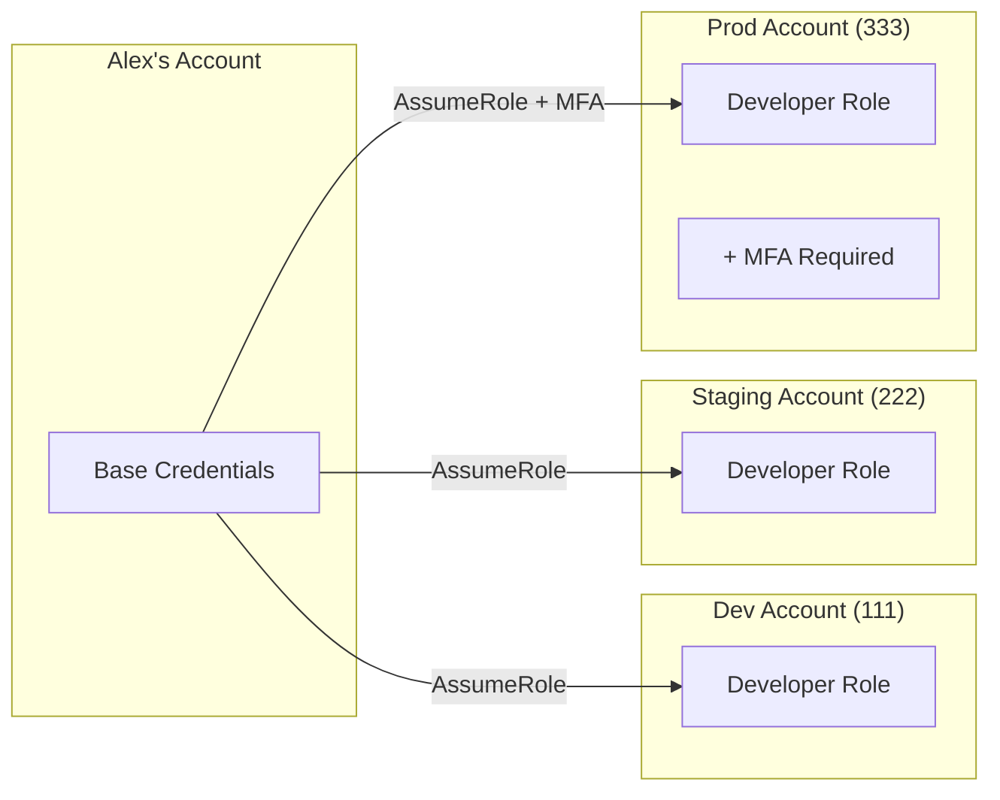
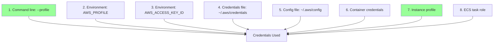

# AWS CLI Configuration and Profiles

## Alex's Multi-Account Problem

PetTracker is growing! Alex now has multiple AWS accounts:

- **Development** - For testing and experiments
- **Staging** - For pre-production testing
- **Production** - The live application

But there's a problem:

```bash
$ aws s3 ls  # Which account am I using?!

# Alex accidentally deleted production data thinking it was dev 😱
```

Alex needs a better way to manage multiple accounts. Enter **named profiles**.

## Understanding Named Profiles

Profiles let you store multiple sets of credentials:



## Setting Up Named Profiles

### Method 1: Using aws configure

```bash
# Configure the default profile
$ aws configure
AWS Access Key ID: AKIADEVEXAMPLE
AWS Secret Access Key: [hidden]
Default region: us-east-1
Default output: json

# Configure staging profile
$ aws configure --profile staging
AWS Access Key ID: AKIASTGEXAMPLE
AWS Secret Access Key: [hidden]
Default region: us-east-1
Default output: json

# Configure production profile
$ aws configure --profile production
AWS Access Key ID: AKIAPRDEXAMPLE
AWS Secret Access Key: [hidden]
Default region: us-east-1
Default output: json
```

### Method 2: Direct File Editing

```bash
# ~/.aws/credentials
[default]
aws_access_key_id = AKIADEVEXAMPLE
aws_secret_access_key = wJalrXUtnDEV/EXAMPLE

[staging]
aws_access_key_id = AKIASTGEXAMPLE
aws_secret_access_key = wJalrXUtnSTG/EXAMPLE

[production]
aws_access_key_id = AKIAPRDEXAMPLE
aws_secret_access_key = wJalrXUtnPRD/EXAMPLE
```

```bash
# ~/.aws/config
[default]
region = us-east-1
output = json

[profile staging]
region = us-east-1
output = json

[profile production]
region = us-east-1
output = table
cli_pager = less
```

**Note:** In `config`, profiles need the `profile` prefix. In `credentials`, they don't.

## Using Profiles

### Command Line Flag

```bash
# Use staging profile
$ aws s3 ls --profile staging

# Use production profile
$ aws ec2 describe-instances --profile production

# Default profile (no flag needed)
$ aws lambda list-functions
```

### Environment Variable

```bash
# Set profile for entire terminal session
$ export AWS_PROFILE=staging

# Now all commands use staging
$ aws s3 ls  # Uses staging automatically

# Check current profile
$ echo $AWS_PROFILE
staging
```

### Alex's Terminal Setup

Alex adds visual indicators to their shell:

```bash
# Add to ~/.bashrc or ~/.zshrc
aws_profile_prompt() {
    if [ -n "$AWS_PROFILE" ]; then
        echo " [AWS:$AWS_PROFILE]"
    fi
}

# For bash
PS1='[\u@\h \W]$(aws_profile_prompt)\$ '

# For zsh with colors
PROMPT='%n@%m %~%F{yellow}$(aws_profile_prompt)%f %# '
```

Now Alex always knows which profile is active:

```bash
alex@laptop ~/pettracker [AWS:production]$
```

## Advanced Profile Configuration

### Assuming Roles with Profiles

Alex's company uses role-based access. Instead of separate credentials, Alex assumes roles:

```bash
# ~/.aws/credentials
[base-account]
aws_access_key_id = AKIABASEEXAMPLE
aws_secret_access_key = wJalrXUtnBASE/EXAMPLE

# ~/.aws/config
[profile base-account]
region = us-east-1

[profile dev-role]
role_arn = arn:aws:iam::111111111111:role/DeveloperRole
source_profile = base-account
region = us-east-1

[profile staging-role]
role_arn = arn:aws:iam::222222222222:role/DeveloperRole
source_profile = base-account
region = us-east-1

[profile prod-role]
role_arn = arn:aws:iam::333333333333:role/DeveloperRole
source_profile = base-account
mfa_serial = arn:aws:iam::000000000000:mfa/alex
region = us-east-1
```



### Using Role Profiles

```bash
# CLI automatically assumes the role
$ aws s3 ls --profile dev-role
# Behind the scenes: STS AssumeRole → temporary credentials → S3 call

# For production with MFA
$ aws s3 ls --profile prod-role
Enter MFA code for arn:aws:iam::000000000000:mfa/alex: 123456
# Success!
```

## Session Tokens and MFA

When MFA is required:

```bash
# Option 1: Let CLI prompt (with profile configured for MFA)
$ aws s3 ls --profile prod-role
Enter MFA code: 123456

# Option 2: Manual session token
$ aws sts get-session-token \
    --serial-number arn:aws:iam::123456789012:mfa/alex \
    --token-code 123456

{
    "Credentials": {
        "AccessKeyId": "ASIAEXAMPLEID",
        "SecretAccessKey": "secretkey",
        "SessionToken": "long-session-token...",
        "Expiration": "2024-01-15T23:00:00Z"
    }
}
```

## Profile Configuration Options

```bash
# ~/.aws/config - Full options example
[profile advanced-example]
region = eu-west-1
output = json
cli_pager = less                    # Paginate long output
cli_auto_prompt = on-partial        # Tab completion
retry_mode = standard               # Retry failed requests
max_attempts = 5                    # Retry count
ca_bundle = /path/to/ca-bundle.crt  # Custom CA
parameter_validation = true         # Validate before sending

# Role assumption options
role_arn = arn:aws:iam::123456789012:role/MyRole
source_profile = default
role_session_name = alex-session
duration_seconds = 3600
external_id = my-external-id        # If required by role

# MFA options
mfa_serial = arn:aws:iam::123456789012:mfa/alex

# Web identity (for EKS, etc.)
web_identity_token_file = /path/to/token
```

## Alex's Profile Safety System

After the accidental deletion incident, Alex creates safeguards:

### 1. Visual Confirmation

```bash
# ~/.bashrc
alias aws-whoami='aws sts get-caller-identity'

# Before any destructive operation
$ aws-whoami --profile production
{
    "Account": "333333333333",
    "Arn": "arn:aws:sts::333333333333:assumed-role/DeveloperRole/alex"
}
```

### 2. Production Profile Warnings

```bash
# ~/.bashrc
aws() {
    if [[ "$AWS_PROFILE" == "production" ]] || [[ "$*" == *"--profile production"* ]]; then
        echo "⚠️  WARNING: Using PRODUCTION profile!"
        read -p "Are you sure? (y/N) " confirm
        if [[ "$confirm" != "y" ]]; then
            echo "Aborted."
            return 1
        fi
    fi
    command aws "$@"
}
```

### 3. Default to Dev

```bash
# ~/.bashrc
export AWS_PROFILE=dev  # Always start in dev

# Function to switch with confirmation
switch-aws() {
    export AWS_PROFILE=$1
    echo "Switched to AWS profile: $AWS_PROFILE"
    aws sts get-caller-identity --query 'Account' --output text
}
```

## Credential Sources and Priority

Alex learns the full credential resolution chain:



## AWS SSO Integration

Alex's company adopts AWS SSO (IAM Identity Center):

```bash
# Configure SSO
$ aws configure sso
SSO session name: pettracker-sso
SSO start URL: https://pettracker.awsapps.com/start
SSO region: us-east-1
SSO registration scopes [sso:account:access]:

# Login
$ aws sso login --profile sso-dev

# Use as normal
$ aws s3 ls --profile sso-dev
```

```bash
# ~/.aws/config with SSO
[profile sso-dev]
sso_session = pettracker-sso
sso_account_id = 111111111111
sso_role_name = DeveloperAccess
region = us-east-1

[profile sso-prod]
sso_session = pettracker-sso
sso_account_id = 333333333333
sso_role_name = DeveloperAccess
region = us-east-1

[sso-session pettracker-sso]
sso_start_url = https://pettracker.awsapps.com/start
sso_region = us-east-1
sso_registration_scopes = sso:account:access
```

## Exam Tips

**For DVA-C02:**

1. Know credential file locations and format
2. Understand profile switching methods
3. Know the credential resolution order
4. Understand role assumption with `source_profile` and `role_arn`
5. MFA can be required for role assumption

**Common scenarios:**

> "Developer needs to access multiple AWS accounts..."
> → Use named profiles with role assumption

> "Enforce MFA for production access..."
> → Configure `mfa_serial` in profile

> "Application needs to assume a role..."
> → Configure `role_arn` and `source_profile`

## Hands-On Challenge

```bash
# List all configured profiles
$ aws configure list-profiles

# See current profile's config
$ aws configure list

# Create a new profile
$ aws configure --profile mytest

# Test the profile
$ aws sts get-caller-identity --profile mytest
```

## Key Takeaways

1. **Named profiles** let you manage multiple AWS accounts safely
2. Profiles are stored in `~/.aws/credentials` and `~/.aws/config`
3. Use `--profile` flag or `AWS_PROFILE` environment variable
4. Role assumption enables cross-account access
5. Always know which profile you're using before running commands
6. Add visual indicators and safeguards for production profiles

---

*Next: Alex masters essential AWS CLI commands for daily development.*

---
*v2.0*
