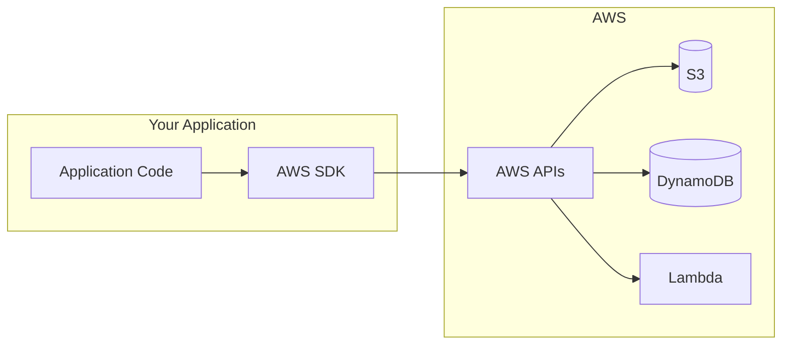
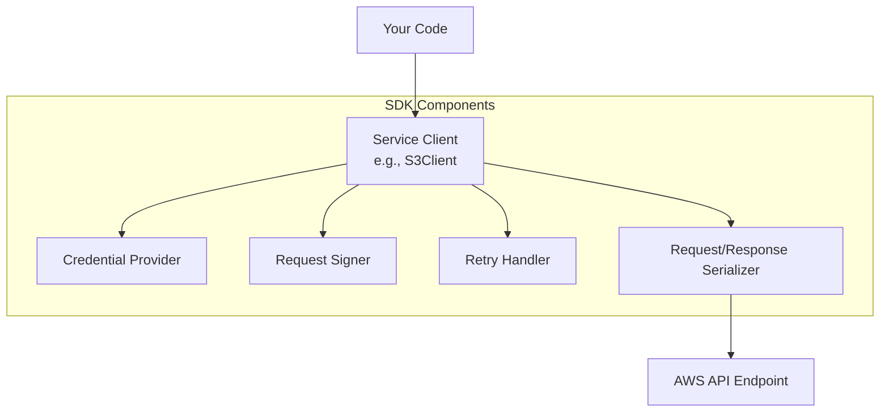
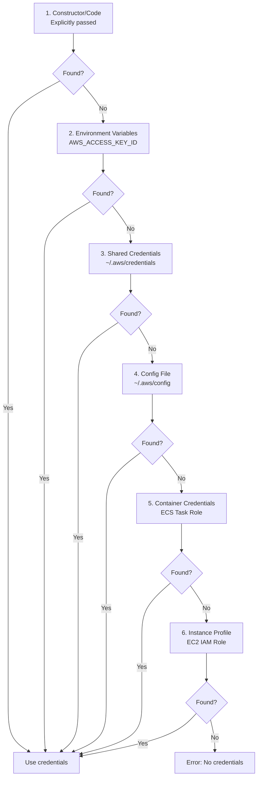
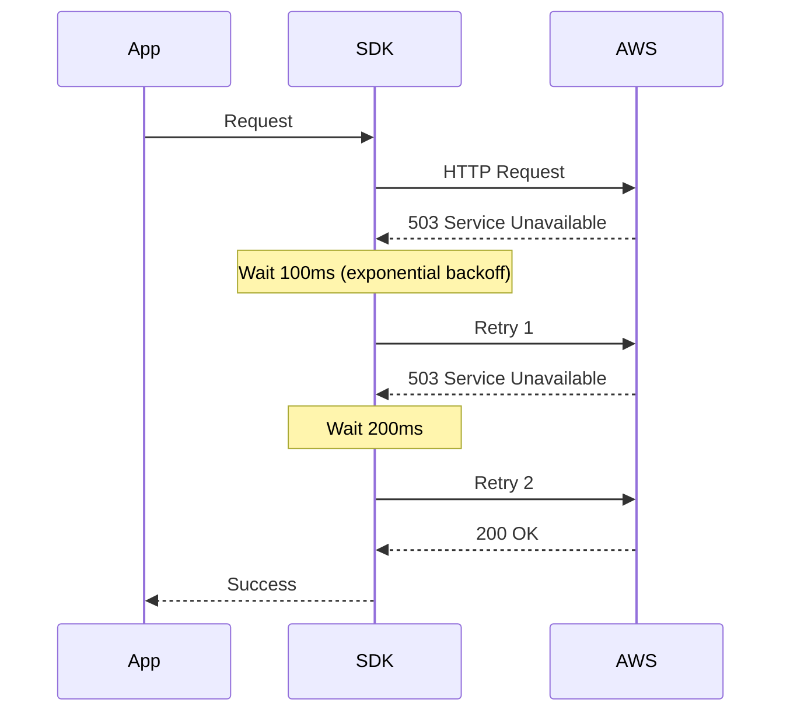
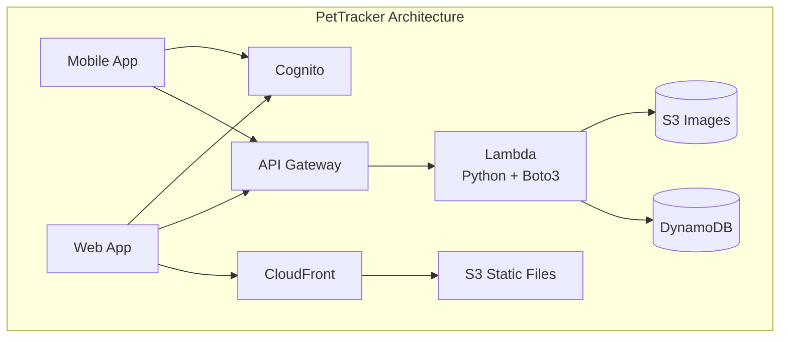

# AWS SDKs Overview

## Alex's Code Integration Challenge

After mastering the CLI, Alex realizes there's a new problem: PetTracker's code needs to interact with AWS services directly. Users can't exactly run CLI commands in the mobile app!

"I need to upload pet photos from my Python backend to S3," Alex tells Sam. "And query DynamoDB for pet data. How do I do that in code?"

Sam grins. "Welcome to the world of AWS SDKs."

## What Are AWS SDKs?

SDKs (Software Development Kits) let you interact with AWS services from your application code:



## Available SDKs

AWS provides SDKs for virtually every popular language:

| Language | SDK Name | Package Manager |
|----------|----------|-----------------|
| Python | Boto3 | pip |
| JavaScript/Node.js | AWS SDK for JavaScript | npm |
| Java | AWS SDK for Java | Maven/Gradle |
| Go | AWS SDK for Go | go mod |
| .NET | AWS SDK for .NET | NuGet |
| PHP | AWS SDK for PHP | Composer |
| Ruby | AWS SDK for Ruby | RubyGems |
| Rust | AWS SDK for Rust | Cargo |
| C++ | AWS SDK for C++ | vcpkg |
| Swift | AWS SDK for Swift | Swift Package Manager |

## SDK Architecture

All AWS SDKs share common patterns:



### Key Components:

1. **Service Clients**: Main interface to interact with a service
2. **Credential Providers**: Load credentials from various sources
3. **Request Signers**: Sign requests with AWS Signature V4
4. **Retry Handlers**: Automatic retry with exponential backoff
5. **Serializers**: Convert data to/from AWS API format

## Credential Resolution Chain

SDKs look for credentials in a specific order:



**Best practice:** Don't hardcode credentials! Let the SDK find them automatically.

```python
# ❌ BAD: Hardcoded credentials
import boto3
client = boto3.client(
    's3',
    aws_access_key_id='AKIAXXXXXX',  # NEVER do this!
    aws_secret_access_key='secret'
)

# ✅ GOOD: Let SDK resolve credentials
import boto3
client = boto3.client('s3')  # Automatically finds credentials
```

## Quick Start Examples

### Python (Boto3)

```python
# Install: pip install boto3

import boto3

# Create S3 client
s3 = boto3.client('s3')

# List buckets
response = s3.list_buckets()
for bucket in response['Buckets']:
    print(bucket['Name'])

# Upload file
s3.upload_file('photo.jpg', 'pettracker-images', 'photos/photo.jpg')

# Download file
s3.download_file('pettracker-images', 'photos/photo.jpg', 'downloaded.jpg')
```

### JavaScript/Node.js (AWS SDK v3)

```javascript
// Install: npm install @aws-sdk/client-s3

import { S3Client, ListBucketsCommand } from "@aws-sdk/client-s3";

const client = new S3Client({ region: "us-east-1" });

// List buckets
const response = await client.send(new ListBucketsCommand({}));
response.Buckets.forEach(bucket => console.log(bucket.Name));
```

### Java

```java
// Maven: software.amazon.awssdk:s3

import software.amazon.awssdk.services.s3.S3Client;
import software.amazon.awssdk.services.s3.model.*;

S3Client s3 = S3Client.builder()
    .region(Region.US_EAST_1)
    .build();

ListBucketsResponse response = s3.listBuckets();
response.buckets().forEach(bucket ->
    System.out.println(bucket.name())
);
```

### Go

```go
// go get github.com/aws/aws-sdk-go-v2

import (
    "context"
    "github.com/aws/aws-sdk-go-v2/config"
    "github.com/aws/aws-sdk-go-v2/service/s3"
)

cfg, _ := config.LoadDefaultConfig(context.TODO())
client := s3.NewFromConfig(cfg)

result, _ := client.ListBuckets(context.TODO(), &s3.ListBucketsInput{})
for _, bucket := range result.Buckets {
    fmt.Println(*bucket.Name)
}
```

## SDK Version Considerations

### JavaScript SDK: v2 vs v3

Alex finds some old tutorials using SDK v2:

```javascript
// OLD SDK v2 (still works, but not recommended)
const AWS = require('aws-sdk');
const s3 = new AWS.S3();
s3.listBuckets((err, data) => {
    if (err) console.error(err);
    else console.log(data.Buckets);
});

// NEW SDK v3 (recommended)
import { S3Client, ListBucketsCommand } from "@aws-sdk/client-s3";
const client = new S3Client({});
const response = await client.send(new ListBucketsCommand({}));
```

**Why v3?**
- Modular imports (smaller bundles)
- First-class TypeScript support
- Middleware stack for customization
- Better tree-shaking

### Python Boto3 vs Botocore

```python
# Boto3 = High-level, user-friendly
import boto3
s3 = boto3.resource('s3')  # Resource API (OOP-style)
s3 = boto3.client('s3')    # Client API (low-level)

# Botocore = Low-level, used by Boto3 internally
import botocore
# Generally don't use directly unless needed
```

## Error Handling

SDKs throw specific exceptions you can catch:

### Python

```python
import boto3
from botocore.exceptions import ClientError, NoCredentialsError

s3 = boto3.client('s3')

try:
    s3.get_object(Bucket='pettracker-images', Key='missing.jpg')
except NoCredentialsError:
    print("No AWS credentials found!")
except ClientError as e:
    error_code = e.response['Error']['Code']
    if error_code == 'NoSuchKey':
        print("File not found")
    elif error_code == 'AccessDenied':
        print("Permission denied")
    else:
        raise
```

### JavaScript

```javascript
import { S3Client, GetObjectCommand } from "@aws-sdk/client-s3";
import { S3ServiceException } from "@aws-sdk/client-s3";

const client = new S3Client({});

try {
    await client.send(new GetObjectCommand({
        Bucket: 'pettracker-images',
        Key: 'missing.jpg'
    }));
} catch (error) {
    if (error instanceof S3ServiceException) {
        if (error.name === 'NoSuchKey') {
            console.log('File not found');
        }
    }
    throw error;
}
```

## Retry Behavior

SDKs automatically retry failed requests:



### Configuring Retries

```python
# Python
import boto3
from botocore.config import Config

config = Config(
    retries={
        'max_attempts': 5,
        'mode': 'adaptive'  # or 'standard', 'legacy'
    }
)
s3 = boto3.client('s3', config=config)
```

```javascript
// JavaScript v3
import { S3Client } from "@aws-sdk/client-s3";

const client = new S3Client({
    maxAttempts: 5,
});
```

## Waiters: Waiting for Resources

Sometimes you need to wait for AWS operations to complete:

```python
import boto3

ec2 = boto3.client('ec2')

# Launch instance
response = ec2.run_instances(
    ImageId='ami-12345678',
    InstanceType='t2.micro',
    MinCount=1,
    MaxCount=1
)
instance_id = response['Instances'][0]['InstanceId']

# Wait for instance to be running
waiter = ec2.get_waiter('instance_running')
waiter.wait(InstanceIds=[instance_id])

print(f"Instance {instance_id} is now running!")
```

## Alex's SDK Decision

For PetTracker, Alex chooses:

- **Backend API**: Python with Boto3 (familiar syntax)
- **Lambda functions**: Python (great Lambda integration)
- **Frontend**: JavaScript SDK v3 (with Cognito for auth)



## Exam Tips

**For DVA-C02:**

1. Know the credential resolution chain order
2. Never hardcode credentials in application code
3. Understand difference between SDK versions (JS v2 vs v3)
4. Know how to configure retries
5. Understand waiters for async operations

**Common scenarios:**

> "Application on EC2 needs to access S3..."
> → Use IAM instance profile, SDK will find credentials automatically

> "How to handle transient failures?"
> → SDK automatically retries with exponential backoff

> "How to wait for an EC2 instance to be ready?"
> → Use waiters

## Key Takeaways

1. **SDKs available for all major languages**
2. **Never hardcode credentials** - use credential chain
3. **SDKs handle retries** automatically
4. **Use waiters** for async operations
5. **Choose the right SDK version** (prefer v3 for JavaScript)
6. **Handle exceptions** appropriately for your language

---

*Next: Alex dives deep into Python's Boto3 SDK with practical PetTracker examples.*

---
*v2.0*
