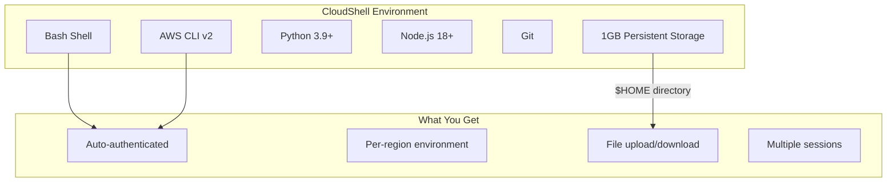
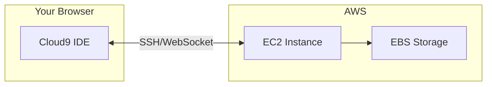
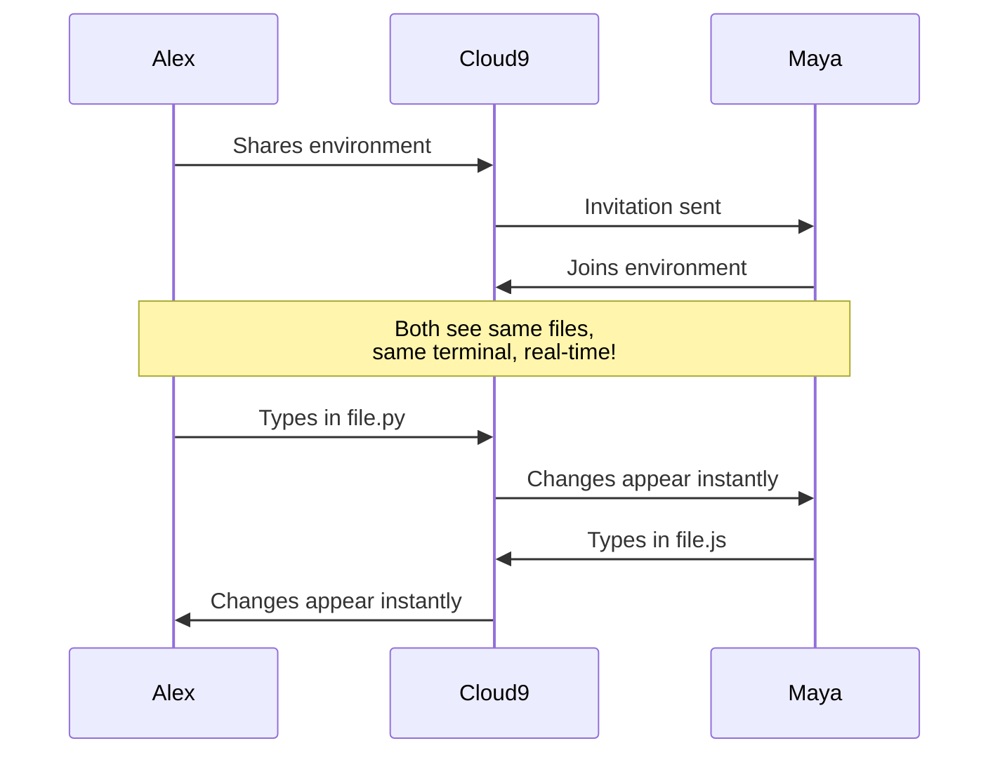
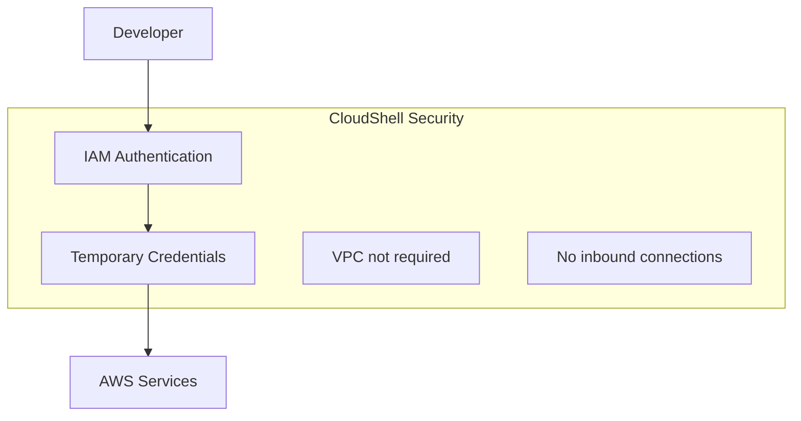

# CloudShell and Cloud9

## Alex's Laptop Dies at the Worst Time

It's demo day. Alex is about to present PetTracker to potential investors when disaster strikes: the laptop won't boot. Blue screen of death. All the AWS CLI tools, configured profiles, and development environment - gone.

"The demo is in 30 minutes!" Alex panics.

Sam, watching from across the room, walks over calmly. "Have you tried CloudShell?"

## AWS CloudShell: Your Terminal in the Browser

CloudShell is a browser-based terminal with AWS CLI pre-installed and automatically authenticated.

### Accessing CloudShell

1. Log into AWS Console
2. Click the CloudShell icon (terminal icon in the top navigation)
3. Wait ~30 seconds for environment to initialize
4. Start typing commands!

```bash
# Already authenticated - no setup needed!
$ aws sts get-caller-identity
{
    "Account": "123456789012",
    "Arn": "arn:aws:iam::123456789012:user/alex"
}

# AWS CLI is pre-installed and up to date
$ aws --version
aws-cli/2.15.0 Python/3.11.6 Linux/5.10.0

# Common tools are available
$ python3 --version
Python 3.9.16

$ node --version
v18.17.1

$ git --version
git version 2.40.1
```

### Alex Saves the Demo

```bash
# In CloudShell, Alex quickly:

# 1. Checks PetTracker Lambda functions
$ aws lambda list-functions --query 'Functions[*].FunctionName'
[
    "pettracker-api",
    "pettracker-photo-processor",
    "pettracker-notification"
]

# 2. Verifies the API is responding
$ curl https://api.pettracker.example.com/health
{"status": "healthy"}

# 3. Checks recent CloudWatch logs
$ aws logs tail /aws/lambda/pettracker-api --since 10m

# Demo saved! 🎉
```

### CloudShell Features



### CloudShell Limitations

| Feature | Limit |
|---------|-------|
| Storage | 1 GB per region |
| Session timeout | 20 minutes idle |
| Concurrent sessions | 10 |
| Outbound internet | Available |
| Inbound connections | Not available |
| vCPU | 1 vCPU |
| Memory | 2 GB |

### Persistent Storage

```bash
# Your home directory persists between sessions
$ cd ~
$ mkdir scripts
$ echo 'aws s3 ls' > scripts/check-buckets.sh
$ chmod +x scripts/check-buckets.sh

# Close CloudShell, reopen later...
$ ~/scripts/check-buckets.sh  # Still there!

# But per-region! us-east-1 home ≠ us-west-2 home
```

### Installing Additional Tools

```bash
# Install tools to your home directory (persists)
$ pip3 install --user boto3-stubs
$ npm install -g aws-cdk

# Or use virtual environments
$ python3 -m venv ~/venvs/pettracker
$ source ~/venvs/pettracker/bin/activate
$ pip install boto3 requests
```

## AWS Cloud9: Full IDE in the Browser

While CloudShell is great for quick tasks, Alex needs a full development environment. Enter **Cloud9**.

### What is Cloud9?

Cloud9 is a cloud-based IDE that runs in your browser:



### Creating a Cloud9 Environment

```bash
# Via CLI
aws cloud9 create-environment-ec2 \
    --name pettracker-dev \
    --instance-type t3.small \
    --image-id amazonlinux-2-x86_64 \
    --automatic-stop-time-minutes 30

# Or via Console:
# 1. Go to Cloud9 service
# 2. Create environment
# 3. Choose instance type
# 4. Click Create
```

### Cloud9 Features

**Built-in capabilities:**
- Full file editor with syntax highlighting
- Integrated terminal
- Debugger for multiple languages
- Git integration
- Real-time collaboration
- AWS toolkit integration

**Pre-installed tools:**
- AWS CLI
- SAM CLI
- Docker
- Python, Node.js, Go, Ruby
- Many database clients

### Alex's Cloud9 Setup

Alex creates a development environment for PetTracker:

```bash
# In Cloud9 terminal

# Clone the project
git clone https://github.com/alex/pettracker.git
cd pettracker

# Install dependencies
pip install -r requirements.txt
npm install

# Run locally
python app.py
# Server running on http://localhost:8080

# Cloud9 provides preview URL!
# Click "Preview" → "Preview Running Application"
```

### Cloud9 Collaboration

Alex's colleague **Maya**, a frontend developer, joins the environment:



**To share:**
1. Cloud9 → Share
2. Add IAM user ARN
3. Choose permissions (read-only or read-write)

### Cloud9 Costs

**Important:** Cloud9 is free, but the underlying EC2 instance costs money!

```
Cloud9 IDE: $0 (free!)
EC2 instance: ~$0.02/hour for t3.small
EBS storage: ~$0.10/GB/month

Alex's mistake:
- Created t3.xlarge "for faster builds"
- Forgot to enable auto-stop
- Left running over weekend
- Bill: $15 for unused compute 😬

Lesson: Always enable auto-stop!
```

### Auto-Stop Configuration

```bash
# Set environment to stop after 30 minutes of inactivity
aws cloud9 update-environment \
    --environment-id abc123def456 \
    --managed-credentials-action ENABLE \
    --automatic-stop-time-minutes 30
```

### Cloud9 with Lambda

Cloud9 integrates beautifully with Lambda development:

```bash
# Install SAM CLI (if not present)
pip install aws-sam-cli

# Initialize SAM project
sam init --runtime python3.9 --name pettracker-lambda

# Local testing
sam local invoke PetTrackerFunction -e event.json

# Local API
sam local start-api
# API running at http://127.0.0.1:3000

# Deploy
sam deploy --guided
```

## CloudShell vs Cloud9: When to Use Each

| Scenario | Use CloudShell | Use Cloud9 |
|----------|---------------|------------|
| Quick CLI commands | ✓ | |
| Checking AWS resources | ✓ | |
| Emergency debugging | ✓ | |
| Writing scripts | ✓ | ✓ |
| Full application development | | ✓ |
| Collaboration with team | | ✓ |
| Running local servers | | ✓ |
| Docker development | | ✓ |
| Long-running tasks | | ✓ |
| Cost-sensitive | ✓ (free) | (EC2 costs) |

## Security Considerations

### CloudShell Security



- Automatically uses your IAM permissions
- Credentials are temporary and auto-rotated
- Cannot be accessed from internet
- Environment isolated per user

### Cloud9 Security

```bash
# Cloud9 uses IAM for authentication
# But runs on EC2 - consider:

# 1. Use managed credentials (auto-rotated)
# 2. Or attach IAM instance profile

# 3. Security group controls
# - Cloud9 creates SG automatically
# - Only allows inbound from Cloud9 service

# 4. Consider using private subnet + VPN
aws cloud9 create-environment-ec2 \
    --subnet-id subnet-abc123 \
    --connection-type CONNECT_SSM  # No public IP needed!
```

## Exam Tips

**For DVA-C02:**

1. CloudShell is **free** and **automatically authenticated**
2. CloudShell storage is **1 GB per region** and **persistent**
3. Cloud9 runs on EC2 - **you pay for the instance**
4. Cloud9 can use **managed credentials** (recommended)
5. Both have AWS CLI and SDKs pre-installed

**Common scenarios:**

> "Developer needs quick access to AWS CLI without local setup..."
> → CloudShell

> "Team needs collaborative development environment..."
> → Cloud9 with sharing enabled

> "Cost-conscious developer needs browser-based access..."
> → CloudShell (free) vs Cloud9 (EC2 costs)

## Hands-On Challenge

### Try CloudShell

1. Open AWS Console
2. Click CloudShell icon
3. Run: `aws s3 ls`
4. Create a script: `echo 'aws sts get-caller-identity' > ~/whoami.sh`
5. Make executable: `chmod +x ~/whoami.sh`
6. Close CloudShell
7. Reopen and run: `~/whoami.sh` (still there!)

### Try Cloud9 (Optional)

1. Create Cloud9 environment (t3.micro to save costs)
2. Enable auto-stop at 30 minutes
3. Clone a project and run it
4. Preview the running application
5. **Remember to delete when done!**

## Key Takeaways

1. **CloudShell** = Quick, free, terminal in browser
2. **Cloud9** = Full IDE, collaboration, costs EC2 money
3. Both auto-authenticate with your IAM credentials
4. CloudShell: 1 GB persistent storage per region
5. Cloud9: Enable auto-stop to avoid surprise bills!
6. Great for demos, emergencies, and collaboration

---

*Next: Alex learns where to find help - documentation, support, and community resources.*

---
*v1.0*
