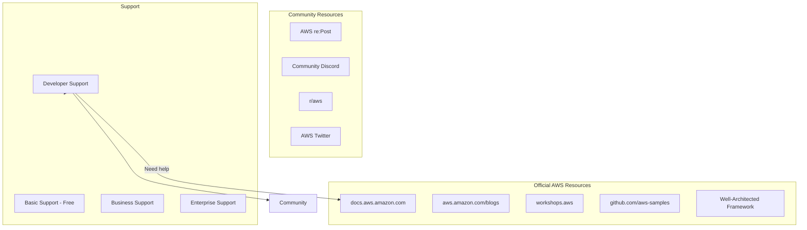
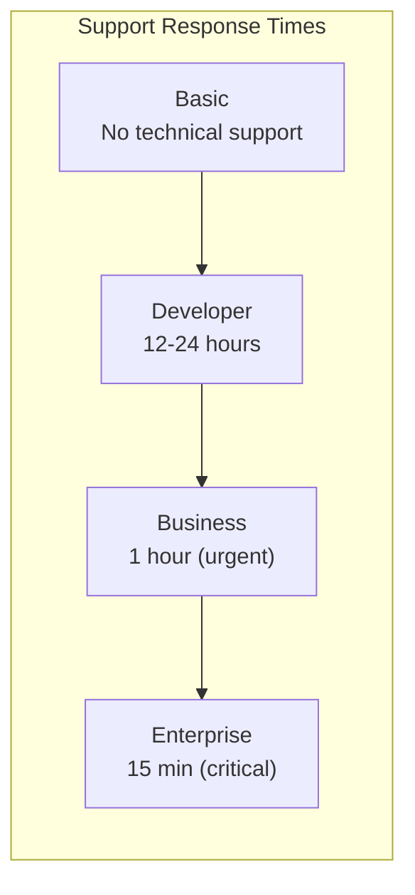
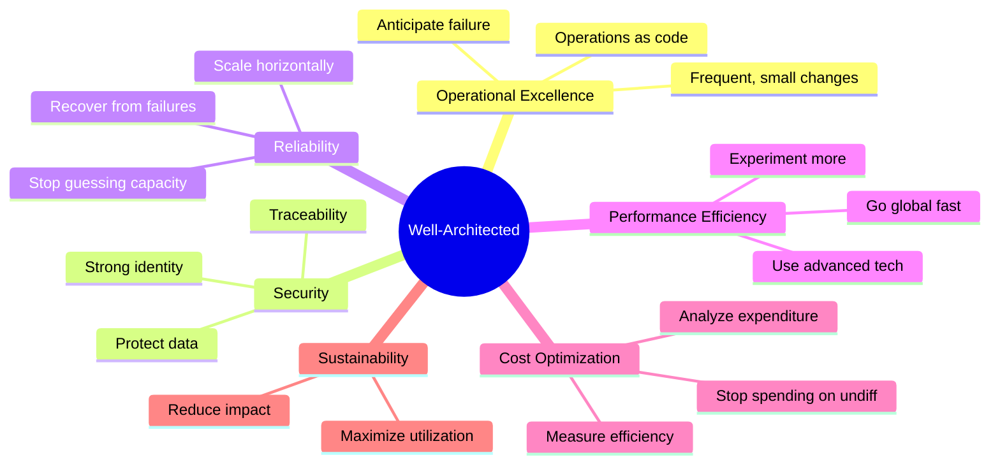
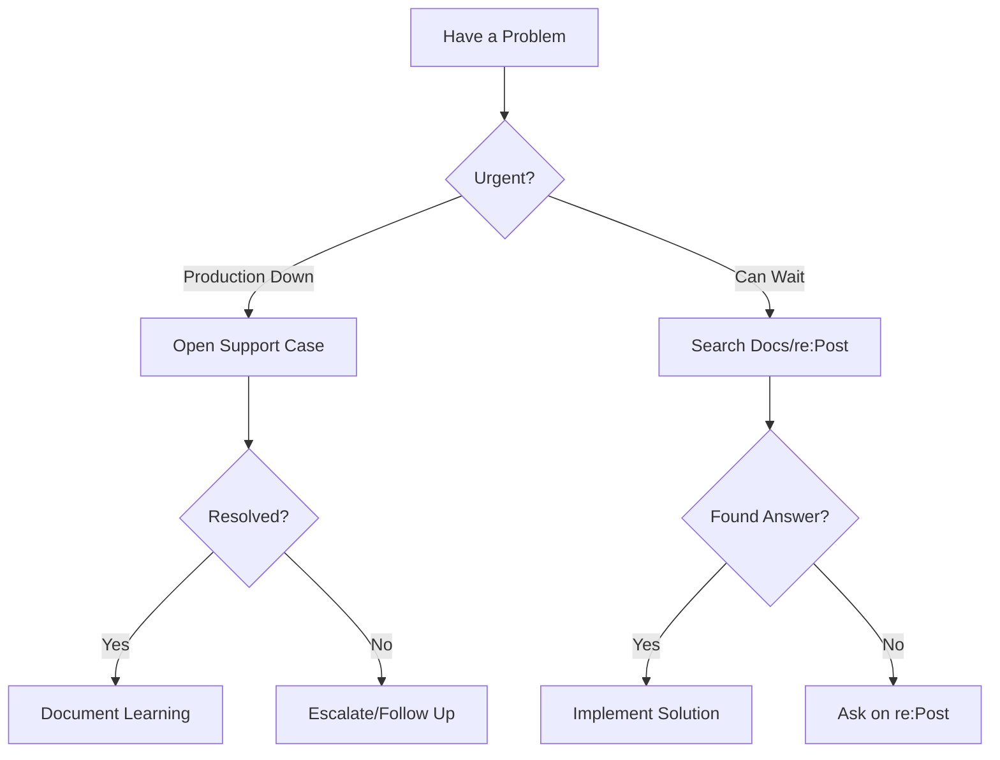

# AWS Documentation and Support

## Alex Gets Stuck

It's 2 AM. Alex has been debugging an issue for hours. The Lambda function keeps timing out, but only in production. The error message is cryptic:

```
Task timed out after 30.00 seconds
```

"I've tried everything," Alex mutters, scrolling through Stack Overflow results that don't quite match the problem.

Then Alex remembers what Sam said: "The best AWS documentation is AWS's own documentation. You just need to know where to look."

## The AWS Documentation Ecosystem



## AWS Official Documentation

### The Main Documentation Site

**docs.aws.amazon.com** is massive but well-organized:

```
docs.aws.amazon.com/
├── Lambda/
│   ├── Developer Guide (concepts, how-tos)
│   ├── API Reference (every API call)
│   └── CLI Reference (commands)
├── DynamoDB/
│   ├── Developer Guide
│   └── API Reference
├── S3/
└── ... (200+ services)
```

### Alex Finds the Answer

Searching for "Lambda timeout troubleshooting":

```bash
# Alex discovers these documentation pages:

# 1. Lambda Developer Guide → Troubleshooting
https://docs.aws.amazon.com/lambda/latest/dg/troubleshooting.html

# Key insight: "Functions in a VPC need NAT gateway for internet access"

# Alex's Lambda was in a VPC but couldn't reach DynamoDB!
```

**The fix:**
```bash
# Option 1: Add NAT Gateway (costs money)
# Option 2: Add VPC Endpoint for DynamoDB (better!)

aws ec2 create-vpc-endpoint \
    --vpc-id vpc-abc123 \
    --service-name com.amazonaws.us-east-1.dynamodb \
    --route-table-ids rtb-def456
```

### Documentation Structure

Each service typically has:

| Document Type | What It Contains | When to Use |
|--------------|------------------|-------------|
| **Developer Guide** | Concepts, tutorials, best practices | Learning a service |
| **API Reference** | Every API operation in detail | Building integrations |
| **CLI Reference** | All CLI commands | Command-line work |
| **User Guide** | Console-focused instructions | Console operations |
| **FAQ** | Common questions | Quick answers |

### Pro Tips for Documentation

```bash
# 1. Use the search - it's actually good!
# Go to docs.aws.amazon.com → Search → "Lambda VPC"

# 2. Check the "Related information" sections
# Often has links to exactly what you need

# 3. Use the PDF versions for offline reading
# Each guide has a downloadable PDF

# 4. Star/bookmark pages you use often
# DynamoDB reserved words: always need this one!
```

## AWS re:Post (Community Forums)

AWS re:Post replaced the old AWS forums:

```
repost.aws/
├── Questions (like Stack Overflow for AWS)
├── Knowledge Center (official how-tos)
├── Articles (community posts)
└── Tags (browse by service)
```

### Knowledge Center Gems

Alex discovers the **Knowledge Center** - AWS's curated how-to articles:

```bash
# Gold mine of solutions!
https://repost.aws/knowledge-center

# Examples Alex finds useful:
# - "How do I troubleshoot Lambda function timeouts?"
# - "Why is my S3 presigned URL expiring?"
# - "How do I resolve DynamoDB throttling?"
```

## AWS Blogs

AWS maintains several technical blogs:

| Blog | Focus | URL |
|------|-------|-----|
| **AWS News Blog** | Announcements | aws.amazon.com/blogs/aws/ |
| **Compute Blog** | Lambda, EC2, Containers | aws.amazon.com/blogs/compute/ |
| **Database Blog** | DynamoDB, RDS | aws.amazon.com/blogs/database/ |
| **Architecture Blog** | Patterns, best practices | aws.amazon.com/blogs/architecture/ |
| **Security Blog** | IAM, security services | aws.amazon.com/blogs/security/ |

### Alex Subscribes to RSS

```bash
# RSS feeds available for all blogs
# Alex adds these to Feedly:

aws.amazon.com/blogs/compute/feed/
aws.amazon.com/blogs/database/feed/
```

## AWS Workshops

Free, hands-on workshops to learn by doing:

```
workshops.aws/
├── serverless/         # Lambda, API Gateway, DynamoDB
├── containers/         # ECS, EKS, Fargate
├── machine-learning/   # SageMaker, Rekognition
└── security/          # IAM, encryption
```

Alex finds the Serverless workshop perfect for PetTracker:
```
https://serverlessland.com/learn
```

## AWS Samples on GitHub

Real code examples:

```bash
# Official AWS sample repositories
github.com/aws-samples/          # Main samples
github.com/awslabs/             # Labs and experiments
github.com/aws/                 # Official SDKs

# Alex finds relevant samples:
github.com/aws-samples/serverless-patterns
github.com/aws-samples/amazon-dynamodb-examples
```

## AWS Support Plans

### Free: Basic Support

Everyone gets:
- Documentation
- AWS re:Post
- AWS Trusted Advisor (limited checks)
- Service health dashboard
- Account and billing support

### Paid: Developer Support ($29/month)

Best for:
- Development/test environments
- Exploring AWS
- Non-production workloads

Includes:
- Technical support via email
- General guidance
- 12-24 hour response time
- 1 primary contact

### Paid: Business Support (from $100/month)

Best for:
- Production workloads
- Business-critical applications

Includes:
- 24/7 phone, email, chat support
- 1-hour response for production down
- All Trusted Advisor checks
- Infrastructure Event Management
- Unlimited contacts

### Paid: Enterprise Support (from $15,000/month)

Best for:
- Mission-critical workloads
- Large organizations

Includes everything in Business plus:
- Technical Account Manager (TAM)
- Concierge support team
- 15-minute response for business-critical
- Proactive reviews
- Training credits



## AWS Trusted Advisor

Free checks (Basic/Developer) vs All checks (Business/Enterprise):

```bash
# Free checks (everyone gets these):
✓ S3 bucket permissions (public buckets)
✓ Security groups (open ports)
✓ IAM use
✓ MFA on root account
✓ Service limits

# Business/Enterprise gets:
✓ Cost optimization (unused resources)
✓ Performance checks
✓ All security checks
✓ Fault tolerance checks
✓ Service limit checks
```

Alex discovers Trusted Advisor found an issue:

```
⚠️  Security Groups - Unrestricted Access

Security group sg-abc123 allows unrestricted access (0.0.0.0/0)
to port 22 (SSH).

Recommendation: Restrict access to specific IP addresses.
```

## The Well-Architected Framework

AWS's guide to building secure, efficient, reliable systems:



Alex uses the **Well-Architected Tool** to review PetTracker:
1. Console → Well-Architected Tool
2. Define workload
3. Answer questions
4. Get improvement recommendations

## Getting Help Effectively

Sam shares tips for getting help faster:

### 1. Before Asking

```markdown
- [ ] Read the error message carefully
- [ ] Check CloudWatch logs
- [ ] Search documentation
- [ ] Search re:Post/Knowledge Center
- [ ] Try AWS's troubleshooting guides
- [ ] Check service limits
- [ ] Verify IAM permissions
```

### 2. When Asking (Good Question Format)

```markdown
**What I'm trying to do:**
Deploy a Lambda function that processes S3 uploads

**What I expected:**
Function runs when file uploaded to S3

**What actually happened:**
Error: "Unable to import module 'handler'"

**What I've tried:**
1. Verified handler name matches in config
2. Checked deployment package structure
3. Tested locally - works fine

**Relevant code/config:**
```python
# handler.py
def lambda_handler(event, context):
    ...
```

**Environment:**
- Runtime: Python 3.9
- Region: us-east-1
- Deployment: SAM
```

### 3. Resources by Urgency



## Exam Tips

**For DVA-C02:**

1. Know the support plan tiers and response times
2. Understand Trusted Advisor free vs paid checks
3. Know where to find troubleshooting guides
4. Understand the Well-Architected pillars

**Common scenarios:**

> "Company needs 24/7 phone support for production..."
> → Business or Enterprise Support

> "How to check for security vulnerabilities automatically?"
> → Trusted Advisor (full access with Business/Enterprise)

> "Developer needs best practices guidance..."
> → Well-Architected Framework, documentation

## Key Takeaways

1. **AWS Documentation** is comprehensive - use the search!
2. **re:Post Knowledge Center** has curated how-tos
3. **AWS Blogs** announce new features and patterns
4. **Support plans** range from free to enterprise
5. **Trusted Advisor** catches common issues
6. **Well-Architected Framework** guides best practices

---

*Next: Alex sets up billing alerts - the most important lesson to learn early!*

---
*v2.0*
