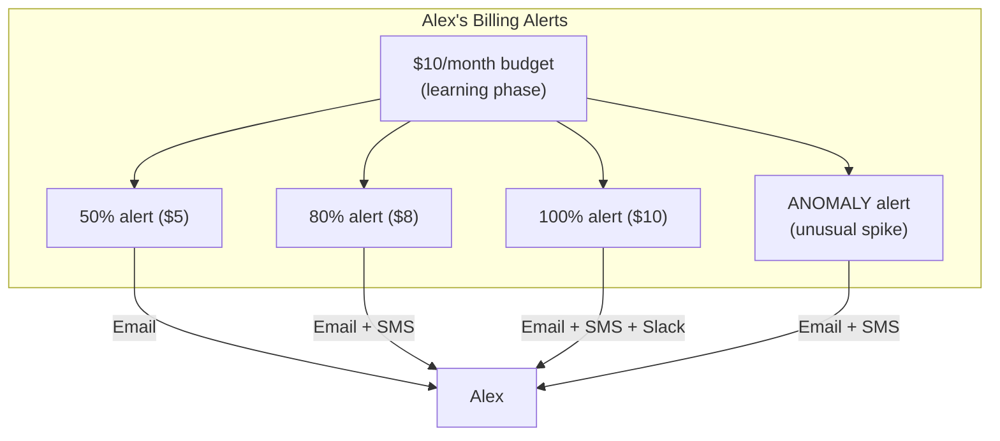
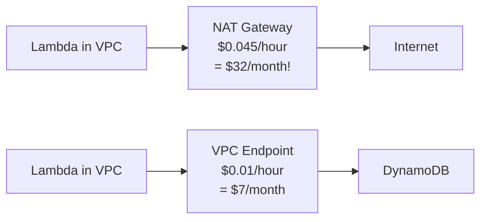
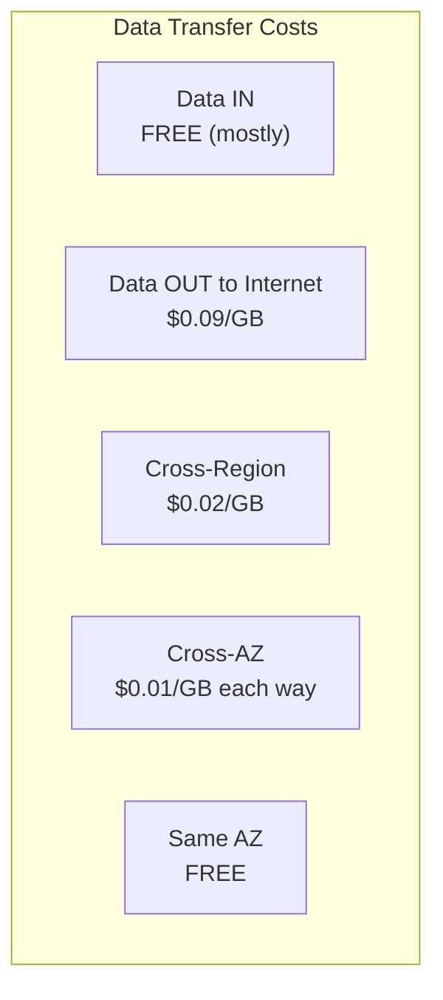
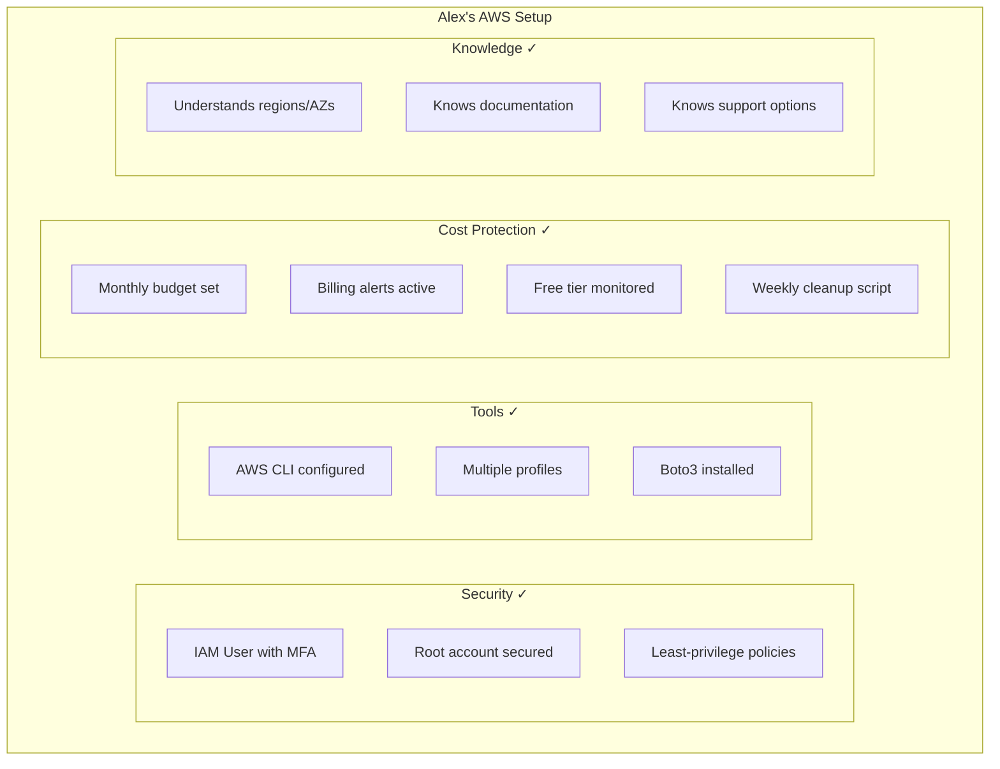

# Alex's Solution: Environment Ready + Critical Cost Setup!

## The Horror Story That Changed Everything

Before we celebrate Alex's progress, Sam shares a cautionary tale that will save you real money.

"Let me tell you about my friend Chris," Sam says, getting serious. "Chris was learning AWS, spun up some resources for a tutorial, and forgot about them. Three months later: **$2,400 bill**."

Alex's eyes go wide.

"It gets worse. Chris used RDS Multi-AZ, NAT Gateways, and a large Elasticsearch cluster - all 'just to test.' AWS doesn't care if you're learning. The meter runs 24/7."

## STOP! Set Up Billing Alerts First!

**This is the most important lesson in this entire course.** Before doing ANYTHING else, set up billing alerts.

### Step 1: Enable Billing Alerts

```bash
# First, enable billing alerts in your account
# Console → Account → Billing preferences

# Or via CLI (requires root account access for initial setup)
aws ce put-anomaly-monitor \
    --anomaly-monitor '{
        "MonitorName": "TotalSpendMonitor",
        "MonitorType": "DIMENSIONAL",
        "MonitorDimension": "SERVICE"
    }'
```

### Step 2: Create Budget Alerts

```bash
# Create a monthly budget with alerts
aws budgets create-budget \
    --account-id $(aws sts get-caller-identity --query Account --output text) \
    --budget '{
        "BudgetName": "Monthly-Total",
        "BudgetLimit": {
            "Amount": "20",
            "Unit": "USD"
        },
        "TimeUnit": "MONTHLY",
        "BudgetType": "COST"
    }' \
    --notifications-with-subscribers '[
        {
            "Notification": {
                "NotificationType": "ACTUAL",
                "ComparisonOperator": "GREATER_THAN",
                "Threshold": 50
            },
            "Subscribers": [
                {
                    "SubscriptionType": "EMAIL",
                    "Address": "alex@pettracker.com"
                }
            ]
        },
        {
            "Notification": {
                "NotificationType": "ACTUAL",
                "ComparisonOperator": "GREATER_THAN",
                "Threshold": 80
            },
            "Subscribers": [
                {
                    "SubscriptionType": "EMAIL",
                    "Address": "alex@pettracker.com"
                }
            ]
        },
        {
            "Notification": {
                "NotificationType": "ACTUAL",
                "ComparisonOperator": "GREATER_THAN",
                "Threshold": 100
            },
            "Subscribers": [
                {
                    "SubscriptionType": "EMAIL",
                    "Address": "alex@pettracker.com"
                }
            ]
        }
    ]'
```

### Alex's Budget Setup



## The Free Tier: Know the Limits!

AWS Free Tier has THREE types:

### 1. Always Free
```yaml
Always Free (forever):
  Lambda: 1M requests/month, 400,000 GB-seconds
  DynamoDB: 25GB storage, 25 RCU/WCU
  SNS: 1M publishes
  CloudWatch: 10 custom metrics
  SQS: 1M requests/month
```

### 2. 12 Months Free (after signup)
```yaml
12 Months Free (new accounts only):
  EC2: 750 hours/month t2.micro or t3.micro
  S3: 5GB storage
  RDS: 750 hours/month db.t2.micro
  CloudFront: 50GB data transfer
  ElastiCache: 750 hours t2.micro
```

### 3. Trials
```yaml
Short-term Trials (service-specific):
  Redshift: 2 months free
  QuickSight: 30 days free
  SageMaker: 2 months free
```

### Alex's Free Tier Dashboard

```bash
# Check your free tier usage
# Console → Billing → Free Tier

# Or set up usage alerts
aws budgets create-budget \
    --account-id $(aws sts get-caller-identity --query Account --output text) \
    --budget '{
        "BudgetName": "FreeTier-EC2",
        "BudgetLimit": {
            "Amount": "750",
            "Unit": "HOURS"
        },
        "TimeUnit": "MONTHLY",
        "BudgetType": "USAGE",
        "CostFilters": {
            "Service": ["Amazon Elastic Compute Cloud - Compute"]
        }
    }'
```

## Common Cost Traps (And How Alex Avoids Them)

### Trap 1: NAT Gateways



**Cost:** NAT Gateway = ~$32/month minimum + data processing
**Solution:** Use VPC Endpoints for AWS services, avoid NAT when possible

### Trap 2: Elastic IPs

```bash
# Elastic IPs are FREE when:
# - Attached to a RUNNING instance
# - Only ONE per instance

# Elastic IPs COST when:
# - Not attached to any instance: $0.005/hour = $3.60/month
# - Attached to a STOPPED instance: $0.005/hour
# - More than one per instance: $0.005/hour each

# Check for unused Elastic IPs
aws ec2 describe-addresses \
    --query 'Addresses[?AssociationId==`null`].PublicIp'
```

### Trap 3: Forgotten Resources

Alex creates a cleanup script:

```bash
#!/bin/bash
# weekly-cleanup.sh - Run this every week!

echo "=== Checking for forgotten resources ==="

# Unattached EBS volumes
echo "Unattached EBS volumes:"
aws ec2 describe-volumes \
    --filters "Name=status,Values=available" \
    --query 'Volumes[*].[VolumeId,Size,CreateTime]' \
    --output table

# Old snapshots (>30 days)
echo "Old snapshots:"
aws ec2 describe-snapshots \
    --owner-ids self \
    --query 'Snapshots[?StartTime<`2024-01-01`].[SnapshotId,VolumeSize,StartTime]' \
    --output table

# Unused Elastic IPs
echo "Unused Elastic IPs:"
aws ec2 describe-addresses \
    --query 'Addresses[?AssociationId==`null`].PublicIp'

# Idle load balancers (no healthy targets)
echo "Load balancers to check:"
aws elbv2 describe-load-balancers \
    --query 'LoadBalancers[*].[LoadBalancerName,State.Code]' \
    --output table

# Old Lambda versions (keeping too many)
echo "Lambda functions with many versions:"
for func in $(aws lambda list-functions --query 'Functions[*].FunctionName' --output text); do
    count=$(aws lambda list-versions-by-function --function-name $func --query 'length(Versions)')
    if [ $count -gt 5 ]; then
        echo "$func: $count versions"
    fi
done
```

### Trap 4: Data Transfer Costs



### Trap 5: CloudWatch Logs Storage

```bash
# Logs accumulate forever by default!
# Set retention policies

aws logs put-retention-policy \
    --log-group-name /aws/lambda/pettracker-api \
    --retention-in-days 7  # Keep only 7 days for dev

# For production, maybe 30-90 days
# Archive to S3 if needed longer
```

## Alex's Cost Optimization Dashboard

```bash
# Create a daily cost check alias
alias aws-cost-today='aws ce get-cost-and-usage \
    --time-period Start=$(date -d "yesterday" +%Y-%m-%d),End=$(date +%Y-%m-%d) \
    --granularity DAILY \
    --metrics "UnblendedCost" \
    --query "ResultsByTime[0].Total.UnblendedCost.Amount"'

# Check cost by service
alias aws-cost-services='aws ce get-cost-and-usage \
    --time-period Start=$(date -d "30 days ago" +%Y-%m-%d),End=$(date +%Y-%m-%d) \
    --granularity MONTHLY \
    --metrics "UnblendedCost" \
    --group-by Type=DIMENSION,Key=SERVICE \
    --query "ResultsByTime[0].Groups[*].[Keys[0],Metrics.UnblendedCost.Amount]" \
    --output table'
```

## Alex's Complete Environment Summary

After this chapter, Alex has:



## Chapter Review: What Alex Learned

| Topic | Key Takeaway | Exam Relevance |
|-------|--------------|----------------|
| Global Infrastructure | Regions > AZs > Edge Locations | High |
| AWS CLI | `~/.aws/credentials` and `~/.aws/config` | High |
| Profiles | Use named profiles for multiple accounts | Medium |
| SDKs | Credential chain, never hardcode | High |
| CloudShell | Free, auto-authenticated terminal | Medium |
| Cloud9 | Full IDE, costs EC2 money | Low |
| Documentation | re:Post, Knowledge Center | Medium |
| Support Plans | Tiers and response times | Medium |
| Billing | SET UP ALERTS FIRST! | Life-saving |

## Alex's Checklist Before Moving On

```markdown
## Pre-Chapter Checklist

- [ ] AWS account created
- [ ] Root account has MFA enabled
- [ ] IAM user created with appropriate permissions
- [ ] AWS CLI installed and configured
- [ ] At least one named profile set up
- [ ] Python/Node.js SDK installed
- [ ] **BILLING ALERTS CONFIGURED** (most important!)
- [ ] Budget set to reasonable amount
- [ ] Free tier dashboard bookmarked
- [ ] Cleanup script ready

If any box is unchecked, do it NOW before continuing!
```

## What's Next: IAM and Security

With the environment ready and protected by billing alerts, Alex is ready to dive deeper. The next chapter covers IAM - the foundation of AWS security.

**Preview:** Alex's mentor Sam reviews PetTracker's IAM setup and finds some concerning issues...

```bash
# Sneak peek at Chapter 1
$ aws iam get-account-summary
{
    "SummaryMap": {
        "Users": 5,
        "Policies": 12,
        "MFADevicesInUse": 1,  # Uh oh, only 1 user has MFA!
        "AccessKeysPerUserQuota": 2,
        "AccountAccessKeysPresent": 1  # Root has access keys?!
    }
}

# Sam: "We need to talk about your IAM setup..."
```

## Key Takeaways from Chapter 0

1. **AWS Global Infrastructure**: Regions contain AZs; Edge Locations cache content
2. **AWS CLI**: Your primary tool for AWS work; configure with profiles
3. **SDKs**: Let the credential chain work; never hardcode keys
4. **CloudShell/Cloud9**: Browser-based alternatives when needed
5. **Documentation**: docs.aws.amazon.com, re:Post, Knowledge Center
6. **BILLING**: Set up alerts BEFORE doing anything else!

---

**Congratulations!** You've completed Chapter 0. Alex (and you) are now ready to start building PetTracker securely and cost-effectively.

*Next Chapter: IAM and Security - Locking down PetTracker properly.*

---
*v2.0*
