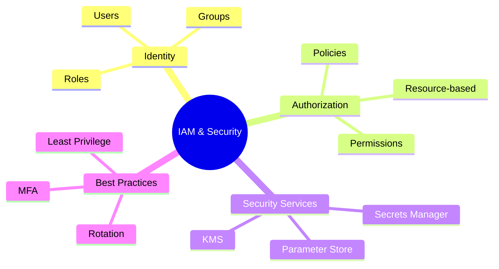

# IAM and Security

AWS Identity and Access Management (IAM) is the foundation of security on AWS. Every AWS action requires authentication and authorization through IAM. Master this, and you'll understand how to secure any AWS application.

## Alex's Story: The Security Audit

Two weeks after setting up PetTracker's basic infrastructure, Alex gets an unexpected visitor: **Jordan**, the company's security consultant. Jordan takes one look at Alex's AWS setup and sighs heavily.

"Let me guess," Jordan says, "you've been using the root account for everything, there's one IAM user shared between three developers, and nobody has MFA enabled except you?"

Alex's face goes red. "How did you know?"

"Because that's how everyone starts. Let's fix this before you end up in a breach report."

## What You'll Learn

By the end of this chapter, you'll understand:

- IAM users, groups, roles, and policies
- How to write effective IAM policies
- Cross-account access and federation
- Security best practices (MFA, key rotation, least privilege)
- AWS security services (KMS, Secrets Manager, Parameter Store)

## Chapter Architecture

## Why This Matters for the Exam

IAM is one of the most heavily tested topics on the DVA-C02. You need to understand:

- Policy structure and evaluation logic
- When to use roles vs users
- How services assume roles
- Cross-account access patterns
- Security best practices

Expect 15-20% of exam questions to directly involve IAM concepts.

## Characters in This Chapter

- **Alex** - Our developer, learning security the hard way
- **Jordan** - Security consultant who's seen every mistake
- **Sam** - DevOps mentor, helps with implementation
- **Maya** - Frontend developer who needs limited AWS access
- **The CTO** - Gets involved when security incidents happen

---
*v1.0*
