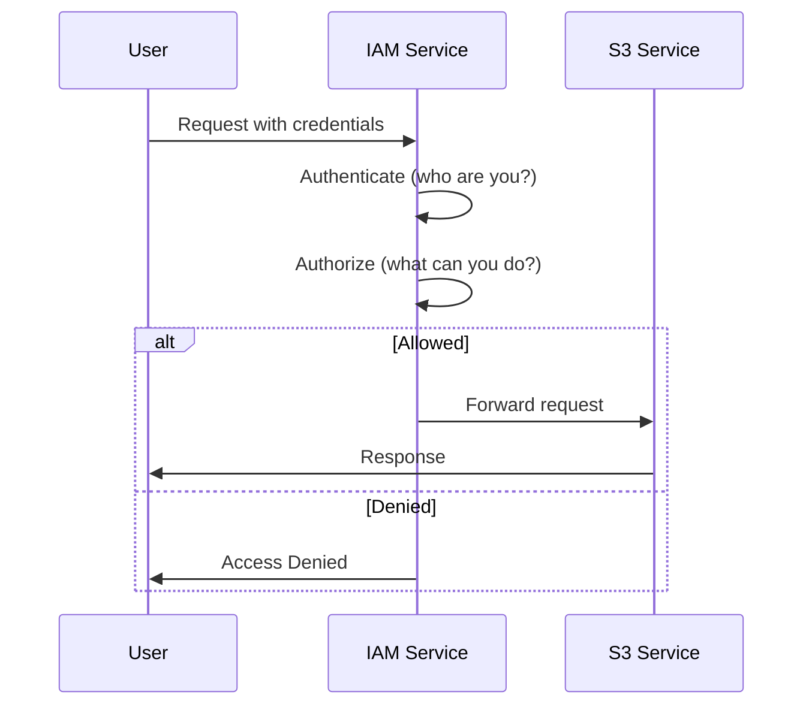
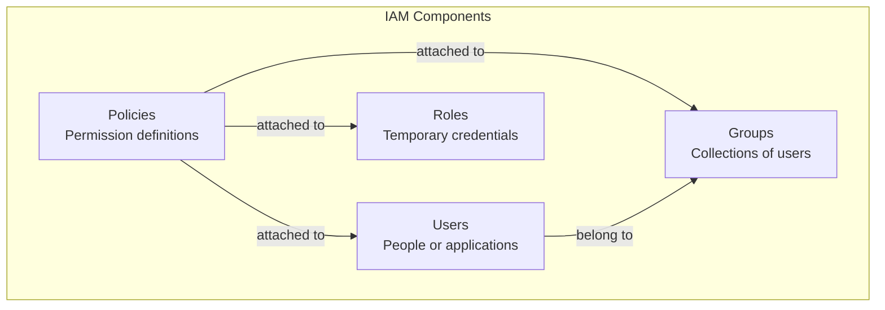
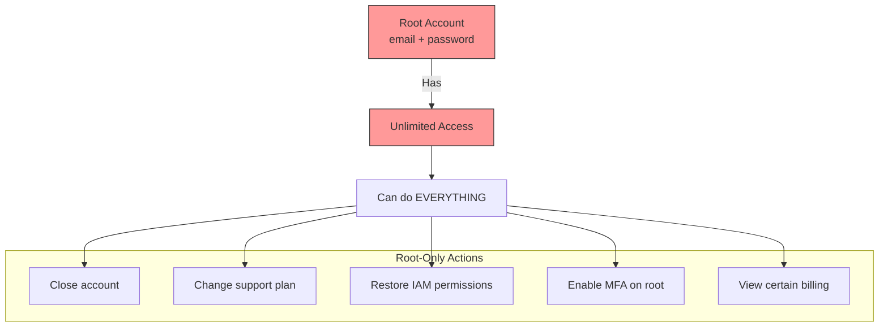
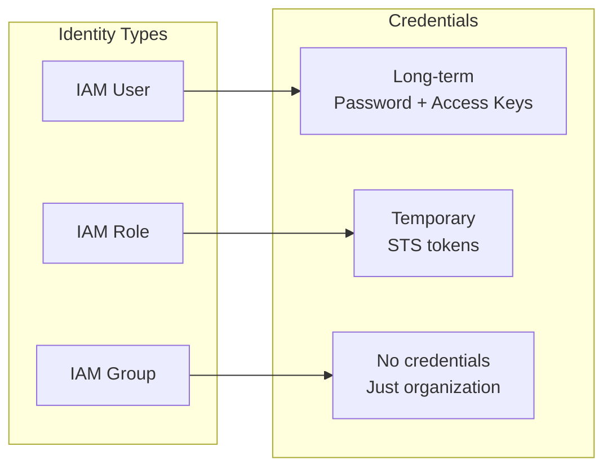
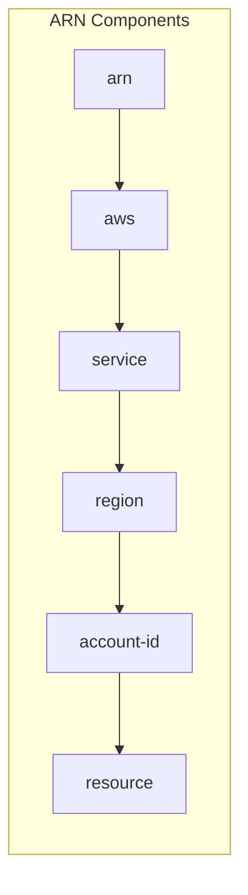
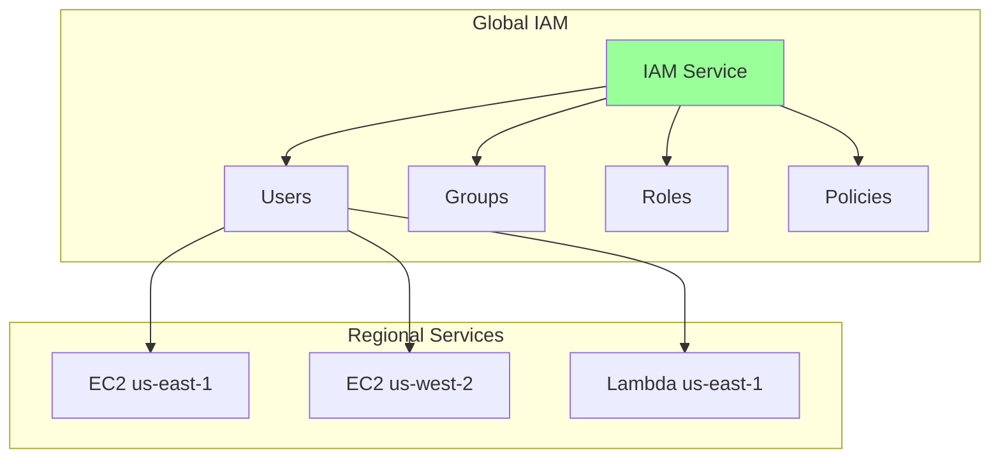

# IAM Fundamentals

## What is IAM?

AWS Identity and Access Management (IAM) is a free service that lets you control who can do what in your AWS account. Every single AWS API call is authenticated and authorized through IAM.



## The Four Pillars of IAM



### 1. Users

An IAM user represents a person or application that interacts with AWS.

```bash
# Create an IAM user
aws iam create-user --user-name maya

# Output:
{
    "User": {
        "Path": "/",
        "UserName": "maya",
        "UserId": "AIDAEXAMPLEID",
        "Arn": "arn:aws:iam::123456789012:user/maya",
        "CreateDate": "2024-01-15T10:30:00Z"
    }
}
```

**Key characteristics:**
- Long-term credentials (password, access keys)
- Can have console access, API access, or both
- Should represent a single identity (don't share users!)

### 2. Groups

Groups are collections of users. Attach policies to groups, and all members inherit those permissions.

```bash
# Create a group
aws iam create-group --group-name Developers

# Add user to group
aws iam add-user-to-group --user-name maya --group-name Developers
```

**Key characteristics:**
- Simplify permission management
- A user can belong to multiple groups
- No nesting (groups can't contain groups)

### 3. Roles

Roles provide temporary credentials that can be assumed by users, services, or applications.

```bash
# Create a role (for Lambda)
aws iam create-role \
    --role-name pettracker-lambda-role \
    --assume-role-policy-document file://trust-policy.json
```

**Key characteristics:**
- No permanent credentials
- Can be assumed by AWS services, users, or external identities
- Perfect for cross-account access
- Used by EC2, Lambda, ECS, etc.

### 4. Policies

Policies are JSON documents that define permissions.

```json
{
    "Version": "2012-10-17",
    "Statement": [
        {
            "Effect": "Allow",
            "Action": "s3:GetObject",
            "Resource": "arn:aws:s3:::pettracker-images/*"
        }
    ]
}
```

**Key characteristics:**
- Define what actions are allowed or denied
- Can be AWS-managed or customer-managed
- Attached to users, groups, or roles

## Alex's First Fix: Understanding the Root Account

Jordan explains the root account to Alex:



### Securing the Root Account

Alex follows Jordan's instructions:

```bash
# Step 1: Enable MFA (must do in console)
# Console → Account → Security credentials → MFA

# Step 2: Delete root access keys (if any exist)
# Console → Security credentials → Access keys → Delete

# Step 3: Create strong password
# At least 16 characters, mixed case, numbers, symbols

# Step 4: Lock it away
# Store credentials in secure vault (not your password manager!)
```

### Root Account vs IAM User

| Aspect | Root Account | IAM User |
|--------|--------------|----------|
| **Access** | Unlimited | Policy-controlled |
| **MFA** | Must enable | Should enable |
| **Usage** | Emergency only | Daily work |
| **Keys** | Never create | OK with caution |
| **Audit** | Limited | Full CloudTrail |

## IAM Identities Comparison



## Alex Creates Proper Users

With Jordan watching, Alex creates individual users for the team:

```bash
#!/bin/bash
# create-team-users.sh

# Create users
for user in alex maya sam; do
    echo "Creating user: $user"

    # Create the user
    aws iam create-user --user-name $user

    # Enable console access
    aws iam create-login-profile \
        --user-name $user \
        --password "TempPassword123!" \
        --password-reset-required

    echo "User $user created with temporary password"
done

# Create groups
aws iam create-group --group-name Developers
aws iam create-group --group-name DevOps
aws iam create-group --group-name ReadOnly

# Add users to appropriate groups
aws iam add-user-to-group --user-name alex --group-name Developers
aws iam add-user-to-group --user-name maya --group-name Developers
aws iam add-user-to-group --user-name sam --group-name DevOps
```

## The ARN Format

Alex keeps seeing "ARN" everywhere. Jordan explains:

**ARN = Amazon Resource Name** - a unique identifier for any AWS resource.

```
arn:aws:service:region:account-id:resource-type/resource-id

Examples:
arn:aws:iam::123456789012:user/alex
arn:aws:s3:::pettracker-images
arn:aws:dynamodb:us-east-1:123456789012:table/PetTracker-Pets
arn:aws:lambda:us-east-1:123456789012:function:pettracker-api
```



**Special cases:**
- S3 buckets: No region (globally unique names)
- IAM: No region (global service)
- Some resources: Use `:` vs `/` for resource path

## IAM Is Global

One important concept:



**This means:**
- IAM users, groups, roles, and policies are available in ALL regions
- Create once, use everywhere
- No regional configuration needed for IAM itself

## Alex's Mental Model

After the lesson, Alex draws a mental model:

```
AWS Account
├── Root Account (EMERGENCY ONLY, MFA enabled)
│
├── IAM Users (individual identities)
│   ├── alex (Developer)
│   ├── maya (Developer)
│   └── sam (DevOps)
│
├── IAM Groups (permission containers)
│   ├── Developers → [alex, maya]
│   └── DevOps → [sam]
│
├── IAM Roles (for services and temp access)
│   ├── lambda-execution-role
│   ├── ec2-instance-role
│   └── cross-account-role
│
└── IAM Policies (permission definitions)
    ├── AWS Managed Policies
    └── Custom Policies
```

## Exam Tips

**For DVA-C02:**

1. **Root account** should only be used for root-only tasks
2. **IAM is global** - not regional
3. **Users** have long-term credentials
4. **Roles** have temporary credentials (preferred for services)
5. **Groups** cannot be nested
6. **Policies** define permissions in JSON format

**Common exam scenarios:**

> "Application on EC2 needs to access S3..."
> → Use IAM Role (not user access keys)

> "Multiple developers need the same permissions..."
> → Create IAM Group, attach policy, add users

> "Third-party service needs access to your account..."
> → Create IAM Role with trust policy

## Hands-On Challenge

```bash
# 1. List all IAM users
aws iam list-users

# 2. Create a new user
aws iam create-user --user-name test-user

# 3. List all groups
aws iam list-groups

# 4. See what groups a user belongs to
aws iam list-groups-for-user --user-name alex

# 5. Clean up
aws iam delete-user --user-name test-user
```

## Key Takeaways

1. **IAM controls all access to AWS**
2. **Root account** = unlimited power, use sparingly
3. **Users** = individual identities with long-term credentials
4. **Groups** = collections of users for easier management
5. **Roles** = temporary credentials for services and cross-account
6. **Policies** = JSON documents defining permissions
7. **IAM is global** - works across all regions

---

*Next: Alex dives deeper into IAM Users and Groups, implementing proper team structure.*

---
*v1.0*
