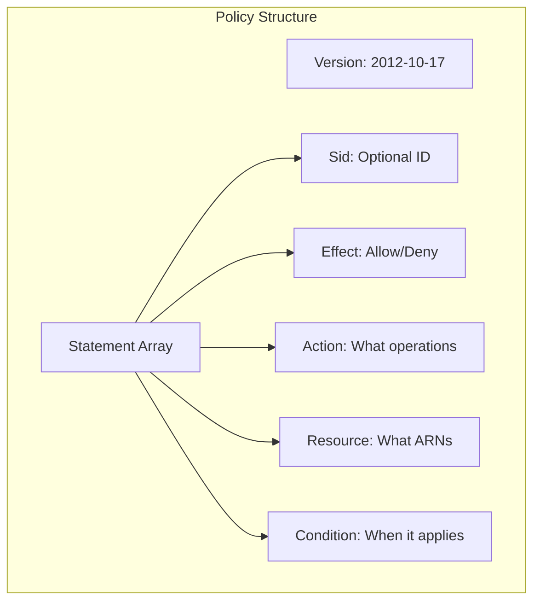
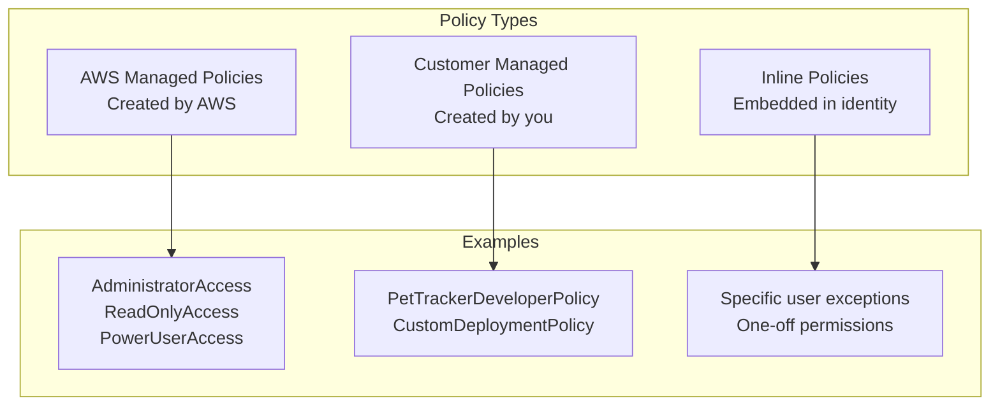

# IAM Policies Deep Dive

## Alex's Policy Problem

Alex has created users and groups, but now comes the hard part: defining what each group can actually do. The first attempt doesn't go well:

```json
{
    "Version": "2012-10-17",
    "Statement": [{
        "Effect": "Allow",
        "Action": "*",
        "Resource": "*"
    }]
}
```

"That's literally just admin access with extra steps," Jordan sighs. "Let's learn to write proper policies."

## Anatomy of an IAM Policy

Every IAM policy has the same structure:

```json
{
    "Version": "2012-10-17",
    "Statement": [
        {
            "Sid": "DescriptiveStatementId",
            "Effect": "Allow | Deny",
            "Action": "service:action",
            "Resource": "arn:aws:...",
            "Condition": {
                "ConditionOperator": {
                    "ConditionKey": "ConditionValue"
                }
            }
        }
    ]
}
```



### Breaking Down Each Element

#### Version
Always use `"2012-10-17"` - it's the current policy language version.

```json
"Version": "2012-10-17"  // Current version, always use this
"Version": "2008-10-17"  // Old version, don't use
```

#### Effect
Only two options: `Allow` or `Deny`

```json
"Effect": "Allow"  // Grant permission
"Effect": "Deny"   // Explicitly block (overrides Allow)
```

#### Action
Specifies what API operations are allowed/denied:

```json
// Single action
"Action": "s3:GetObject"

// Multiple actions
"Action": [
    "s3:GetObject",
    "s3:PutObject",
    "s3:DeleteObject"
]

// Wildcard - all S3 actions
"Action": "s3:*"

// Wildcard - all Get actions in S3
"Action": "s3:Get*"

// All actions on all services (DANGEROUS!)
"Action": "*"
```

#### Resource
Specifies which AWS resources the action applies to:

```json
// Specific object
"Resource": "arn:aws:s3:::pettracker-images/photos/photo1.jpg"

// All objects in a bucket
"Resource": "arn:aws:s3:::pettracker-images/*"

// Bucket AND objects (need both for full access)
"Resource": [
    "arn:aws:s3:::pettracker-images",
    "arn:aws:s3:::pettracker-images/*"
]

// All resources (use carefully!)
"Resource": "*"
```

## Alex's First Real Policy

Let's create a policy for the Developers group:

```json
{
    "Version": "2012-10-17",
    "Statement": [
        {
            "Sid": "LambdaFullAccess",
            "Effect": "Allow",
            "Action": [
                "lambda:*"
            ],
            "Resource": "arn:aws:lambda:us-east-1:123456789012:function:pettracker-*"
        },
        {
            "Sid": "DynamoDBAccess",
            "Effect": "Allow",
            "Action": [
                "dynamodb:GetItem",
                "dynamodb:PutItem",
                "dynamodb:UpdateItem",
                "dynamodb:DeleteItem",
                "dynamodb:Query",
                "dynamodb:Scan"
            ],
            "Resource": [
                "arn:aws:dynamodb:us-east-1:123456789012:table/PetTracker-*",
                "arn:aws:dynamodb:us-east-1:123456789012:table/PetTracker-*/index/*"
            ]
        },
        {
            "Sid": "S3Access",
            "Effect": "Allow",
            "Action": [
                "s3:GetObject",
                "s3:PutObject",
                "s3:DeleteObject"
            ],
            "Resource": "arn:aws:s3:::pettracker-*/*"
        },
        {
            "Sid": "S3ListBuckets",
            "Effect": "Allow",
            "Action": "s3:ListBucket",
            "Resource": "arn:aws:s3:::pettracker-*"
        },
        {
            "Sid": "CloudWatchLogs",
            "Effect": "Allow",
            "Action": [
                "logs:CreateLogGroup",
                "logs:CreateLogStream",
                "logs:PutLogEvents",
                "logs:DescribeLogGroups",
                "logs:DescribeLogStreams",
                "logs:GetLogEvents"
            ],
            "Resource": "arn:aws:logs:us-east-1:123456789012:log-group:/aws/lambda/pettracker-*"
        }
    ]
}
```

**What this policy does:**
- Full Lambda access to pettracker-* functions
- DynamoDB CRUD operations on PetTracker-* tables
- S3 object operations on pettracker-* buckets
- CloudWatch Logs access for Lambda logs

## Policy Types



### AWS Managed Policies

Pre-built policies maintained by AWS:

```bash
# List some AWS managed policies
aws iam list-policies --scope AWS --query 'Policies[?starts_with(PolicyName, `Amazon`)].PolicyName' | head -20

# Common ones:
# AdministratorAccess - Full access (DANGEROUS)
# ReadOnlyAccess - Read everything, write nothing
# PowerUserAccess - Full access except IAM
# AmazonS3FullAccess - Full S3 access
# AmazonDynamoDBFullAccess - Full DynamoDB access
```

**Pros:**
- Easy to use
- Automatically updated by AWS
- Well-documented

**Cons:**
- Often too permissive
- Can't customize
- May include services you don't use

### Customer Managed Policies

Policies you create and manage:

```bash
# Create a customer managed policy
aws iam create-policy \
    --policy-name PetTrackerDeveloperPolicy \
    --policy-document file://developer-policy.json \
    --description "Policy for PetTracker developers"
```

**Pros:**
- Fully customizable
- Can be attached to multiple identities
- Version controlled
- Can be updated (new versions)

**Cons:**
- You maintain them
- Must update when services change

### Inline Policies

Policies embedded directly in a user, group, or role:

```bash
# Add inline policy to user
aws iam put-user-policy \
    --user-name maya \
    --policy-name MayaSpecialAccess \
    --policy-document file://maya-special.json
```

**Pros:**
- Good for exceptions
- Deleted when identity is deleted

**Cons:**
- Hard to audit
- Can't reuse
- Clutter user/group/role definitions

**Best Practice:** Use Customer Managed Policies for most cases. Use inline only for strict 1:1 relationships.

## Conditions: Adding Context

Conditions let you add requirements to policies:

```json
{
    "Version": "2012-10-17",
    "Statement": [{
        "Effect": "Allow",
        "Action": "s3:*",
        "Resource": "*",
        "Condition": {
            "IpAddress": {
                "aws:SourceIp": "203.0.113.0/24"
            }
        }
    }]
}
```

### Common Condition Keys

```json
// IP-based restrictions
"Condition": {
    "IpAddress": {
        "aws:SourceIp": ["203.0.113.0/24", "2001:DB8::/32"]
    }
}

// Time-based restrictions
"Condition": {
    "DateGreaterThan": {"aws:CurrentTime": "2024-01-01T00:00:00Z"},
    "DateLessThan": {"aws:CurrentTime": "2024-12-31T23:59:59Z"}
}

// MFA required
"Condition": {
    "Bool": {
        "aws:MultiFactorAuthPresent": "true"
    }
}

// Specific tags required
"Condition": {
    "StringEquals": {
        "aws:RequestTag/Environment": "production"
    }
}

// SSL/TLS required
"Condition": {
    "Bool": {
        "aws:SecureTransport": "true"
    }
}
```

### Alex's Production Protection Policy

Jordan helps Alex create a policy that requires MFA for production access:

```json
{
    "Version": "2012-10-17",
    "Statement": [
        {
            "Sid": "AllowDevelopmentAccess",
            "Effect": "Allow",
            "Action": [
                "dynamodb:*",
                "lambda:*",
                "s3:*"
            ],
            "Resource": [
                "arn:aws:dynamodb:*:*:table/PetTracker-Dev-*",
                "arn:aws:lambda:*:*:function:pettracker-dev-*",
                "arn:aws:s3:::pettracker-dev-*"
            ]
        },
        {
            "Sid": "AllowProductionWithMFA",
            "Effect": "Allow",
            "Action": [
                "dynamodb:*",
                "lambda:*",
                "s3:*"
            ],
            "Resource": [
                "arn:aws:dynamodb:*:*:table/PetTracker-Prod-*",
                "arn:aws:lambda:*:*:function:pettracker-prod-*",
                "arn:aws:s3:::pettracker-prod-*"
            ],
            "Condition": {
                "Bool": {
                    "aws:MultiFactorAuthPresent": "true"
                }
            }
        }
    ]
}
```

**What this does:**
- Dev resources: Always accessible
- Prod resources: Only with MFA authenticated

## Policy Variables

Use variables to make policies dynamic:

```json
{
    "Version": "2012-10-17",
    "Statement": [{
        "Effect": "Allow",
        "Action": ["s3:GetObject", "s3:PutObject"],
        "Resource": "arn:aws:s3:::pettracker-user-data/${aws:username}/*"
    }]
}
```

### Common Variables

```json
${aws:username}          // IAM user name
${aws:userid}            // IAM user ID
${aws:PrincipalTag/key}  // Tag on the principal
${aws:RequestTag/key}    // Tag in the request
${s3:prefix}             // S3 prefix (with S3 conditions)
${aws:CurrentTime}       // Current time
${aws:SourceIp}          // Requester's IP
```

### User Home Directory Pattern

Common pattern - give each user their own S3 "folder":

```json
{
    "Version": "2012-10-17",
    "Statement": [
        {
            "Sid": "AllowUserToListBucket",
            "Effect": "Allow",
            "Action": "s3:ListBucket",
            "Resource": "arn:aws:s3:::pettracker-user-data",
            "Condition": {
                "StringLike": {
                    "s3:prefix": ["${aws:username}/*", "${aws:username}"]
                }
            }
        },
        {
            "Sid": "AllowUserToManageOwnFolder",
            "Effect": "Allow",
            "Action": ["s3:GetObject", "s3:PutObject", "s3:DeleteObject"],
            "Resource": "arn:aws:s3:::pettracker-user-data/${aws:username}/*"
        }
    ]
}
```

## Testing Policies

### Policy Simulator

```bash
# Simulate a policy action
aws iam simulate-principal-policy \
    --policy-source-arn arn:aws:iam::123456789012:user/maya \
    --action-names s3:GetObject \
    --resource-arns arn:aws:s3:::pettracker-images/photos/test.jpg

# Output shows if action would be allowed or denied
```

### Common Testing Mistakes

Alex tests a policy and it fails:

```bash
$ aws s3 cp test.jpg s3://pettracker-images/

fatal error: An error occurred (AccessDenied) when calling the PutObject operation
```

**Debugging checklist:**
1. Check which identity you're using: `aws sts get-caller-identity`
2. Check attached policies: `aws iam list-attached-user-policies`
3. Check group memberships: `aws iam list-groups-for-user`
4. Use policy simulator to test
5. Check for explicit Denies (they override Allows)

## Exam Tips

**For DVA-C02:**

1. Know the policy structure (Version, Statement, Effect, Action, Resource, Condition)
2. Explicit `Deny` always wins over `Allow`
3. Default is implicit deny (if not allowed, it's denied)
4. `Resource: "*"` means all resources for that action
5. Conditions add contextual requirements
6. Variables like `${aws:username}` enable dynamic policies

**Common exam scenarios:**

> "User can access some S3 buckets but not others..."
> → Check Resource ARN patterns, look for wildcards

> "Access works in console but not CLI..."
> → Check if MFA condition is required

> "Need to restrict access to business hours only..."
> → Use DateGreaterThan/DateLessThan conditions

## Key Takeaways

1. **Master the policy structure** - Version, Statement, Effect, Action, Resource, Condition
2. **Use wildcards carefully** - `*` can be dangerous
3. **Conditions add security** - IP, MFA, time restrictions
4. **Variables make policies dynamic** - `${aws:username}`
5. **Test policies** before applying them
6. **Prefer Customer Managed Policies** over inline

---

*Next: Alex learns how IAM evaluates multiple policies and why explicit Deny always wins.*
