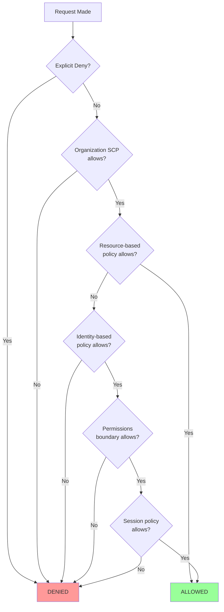
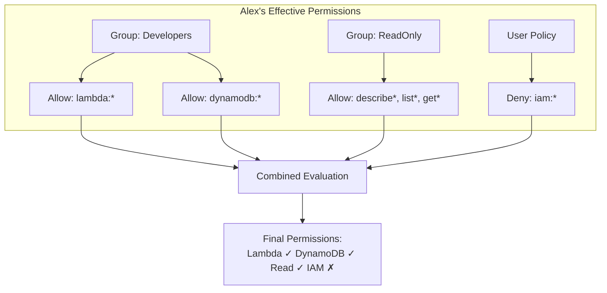
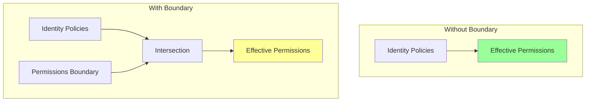
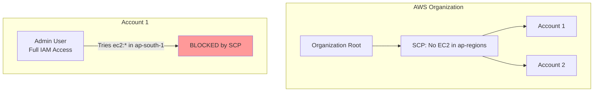

# Policy Evaluation Logic

## Alex's Confusing Denial

Alex has attached all the right policies, but something weird is happening:

```bash
$ aws s3 cp test.jpg s3://pettracker-images/

An error occurred (AccessDenied) when calling the PutObject operation
```

"But I have an Allow policy for S3!" Alex protests.

Jordan smiles. "Let me show you how IAM actually evaluates policies. It's not as simple as 'Allow wins.'"

## The Policy Evaluation Flowchart

When you make an AWS request, IAM evaluates it through this logic:



## The Key Rules

### Rule 1: Default Deny

Everything is denied by default. If there's no explicit Allow, it's denied.

```json
// User has no policies attached
// Request: s3:GetObject
// Result: DENIED (implicit deny)
```

### Rule 2: Explicit Allow Overrides Default Deny

An Allow statement permits the action.

```json
{
    "Effect": "Allow",
    "Action": "s3:GetObject",
    "Resource": "*"
}
// Request: s3:GetObject
// Result: ALLOWED
```

### Rule 3: Explicit Deny ALWAYS Wins

This is the most important rule. An explicit Deny overrides any Allow.

```json
// Policy 1 (from group):
{
    "Effect": "Allow",
    "Action": "s3:*",
    "Resource": "*"
}

// Policy 2 (boundary or inline):
{
    "Effect": "Deny",
    "Action": "s3:DeleteBucket",
    "Resource": "*"
}

// Request: s3:DeleteBucket
// Result: DENIED (explicit Deny wins!)
```

## Alex Discovers the Problem

Jordan helps Alex investigate:

```bash
# Check all policies affecting Alex
aws iam list-attached-user-policies --user-name alex
aws iam list-user-policies --user-name alex
aws iam list-groups-for-user --user-name alex

# For each group, check policies
aws iam list-attached-group-policies --group-name Developers
```

The culprit: An organization-wide policy Alex didn't know about:

```json
{
    "Sid": "DenyProductionWritesWithoutMFA",
    "Effect": "Deny",
    "Action": [
        "s3:PutObject",
        "s3:DeleteObject"
    ],
    "Resource": "arn:aws:s3:::pettracker-*/*",
    "Condition": {
        "BoolIfExists": {
            "aws:MultiFactorAuthPresent": "false"
        }
    }
}
```

"You're not using MFA for this session," Jordan explains. "The company has a policy that denies production writes without MFA."

## Multiple Policies: How They Combine

When a user has multiple policies (from groups, direct attachment, etc.), IAM combines them:



### Example: Overlapping Policies

```json
// Policy A (Group: Developers)
{
    "Statement": [{
        "Effect": "Allow",
        "Action": "s3:*",
        "Resource": "arn:aws:s3:::pettracker-dev-*"
    }]
}

// Policy B (Group: Production)
{
    "Statement": [{
        "Effect": "Allow",
        "Action": "s3:GetObject",
        "Resource": "arn:aws:s3:::pettracker-prod-*"
    }]
}

// Policy C (Organization SCP)
{
    "Statement": [{
        "Effect": "Deny",
        "Action": "s3:DeleteBucket",
        "Resource": "*"
    }]
}
```

**Results:**
- `s3:GetObject` on dev bucket → ✅ Allowed (Policy A)
- `s3:PutObject` on dev bucket → ✅ Allowed (Policy A)
- `s3:GetObject` on prod bucket → ✅ Allowed (Policy B)
- `s3:PutObject` on prod bucket → ❌ Denied (not allowed by Policy B)
- `s3:DeleteBucket` anywhere → ❌ Denied (Policy C)

## Boundaries and SCPs

### Permissions Boundaries

A permissions boundary is a maximum limit on what an IAM entity can do:



```json
// Identity policy: Allow everything
{
    "Effect": "Allow",
    "Action": "*",
    "Resource": "*"
}

// Permissions boundary: Only allow S3 and Lambda
{
    "Effect": "Allow",
    "Action": [
        "s3:*",
        "lambda:*"
    ],
    "Resource": "*"
}

// Effective: Only S3 and Lambda allowed!
```

### Service Control Policies (SCPs)

SCPs are organization-level policies that limit what accounts can do:



**Important:** SCPs don't grant permissions, they only restrict them.

## Practical Debugging Guide

### Step 1: Check Your Identity

```bash
aws sts get-caller-identity
```

### Step 2: List All Policies

```bash
# Direct user policies
aws iam list-attached-user-policies --user-name YOUR_USER
aws iam list-user-policies --user-name YOUR_USER

# Group memberships
aws iam list-groups-for-user --user-name YOUR_USER

# For each group
aws iam list-attached-group-policies --group-name GROUP_NAME
aws iam list-group-policies --group-name GROUP_NAME
```

### Step 3: Use Policy Simulator

```bash
aws iam simulate-principal-policy \
    --policy-source-arn arn:aws:iam::123456789012:user/alex \
    --action-names s3:PutObject \
    --resource-arns arn:aws:s3:::pettracker-images/test.jpg

# Response tells you:
# - EvalActionName: The action tested
# - EvalResourceName: The resource tested
# - EvalDecision: allowed/denied
# - MatchedStatements: Which policy statements matched
```

### Step 4: Check for SCPs (if in Organization)

```bash
aws organizations list-policies --filter SERVICE_CONTROL_POLICY
aws organizations describe-policy --policy-id p-xxxxx
```

## Common Gotchas

### Gotcha 1: S3 Bucket vs Objects

```json
// This allows listing the bucket
{
    "Effect": "Allow",
    "Action": "s3:ListBucket",
    "Resource": "arn:aws:s3:::my-bucket"  // Bucket ARN
}

// This allows accessing objects
{
    "Effect": "Allow",
    "Action": "s3:GetObject",
    "Resource": "arn:aws:s3:::my-bucket/*"  // Object ARN (note the /*)
}

// Common mistake: Using bucket ARN for object actions
{
    "Effect": "Allow",
    "Action": "s3:GetObject",
    "Resource": "arn:aws:s3:::my-bucket"  // WRONG! Missing /*
}
```

### Gotcha 2: NotAction and NotResource

These are confusing - they mean "everything except":

```json
// Allow all S3 actions EXCEPT DeleteBucket
{
    "Effect": "Allow",
    "NotAction": "s3:DeleteBucket",
    "Resource": "*"
}

// Deny access to everything EXCEPT this bucket
{
    "Effect": "Deny",
    "Action": "s3:*",
    "NotResource": [
        "arn:aws:s3:::allowed-bucket",
        "arn:aws:s3:::allowed-bucket/*"
    ]
}
```

### Gotcha 3: Case Sensitivity

- Actions: Case-insensitive (`s3:GetObject` = `s3:getobject`)
- Resource ARNs: Case-sensitive!
- Condition keys: Case-insensitive
- Condition values: Usually case-sensitive

## Visual: The Evaluation Process

```
Request: s3:PutObject on arn:aws:s3:::pettracker-prod/data.json

Step 1: Check for explicit Deny
  → SCP: No Deny
  → Identity policies: No Deny
  → Resource policy: No Deny
  → Result: Continue

Step 2: Check SCP (Organization)
  → SCP allows S3 in us-east-1: ✓
  → Result: Continue

Step 3: Check Resource-based policy
  → S3 bucket policy: Not specified for this user
  → Result: Continue (needs identity policy)

Step 4: Check Identity-based policies
  → Group "Developers": Allows s3:PutObject on pettracker-*
  → Result: ALLOWED

Step 5: Check Permissions Boundary (if exists)
  → No boundary set
  → Result: ALLOWED

Final: ALLOWED
```

## Exam Tips

**For DVA-C02:**

1. **Explicit Deny ALWAYS wins** - most important rule
2. **Default is implicit deny** - no Allow = Denied
3. **Evaluation order**: Deny → SCP → Resource → Identity → Boundary → Session
4. **S3 needs both bucket and object ARNs** for full access
5. **Permissions boundaries** set maximum permissions
6. **Use policy simulator** to debug

**Common exam patterns:**

> "User has Allow policy but action is denied..."
> → Look for explicit Deny elsewhere (SCP, boundary, other policy)

> "Admin user can't perform action in specific region..."
> → Check for SCP restrictions at organization level

> "User can list bucket but can't download objects..."
> → Check if policy has object ARN (with /*) not just bucket ARN

## Key Takeaways

1. **Explicit Deny** overrides everything
2. **No Allow = Denied** (implicit deny)
3. Multiple policies are **combined** through union (Allows) and intersection (Denies)
4. **SCPs** limit what accounts can do
5. **Permissions boundaries** limit what users/roles can do
6. **Always test** with policy simulator before deploying

---

*Next: Alex learns about IAM Roles - temporary credentials for services and cross-account access.*

---
*v1.0*
