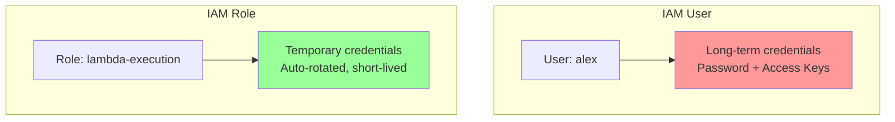
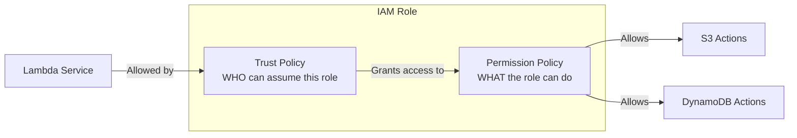
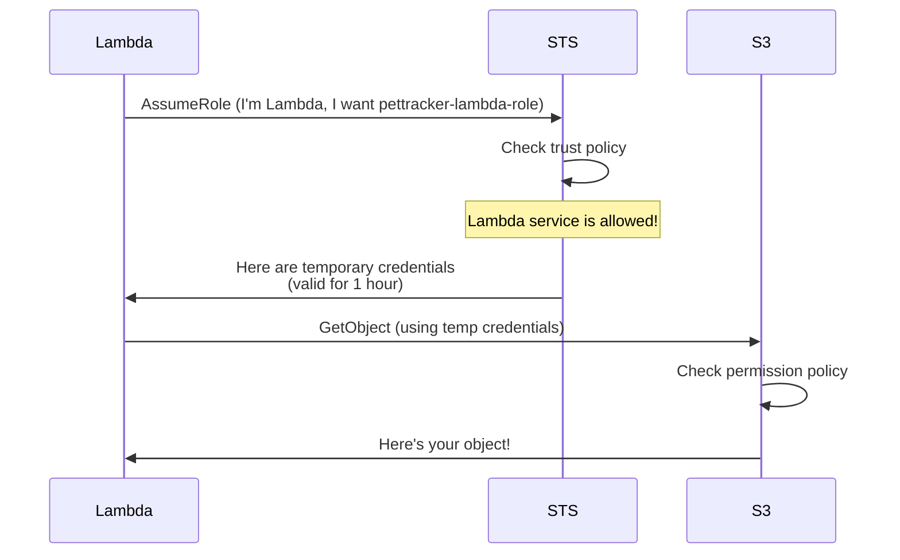
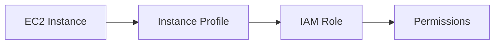

# IAM Roles

## Alex's Lambda Problem

Alex has created a Lambda function to process pet photos, but it can't access S3:

```python
# lambda_function.py
import boto3

def lambda_handler(event, context):
    s3 = boto3.client('s3')
    # This fails!
    response = s3.get_object(Bucket='pettracker-images', Key=event['key'])
    return process_image(response['Body'].read())
```

```
Error: An error occurred (AccessDenied) when calling the GetObject operation
```

"But I'm the admin!" Alex says. "Why can't my function access S3?"

Jordan explains: "Your Lambda function doesn't run as you. It needs its own IAM Role."

## What is an IAM Role?

A role is an IAM identity with permissions, but instead of being associated with a person, it's meant to be **assumed** by anyone (or anything) that needs it.



**Key differences from users:**
- No password or permanent access keys
- Provides temporary credentials via STS
- Can be assumed by users, services, or applications
- Credentials automatically rotate

## Role Components

Every role has two types of policies:



### Trust Policy (Who Can Assume)

```json
{
    "Version": "2012-10-17",
    "Statement": [{
        "Effect": "Allow",
        "Principal": {
            "Service": "lambda.amazonaws.com"
        },
        "Action": "sts:AssumeRole"
    }]
}
```

### Permission Policy (What They Can Do)

```json
{
    "Version": "2012-10-17",
    "Statement": [{
        "Effect": "Allow",
        "Action": [
            "s3:GetObject",
            "s3:PutObject"
        ],
        "Resource": "arn:aws:s3:::pettracker-images/*"
    }]
}
```

## Creating a Lambda Execution Role

Alex creates a proper role for the Lambda function:

```bash
# Step 1: Create the trust policy file
cat > trust-policy.json << 'EOF'
{
    "Version": "2012-10-17",
    "Statement": [{
        "Effect": "Allow",
        "Principal": {
            "Service": "lambda.amazonaws.com"
        },
        "Action": "sts:AssumeRole"
    }]
}
EOF

# Step 2: Create the role
aws iam create-role \
    --role-name pettracker-lambda-role \
    --assume-role-policy-document file://trust-policy.json \
    --description "Execution role for PetTracker Lambda functions"

# Step 3: Attach permission policies
aws iam attach-role-policy \
    --role-name pettracker-lambda-role \
    --policy-arn arn:aws:iam::aws:policy/service-role/AWSLambdaBasicExecutionRole

# Step 4: Create and attach custom policy for S3 access
aws iam put-role-policy \
    --role-name pettracker-lambda-role \
    --policy-name PetTrackerS3Access \
    --policy-document '{
        "Version": "2012-10-17",
        "Statement": [{
            "Effect": "Allow",
            "Action": ["s3:GetObject", "s3:PutObject"],
            "Resource": "arn:aws:s3:::pettracker-images/*"
        }]
    }'

# Step 5: Assign role to Lambda function
aws lambda update-function-configuration \
    --function-name pettracker-photo-processor \
    --role arn:aws:iam::123456789012:role/pettracker-lambda-role
```

## How Role Assumption Works

When a service assumes a role:



## Trust Policy Principals

The Principal element specifies who can assume the role:

```json
// AWS Service
"Principal": {
    "Service": "lambda.amazonaws.com"
}

// Specific IAM User
"Principal": {
    "AWS": "arn:aws:iam::123456789012:user/alex"
}

// Any identity in an account
"Principal": {
    "AWS": "arn:aws:iam::123456789012:root"
}

// Another AWS account
"Principal": {
    "AWS": "arn:aws:iam::999999999999:root"
}

// SAML identity provider
"Principal": {
    "Federated": "arn:aws:iam::123456789012:saml-provider/MyProvider"
}

// Web identity (Cognito, etc.)
"Principal": {
    "Federated": "cognito-identity.amazonaws.com"
}
```

## Common AWS Service Principals

| Service | Principal |
|---------|-----------|
| Lambda | lambda.amazonaws.com |
| EC2 | ec2.amazonaws.com |
| ECS Tasks | ecs-tasks.amazonaws.com |
| API Gateway | apigateway.amazonaws.com |
| CloudWatch Events | events.amazonaws.com |
| Step Functions | states.amazonaws.com |
| CodeBuild | codebuild.amazonaws.com |
| CodePipeline | codepipeline.amazonaws.com |

## Users Assuming Roles

Alex can assume a role too, not just services:

```bash
# Create a role that Alex can assume
cat > developer-assume-policy.json << 'EOF'
{
    "Version": "2012-10-17",
    "Statement": [{
        "Effect": "Allow",
        "Principal": {
            "AWS": "arn:aws:iam::123456789012:user/alex"
        },
        "Action": "sts:AssumeRole",
        "Condition": {
            "Bool": {
                "aws:MultiFactorAuthPresent": "true"
            }
        }
    }]
}
EOF

aws iam create-role \
    --role-name ProductionDeployRole \
    --assume-role-policy-document file://developer-assume-policy.json
```

```bash
# Alex assumes the role
aws sts assume-role \
    --role-arn arn:aws:iam::123456789012:role/ProductionDeployRole \
    --role-session-name alex-deploy-session

# Output:
{
    "Credentials": {
        "AccessKeyId": "ASIAEXAMPLEKEY",
        "SecretAccessKey": "temporarysecret",
        "SessionToken": "very-long-session-token...",
        "Expiration": "2024-01-15T15:00:00Z"
    },
    "AssumedRoleUser": {
        "AssumedRoleId": "AROA...:alex-deploy-session",
        "Arn": "arn:aws:sts::123456789012:assumed-role/ProductionDeployRole/alex-deploy-session"
    }
}
```

### Using Assumed Role Credentials

```bash
# Method 1: Export environment variables
export AWS_ACCESS_KEY_ID="ASIAEXAMPLEKEY"
export AWS_SECRET_ACCESS_KEY="temporarysecret"
export AWS_SESSION_TOKEN="very-long-session-token..."

# Method 2: Use profile with role
# In ~/.aws/config:
[profile prod-deploy]
role_arn = arn:aws:iam::123456789012:role/ProductionDeployRole
source_profile = default
mfa_serial = arn:aws:iam::123456789012:mfa/alex

# Then use:
aws s3 ls --profile prod-deploy
```

## Role Session Duration

Roles have configurable session durations:

```bash
# Set max session duration for a role (1-12 hours)
aws iam update-role \
    --role-name ProductionDeployRole \
    --max-session-duration 14400  # 4 hours

# Request specific duration when assuming
aws sts assume-role \
    --role-arn arn:aws:iam::123456789012:role/ProductionDeployRole \
    --role-session-name alex-session \
    --duration-seconds 3600  # 1 hour
```

## Instance Profiles (EC2 Roles)

For EC2 instances, roles need an instance profile wrapper:



```bash
# Create role
aws iam create-role \
    --role-name EC2-PetTracker-Role \
    --assume-role-policy-document '{
        "Version": "2012-10-17",
        "Statement": [{
            "Effect": "Allow",
            "Principal": {"Service": "ec2.amazonaws.com"},
            "Action": "sts:AssumeRole"
        }]
    }'

# Create instance profile
aws iam create-instance-profile \
    --instance-profile-name EC2-PetTracker-Profile

# Add role to instance profile
aws iam add-role-to-instance-profile \
    --instance-profile-name EC2-PetTracker-Profile \
    --role-name EC2-PetTracker-Role

# Launch EC2 with instance profile
aws ec2 run-instances \
    --image-id ami-12345678 \
    --instance-type t3.micro \
    --iam-instance-profile Name=EC2-PetTracker-Profile
```

## Alex's Mental Model for Roles

```
When to use a Role:

✓ AWS Service needs permissions (Lambda, EC2, ECS)
✓ Cross-account access needed
✓ Temporary elevated permissions (break-glass)
✓ Federated users (SSO, SAML)
✓ External applications

When NOT to use a Role:

✗ Single human user (use IAM User)
✗ Permanent API access from external app (consider IAM User)
✗ Simple scripting on your laptop (use IAM User)
```

## Exam Tips

**For DVA-C02:**

1. **Trust policy** = WHO can assume (Principal)
2. **Permission policy** = WHAT they can do (Actions/Resources)
3. Services MUST use roles, not access keys
4. **Instance profiles** wrap roles for EC2
5. Role credentials are **temporary** and **auto-rotated**
6. **sts:AssumeRole** is the action to assume a role

**Common exam scenarios:**

> "Lambda function needs to access DynamoDB..."
> → Create role with Lambda trust policy and DynamoDB permissions

> "EC2 instance needs to access S3..."
> → Create role, instance profile, attach to instance

> "Application needs temporary credentials..."
> → Use sts:AssumeRole to get temporary credentials

## Key Takeaways

1. **Roles provide temporary credentials** - more secure than long-term keys
2. **Trust policy** defines who can assume the role
3. **Permission policy** defines what the role can do
4. **AWS services** (Lambda, EC2, etc.) must use roles
5. **Instance profiles** are required for EC2 roles
6. Users can assume roles for elevated/cross-account access

---

*Next: Alex learns how to set up roles for specific AWS services.*

---
*v1.0*
