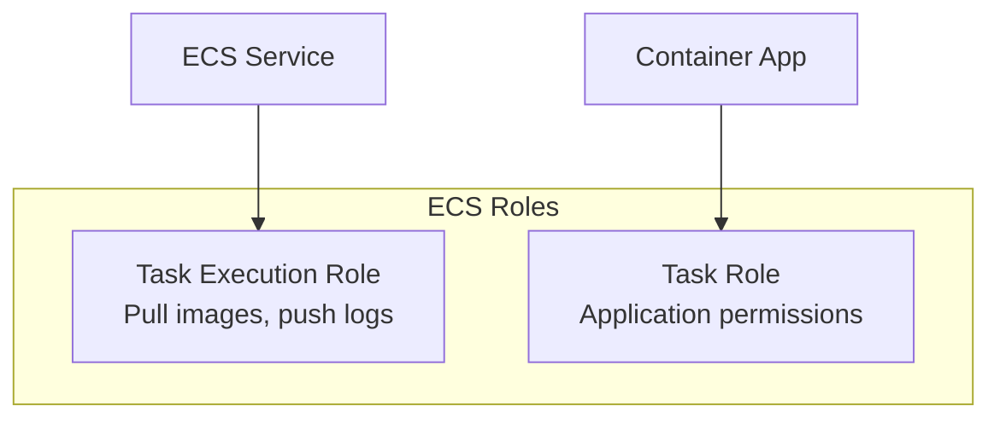
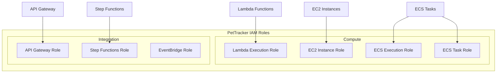

# Roles for AWS Services

## Alex Sets Up the Full PetTracker Backend

Now that Alex understands roles, it's time to set up proper IAM for all PetTracker services. Each service needs its own role with minimum required permissions.

## Lambda Execution Roles

### Basic Lambda Role

Every Lambda function needs at least logging permissions:

```bash
# The minimum policy for any Lambda
aws iam create-role \
    --role-name PetTracker-Lambda-Basic \
    --assume-role-policy-document '{
        "Version": "2012-10-17",
        "Statement": [{
            "Effect": "Allow",
            "Principal": {"Service": "lambda.amazonaws.com"},
            "Action": "sts:AssumeRole"
        }]
    }'

# Attach basic execution role (CloudWatch Logs)
aws iam attach-role-policy \
    --role-name PetTracker-Lambda-Basic \
    --policy-arn arn:aws:iam::aws:policy/service-role/AWSLambdaBasicExecutionRole
```

What `AWSLambdaBasicExecutionRole` provides:

```json
{
    "Version": "2012-10-17",
    "Statement": [{
        "Effect": "Allow",
        "Action": [
            "logs:CreateLogGroup",
            "logs:CreateLogStream",
            "logs:PutLogEvents"
        ],
        "Resource": "*"
    }]
}
```

### Lambda with VPC Access

If Lambda needs to access resources in a VPC:

```bash
aws iam attach-role-policy \
    --role-name PetTracker-Lambda-VPC \
    --policy-arn arn:aws:iam::aws:policy/service-role/AWSLambdaVPCAccessExecutionRole
```

This adds:
```json
{
    "Effect": "Allow",
    "Action": [
        "ec2:CreateNetworkInterface",
        "ec2:DescribeNetworkInterfaces",
        "ec2:DeleteNetworkInterface",
        "ec2:AssignPrivateIpAddresses",
        "ec2:UnassignPrivateIpAddresses"
    ],
    "Resource": "*"
}
```

### Alex's Photo Processor Lambda Role

```json
{
    "Version": "2012-10-17",
    "Statement": [
        {
            "Sid": "CloudWatchLogs",
            "Effect": "Allow",
            "Action": [
                "logs:CreateLogGroup",
                "logs:CreateLogStream",
                "logs:PutLogEvents"
            ],
            "Resource": "arn:aws:logs:us-east-1:123456789012:log-group:/aws/lambda/pettracker-*"
        },
        {
            "Sid": "S3Access",
            "Effect": "Allow",
            "Action": [
                "s3:GetObject",
                "s3:PutObject"
            ],
            "Resource": [
                "arn:aws:s3:::pettracker-images/*",
                "arn:aws:s3:::pettracker-thumbnails/*"
            ]
        },
        {
            "Sid": "DynamoDBAccess",
            "Effect": "Allow",
            "Action": [
                "dynamodb:PutItem",
                "dynamodb:UpdateItem"
            ],
            "Resource": "arn:aws:dynamodb:us-east-1:123456789012:table/PetTracker-Photos"
        }
    ]
}
```

## EC2 Instance Roles

### Creating an EC2 Role

```bash
# Create role with EC2 trust
aws iam create-role \
    --role-name PetTracker-EC2-WebServer \
    --assume-role-policy-document '{
        "Version": "2012-10-17",
        "Statement": [{
            "Effect": "Allow",
            "Principal": {"Service": "ec2.amazonaws.com"},
            "Action": "sts:AssumeRole"
        }]
    }'

# Create and attach custom policy
aws iam put-role-policy \
    --role-name PetTracker-EC2-WebServer \
    --policy-name WebServerAccess \
    --policy-document file://ec2-policy.json

# Create instance profile
aws iam create-instance-profile \
    --instance-profile-name PetTracker-EC2-WebServer-Profile

# Attach role to profile
aws iam add-role-to-instance-profile \
    --instance-profile-name PetTracker-EC2-WebServer-Profile \
    --role-name PetTracker-EC2-WebServer
```

### EC2 Accessing Instance Metadata

Applications on EC2 get role credentials automatically:

```python
# On EC2 instance - boto3 automatically uses instance role
import boto3

# No credentials needed! Uses instance role automatically
s3 = boto3.client('s3')
s3.get_object(Bucket='pettracker-images', Key='photo.jpg')
```

```bash
# How it works - instance metadata service
curl http://169.254.169.254/latest/meta-data/iam/security-credentials/
# Returns: PetTracker-EC2-WebServer

curl http://169.254.169.254/latest/meta-data/iam/security-credentials/PetTracker-EC2-WebServer
# Returns temporary credentials (auto-rotated!)
```

### IMDSv2 (More Secure)

AWS recommends using IMDSv2:

```bash
# Launch instance requiring IMDSv2
aws ec2 run-instances \
    --image-id ami-12345678 \
    --instance-type t3.micro \
    --metadata-options "HttpTokens=required,HttpEndpoint=enabled"

# Accessing with IMDSv2 (requires token)
TOKEN=$(curl -X PUT "http://169.254.169.254/latest/api/token" \
    -H "X-aws-ec2-metadata-token-ttl-seconds: 21600")

curl -H "X-aws-ec2-metadata-token: $TOKEN" \
    http://169.254.169.254/latest/meta-data/iam/security-credentials/
```

## ECS Task Roles

ECS has two types of roles:



### Task Execution Role

Needed by ECS itself to manage your tasks:

```json
{
    "Version": "2012-10-17",
    "Statement": [
        {
            "Effect": "Allow",
            "Action": [
                "ecr:GetAuthorizationToken",
                "ecr:BatchCheckLayerAvailability",
                "ecr:GetDownloadUrlForLayer",
                "ecr:BatchGetImage",
                "logs:CreateLogStream",
                "logs:PutLogEvents"
            ],
            "Resource": "*"
        }
    ]
}
```

### Task Role (Application Permissions)

What your containerized application can do:

```json
{
    "Version": "2012-10-17",
    "Statement": [
        {
            "Effect": "Allow",
            "Action": [
                "s3:GetObject",
                "s3:PutObject"
            ],
            "Resource": "arn:aws:s3:::pettracker-images/*"
        },
        {
            "Effect": "Allow",
            "Action": [
                "dynamodb:*"
            ],
            "Resource": "arn:aws:dynamodb:us-east-1:*:table/PetTracker-*"
        }
    ]
}
```

### Creating ECS Roles

```bash
# Task Execution Role
aws iam create-role \
    --role-name PetTracker-ECS-Execution \
    --assume-role-policy-document '{
        "Version": "2012-10-17",
        "Statement": [{
            "Effect": "Allow",
            "Principal": {"Service": "ecs-tasks.amazonaws.com"},
            "Action": "sts:AssumeRole"
        }]
    }'

aws iam attach-role-policy \
    --role-name PetTracker-ECS-Execution \
    --policy-arn arn:aws:iam::aws:policy/service-role/AmazonECSTaskExecutionRolePolicy

# Task Role (for application)
aws iam create-role \
    --role-name PetTracker-ECS-Task \
    --assume-role-policy-document '{
        "Version": "2012-10-17",
        "Statement": [{
            "Effect": "Allow",
            "Principal": {"Service": "ecs-tasks.amazonaws.com"},
            "Action": "sts:AssumeRole"
        }]
    }'
```

### Using in Task Definition

```json
{
    "family": "pettracker-api",
    "executionRoleArn": "arn:aws:iam::123456789012:role/PetTracker-ECS-Execution",
    "taskRoleArn": "arn:aws:iam::123456789012:role/PetTracker-ECS-Task",
    "containerDefinitions": [...]
}
```

## API Gateway Roles

### API Gateway Invoking Lambda

API Gateway needs permission to invoke Lambda:

```json
{
    "Version": "2012-10-17",
    "Statement": [{
        "Effect": "Allow",
        "Principal": {
            "Service": "apigateway.amazonaws.com"
        },
        "Action": "lambda:InvokeFunction",
        "Resource": "arn:aws:lambda:us-east-1:123456789012:function:pettracker-*",
        "Condition": {
            "ArnLike": {
                "AWS:SourceArn": "arn:aws:execute-api:us-east-1:123456789012:*/*/GET/*"
            }
        }
    }]
}
```

**Note:** This is a resource-based policy on Lambda, not a role!

### API Gateway CloudWatch Logging

```bash
# Create role for API Gateway logging
aws iam create-role \
    --role-name APIGateway-CloudWatch-Role \
    --assume-role-policy-document '{
        "Version": "2012-10-17",
        "Statement": [{
            "Effect": "Allow",
            "Principal": {"Service": "apigateway.amazonaws.com"},
            "Action": "sts:AssumeRole"
        }]
    }'

aws iam attach-role-policy \
    --role-name APIGateway-CloudWatch-Role \
    --policy-arn arn:aws:iam::aws:policy/service-role/AmazonAPIGatewayPushToCloudWatchLogs

# Set at account level
aws apigateway update-account \
    --patch-operations op=replace,path=/cloudwatchRoleArn,value=arn:aws:iam::123456789012:role/APIGateway-CloudWatch-Role
```

## Step Functions Roles

Step Functions need to invoke other services:

```json
{
    "Version": "2012-10-17",
    "Statement": [
        {
            "Effect": "Allow",
            "Action": "lambda:InvokeFunction",
            "Resource": "arn:aws:lambda:us-east-1:123456789012:function:pettracker-*"
        },
        {
            "Effect": "Allow",
            "Action": [
                "sns:Publish"
            ],
            "Resource": "arn:aws:sns:us-east-1:123456789012:pettracker-*"
        },
        {
            "Effect": "Allow",
            "Action": [
                "logs:CreateLogDelivery",
                "logs:GetLogDelivery",
                "logs:UpdateLogDelivery",
                "logs:DeleteLogDelivery",
                "logs:ListLogDeliveries",
                "logs:PutResourcePolicy",
                "logs:DescribeResourcePolicies",
                "logs:DescribeLogGroups"
            ],
            "Resource": "*"
        }
    ]
}
```

## Service-Linked Roles

Some services create their own roles automatically:

```bash
# List service-linked roles
aws iam list-roles --query 'Roles[?starts_with(Path, `/aws-service-role/`)].[RoleName,Path]'

# Examples:
# AWSServiceRoleForElasticLoadBalancing
# AWSServiceRoleForAutoScaling
# AWSServiceRoleForRDS
```

**You don't create these** - AWS does when you first use the service.

## Alex's Complete Role Architecture



## Exam Tips

**For DVA-C02:**

1. **Lambda needs execution role** - at minimum for CloudWatch Logs
2. **EC2 uses instance profiles** - wrapper for IAM role
3. **ECS has TWO roles** - execution (infrastructure) and task (application)
4. **Trust policies** differ by service principal
5. **Service-linked roles** are auto-created by AWS

**Common exam scenarios:**

> "Lambda can't write logs..."
> → Missing AWSLambdaBasicExecutionRole

> "ECS task can't pull image from ECR..."
> → Missing task execution role

> "EC2 application can't access S3..."
> → Check instance profile is attached and has permissions

## Key Takeaways

1. **Each AWS service** has specific trust policy principal
2. **Lambda**: Needs execution role for basic operation
3. **EC2**: Uses instance profiles wrapping roles
4. **ECS**: Separate roles for execution and application
5. **Always follow least privilege** - only grant needed permissions
6. **Service-linked roles** are created automatically

---

*Next: Alex learns about cross-account access using IAM roles.*

---
*v2.0*
