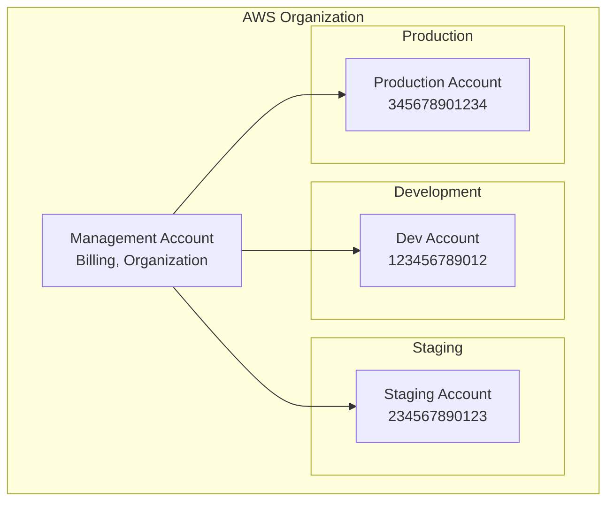
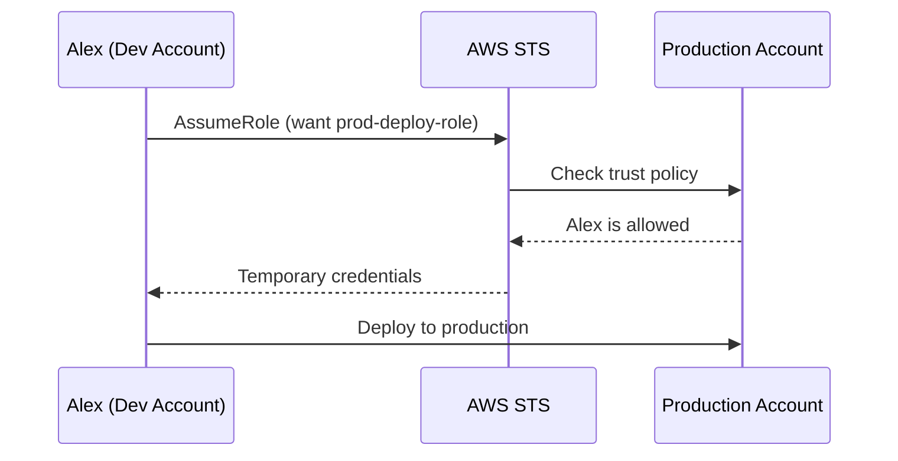
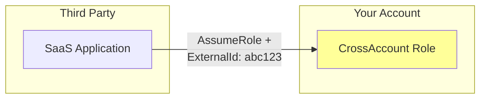
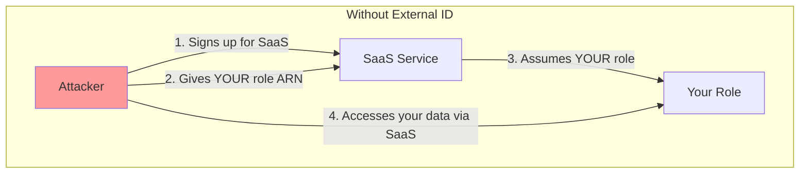
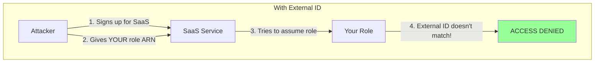
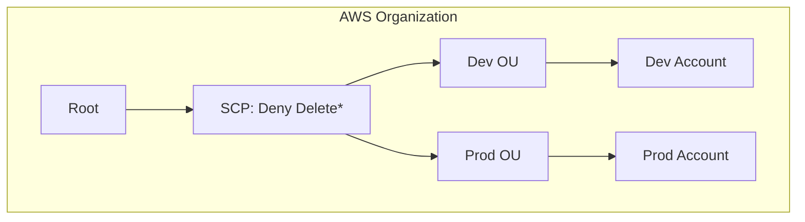
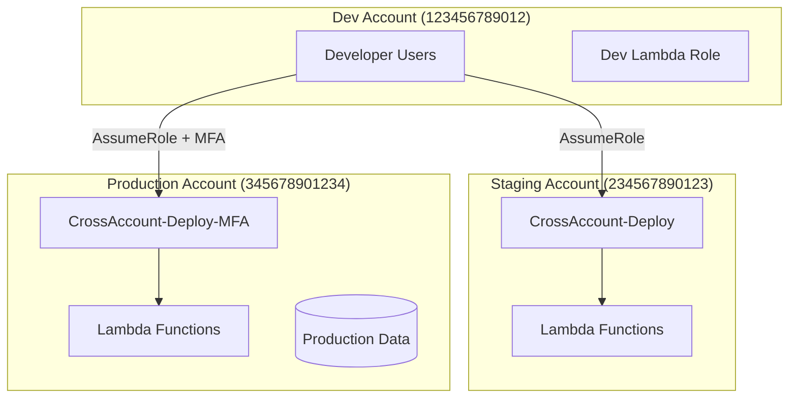

# Cross-Account Access

## Alex's Multi-Account Strategy

PetTracker is maturing. Sam, the DevOps engineer, suggests implementing a proper multi-account strategy:

"Right now, everything's in one account - dev, staging, and production. That's a ticking time bomb."

Alex asks, "Why do we need multiple accounts?"

Sam lists the reasons:
1. **Blast radius** - Mistakes in dev don't affect production
2. **Security** - Different security controls per environment
3. **Billing** - Clear cost allocation
4. **Compliance** - Easier to audit and control

## The Multi-Account Architecture



## Cross-Account Role Assumption

To access resources in another account, you **assume a role** in that account:



## Setting Up Cross-Account Access

### Step 1: Create Role in Target Account (Production)

In the Production account:

```bash
# Create cross-account role
aws iam create-role \
    --role-name CrossAccount-Developer \
    --assume-role-policy-document '{
        "Version": "2012-10-17",
        "Statement": [{
            "Effect": "Allow",
            "Principal": {
                "AWS": "arn:aws:iam::123456789012:root"
            },
            "Action": "sts:AssumeRole",
            "Condition": {
                "Bool": {
                    "aws:MultiFactorAuthPresent": "true"
                }
            }
        }]
    }'

# Attach permissions
aws iam attach-role-policy \
    --role-name CrossAccount-Developer \
    --policy-arn arn:aws:iam::aws:policy/ReadOnlyAccess
```

### Step 2: Grant Permission to Assume Role (Dev Account)

In the Development account, give users permission to assume the role:

```json
{
    "Version": "2012-10-17",
    "Statement": [{
        "Effect": "Allow",
        "Action": "sts:AssumeRole",
        "Resource": "arn:aws:iam::345678901234:role/CrossAccount-Developer"
    }]
}
```

### Step 3: Assume the Role

```bash
# Assume the role
aws sts assume-role \
    --role-arn arn:aws:iam::345678901234:role/CrossAccount-Developer \
    --role-session-name alex-cross-account

# Use the returned credentials
export AWS_ACCESS_KEY_ID="ASIA..."
export AWS_SECRET_ACCESS_KEY="..."
export AWS_SESSION_TOKEN="..."

# Now you're operating in production account!
aws sts get-caller-identity
# Shows production account ID
```

## Using AWS CLI Profiles for Cross-Account

Alex sets up profiles for easier access:

```ini
# ~/.aws/config

[profile dev]
region = us-east-1

[profile staging]
role_arn = arn:aws:iam::234567890123:role/CrossAccount-Developer
source_profile = dev
region = us-east-1

[profile production]
role_arn = arn:aws:iam::345678901234:role/CrossAccount-Developer
source_profile = dev
mfa_serial = arn:aws:iam::123456789012:mfa/alex
region = us-east-1
```

```bash
# Use different accounts easily
aws s3 ls --profile dev           # Dev account
aws s3 ls --profile staging       # Staging account
aws s3 ls --profile production    # Production (prompts for MFA)
```

## External ID for Third-Party Access

When giving access to external parties (vendors, SaaS tools), use External ID:



### Why External ID?

Prevents the "confused deputy" problem:





### Implementing External ID

```json
{
    "Version": "2012-10-17",
    "Statement": [{
        "Effect": "Allow",
        "Principal": {
            "AWS": "arn:aws:iam::999999999999:root"
        },
        "Action": "sts:AssumeRole",
        "Condition": {
            "StringEquals": {
                "sts:ExternalId": "UniqueRandomString123"
            }
        }
    }]
}
```

The third party must provide this External ID when assuming the role:

```bash
aws sts assume-role \
    --role-arn arn:aws:iam::123456789012:role/ThirdPartyRole \
    --role-session-name saas-session \
    --external-id UniqueRandomString123
```

## Service Access Across Accounts

### Lambda Accessing Cross-Account S3

Lambda in Account A needs to access S3 in Account B:

**Option 1: Resource-Based Policy (S3 Bucket Policy)**

```json
// In Account B - S3 bucket policy
{
    "Version": "2012-10-17",
    "Statement": [{
        "Effect": "Allow",
        "Principal": {
            "AWS": "arn:aws:iam::123456789012:role/Lambda-Role"
        },
        "Action": [
            "s3:GetObject",
            "s3:PutObject"
        ],
        "Resource": "arn:aws:s3:::account-b-bucket/*"
    }]
}
```

**Option 2: Lambda Assumes Role in Account B**

```python
import boto3

def lambda_handler(event, context):
    # Assume role in Account B
    sts = boto3.client('sts')
    assumed = sts.assume_role(
        RoleArn='arn:aws:iam::234567890123:role/CrossAccountS3Role',
        RoleSessionName='lambda-cross-account'
    )

    # Create S3 client with assumed credentials
    s3 = boto3.client(
        's3',
        aws_access_key_id=assumed['Credentials']['AccessKeyId'],
        aws_secret_access_key=assumed['Credentials']['SecretAccessKey'],
        aws_session_token=assumed['Credentials']['SessionToken']
    )

    # Now access Account B's bucket
    response = s3.get_object(Bucket='account-b-bucket', Key='data.json')
    return response['Body'].read()
```

## AWS Organizations and SCPs

With AWS Organizations, you can set organization-wide permissions:



### SCP Example: Prevent Region Usage

```json
{
    "Version": "2012-10-17",
    "Statement": [{
        "Sid": "DenyNonApprovedRegions",
        "Effect": "Deny",
        "Action": "*",
        "Resource": "*",
        "Condition": {
            "StringNotEquals": {
                "aws:RequestedRegion": [
                    "us-east-1",
                    "us-west-2",
                    "eu-west-1"
                ]
            }
        }
    }]
}
```

### SCP Example: Require Tags

```json
{
    "Version": "2012-10-17",
    "Statement": [{
        "Sid": "RequireEnvironmentTag",
        "Effect": "Deny",
        "Action": [
            "ec2:RunInstances",
            "lambda:CreateFunction",
            "dynamodb:CreateTable"
        ],
        "Resource": "*",
        "Condition": {
            "Null": {
                "aws:RequestTag/Environment": "true"
            }
        }
    }]
}
```

## Alex's Cross-Account Setup

Alex implements the full cross-account strategy:



## Exam Tips

**For DVA-C02:**

1. Cross-account access requires **role assumption**
2. **Trust policy** in target account specifies who can assume
3. **Permission to assume** needed in source account
4. **External ID** prevents confused deputy attacks
5. **SCPs** can restrict what accounts can do
6. Resource-based policies can grant cross-account access directly

**Common exam scenarios:**

> "Lambda in Account A needs S3 in Account B..."
> → Either resource-based policy on S3 OR Lambda assumes cross-account role

> "Third-party service needs access to your account..."
> → Create role with External ID condition

> "Prevent all accounts from using certain regions..."
> → Use SCP at Organization level

## Key Takeaways

1. **Multi-account** = Better security, isolation, and billing
2. **Cross-account access** = Trust policy + Permission to assume
3. **External ID** = Required for third-party access
4. **Resource-based policies** = Alternative to role assumption
5. **SCPs** = Organization-wide guardrails
6. **Always use MFA** for production cross-account access

---

*Next: Alex implements security best practices across the PetTracker infrastructure.*

---
*v2.0*
