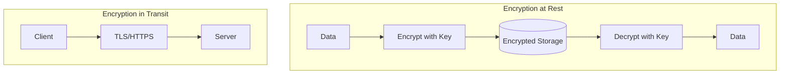
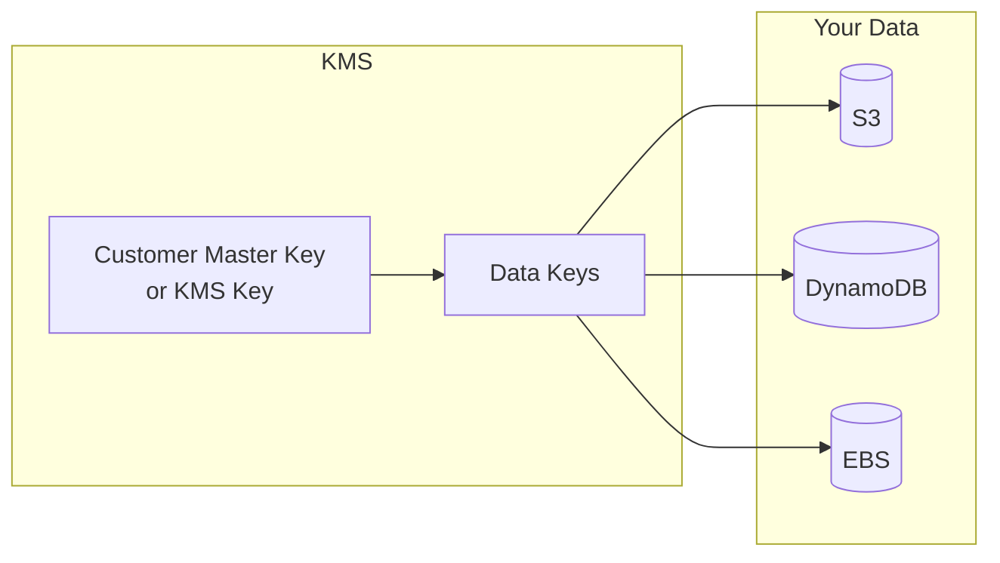
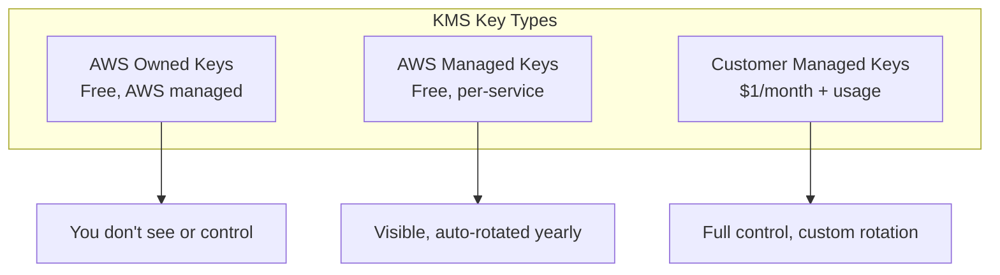
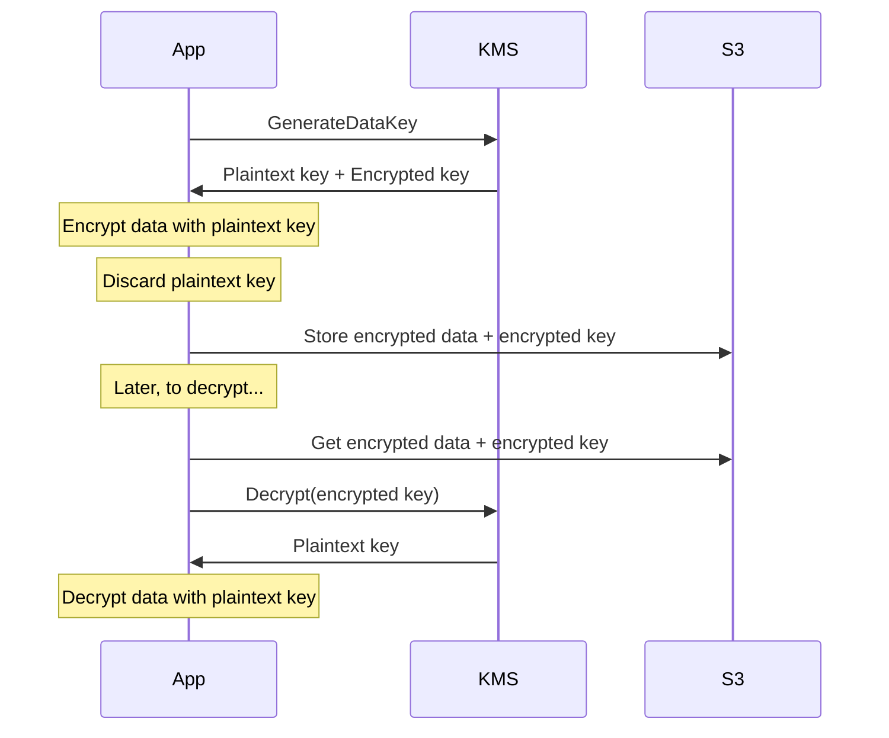
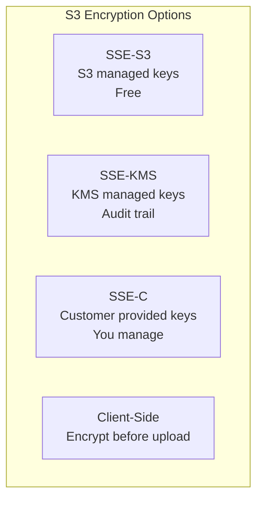
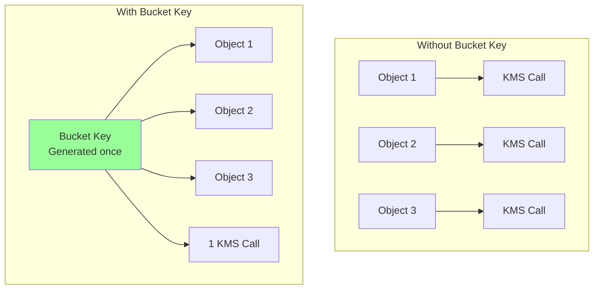
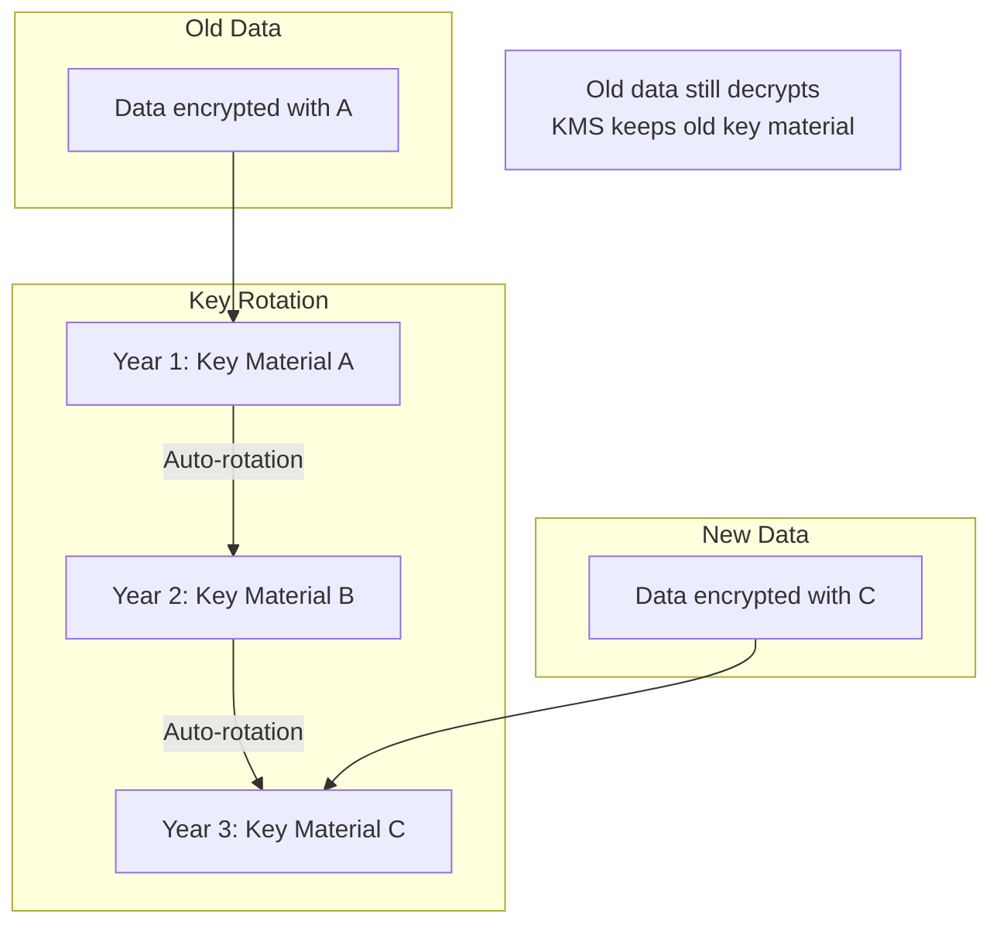

# KMS and Encryption

## Alex's Data Protection Requirement

Jordan reviews PetTracker's data handling: "You're storing pet health records, which includes sensitive information. That data needs to be encrypted - both at rest and in transit."

Alex asks, "Isn't HTTPS enough?"

"HTTPS encrypts data in transit. But what about data sitting in S3 or DynamoDB? If someone gains access to those services, they can read everything. You need encryption at rest."

## Encryption Fundamentals



## AWS Key Management Service (KMS)

KMS is AWS's managed service for creating and controlling encryption keys.



### Key Types



### Creating a KMS Key

```bash
# Create a customer managed key
aws kms create-key \
    --description "PetTracker encryption key" \
    --tags TagKey=Application,TagValue=PetTracker

# Output:
{
    "KeyMetadata": {
        "KeyId": "1234abcd-12ab-34cd-56ef-1234567890ab",
        "Arn": "arn:aws:kms:us-east-1:123456789012:key/1234abcd-12ab-34cd-56ef-1234567890ab",
        "KeyState": "Enabled",
        "KeyUsage": "ENCRYPT_DECRYPT"
    }
}

# Create an alias (friendly name)
aws kms create-alias \
    --alias-name alias/pettracker \
    --target-key-id 1234abcd-12ab-34cd-56ef-1234567890ab
```

### KMS Key Policy

Every KMS key has a key policy that controls access:

```json
{
    "Version": "2012-10-17",
    "Statement": [
        {
            "Sid": "Enable Root Account",
            "Effect": "Allow",
            "Principal": {
                "AWS": "arn:aws:iam::123456789012:root"
            },
            "Action": "kms:*",
            "Resource": "*"
        },
        {
            "Sid": "Allow Admin",
            "Effect": "Allow",
            "Principal": {
                "AWS": "arn:aws:iam::123456789012:role/KMSAdmin"
            },
            "Action": [
                "kms:Create*",
                "kms:Describe*",
                "kms:Enable*",
                "kms:List*",
                "kms:Put*",
                "kms:Update*",
                "kms:Revoke*",
                "kms:Disable*",
                "kms:Get*",
                "kms:Delete*",
                "kms:ScheduleKeyDeletion",
                "kms:CancelKeyDeletion"
            ],
            "Resource": "*"
        },
        {
            "Sid": "Allow Use",
            "Effect": "Allow",
            "Principal": {
                "AWS": "arn:aws:iam::123456789012:role/PetTracker-Lambda"
            },
            "Action": [
                "kms:Encrypt",
                "kms:Decrypt",
                "kms:GenerateDataKey*"
            ],
            "Resource": "*"
        }
    ]
}
```

## Envelope Encryption

KMS uses envelope encryption for efficiency:



### Why Envelope Encryption?

```
Problem: KMS has a 4KB limit on data it can encrypt directly

Solution: Envelope Encryption
1. Generate data key from KMS
2. Encrypt your large data with data key (locally)
3. Encrypt data key with KMS key
4. Store encrypted data + encrypted data key
5. Discard plaintext data key
```

### Using Envelope Encryption in Code

```python
import boto3
import base64
from cryptography.fernet import Fernet

kms = boto3.client('kms')

def encrypt_data(plaintext: bytes, key_id: str) -> dict:
    # Generate data key
    response = kms.generate_data_key(
        KeyId=key_id,
        KeySpec='AES_256'
    )

    # Encrypt data with plaintext key
    cipher = Fernet(base64.urlsafe_b64encode(response['Plaintext'][:32]))
    encrypted_data = cipher.encrypt(plaintext)

    return {
        'encrypted_data': encrypted_data,
        'encrypted_key': response['CiphertextBlob']
    }

def decrypt_data(encrypted_data: bytes, encrypted_key: bytes) -> bytes:
    # Decrypt the data key
    response = kms.decrypt(CiphertextBlob=encrypted_key)

    # Decrypt data with plaintext key
    cipher = Fernet(base64.urlsafe_b64encode(response['Plaintext'][:32]))
    return cipher.decrypt(encrypted_data)
```

## S3 Encryption

### Server-Side Encryption Options



### Enabling S3 Encryption

```bash
# Enable default encryption on bucket
aws s3api put-bucket-encryption \
    --bucket pettracker-images \
    --server-side-encryption-configuration '{
        "Rules": [{
            "ApplyServerSideEncryptionByDefault": {
                "SSEAlgorithm": "aws:kms",
                "KMSMasterKeyID": "alias/pettracker"
            },
            "BucketKeyEnabled": true
        }]
    }'
```

### S3 Bucket Keys

Reduce KMS costs with S3 Bucket Keys:



## DynamoDB Encryption

DynamoDB encrypts all data by default:

```bash
# Check table encryption
aws dynamodb describe-table \
    --table-name PetTracker-Pets \
    --query 'Table.SSEDescription'

# Create table with customer managed key
aws dynamodb create-table \
    --table-name PetTracker-Secrets \
    --attribute-definitions AttributeName=SecretId,AttributeType=S \
    --key-schema AttributeName=SecretId,KeyType=HASH \
    --billing-mode PAY_PER_REQUEST \
    --sse-specification Enabled=true,SSEType=KMS,KMSMasterKeyId=alias/pettracker
```

## Lambda Environment Variable Encryption

```bash
# Encrypt Lambda environment variables
aws lambda update-function-configuration \
    --function-name pettracker-api \
    --kms-key-arn arn:aws:kms:us-east-1:123456789012:key/1234abcd-... \
    --environment '{
        "Variables": {
            "DB_PASSWORD": "encrypted-at-rest"
        }
    }'
```

### Decrypting in Lambda

```python
import boto3
import os
import base64

def decrypt_env_var(encrypted_value):
    kms = boto3.client('kms')
    return kms.decrypt(
        CiphertextBlob=base64.b64decode(encrypted_value)
    )['Plaintext'].decode('utf-8')

# Usage
db_password = decrypt_env_var(os.environ['DB_PASSWORD'])
```

## Key Rotation

### Automatic Rotation

```bash
# Enable automatic rotation (yearly)
aws kms enable-key-rotation \
    --key-id alias/pettracker

# Check rotation status
aws kms get-key-rotation-status \
    --key-id alias/pettracker
```

### How Rotation Works



Key rotation:
- Creates new key material
- Keeps old key material for decryption
- New encryptions use new material
- Old data still decrypts automatically

## Cross-Account KMS Access

```json
{
    "Version": "2012-10-17",
    "Statement": [{
        "Sid": "AllowCrossAccountUse",
        "Effect": "Allow",
        "Principal": {
            "AWS": "arn:aws:iam::999999999999:role/CrossAccountRole"
        },
        "Action": [
            "kms:Encrypt",
            "kms:Decrypt",
            "kms:GenerateDataKey*"
        ],
        "Resource": "*",
        "Condition": {
            "StringEquals": {
                "kms:ViaService": "s3.us-east-1.amazonaws.com"
            }
        }
    }]
}
```

## KMS Pricing

| Operation | Cost |
|-----------|------|
| Customer Managed Key | $1/month |
| AWS Managed Key | Free |
| API requests | $0.03 per 10,000 |
| Asymmetric requests | $0.10-0.15 per 10,000 |

**Cost optimization tips:**
- Use S3 Bucket Keys (reduces KMS calls by 99%)
- Cache data keys when possible
- Use AWS managed keys when audit trail not needed

## Exam Tips

**For DVA-C02:**

1. **KMS keys** encrypt data keys, not data directly (envelope encryption)
2. **S3 SSE-KMS** provides audit trail via CloudTrail
3. **Key policies** control access to KMS keys
4. **Automatic rotation** rotates key material yearly
5. **S3 Bucket Keys** reduce KMS costs
6. **GenerateDataKey** creates data key for envelope encryption

**Common scenarios:**

> "Need audit trail for S3 encryption..."
> → Use SSE-KMS (logs to CloudTrail)

> "Reduce KMS costs for S3..."
> → Enable S3 Bucket Keys

> "Share encrypted data across accounts..."
> → Configure key policy for cross-account access

## Key Takeaways

1. **KMS manages encryption keys** - never store keys yourself
2. **Envelope encryption** - KMS encrypts data keys, you encrypt data
3. **Key policies** - Control who can use keys
4. **Enable rotation** - Automatic yearly rotation recommended
5. **SSE-KMS** for S3 - Provides CloudTrail audit trail
6. **S3 Bucket Keys** - Reduce KMS API costs by 99%

---

*Next: Alex learns about Secrets Manager and Parameter Store for managing application secrets.*
