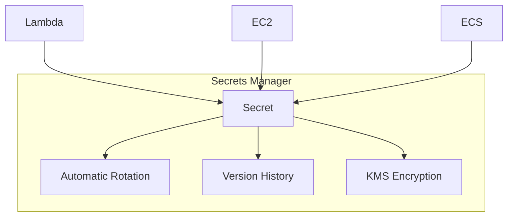
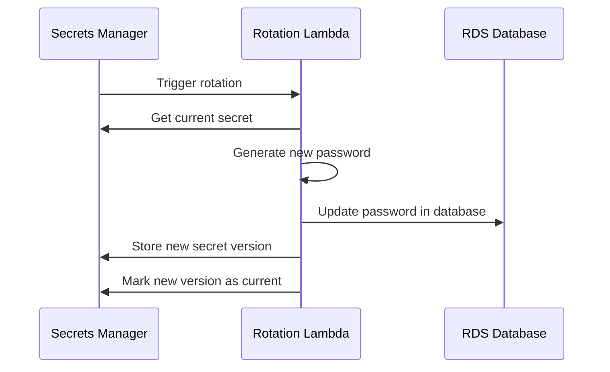
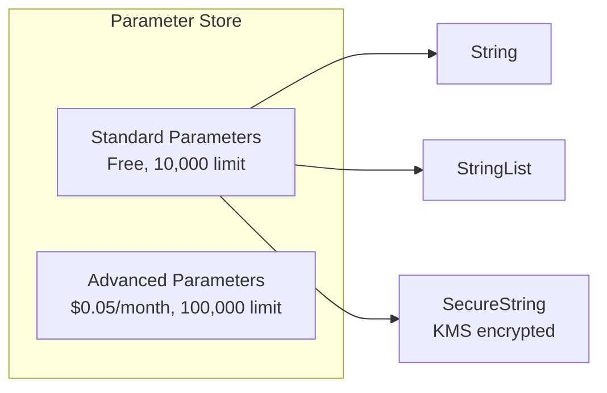
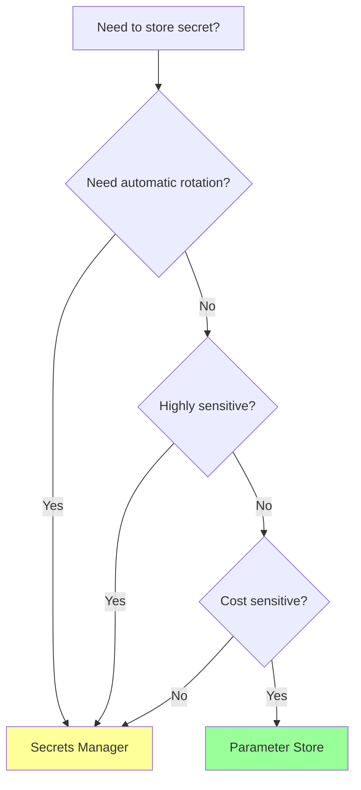

# Secrets Manager and Parameter Store

## Alex's Secret Problem

Alex has been storing database passwords in environment variables:

```python
# config.py - DON'T DO THIS!
DB_PASSWORD = os.environ.get('DB_PASSWORD', 'defaultpassword')
```

And worse, in the Lambda console environment variables (visible to anyone with Lambda access).

Jordan spots this immediately: "Those environment variables are visible to anyone who can view the Lambda function. And how do you rotate that password?"

Alex: "Um... I'd have to update every Lambda function manually?"

Jordan: "Exactly. Let me show you the right way."

## AWS Secrets Manager

Secrets Manager is designed specifically for managing secrets like:
- Database credentials
- API keys
- OAuth tokens
- SSH keys



### Creating a Secret

```bash
# Create a database credential secret
aws secretsmanager create-secret \
    --name pettracker/prod/db-credentials \
    --description "Production database credentials" \
    --secret-string '{
        "username": "pettracker_app",
        "password": "SuperSecureP@ssw0rd!",
        "host": "pettracker-db.cluster-xxx.us-east-1.rds.amazonaws.com",
        "port": 5432,
        "dbname": "pettracker"
    }'

# Or from a file
aws secretsmanager create-secret \
    --name pettracker/prod/api-key \
    --secret-string file://api-key.json
```

### Retrieving a Secret

```python
import boto3
import json

def get_secret(secret_name: str) -> dict:
    client = boto3.client('secretsmanager')

    response = client.get_secret_value(SecretId=secret_name)

    # Secret can be string or binary
    if 'SecretString' in response:
        return json.loads(response['SecretString'])
    else:
        return response['SecretBinary']

# Usage
credentials = get_secret('pettracker/prod/db-credentials')
connection = psycopg2.connect(
    host=credentials['host'],
    user=credentials['username'],
    password=credentials['password'],
    database=credentials['dbname']
)
```

### Automatic Rotation

The killer feature of Secrets Manager:

```bash
# Enable rotation for RDS credentials
aws secretsmanager rotate-secret \
    --secret-id pettracker/prod/db-credentials \
    --rotation-lambda-arn arn:aws:lambda:us-east-1:123456789012:function:SecretsManagerRotation \
    --rotation-rules '{
        "AutomaticallyAfterDays": 30
    }'
```



### Rotation Lambda

AWS provides rotation Lambda templates for common scenarios:

```bash
# For RDS MySQL
aws serverlessrepo create-cloud-formation-template \
    --application-id arn:aws:serverlessrepo:us-east-1:297356227824:applications/SecretsManagerRDSMySQLRotationSingleUser

# For RDS PostgreSQL
aws serverlessrepo create-cloud-formation-template \
    --application-id arn:aws:serverlessrepo:us-east-1:297356227824:applications/SecretsManagerRDSPostgreSQLRotationSingleUser
```

## AWS Systems Manager Parameter Store

Parameter Store is a simpler (and often free) alternative for configuration:



### Creating Parameters

```bash
# Plain text parameter
aws ssm put-parameter \
    --name "/pettracker/prod/api-url" \
    --type "String" \
    --value "https://api.pettracker.com"

# Secure parameter (encrypted)
aws ssm put-parameter \
    --name "/pettracker/prod/db-password" \
    --type "SecureString" \
    --value "SuperSecureP@ssw0rd!"

# With specific KMS key
aws ssm put-parameter \
    --name "/pettracker/prod/api-key" \
    --type "SecureString" \
    --key-id "alias/pettracker" \
    --value "sk_live_xxx"
```

### Retrieving Parameters

```python
import boto3

ssm = boto3.client('ssm')

# Get single parameter
response = ssm.get_parameter(
    Name='/pettracker/prod/db-password',
    WithDecryption=True  # Required for SecureString
)
password = response['Parameter']['Value']

# Get multiple parameters by path
response = ssm.get_parameters_by_path(
    Path='/pettracker/prod/',
    WithDecryption=True
)
for param in response['Parameters']:
    print(f"{param['Name']}: {param['Value']}")

# Get multiple specific parameters
response = ssm.get_parameters(
    Names=[
        '/pettracker/prod/db-password',
        '/pettracker/prod/api-key'
    ],
    WithDecryption=True
)
```

### Parameter Hierarchies

```bash
# Organize parameters by path
/pettracker/
├── dev/
│   ├── db-password
│   ├── api-url
│   └── log-level
├── staging/
│   ├── db-password
│   ├── api-url
│   └── log-level
└── prod/
    ├── db-password
    ├── api-url
    └── log-level
```

Access control by path:

```json
{
    "Version": "2012-10-17",
    "Statement": [{
        "Effect": "Allow",
        "Action": [
            "ssm:GetParameter",
            "ssm:GetParameters",
            "ssm:GetParametersByPath"
        ],
        "Resource": "arn:aws:ssm:us-east-1:123456789012:parameter/pettracker/dev/*"
    }]
}
```

## Secrets Manager vs Parameter Store

| Feature | Secrets Manager | Parameter Store |
|---------|-----------------|-----------------|
| **Cost** | $0.40/secret/month + API calls | Free (standard) or $0.05/advanced/month |
| **Rotation** | Built-in automatic rotation | Manual rotation |
| **Cross-account** | Yes, with resource policy | Limited |
| **Size limit** | 64 KB | 4 KB (standard) / 8 KB (advanced) |
| **Versioning** | Automatic | Optional |
| **Best for** | Database creds, API keys | Configuration, non-sensitive data |

### When to Use Which



## Alex's Implementation

Alex refactors PetTracker to use proper secret management:

### For Database Credentials (Secrets Manager)

```python
# db.py
import boto3
import json
import psycopg2
from functools import lru_cache

@lru_cache(maxsize=1)
def get_db_credentials():
    """Cached database credentials from Secrets Manager."""
    client = boto3.client('secretsmanager')
    response = client.get_secret_value(
        SecretId='pettracker/prod/db-credentials'
    )
    return json.loads(response['SecretString'])

def get_connection():
    creds = get_db_credentials()
    return psycopg2.connect(
        host=creds['host'],
        user=creds['username'],
        password=creds['password'],
        database=creds['dbname'],
        port=creds['port']
    )
```

### For Configuration (Parameter Store)

```python
# config.py
import boto3
from functools import lru_cache

ssm = boto3.client('ssm')

@lru_cache(maxsize=32)
def get_config(name: str) -> str:
    """Cached configuration from Parameter Store."""
    response = ssm.get_parameter(
        Name=f'/pettracker/{get_environment()}/{name}',
        WithDecryption=True
    )
    return response['Parameter']['Value']

def get_environment() -> str:
    import os
    return os.environ.get('ENVIRONMENT', 'dev')

# Usage
api_url = get_config('api-url')
log_level = get_config('log-level')
```

### Lambda with Secrets

```python
import json
import boto3

# Initialize outside handler for connection reuse
secrets_client = boto3.client('secretsmanager')

def get_secret():
    return json.loads(
        secrets_client.get_secret_value(
            SecretId='pettracker/prod/db-credentials'
        )['SecretString']
    )

def lambda_handler(event, context):
    # Use cached secret (Lambda execution context reuse)
    credentials = get_secret()
    # ... rest of function
```

## Caching Secrets

### Lambda Secrets Caching

```python
import boto3
import json
import time

class SecretCache:
    def __init__(self, ttl_seconds=300):
        self.client = boto3.client('secretsmanager')
        self.cache = {}
        self.ttl = ttl_seconds

    def get_secret(self, secret_id: str) -> dict:
        now = time.time()

        if secret_id in self.cache:
            cached_time, value = self.cache[secret_id]
            if now - cached_time < self.ttl:
                return value

        # Fetch fresh secret
        response = self.client.get_secret_value(SecretId=secret_id)
        value = json.loads(response['SecretString'])
        self.cache[secret_id] = (now, value)
        return value

# Global cache for Lambda execution context reuse
secret_cache = SecretCache(ttl_seconds=300)
```

### AWS Lambda Extension for Secrets

AWS provides a Lambda layer for caching:

```yaml
# SAM template
Resources:
  MyFunction:
    Type: AWS::Serverless::Function
    Properties:
      Layers:
        - arn:aws:lambda:us-east-1:177933569100:layer:AWS-Parameters-and-Secrets-Lambda-Extension:4
      Environment:
        Variables:
          SECRETS_MANAGER_TTL: 300
```

## IAM Permissions for Secrets

### For Secrets Manager

```json
{
    "Version": "2012-10-17",
    "Statement": [{
        "Effect": "Allow",
        "Action": "secretsmanager:GetSecretValue",
        "Resource": "arn:aws:secretsmanager:us-east-1:123456789012:secret:pettracker/*"
    }]
}
```

### For Parameter Store

```json
{
    "Version": "2012-10-17",
    "Statement": [
        {
            "Effect": "Allow",
            "Action": [
                "ssm:GetParameter",
                "ssm:GetParameters",
                "ssm:GetParametersByPath"
            ],
            "Resource": "arn:aws:ssm:us-east-1:123456789012:parameter/pettracker/*"
        },
        {
            "Effect": "Allow",
            "Action": "kms:Decrypt",
            "Resource": "arn:aws:kms:us-east-1:123456789012:key/*",
            "Condition": {
                "StringEquals": {
                    "kms:ViaService": "ssm.us-east-1.amazonaws.com"
                }
            }
        }
    ]
}
```

## Exam Tips

**For DVA-C02:**

1. **Secrets Manager** = Automatic rotation, database credentials
2. **Parameter Store** = Configuration, free tier available
3. **SecureString** = Encrypted parameters (KMS)
4. **WithDecryption=True** required for SecureString
5. **Cache secrets** in Lambda for performance
6. **Parameter hierarchies** enable path-based access control

**Common scenarios:**

> "Need automatic rotation of database credentials..."
> → Secrets Manager with rotation Lambda

> "Store configuration that varies by environment..."
> → Parameter Store with path hierarchy

> "Cost-sensitive, don't need rotation..."
> → Parameter Store (free standard tier)

## Key Takeaways

1. **Never hardcode secrets** in code or environment variables
2. **Secrets Manager** for sensitive credentials with rotation
3. **Parameter Store** for configuration (often free)
4. **Use hierarchies** for organization and access control
5. **Cache secrets** to reduce API calls and improve performance
6. **Grant minimal permissions** - only GetSecretValue/GetParameter

---

*Next: Alex completes the security hardening of PetTracker!*

---
*v2.0*
