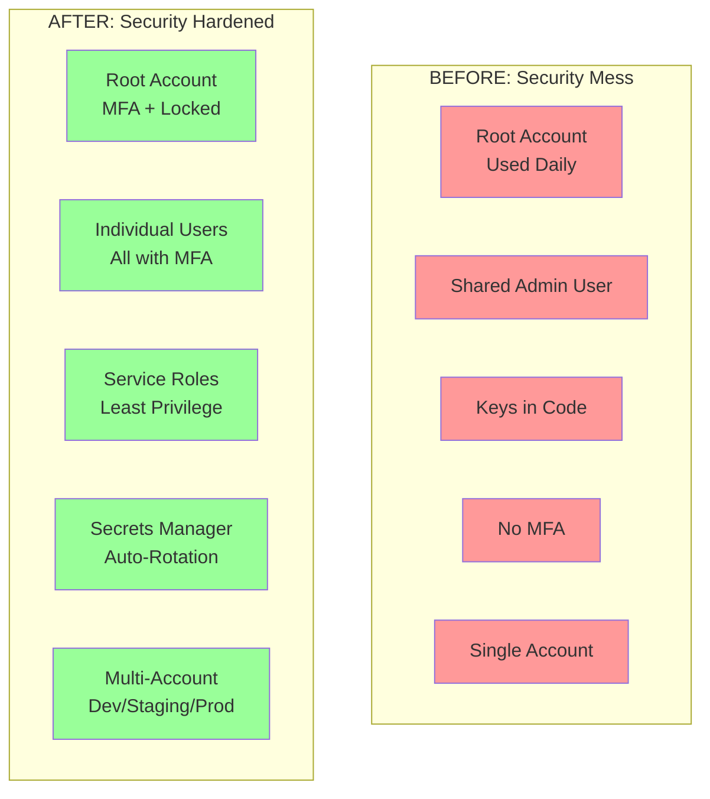
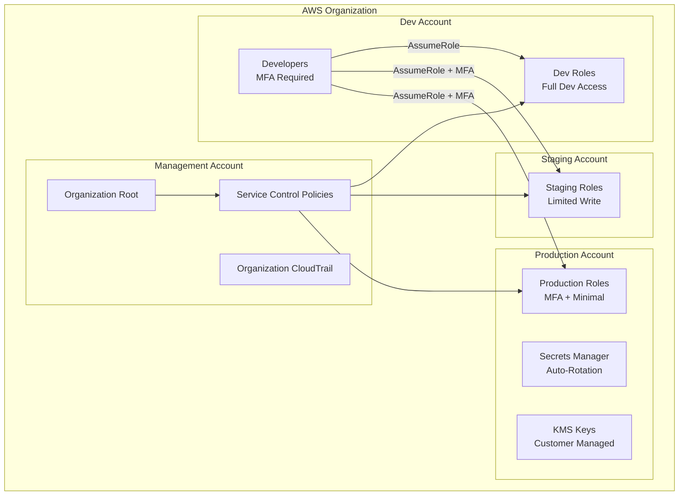

# Alex's Solution: Security Hardened!

## The Transformation

Two weeks after Jordan's security audit, Alex presents the new PetTracker security architecture. The CTO, **Elena**, joins the review.

"Show me what you've done," Elena says.

## Before vs After



## The Complete Security Architecture



## Security Checklist: Completed!

### Identity and Access Management

| Item | Status | Implementation |
|------|--------|----------------|
| Root account MFA | ✅ | Hardware MFA device |
| Root account not used | ✅ | No API calls in 30 days |
| Individual IAM users | ✅ | alex, maya, sam, jordan |
| All users have MFA | ✅ | Virtual MFA enforced |
| Groups for permissions | ✅ | Developers, DevOps, Audit |
| Least privilege policies | ✅ | Custom policies per role |
| Service roles | ✅ | Lambda, EC2, ECS roles |
| No shared credentials | ✅ | Each user has own keys |
| Key rotation policy | ✅ | 90-day automatic alerts |

### Data Protection

| Item | Status | Implementation |
|------|--------|----------------|
| S3 encryption | ✅ | SSE-KMS with Bucket Keys |
| DynamoDB encryption | ✅ | Customer managed key |
| Secrets in Secrets Manager | ✅ | Auto-rotation enabled |
| Config in Parameter Store | ✅ | SecureString for sensitive |
| No hardcoded credentials | ✅ | All from Secrets Manager |
| KMS key rotation | ✅ | Annual automatic rotation |

### Monitoring and Audit

| Item | Status | Implementation |
|------|--------|----------------|
| CloudTrail enabled | ✅ | All regions, S3 storage |
| Access Analyzer | ✅ | Weekly review scheduled |
| IAM credential report | ✅ | Weekly audit script |
| GuardDuty enabled | ✅ | Threat detection active |
| Config rules | ✅ | Compliance monitoring |

## Alex's Final IAM Structure

### IAM Groups and Policies

```bash
# Final group structure
Groups:
├── Developers
│   ├── Policy: DeveloperAccess
│   ├── Policy: MFAEnforcement
│   └── Members: alex, maya
├── DevOps
│   ├── Policy: DevOpsAccess
│   ├── Policy: MFAEnforcement
│   └── Members: sam
└── SecurityAudit
    ├── Policy: SecurityAuditAccess
    ├── Policy: MFAEnforcement
    └── Members: jordan
```

### Service Roles

```bash
# Lambda roles
pettracker-lambda-api:
  - AWSLambdaBasicExecutionRole
  - DynamoDBReadWrite (pettracker-* tables)
  - S3ReadWrite (pettracker-images/*)
  - SecretsManagerRead (pettracker/*)

pettracker-lambda-processor:
  - AWSLambdaBasicExecutionRole
  - S3ReadWrite (pettracker-images/*)
  - S3PutObject (pettracker-thumbnails/*)

# ECS roles
pettracker-ecs-execution:
  - AmazonECSTaskExecutionRolePolicy

pettracker-ecs-task:
  - DynamoDBReadWrite (pettracker-* tables)
  - SecretsManagerRead (pettracker/*)
```

## The Cost of Security (Worth It!)

Elena asks about costs. Alex presents the breakdown:

```
Monthly Security Costs:
├── KMS Customer Managed Key: $1.00
├── Secrets Manager (5 secrets): $2.00
├── CloudTrail (S3 storage): ~$0.50
├── GuardDuty: ~$10.00
├── Config: ~$3.00
└── Total: ~$16.50/month

vs

Cost of a Security Breach:
├── Incident response: $50,000+
├── Customer notification: $10,000+
├── Reputation damage: Priceless
├── Regulatory fines: $$$$$
└── Total: Don't want to find out
```

Elena nods approvingly. "Sixteen dollars a month is the best investment we'll make."

## The Security Mindset Shift

Alex reflects on the journey:

```
Old Thinking:
"Security slows me down"
"I'll add it later"
"It's probably fine"
"Who would attack us?"

New Thinking:
"Security enables safe velocity"
"Security is built-in from the start"
"Assume breach, minimize blast radius"
"Automated attacks target everyone"
```

## Quick Reference: Security Commands

Alex creates a quick reference for the team:

```bash
# Check who you are
aws sts get-caller-identity

# Check MFA status for all users
for user in $(aws iam list-users --query 'Users[*].UserName' --output text); do
    mfa=$(aws iam list-mfa-devices --user-name $user --query 'MFADevices[0].SerialNumber' --output text)
    echo "$user: ${mfa:-NO MFA}"
done

# Find unused access keys (>30 days)
aws iam get-credential-report --query 'Content' --output text | base64 -d | \
    awk -F',' 'NR>1 && $11!="N/A" {print $1, $11}'

# Check for public S3 buckets
aws s3api list-buckets --query 'Buckets[*].Name' --output text | \
    xargs -I {} aws s3api get-bucket-policy-status --bucket {} 2>/dev/null

# List all cross-account roles
aws iam list-roles --query 'Roles[?contains(AssumeRolePolicyDocument.Statement[0].Principal.AWS, `arn:aws:iam::`) && !contains(AssumeRolePolicyDocument.Statement[0].Principal.AWS, `123456789012`)].RoleName'

# Get secret (for debugging)
aws secretsmanager get-secret-value --secret-id pettracker/prod/db-credentials \
    --query 'SecretString' --output text | jq .

# Get parameter
aws ssm get-parameter --name /pettracker/prod/api-url --with-decryption \
    --query 'Parameter.Value' --output text
```

## Chapter Summary: What Alex Learned

### The Four Pillars of IAM

1. **Authentication** - Verifying identity (users, MFA)
2. **Authorization** - Granting permissions (policies)
3. **Audit** - Tracking activity (CloudTrail)
4. **Automation** - Rotating credentials (Secrets Manager)

### Key Concepts Mastered

| Concept | Key Points |
|---------|------------|
| **IAM Users** | Individual identities, long-term credentials |
| **IAM Groups** | Collections of users, attach policies here |
| **IAM Roles** | Temporary credentials, for services and cross-account |
| **IAM Policies** | JSON permission documents, least privilege |
| **Policy Evaluation** | Explicit Deny wins, default implicit deny |
| **KMS** | Key management, envelope encryption |
| **Secrets Manager** | Secret storage with rotation |
| **Parameter Store** | Configuration storage, free tier |

### Exam Preparation: IAM Topics

These topics appear frequently on the DVA-C02:

1. **Policy structure** - Version, Statement, Effect, Action, Resource, Condition
2. **Explicit Deny** - Always overrides Allow
3. **Roles vs Users** - When to use each
4. **Cross-account access** - Trust policies and assume role
5. **Service roles** - Lambda execution roles, EC2 instance profiles
6. **Secret management** - Secrets Manager vs Parameter Store
7. **KMS** - Customer managed keys, envelope encryption

## What's Next: EC2 and Compute

With security foundations in place, Alex is ready to build PetTracker's infrastructure. The next chapter covers EC2 - the foundational compute service.

**Preview:** Alex needs to run a background job that processes pet photos. Lambda has a 15-minute timeout limit. Time to learn about EC2...

```bash
# Sneak peek at Chapter 2
$ aws ec2 describe-instance-types \
    --filters "Name=current-generation,Values=true" \
    --query 'InstanceTypes[*].[InstanceType,VCpuInfo.DefaultVCpus,MemoryInfo.SizeInMiB]' \
    --output table | head -20

# Alex: "Wait, there are HOW many instance types?!"
```

## Key Takeaways from Chapter 1

1. **Security is not optional** - Build it in from the start
2. **Least privilege** - Grant minimum required permissions
3. **MFA everywhere** - Non-negotiable for all users
4. **Use roles** - Temporary credentials > long-term keys
5. **Never hardcode secrets** - Use Secrets Manager or Parameter Store
6. **Audit everything** - CloudTrail, Access Analyzer, credential reports
7. **Multi-account** - Isolation between environments
8. **Encryption at rest** - KMS for all sensitive data

---

**Congratulations!** You've completed Chapter 1. Alex (and you) now have a solid security foundation for building applications on AWS.

*Next Chapter: EC2 Fundamentals - Building PetTracker's compute infrastructure.*

---
*v2.0*
