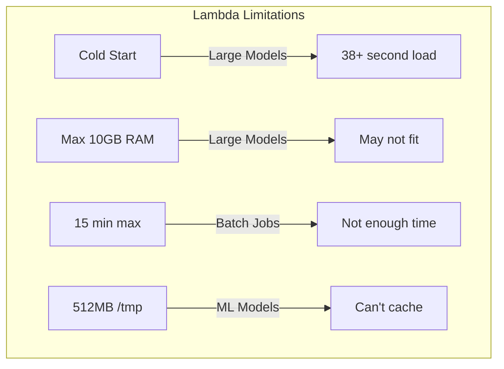
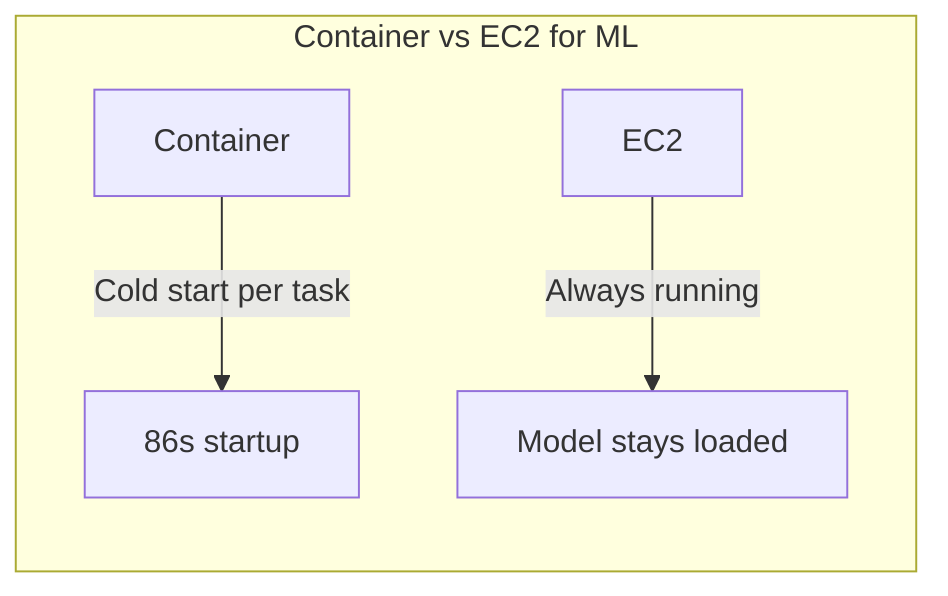
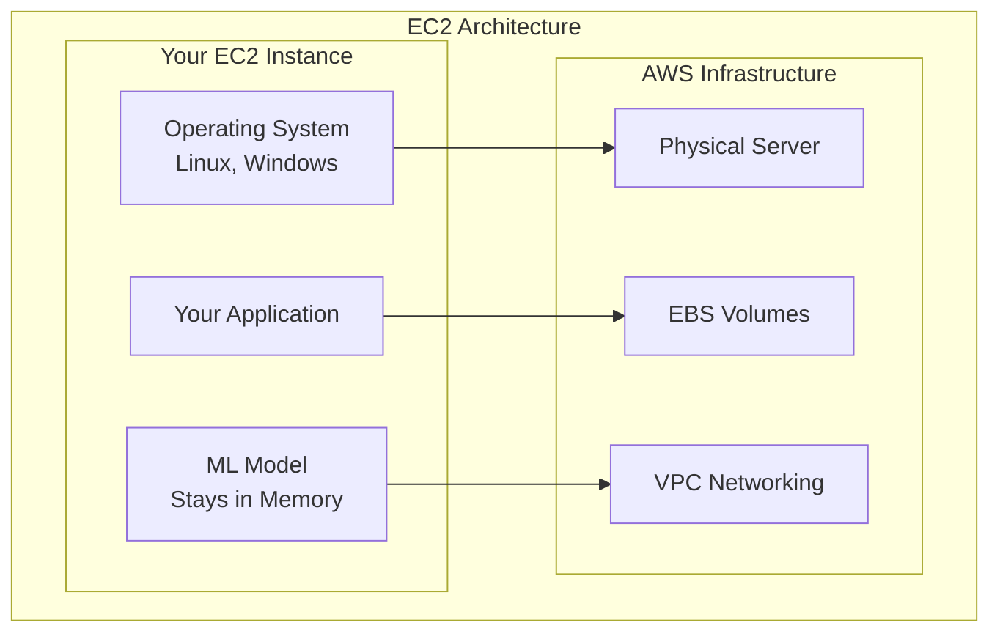
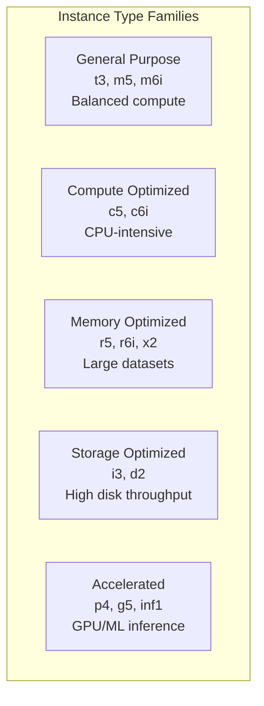
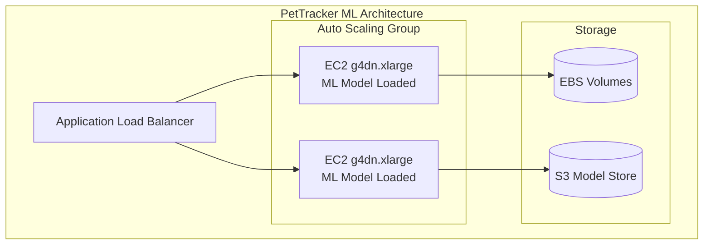
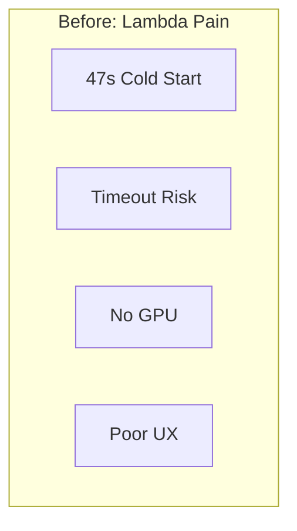
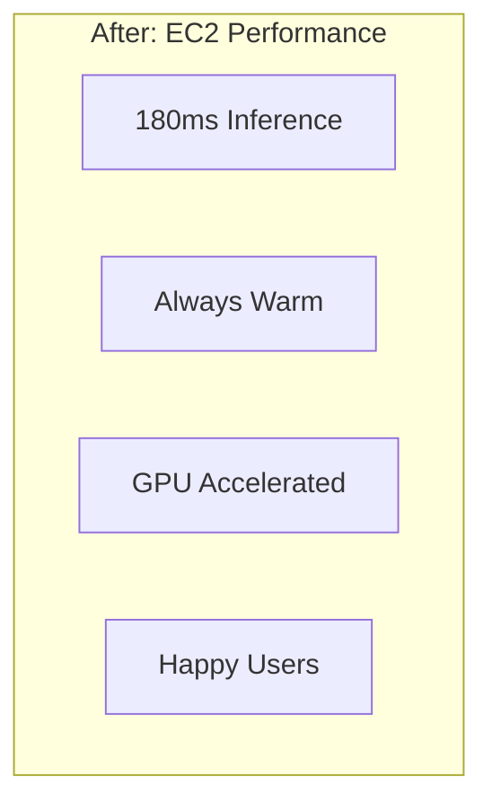

# EC2 Fundamentals: When You Need Real Servers

## The Day Lambda Said "No"

Alex had been a serverless convert. Lambda handled PetTracker's API beautifully - no servers to manage, automatic scaling, pay-per-invocation pricing. Life was good.

Then Maya, the frontend developer, had an idea: "What if we added AI-powered pet breed identification? Users upload a photo, we tell them the breed!"

Alex was excited. They found an open-source ML model, packaged it up, and deployed it to Lambda. The first test worked... sort of.

```
Lambda Execution Results:
- Cold start: 47 seconds
- Model load time: 38 seconds
- Inference time: 2 seconds
- Total: 49 seconds
- Status: TIMEOUT (Lambda max is 15 minutes, but UX is terrible)
```

"Almost a minute to identify a dog breed?" Maya shook her head. "Users will think the app is broken."

---

## "But Why Can't Lambda Handle This?"

This is a question every serverless developer eventually asks. Let's examine why Lambda isn't always the answer.

:::floating:right:1/2


**Lambda's constraints:**
- **Cold starts** - Container initialization adds latency
- **Memory limit** - 10GB maximum
- **Timeout** - 15 minutes maximum
- **No persistent storage** - Model reloads every invocation
- **No GPU** - CPU-only inference is slow
:::

"The ML model is 2.3GB," Alex explained to Sam. "Every Lambda invocation loads it from scratch. There's no way to keep it warm."

"What about Provisioned Concurrency?"

"Tried it. The model still loads on each new container. We'd need to provision 50 containers to handle our traffic, and even then, new containers spin up during spikes."

Sam nodded. "Sometimes you need a server that stays running. That's what EC2 is for."

---

## "But Why Not Just Use Containers?"

Another common question. ECS and Fargate are great, but they have the same fundamental issue for this use case.

**The container cold start problem:**

```
Fargate Task Launch:
- Image pull: 45 seconds (2.3GB image)
- Container start: 3 seconds
- Model initialization: 38 seconds
- Total: 86 seconds to first request
```

:::floating:left:1/2


Containers share Lambda's problem: the model loads fresh when the container starts. For ML inference, you want the model **always loaded in memory**, ready to respond instantly.
:::

"The key insight," Sam explained, "is that some workloads need persistent compute. The server runs continuously, model stays in memory, inference happens in milliseconds."

---

## What is EC2?

**Amazon Elastic Compute Cloud (EC2) provides resizable virtual servers in the cloud. You choose the hardware, you choose the OS, you have full control.**



**Key EC2 Concepts:**

| Concept | What It Is | Why It Matters |
|---------|-----------|----------------|
| **Instance** | A virtual server | Your compute resource |
| **AMI** | Amazon Machine Image | Template for your server |
| **Instance Type** | Hardware specification | CPU, memory, network |
| **EBS** | Block storage volumes | Persistent disk storage |
| **Security Group** | Virtual firewall | Controls network access |
| **Key Pair** | SSH credentials | Secure access to instance |

---

## Instance Types: Choosing Your Hardware

:::floating:right:2/3


Instance types follow a naming convention:

`m5.2xlarge`
- **m** = family (general purpose)
- **5** = generation
- **2xlarge** = size

Common families for developers:
- **t3** - Burstable, good for development
- **m5/m6i** - General purpose production
- **c5/c6i** - CPU-intensive (compilation, encoding)
- **r5/r6i** - Memory-intensive (caching, analytics)
- **g5/p4** - GPU (ML training and inference)
:::

For PetTracker's ML inference, Alex chose:

```bash
# GPU instance for fast inference
Instance Type: g4dn.xlarge
- 4 vCPUs
- 16 GB RAM
- 1 NVIDIA T4 GPU
- $0.526/hour ($380/month)

# vs Lambda at scale
# 50 concurrent executions × $0.0000166667/GB-s × 10GB × 45s
# = $0.375 per cold start, thousands per day
```

---

## Alex Launches the First Instance

With Sam's guidance, Alex launched an EC2 instance:

```bash
# Launch a GPU instance
aws ec2 run-instances \
    --image-id ami-0abcdef1234567890 \
    --instance-type g4dn.xlarge \
    --key-name pettracker-dev \
    --security-group-ids sg-0123456789abcdef0 \
    --subnet-id subnet-0123456789abcdef0 \
    --tag-specifications 'ResourceType=instance,Tags=[{Key=Name,Value=pettracker-ml}]'
```

Two minutes later, the instance was running. Alex SSH'd in:

```bash
ssh -i pettracker-dev.pem ec2-user@ec2-54-123-45-67.compute-1.amazonaws.com

# Load the ML model once
python3 load_model.py

# Model now stays in memory
# Inference time: 180ms (vs 47 seconds on Lambda)
```

"From 47 seconds to 180 milliseconds," Alex reported. "Users will love this."

---

## What You'll Learn in This Chapter

This chapter covers everything you need to know about EC2 for the DVA-C02 exam:

- **Instance types and selection** - Choosing the right hardware
- **AMIs and launch templates** - Repeatable deployments
- **Security groups** - Network access control
- **EBS volumes** - Storage options and performance
- **Instance metadata** - The magic endpoint every developer needs
- **Pricing models** - On-Demand, Reserved, Spot, Savings Plans

| Concept | What It Solves |
|---------|---------------|
| **Instance Types** | Match hardware to workload |
| **AMIs** | Consistent, repeatable deployments |
| **Security Groups** | Network isolation |
| **EBS Volumes** | Persistent storage |
| **Instance Metadata** | Dynamic configuration |
| **User Data** | Bootstrap automation |

## The Architecture We're Building

:::floating:right:2/3


By chapter end, PetTracker will have:
- GPU instances for ML inference
- Auto Scaling for traffic spikes
- EBS volumes for persistent data
- Security groups for access control
- Launch templates for consistency
:::

## Why This Matters for the Exam

EC2 is foundational knowledge for DVA-C02. Expect questions about:

- **Instance type selection** - Match workload to instance
- **Security groups** - Stateful firewall rules
- **EBS volume types** - gp3, io2, st1, sc1
- **Instance metadata** - IMDSv2 security
- **Pricing optimization** - Spot, Reserved, Savings Plans

| Topic | What the Exam Asks |
|-------|-------------------|
| **Instance Types** | Which family for which workload |
| **Security Groups** | Inbound vs outbound, stateful behavior |
| **EBS** | Volume types, encryption, snapshots |
| **Metadata** | IMDSv2, instance identity |
| **User Data** | Bootstrap scripts, cloud-init |
| **Pricing** | Spot interruptions, Reserved capacity |

## Meet the Team

Throughout this chapter:

- **Alex** - Learning EC2 after hitting Lambda limits
- **Sam** - DevOps mentor with years of EC2 experience
- **Marcus** - SRE who manages the production fleet
- **Maya** - Frontend developer who sparked the ML feature
- **Finance Team** - Very interested in EC2 costs

## Chapter Roadmap

1. **Alex's Challenge** - When Lambda isn't enough
2. **EC2 Core Concepts** - Instances, AMIs, and architecture
3. **Instance Types** - Choosing the right hardware
4. **Launching Instances** - CLI, console, and templates
5. **Security Groups** - Network access control
6. **EBS Storage** - Volume types and management
7. **Instance Store** - Ephemeral high-performance storage
8. **Instance Metadata** - The developer's secret weapon
9. **User Data** - Bootstrap automation
10. **Pricing Models** - Optimizing EC2 costs
11. **Placement Groups** - Performance optimization
12. **Alex's Solution** - The complete ML inference platform

---

## The Before and After





---

*Ready to learn EC2 from the ground up? Let's start with understanding instance types and how to choose the right hardware for your workload.*

---
*v2.0*
