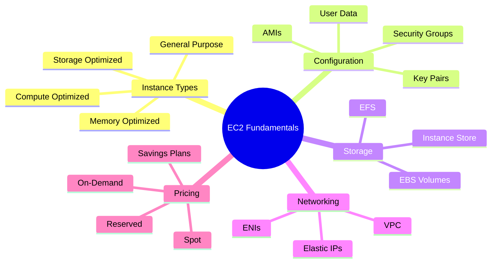

# EC2 Fundamentals

Amazon Elastic Compute Cloud (EC2) is the backbone of AWS compute. It provides resizable virtual servers in the cloud, giving you complete control over your computing resources. Understanding EC2 is essential for any AWS developer, even if you primarily work with serverless technologies.

## Alex's Story: When Lambda Isn't Enough

PetTracker has been running smoothly on Lambda, but Alex hits a wall. The pet breed identification ML model takes too long to load - Lambda's cold starts are killing user experience, and the 15-minute timeout isn't enough for batch processing jobs.

"I need something that runs continuously," Alex tells Sam. "Something I can SSH into and debug. Something... more like a real server."

Sam grins. "Welcome to EC2. It's time to learn the OG of AWS compute."

## What You'll Learn

By the end of this chapter, you'll understand:

- EC2 instance types and how to choose the right one
- Amazon Machine Images (AMIs) and launch configurations
- Security groups and network access control
- EBS volumes and instance storage
- Pricing models and cost optimization
- Instance metadata and user data

## Chapter Architecture

## Why This Matters for the Exam

EC2 is a foundational service that appears throughout the DVA-C02 exam:

- Understanding instance types and their use cases
- Security group configuration
- EBS volume types and performance characteristics
- Instance metadata service usage
- Cost optimization strategies

Even in a serverless-focused exam, EC2 knowledge is essential for understanding how other services work under the hood.

## Characters in This Chapter

- **Alex** - Learning EC2 after hitting Lambda limitations
- **Sam** - DevOps mentor who's managed thousands of instances
- **Marcus** - The SRE who gets paged when instances go down
- **The Finance Team** - Very interested in EC2 cost optimization

---
*v1.0*
