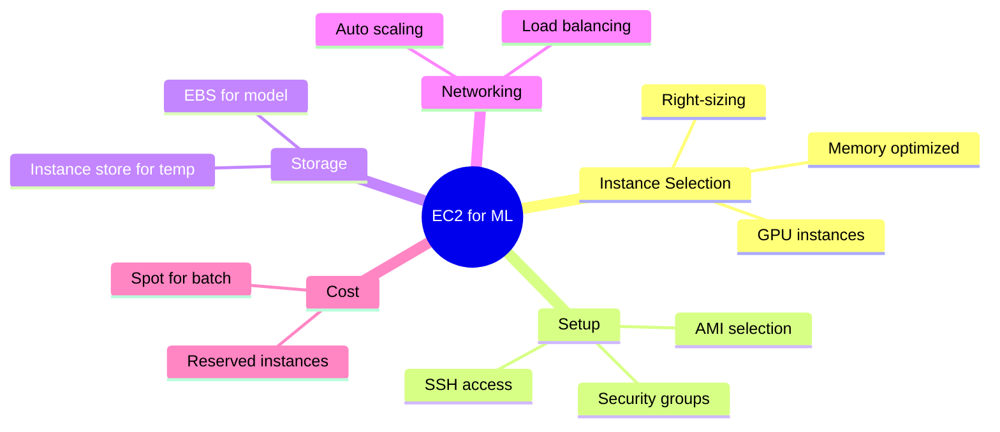

# Alex's Challenge: Lambda Hits Its Limits

## The ML Model Problem

PetTracker's newest feature is exciting: automatic pet breed identification. Users upload a photo, and AI tells them what breed their pet is. Alex built it using a pre-trained TensorFlow model.

The problem? The model is 500MB and takes 30 seconds to load.

```python
# lambda_function.py
import tensorflow as tf

# This takes 30 seconds on cold start! 😱
model = tf.keras.models.load_model('breed_model.h5')

def lambda_handler(event, context):
    # By the time we get here, user has given up
    image = load_image(event['image_url'])
    prediction = model.predict(image)
    return {'breed': decode_prediction(prediction)}
```

## The Cold Start Nightmare

Alex checks CloudWatch metrics:

```
Lambda Cold Start Times:
- P50: 32 seconds
- P95: 45 seconds
- P99: 58 seconds

User Experience:
- "Why is this taking so long?"
- "App seems frozen"
- "1-star review: Breed detection never works"
```

## Alex Tries Everything

### Attempt 1: Provisioned Concurrency

```bash
aws lambda put-provisioned-concurrency-config \
    --function-name breed-identifier \
    --qualifier prod \
    --provisioned-concurrent-executions 10

# Cost: $150/month for 10 warm instances
# Result: Still 30-second loads when scaling beyond 10
```

### Attempt 2: Smaller Model

Alex tries a compressed model:

```python
# Quantized model: 125MB instead of 500MB
# Cold start: 15 seconds (still terrible)
# Accuracy: Dropped from 94% to 78% (not acceptable)
```

### Attempt 3: Lambda Container Images

```dockerfile
FROM public.ecr.aws/lambda/python:3.9
COPY breed_model.h5 /var/task/
COPY app.py /var/task/
RUN pip install tensorflow

# Result: 10GB container image
# Cold start: 45 seconds (WORSE!)
```

## The Breaking Point

Alex gets a message from the CTO:

> "Alex, the breed identifier feature is getting terrible reviews. Users are abandoning the app waiting for results. We need this fixed by next week or we're pulling the feature."

Alex is frustrated. "Lambda is supposed to be the future! Why can't it handle this?"

## Sam's Advice

Sam overhears Alex's frustration:

"Lambda is great for many things, but not everything. You're trying to fit a square peg in a round hole."

"What do you mean?"

"Lambda is designed for short, stateless operations. Your ML model needs:
- Persistent memory (keep model loaded)
- Longer execution time
- More control over the environment
- Predictable, consistent performance

That's not Lambda. That's EC2."

## The Requirements

Alex lists what the breed identifier actually needs:

```markdown
## Breed Identifier Requirements

1. **Model Loading**: 500MB model must stay in memory
2. **Response Time**: < 2 seconds after model is loaded
3. **Availability**: Always ready (no cold starts)
4. **GPU Support**: For faster inference (nice to have)
5. **Batch Processing**: Process multiple images at night
6. **Cost**: Must be reasonable

Lambda Reality:
- ❌ Model reloads on cold start
- ❌ 30+ second cold starts
- ❌ No persistent memory
- ❌ No GPU support
- ❌ 15-minute timeout for batch jobs
```

## The Solution: EC2


## What Alex Needs to Learn



## The Plan

Sam helps Alex outline the approach:

1. **Learn EC2 basics** - Instance types, AMIs, security groups
2. **Launch a test instance** - Get familiar with the workflow
3. **Set up the ML server** - Install dependencies, load model
4. **Configure networking** - Security groups, load balancer
5. **Optimize costs** - Right-size, consider Reserved/Spot
6. **Add reliability** - Auto Scaling, health checks

## Alex's Mindset Shift

```
Old Thinking:
"Serverless is always better"
"EC2 is old technology"
"Managing servers is bad"

New Thinking:
"Use the right tool for the job"
"EC2 offers control when you need it"
"EC2 + Auto Scaling = managed infrastructure"
```

## Key Takeaway

> **"Serverless isn't always the answer. Understanding when to use EC2 versus Lambda is a key skill for any AWS developer. The best solution is the one that meets your requirements, not the one that's newest or trendiest."**

---

*Next: Alex learns the core concepts of EC2 and what makes it tick.*

---
*v1.0*
