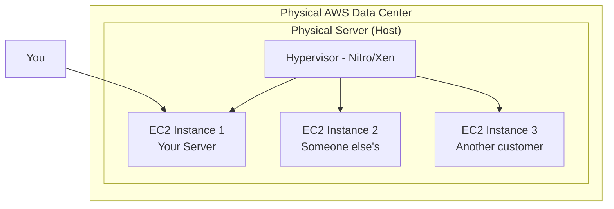
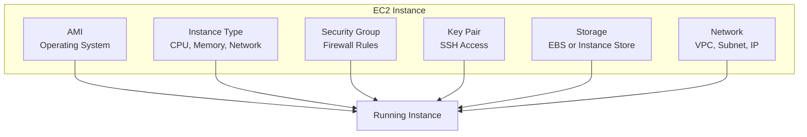
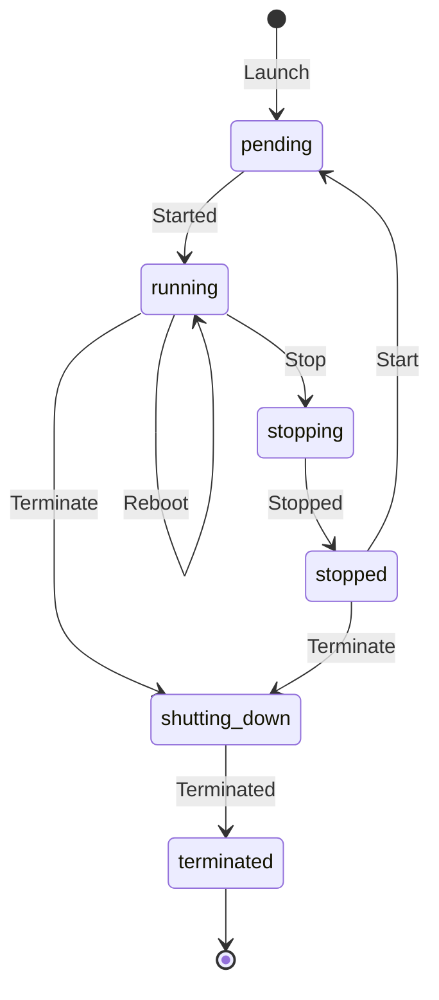
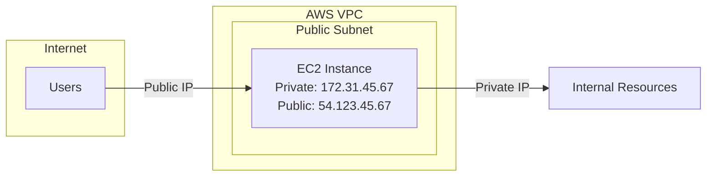
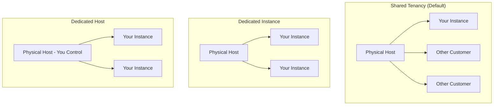

# EC2 Core Concepts

## What is EC2?

Amazon Elastic Compute Cloud (EC2) provides resizable virtual servers (called instances) in the cloud. Think of it as renting a computer from AWS that you can configure however you want.



## Key EC2 Components



### 1. Amazon Machine Image (AMI)

The AMI is a template containing:
- Operating system (Linux, Windows)
- Pre-installed software
- Configuration settings

```bash
# Find Amazon Linux 2 AMIs
aws ec2 describe-images \
    --owners amazon \
    --filters "Name=name,Values=amzn2-ami-hvm-*-x86_64-gp2" \
    --query 'Images | sort_by(@, &CreationDate) | [-1].ImageId'
```

### 2. Instance Type

Determines the hardware:
- vCPUs (virtual CPUs)
- Memory (RAM)
- Network performance
- Storage type

```bash
# See available instance types
aws ec2 describe-instance-types \
    --query 'InstanceTypes[*].[InstanceType,VCpuInfo.DefaultVCpus,MemoryInfo.SizeInMiB]' \
    --output table | head -20
```

### 3. Security Group

Virtual firewall controlling traffic:
- Inbound rules (who can connect to you)
- Outbound rules (who you can connect to)

### 4. Key Pair

SSH key for secure access:
- You keep the private key
- AWS stores the public key
- Required for SSH access to Linux instances

### 5. Storage

- **EBS (Elastic Block Store)**: Network-attached, persistent
- **Instance Store**: Local disk, ephemeral (lost on stop)

### 6. Network

- **VPC**: Virtual network
- **Subnet**: Network segment
- **IP addresses**: Public and private

## EC2 Instance Lifecycle



### Lifecycle States Explained

| State | Description | Billing |
|-------|-------------|---------|
| **pending** | Instance is launching | No charge |
| **running** | Instance is running | Charged |
| **stopping** | Instance is stopping | Charged |
| **stopped** | Instance is stopped | No compute charge (EBS charged) |
| **shutting-down** | Instance is terminating | No charge |
| **terminated** | Instance is deleted | No charge |

## Alex Launches a Test Instance

Alex wants to understand the basics before building the ML server:

```bash
# Step 1: Find the latest Amazon Linux 2 AMI
AMI_ID=$(aws ec2 describe-images \
    --owners amazon \
    --filters "Name=name,Values=amzn2-ami-hvm-*-x86_64-gp2" \
    --query 'Images | sort_by(@, &CreationDate) | [-1].ImageId' \
    --output text)

echo "Using AMI: $AMI_ID"

# Step 2: Create a key pair
aws ec2 create-key-pair \
    --key-name pettracker-key \
    --query 'KeyMaterial' \
    --output text > pettracker-key.pem

chmod 400 pettracker-key.pem

# Step 3: Create a security group
SG_ID=$(aws ec2 create-security-group \
    --group-name pettracker-test-sg \
    --description "Test security group for PetTracker" \
    --query 'GroupId' \
    --output text)

# Step 4: Allow SSH access (be more restrictive in production!)
aws ec2 authorize-security-group-ingress \
    --group-id $SG_ID \
    --protocol tcp \
    --port 22 \
    --cidr 0.0.0.0/0

# Step 5: Launch the instance
INSTANCE_ID=$(aws ec2 run-instances \
    --image-id $AMI_ID \
    --instance-type t3.micro \
    --key-name pettracker-key \
    --security-group-ids $SG_ID \
    --query 'Instances[0].InstanceId' \
    --output text)

echo "Launched instance: $INSTANCE_ID"

# Step 6: Wait for it to be running
aws ec2 wait instance-running --instance-ids $INSTANCE_ID

# Step 7: Get the public IP
PUBLIC_IP=$(aws ec2 describe-instances \
    --instance-ids $INSTANCE_ID \
    --query 'Reservations[0].Instances[0].PublicIpAddress' \
    --output text)

echo "Instance IP: $PUBLIC_IP"

# Step 8: Connect via SSH
ssh -i pettracker-key.pem ec2-user@$PUBLIC_IP
```

## Alex's First SSH Session

```bash
$ ssh -i pettracker-key.pem ec2-user@54.123.45.67

       __|  __|_  )
       _|  (     /   Amazon Linux 2 AMI
      ___|\___|___|

[ec2-user@ip-172-31-45-67 ~]$ whoami
ec2-user

[ec2-user@ip-172-31-45-67 ~]$ uname -a
Linux ip-172-31-45-67 5.10.0-1234-aws x86_64 GNU/Linux

[ec2-user@ip-172-31-45-67 ~]$ free -h
              total        used        free      shared  buff/cache   available
Mem:          976Mi       120Mi       400Mi       0.0Ki       455Mi       700Mi

[ec2-user@ip-172-31-45-67 ~]$ df -h
Filesystem      Size  Used Avail Use% Mounted on
/dev/xvda1      8.0G  1.5G  6.6G  19% /
```

Alex is excited. "It's like having my own Linux server in the cloud!"

## Understanding the Instance

### Private vs Public IPs



- **Private IP**: Internal VPC communication, never changes
- **Public IP**: Internet access, changes on stop/start

### Elastic IPs

For a static public IP:

```bash
# Allocate an Elastic IP
ALLOC_ID=$(aws ec2 allocate-address \
    --query 'AllocationId' \
    --output text)

# Associate with instance
aws ec2 associate-address \
    --instance-id $INSTANCE_ID \
    --allocation-id $ALLOC_ID
```

**Note**: Elastic IPs are free when attached to a running instance, but cost money when unattached!

## Instance Actions

```bash
# Stop instance (preserves EBS data)
aws ec2 stop-instances --instance-ids $INSTANCE_ID

# Start instance
aws ec2 start-instances --instance-ids $INSTANCE_ID

# Reboot instance
aws ec2 reboot-instances --instance-ids $INSTANCE_ID

# Terminate instance (deletes everything!)
aws ec2 terminate-instances --instance-ids $INSTANCE_ID
```

### Stop vs Terminate

| Action | EBS Root Volume | EBS Data Volumes | Instance Store | Billing |
|--------|-----------------|------------------|----------------|---------|
| **Stop** | Preserved | Preserved | Lost | No compute cost |
| **Terminate** | Deleted* | Preserved** | Lost | Nothing |

*Unless `DeleteOnTermination=false`
**Depends on volume settings

## Tenancy Options



Most workloads use shared tenancy. Dedicated options are for:
- Compliance requirements
- Licensing that requires physical isolation
- Regulatory needs

## Exam Tips

**For DVA-C02:**

1. **Instance states**: Know the lifecycle (pending → running → stopped → terminated)
2. **Stop vs Terminate**: Stop preserves EBS, terminate deletes by default
3. **Public IPs**: Change on stop/start unless using Elastic IP
4. **Private IPs**: Persistent within VPC
5. **Security groups**: Stateful firewall

**Common scenarios:**

> "Instance lost public IP after restart..."
> → Public IPs change on stop/start. Use Elastic IP for static.

> "Need to preserve data when stopping instance..."
> → EBS volumes persist; instance store does not

> "Compliance requires physical isolation..."
> → Use Dedicated Instances or Dedicated Hosts

## Key Takeaways

1. **EC2 provides virtual servers** in the cloud
2. **AMIs define** the operating system and software
3. **Instance types define** the hardware (CPU, memory, network)
4. **Security groups** are virtual firewalls
5. **Key pairs** enable SSH access
6. **Public IPs change** on stop/start; use Elastic IPs for static
7. **Stop preserves data**; Terminate deletes (by default)

---

*Next: Alex dives deep into instance types to find the right one for the ML workload.*
