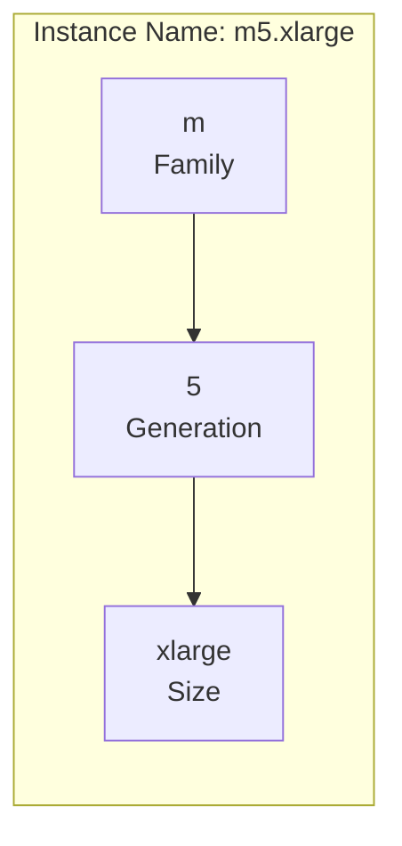
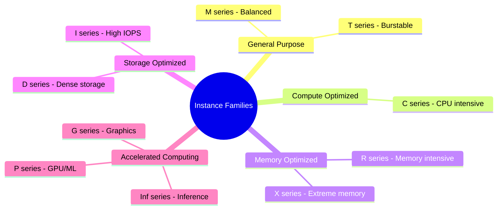
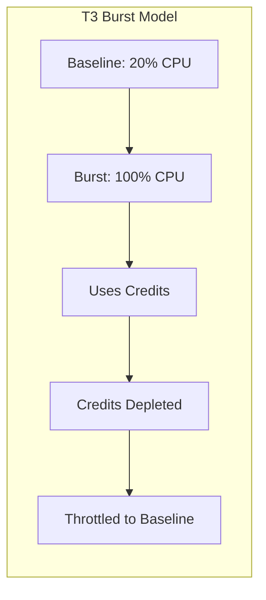
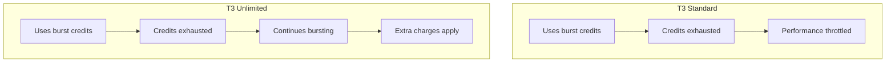
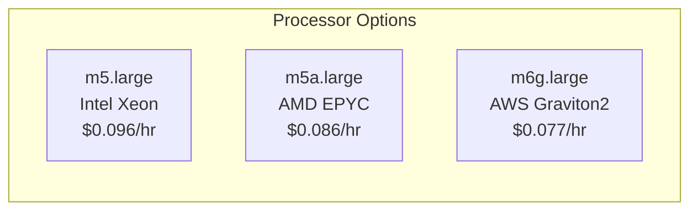
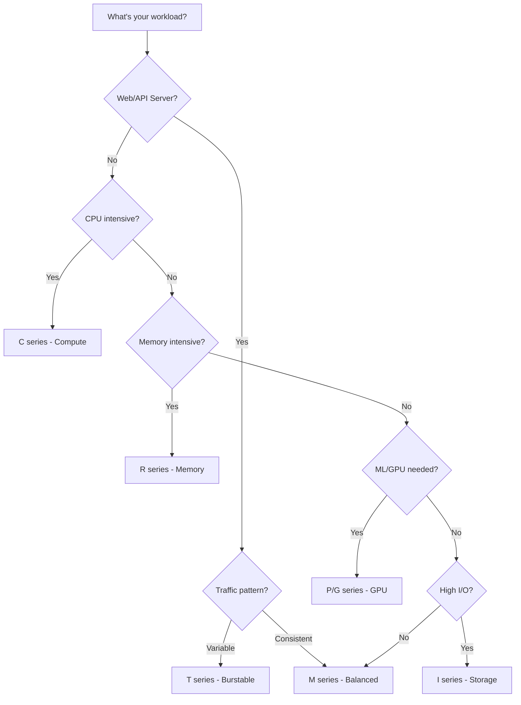

# Instance Types Deep Dive

## Alex's Instance Type Confusion

Alex looks at the EC2 instance type list and is overwhelmed:

```bash
$ aws ec2 describe-instance-types --query 'InstanceTypes[*].InstanceType' | wc -l
750  # Over 750 instance types!
```

"There are HOW many instance types?!" Alex exclaims. "How do I know which one to use?"

Sam explains: "It's actually logical once you understand the naming convention."

## Instance Type Naming Convention

```
m5.xlarge
│ │  │
│ │  └── Size (nano, micro, small, medium, large, xlarge, 2xlarge...)
│ └── Generation (higher = newer, usually better price/performance)
└── Family (m = general purpose)
```



## Instance Families



### General Purpose (T, M)

Balanced compute, memory, and networking.

**T Series (Burstable)**:
```
t3.micro:  2 vCPU,  1 GB RAM  - $0.0104/hr
t3.small:  2 vCPU,  2 GB RAM  - $0.0208/hr
t3.medium: 2 vCPU,  4 GB RAM  - $0.0416/hr
t3.large:  2 vCPU,  8 GB RAM  - $0.0832/hr
```

Use for: Development, small websites, microservices

**M Series (Balanced)**:
```
m5.large:   2 vCPU,   8 GB RAM  - $0.096/hr
m5.xlarge:  4 vCPU,  16 GB RAM  - $0.192/hr
m5.2xlarge: 8 vCPU,  32 GB RAM  - $0.384/hr
```

Use for: Production workloads, app servers, databases

### Compute Optimized (C)

High-performance processors.

```
c5.large:   2 vCPU,  4 GB RAM  - $0.085/hr
c5.xlarge:  4 vCPU,  8 GB RAM  - $0.170/hr
c5.2xlarge: 8 vCPU, 16 GB RAM  - $0.340/hr
```

Use for: Batch processing, gaming servers, scientific modeling, HPC

### Memory Optimized (R, X)

High memory-to-CPU ratio.

**R Series**:
```
r5.large:   2 vCPU,  16 GB RAM  - $0.126/hr
r5.xlarge:  4 vCPU,  32 GB RAM  - $0.252/hr
r5.2xlarge: 8 vCPU,  64 GB RAM  - $0.504/hr
```

**X Series (Extreme)**:
```
x1.16xlarge: 64 vCPU, 976 GB RAM - $6.669/hr
x1e.xlarge:   4 vCPU, 122 GB RAM - $0.834/hr
```

Use for: In-memory databases (Redis, Memcached), real-time analytics

### Storage Optimized (I, D)

High sequential read/write to local storage.

```
i3.large:   2 vCPU,  15 GB RAM, 475 GB NVMe  - $0.156/hr
d2.xlarge:  4 vCPU,  30 GB RAM,   6 TB HDD  - $0.690/hr
```

Use for: Data warehousing, distributed file systems, log processing

### Accelerated Computing (P, G, Inf)

Hardware accelerators (GPUs, FPGAs).

```
p3.2xlarge:  8 vCPU,  61 GB RAM, 1 V100 GPU  - $3.06/hr
g4dn.xlarge: 4 vCPU,  16 GB RAM, 1 T4 GPU   - $0.526/hr
inf1.xlarge: 4 vCPU,   8 GB RAM, 1 Inferentia - $0.228/hr
```

Use for: Machine learning training/inference, graphics rendering, video encoding

## Alex Finds the Right Instance

For the ML breed identifier, Alex analyzes requirements:

```markdown
## ML Inference Requirements

1. **Memory**: 500MB model + overhead = ~2GB minimum
2. **CPU**: Moderate - inference isn't super CPU intensive
3. **GPU**: Nice to have but not required
4. **Network**: Fast for image uploads/downloads
5. **Cost**: Reasonable for always-on service

Options:
- t3.medium: 4GB RAM, burstable - might throttle
- m5.large: 8GB RAM, consistent - good baseline
- g4dn.xlarge: 16GB + T4 GPU - if we need speed
```

### Testing Different Instances

Alex benchmarks the model on different instances:

```python
# benchmark.py
import time
import tensorflow as tf

model = tf.keras.models.load_model('breed_model.h5')

def benchmark(iterations=100):
    times = []
    for _ in range(iterations):
        start = time.time()
        # Simulate inference
        model.predict(dummy_image)
        times.append(time.time() - start)
    return {
        'avg': sum(times) / len(times),
        'p95': sorted(times)[int(0.95 * len(times))],
        'p99': sorted(times)[int(0.99 * len(times))]
    }
```

Results:

| Instance | Avg Inference | P95 | Cost/hr | Monthly Cost |
|----------|--------------|-----|---------|--------------|
| t3.medium | 450ms | 890ms* | $0.0416 | $30 |
| m5.large | 380ms | 420ms | $0.096 | $70 |
| c5.large | 320ms | 350ms | $0.085 | $62 |
| g4dn.xlarge | 45ms | 52ms | $0.526 | $380 |

*T3 throttled after burst credits exhausted

Alex decides: **c5.large** for best price/performance without GPU.

## T Series: Understanding Burst Credits

T series instances are "burstable" - they have baseline performance but can burst higher.



### CPU Credits

```bash
# Check CPU credit balance
aws cloudwatch get-metric-statistics \
    --namespace AWS/EC2 \
    --metric-name CPUCreditBalance \
    --dimensions Name=InstanceId,Value=i-1234567890abcdef0 \
    --start-time $(date -u -d '1 hour ago' +%Y-%m-%dT%H:%M:%SZ) \
    --end-time $(date -u +%Y-%m-%dT%H:%M:%SZ) \
    --period 300 \
    --statistics Average
```

### T3 vs T3 Unlimited



Alex's mistake: Using t3.medium for ML inference led to throttling!

```bash
# Enable unlimited mode
aws ec2 modify-instance-credit-specification \
    --instance-credit-specification "InstanceId=i-1234567890abcdef0,CpuCredits=unlimited"
```

## Instance Generations

Newer generations offer better price/performance:

```
m4.xlarge: 4 vCPU, 16 GB - $0.20/hr (older)
m5.xlarge: 4 vCPU, 16 GB - $0.192/hr (newer, faster)
m6i.xlarge: 4 vCPU, 16 GB - $0.192/hr (newest, even faster)
```

**Rule of thumb**: Always prefer the latest generation unless you need specific features.

## Processor Options

### Intel vs AMD vs Graviton



| Processor | Instance Suffix | Price | Notes |
|-----------|-----------------|-------|-------|
| Intel | (none) or `i` | Baseline | Most compatible |
| AMD | `a` | ~10% cheaper | Good compatibility |
| Graviton (ARM) | `g` | ~20% cheaper | ARM architecture |

**Graviton** is cheapest but requires ARM-compatible software.

## Choosing the Right Instance



## Exam Tips

**For DVA-C02:**

1. Know instance families: T (burst), M (general), C (compute), R (memory), P/G (GPU)
2. T series uses **CPU credits** for bursting
3. Graviton (ARM) instances are cheapest but need compatible software
4. Newer generations offer better price/performance
5. Instance types follow pattern: `family` + `generation` + `size`

**Common scenarios:**

> "Application needs consistent CPU performance..."
> → Use M series (not T series)

> "Reduce costs by 20% for Linux workloads..."
> → Consider Graviton instances

> "Machine learning training workload..."
> → P series with GPU

## Key Takeaways

1. **Instance naming**: family + generation + size (e.g., m5.xlarge)
2. **T series** = burstable, uses CPU credits
3. **M series** = general purpose, consistent performance
4. **C series** = compute optimized, CPU intensive
5. **R series** = memory optimized, large memory
6. **P/G series** = GPU for ML and graphics
7. **Graviton** = ARM-based, 20% cheaper
8. **Always test** your actual workload

---

*Next: Alex learns about AMIs and how to create custom images.*

---
*v2.0*
