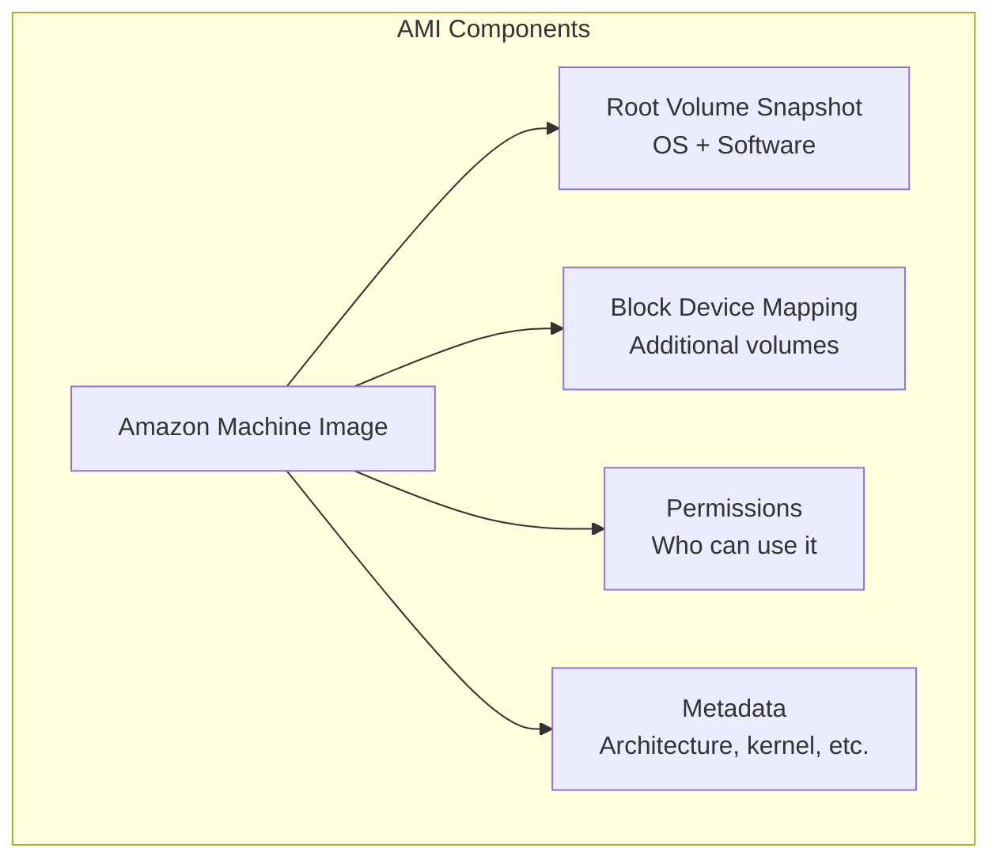
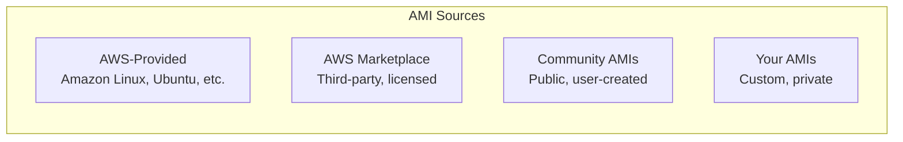
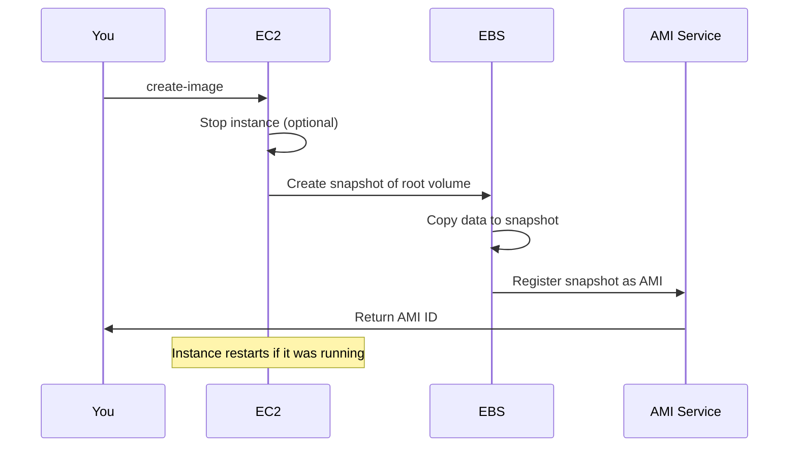
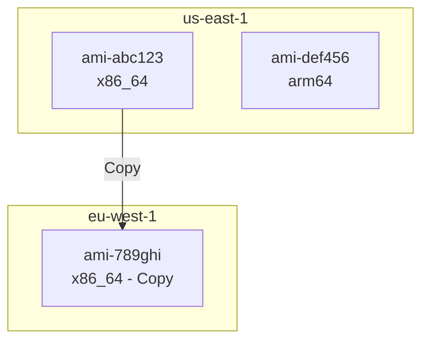
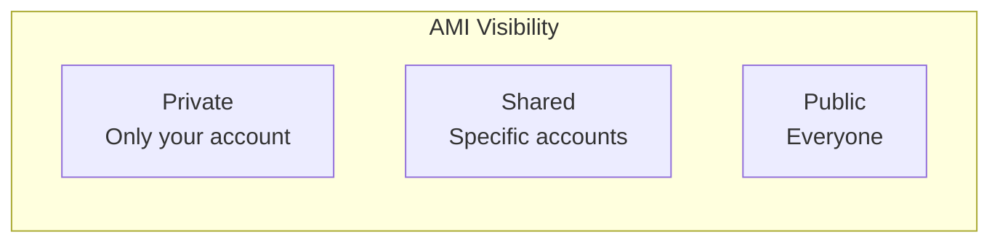
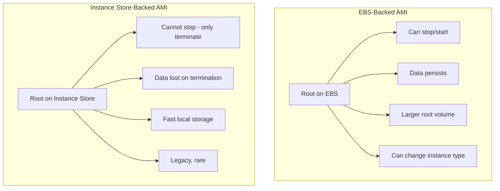
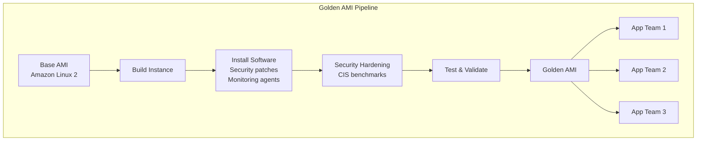

# Amazon Machine Images (AMIs)

## Alex's Custom Image Challenge

After benchmarking, Alex has the perfect EC2 setup:
- c5.large instance
- TensorFlow installed
- Model loaded and optimized
- All dependencies configured

But there's a problem: "If this instance dies, I have to spend 2 hours setting everything up again!"

Sam suggests: "Time to create an AMI. Think of it as a snapshot of your perfect setup."

## What is an AMI?

An Amazon Machine Image (AMI) is a template containing:
- Operating system
- Application software
- Configuration
- Data volumes



## AMI Types



### AWS-Provided AMIs

```bash
# Find Amazon Linux 2023 AMIs
aws ec2 describe-images \
    --owners amazon \
    --filters "Name=name,Values=al2023-ami-*-x86_64" \
    --query 'Images | sort_by(@, &CreationDate) | [-5:].{Name:Name,ID:ImageId,Date:CreationDate}' \
    --output table

# Find Ubuntu 22.04 AMIs
aws ec2 describe-images \
    --owners 099720109477 \
    --filters "Name=name,Values=ubuntu/images/hvm-ssd/ubuntu-jammy-22.04-amd64-server-*" \
    --query 'Images | sort_by(@, &CreationDate) | [-1].ImageId' \
    --output text
```

### AWS Marketplace AMIs

Pre-configured images with licensed software:

```bash
# Search marketplace for ML images
aws ec2 describe-images \
    --owners aws-marketplace \
    --filters "Name=name,Values=*tensorflow*" \
    --query 'Images[*].[Name,ImageId]' \
    --output table
```

**Note**: Marketplace AMIs may have additional hourly charges!

## Creating Your Own AMI

### Alex Creates a Custom AMI

```bash
# Step 1: Configure the instance perfectly
ssh -i pettracker-key.pem ec2-user@$INSTANCE_IP

# Install dependencies
sudo yum update -y
sudo yum install -y python3.9 python3.9-pip
pip3.9 install tensorflow numpy pillow flask gunicorn

# Copy and test the model
# ... setup work ...

# Step 2: Create the AMI (from your local machine)
aws ec2 create-image \
    --instance-id i-1234567890abcdef0 \
    --name "pettracker-ml-v1.0" \
    --description "PetTracker ML inference server with TensorFlow" \
    --tag-specifications 'ResourceType=image,Tags=[{Key=Project,Value=PetTracker},{Key=Version,Value=1.0}]'

# Output: ami-0abc123def456789
```

### AMI Creation Process



### No-Reboot Option

```bash
# Create AMI without stopping instance
# Warning: File system may not be consistent!
aws ec2 create-image \
    --instance-id i-1234567890abcdef0 \
    --name "pettracker-ml-v1.1" \
    --no-reboot

# Safer: Stop applications first, then no-reboot
ssh ec2-user@$INSTANCE_IP "sudo systemctl stop pettracker-ml"
aws ec2 create-image --instance-id $INSTANCE_ID --name "pettracker-ml-v1.1" --no-reboot
ssh ec2-user@$INSTANCE_IP "sudo systemctl start pettracker-ml"
```

## AMI Architecture

AMIs are region-specific and architecture-specific:



### Copying AMIs Between Regions

```bash
# Copy AMI to another region
aws ec2 copy-image \
    --source-region us-east-1 \
    --source-image-id ami-abc123def456789 \
    --name "pettracker-ml-v1.0" \
    --region eu-west-1

# Copy with encryption
aws ec2 copy-image \
    --source-region us-east-1 \
    --source-image-id ami-abc123def456789 \
    --name "pettracker-ml-v1.0-encrypted" \
    --region eu-west-1 \
    --encrypted \
    --kms-key-id alias/pettracker-key
```

## AMI Permissions



### Sharing AMIs

```bash
# Share with specific account
aws ec2 modify-image-attribute \
    --image-id ami-abc123def456789 \
    --launch-permission "Add=[{UserId=123456789012}]"

# Make public (be careful!)
aws ec2 modify-image-attribute \
    --image-id ami-abc123def456789 \
    --launch-permission "Add=[{Group=all}]"

# Check current permissions
aws ec2 describe-image-attribute \
    --image-id ami-abc123def456789 \
    --attribute launchPermission
```

## Alex's AMI Strategy

Alex creates a versioned AMI pipeline:

```bash
#!/bin/bash
# build-ami.sh

VERSION=$(date +%Y%m%d-%H%M%S)
INSTANCE_ID="i-1234567890abcdef0"

# Create AMI with version
AMI_ID=$(aws ec2 create-image \
    --instance-id $INSTANCE_ID \
    --name "pettracker-ml-${VERSION}" \
    --description "Auto-generated AMI" \
    --query 'ImageId' \
    --output text)

echo "Created AMI: $AMI_ID"

# Wait for AMI to be available
aws ec2 wait image-available --image-ids $AMI_ID

# Tag with version
aws ec2 create-tags \
    --resources $AMI_ID \
    --tags Key=Version,Value=$VERSION Key=Latest,Value=true

# Remove "Latest" tag from old AMIs
OLD_AMIS=$(aws ec2 describe-images \
    --owners self \
    --filters "Name=tag:Latest,Values=true" \
    --query "Images[?ImageId!='${AMI_ID}'].ImageId" \
    --output text)

for old in $OLD_AMIS; do
    aws ec2 delete-tags --resources $old --tags Key=Latest
done
```

## EBS-Backed vs Instance Store-Backed



Almost all modern AMIs are EBS-backed. Instance store-backed AMIs are legacy.

## AMI Lifecycle Management

Alex sets up automatic cleanup:

```python
# cleanup_old_amis.py
import boto3
from datetime import datetime, timedelta

ec2 = boto3.client('ec2')

# Find AMIs older than 30 days
thirty_days_ago = datetime.now() - timedelta(days=30)

response = ec2.describe_images(
    Owners=['self'],
    Filters=[
        {'Name': 'tag:Project', 'Values': ['PetTracker']},
        {'Name': 'tag:Latest', 'Values': ['false', '']}  # Not the latest
    ]
)

for image in response['Images']:
    creation_date = datetime.strptime(
        image['CreationDate'],
        '%Y-%m-%dT%H:%M:%S.%fZ'
    )

    if creation_date < thirty_days_ago:
        print(f"Deregistering old AMI: {image['ImageId']}")

        # Deregister the AMI
        ec2.deregister_image(ImageId=image['ImageId'])

        # Delete associated snapshots
        for device in image['BlockDeviceMappings']:
            if 'Ebs' in device:
                snapshot_id = device['Ebs']['SnapshotId']
                print(f"Deleting snapshot: {snapshot_id}")
                ec2.delete_snapshot(SnapshotId=snapshot_id)
```

## Golden AMI Pattern



A "Golden AMI" is a standardized, hardened base image that teams use as their starting point.

## Exam Tips

**For DVA-C02:**

1. **AMIs are region-specific** - must copy to use in other regions
2. **EBS-backed AMIs** can be stopped/started; instance store cannot
3. **Create AMI** takes a snapshot of all EBS volumes
4. **No-reboot** option may cause inconsistent state
5. **Encryption**: Can encrypt during copy, not original creation

**Common scenarios:**

> "Need to launch same configuration in multiple regions..."
> → Copy AMI to target regions

> "AMI creation is taking too long..."
> → Instance is running; use no-reboot (with caution)

> "Need to encrypt an unencrypted AMI..."
> → Copy the AMI with encryption enabled

> "Reduce AMI costs..."
> → Deregister old AMIs AND delete associated snapshots

## Key Takeaways

1. **AMIs are templates** for launching EC2 instances
2. **Create custom AMIs** to capture your configured environment
3. **AMIs are regional** - copy to use in other regions
4. **EBS-backed AMIs** are the modern standard
5. **Golden AMI pattern** ensures consistency across teams
6. **Clean up old AMIs** and their snapshots to save costs
7. **Use versioning** to track AMI changes

---

*Next: Alex launches instances using the custom AMI and learns about launch templates.*
