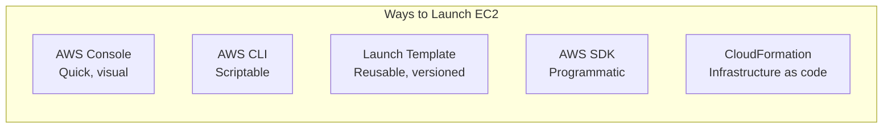
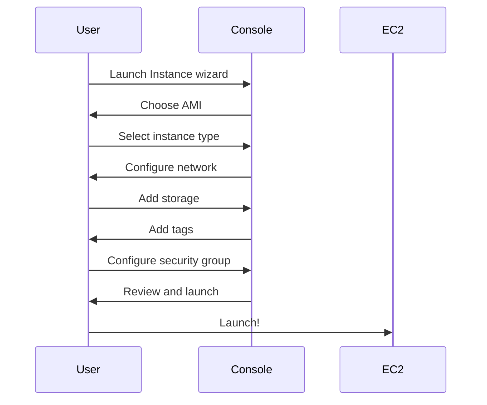
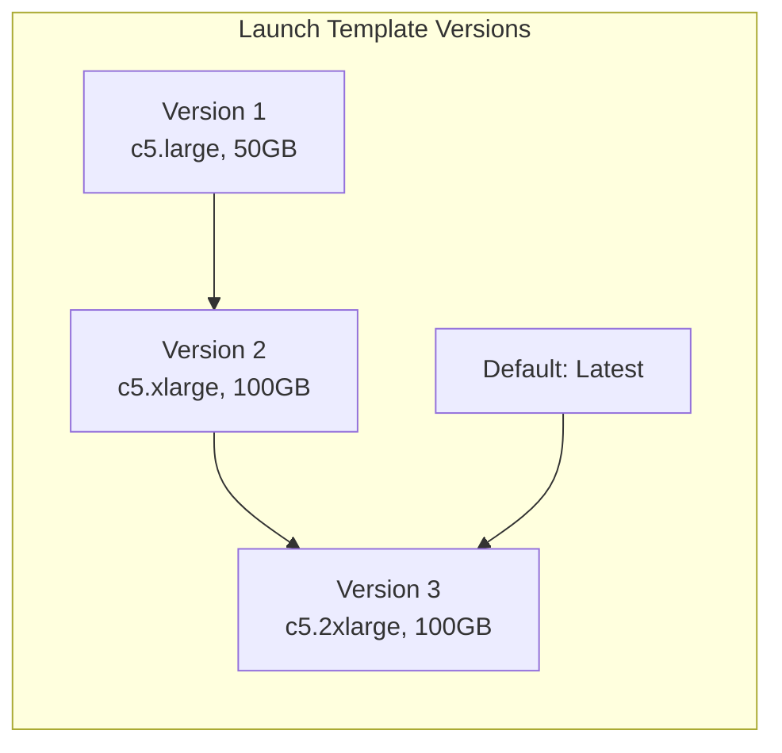
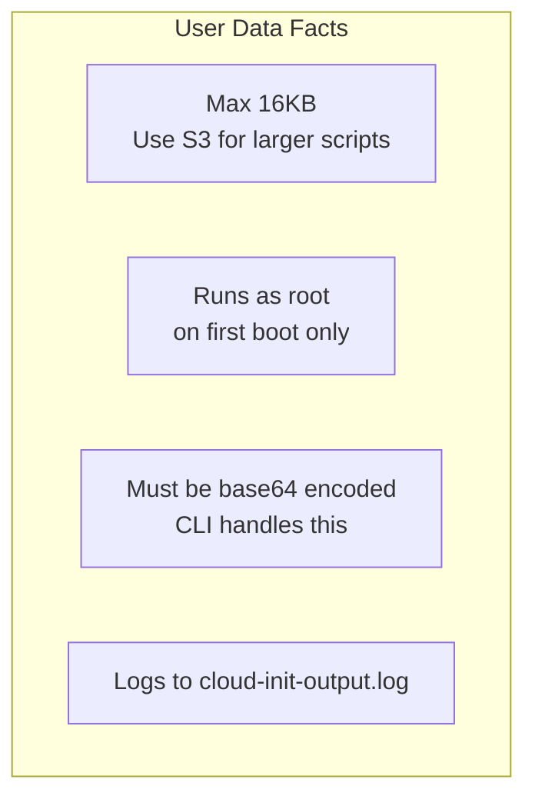
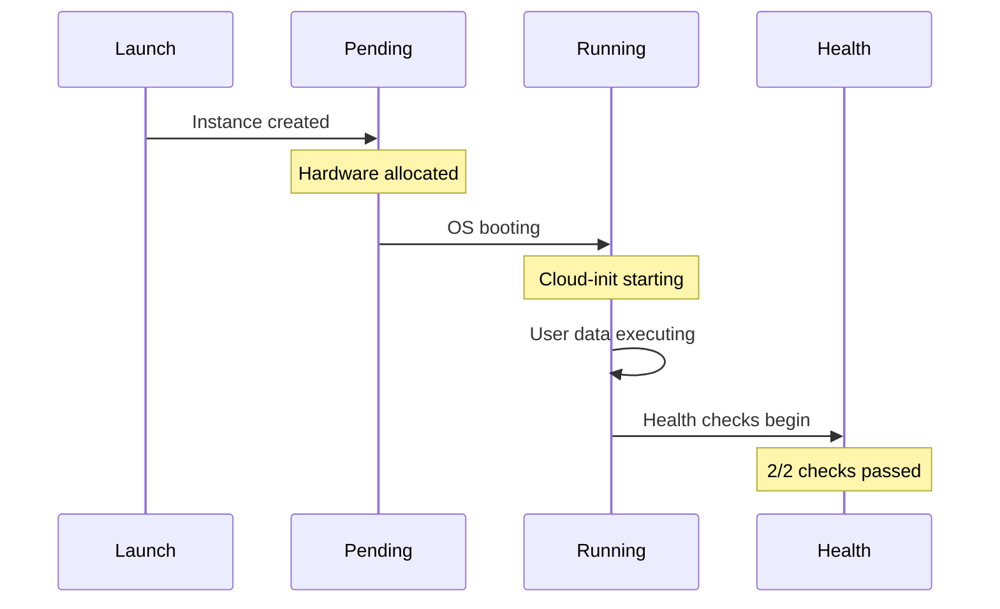
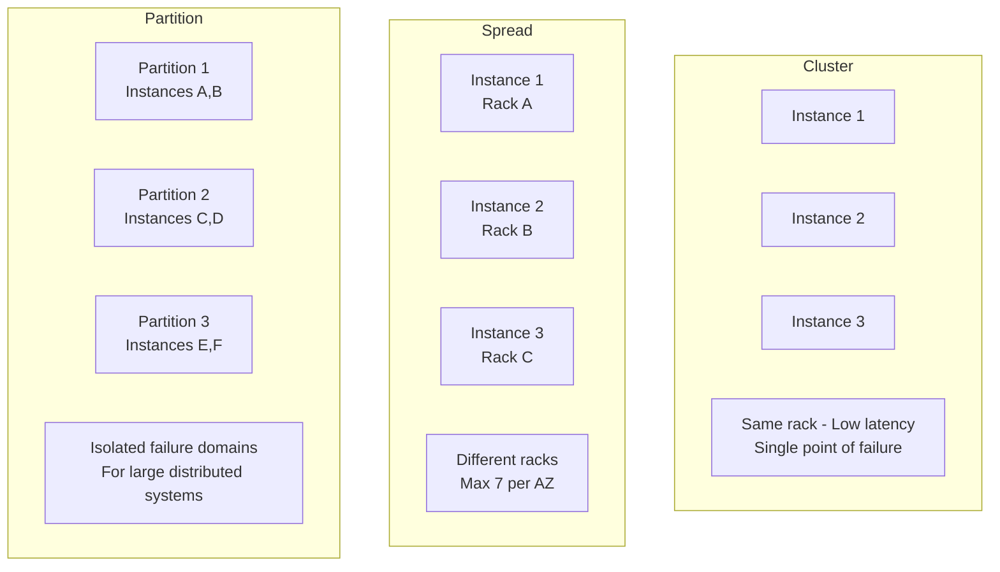

# Launching Your First Instance

## Alex's Launch Configuration

Alex is ready to launch the ML inference server using the custom AMI. But Sam warns: "Don't just click 'Launch'. Let's do this properly with a launch template."

## Launch Methods



## Console Launch: Quick but Not Repeatable

Alex starts with the console to understand the process:



## CLI Launch: Scriptable

```bash
# Basic launch command
aws ec2 run-instances \
    --image-id ami-0abc123def456789 \
    --instance-type c5.large \
    --key-name pettracker-key \
    --security-group-ids sg-0123456789abcdef0 \
    --subnet-id subnet-0123456789abcdef0 \
    --count 1

# Full production launch
aws ec2 run-instances \
    --image-id ami-0abc123def456789 \
    --instance-type c5.large \
    --key-name pettracker-key \
    --security-group-ids sg-0123456789abcdef0 \
    --subnet-id subnet-0123456789abcdef0 \
    --iam-instance-profile Name=PetTrackerML-Role \
    --monitoring Enabled=true \
    --ebs-optimized \
    --block-device-mappings '[
        {
            "DeviceName": "/dev/xvda",
            "Ebs": {
                "VolumeSize": 50,
                "VolumeType": "gp3",
                "DeleteOnTermination": true,
                "Encrypted": true
            }
        }
    ]' \
    --tag-specifications 'ResourceType=instance,Tags=[
        {Key=Name,Value=pettracker-ml-prod},
        {Key=Environment,Value=production},
        {Key=Project,Value=PetTracker}
    ]' \
    --user-data file://startup-script.sh
```

## Launch Templates: The Professional Way

Launch templates are reusable, versioned configurations:

```bash
# Create a launch template
aws ec2 create-launch-template \
    --launch-template-name pettracker-ml-template \
    --version-description "Initial ML server template" \
    --launch-template-data '{
        "ImageId": "ami-0abc123def456789",
        "InstanceType": "c5.large",
        "KeyName": "pettracker-key",
        "SecurityGroupIds": ["sg-0123456789abcdef0"],
        "IamInstanceProfile": {
            "Name": "PetTrackerML-Role"
        },
        "BlockDeviceMappings": [
            {
                "DeviceName": "/dev/xvda",
                "Ebs": {
                    "VolumeSize": 50,
                    "VolumeType": "gp3",
                    "Encrypted": true
                }
            }
        ],
        "Monitoring": {
            "Enabled": true
        },
        "TagSpecifications": [
            {
                "ResourceType": "instance",
                "Tags": [
                    {"Key": "Name", "Value": "pettracker-ml"},
                    {"Key": "Project", "Value": "PetTracker"}
                ]
            }
        ],
        "UserData": "BASE64_ENCODED_SCRIPT"
    }'
```

### Launch Template Versions



```bash
# Create new version
aws ec2 create-launch-template-version \
    --launch-template-name pettracker-ml-template \
    --source-version 1 \
    --version-description "Increased CPU for batch processing" \
    --launch-template-data '{
        "InstanceType": "c5.xlarge"
    }'

# Set default version
aws ec2 modify-launch-template \
    --launch-template-name pettracker-ml-template \
    --default-version 2

# Launch from template
aws ec2 run-instances \
    --launch-template LaunchTemplateName=pettracker-ml-template,Version=2
```

## User Data Scripts

User data runs on first boot to configure the instance:

```bash
#!/bin/bash
# startup-script.sh

# Update system
yum update -y

# Install CloudWatch agent
yum install -y amazon-cloudwatch-agent
/opt/aws/amazon-cloudwatch-agent/bin/amazon-cloudwatch-agent-ctl \
    -a fetch-config \
    -m ec2 \
    -s \
    -c ssm:AmazonCloudWatch-PetTracker

# Start ML service
systemctl enable pettracker-ml
systemctl start pettracker-ml

# Signal completion
/opt/aws/bin/cfn-signal -e $? --stack ${AWS::StackName} --resource MLInstance --region ${AWS::Region}
```

### User Data Debugging

```bash
# User data logs location
/var/log/cloud-init.log
/var/log/cloud-init-output.log

# Check user data was received
curl http://169.254.169.254/latest/user-data

# Re-run user data (for debugging)
# User data only runs on FIRST boot by default
# To re-run, you must explicitly configure it
```

### User Data Limitations



## Alex's Production Launch Script

```bash
#!/bin/bash
# launch-ml-server.sh

set -e

ENVIRONMENT=${1:-staging}
INSTANCE_TYPE=${2:-c5.large}

echo "Launching PetTracker ML server..."
echo "Environment: $ENVIRONMENT"
echo "Instance Type: $INSTANCE_TYPE"

# Get latest AMI
AMI_ID=$(aws ec2 describe-images \
    --owners self \
    --filters "Name=tag:Project,Values=PetTracker" \
              "Name=tag:Latest,Values=true" \
    --query 'Images[0].ImageId' \
    --output text)

echo "Using AMI: $AMI_ID"

# Get subnet based on environment
if [ "$ENVIRONMENT" == "production" ]; then
    SUBNET_ID="subnet-prod123"
    SG_ID="sg-prod456"
else
    SUBNET_ID="subnet-staging789"
    SG_ID="sg-staging012"
fi

# Launch instance
INSTANCE_ID=$(aws ec2 run-instances \
    --image-id $AMI_ID \
    --instance-type $INSTANCE_TYPE \
    --key-name pettracker-key \
    --security-group-ids $SG_ID \
    --subnet-id $SUBNET_ID \
    --iam-instance-profile Name=PetTrackerML-Role \
    --tag-specifications "ResourceType=instance,Tags=[
        {Key=Name,Value=pettracker-ml-${ENVIRONMENT}},
        {Key=Environment,Value=${ENVIRONMENT}},
        {Key=Project,Value=PetTracker}
    ]" \
    --query 'Instances[0].InstanceId' \
    --output text)

echo "Launched instance: $INSTANCE_ID"

# Wait for instance to be running
echo "Waiting for instance to be running..."
aws ec2 wait instance-running --instance-ids $INSTANCE_ID

# Get public IP
PUBLIC_IP=$(aws ec2 describe-instances \
    --instance-ids $INSTANCE_ID \
    --query 'Reservations[0].Instances[0].PublicIpAddress' \
    --output text)

echo "Instance is running!"
echo "Public IP: $PUBLIC_IP"
echo "SSH: ssh -i pettracker-key.pem ec2-user@$PUBLIC_IP"
```

## Instance Initialization



### Initialization States

| Phase | Duration | What's Happening |
|-------|----------|------------------|
| Pending | ~30s | Hardware allocation |
| Running | ~60s | OS boot |
| User Data | Varies | Your scripts running |
| Healthy | ~30s | Status checks passing |

## Placement Groups

Control how instances are placed on hardware:



```bash
# Create placement group
aws ec2 create-placement-group \
    --group-name pettracker-cluster \
    --strategy cluster

# Launch into placement group
aws ec2 run-instances \
    --image-id ami-abc123 \
    --instance-type c5.xlarge \
    --placement GroupName=pettracker-cluster \
    --count 3
```

## Capacity Reservations

Guarantee instance availability:

```bash
# Create capacity reservation
aws ec2 create-capacity-reservation \
    --instance-type c5.large \
    --instance-platform Linux/UNIX \
    --availability-zone us-east-1a \
    --instance-count 2 \
    --end-date-type unlimited

# Launch with capacity reservation
aws ec2 run-instances \
    --image-id ami-abc123 \
    --instance-type c5.large \
    --capacity-reservation-specification \
        CapacityReservationTarget={CapacityReservationId=cr-abc123}
```

## Alex's Launch Checklist

Before launching production instances:

```markdown
## Pre-Launch Checklist

### AMI
- [ ] Using tested, versioned AMI
- [ ] AMI available in target region
- [ ] Security patches included

### Network
- [ ] Correct VPC and subnet
- [ ] Security groups reviewed
- [ ] Elastic IP if needed

### Security
- [ ] Key pair created and stored securely
- [ ] IAM role with least privilege
- [ ] Encryption enabled on EBS

### Configuration
- [ ] Instance type appropriate for workload
- [ ] User data script tested
- [ ] Tags applied for cost tracking

### Monitoring
- [ ] CloudWatch monitoring enabled
- [ ] Alarms configured
- [ ] Logs shipping to CloudWatch

### Backup
- [ ] EBS snapshots scheduled
- [ ] AMI backup plan in place
```

## Exam Tips

**For DVA-C02:**

1. **Launch templates** are versioned and preferred over launch configurations
2. **User data** runs only on first boot (by default)
3. **User data limit** is 16KB
4. **Placement groups**: Cluster (low latency), Spread (HA), Partition (big data)
5. **run-instances** returns immediately; use `wait` for status

**Common scenarios:**

> "Ensure consistent instance configuration across team..."
> → Use launch templates

> "Need instances to communicate with lowest latency..."
> → Cluster placement group

> "Critical instances must not share hardware..."
> → Spread placement group

> "Configure instance on first boot..."
> → User data script

## Key Takeaways

1. **Launch templates** provide reusable, versioned configurations
2. **User data** automates instance configuration on first boot
3. **Placement groups** control physical placement for performance or HA
4. **Capacity reservations** guarantee availability
5. **Always tag instances** for management and cost tracking
6. **Use scripts** to make launches repeatable

---

*Next: Alex configures security groups to control network access.*

---
*v1.0*
