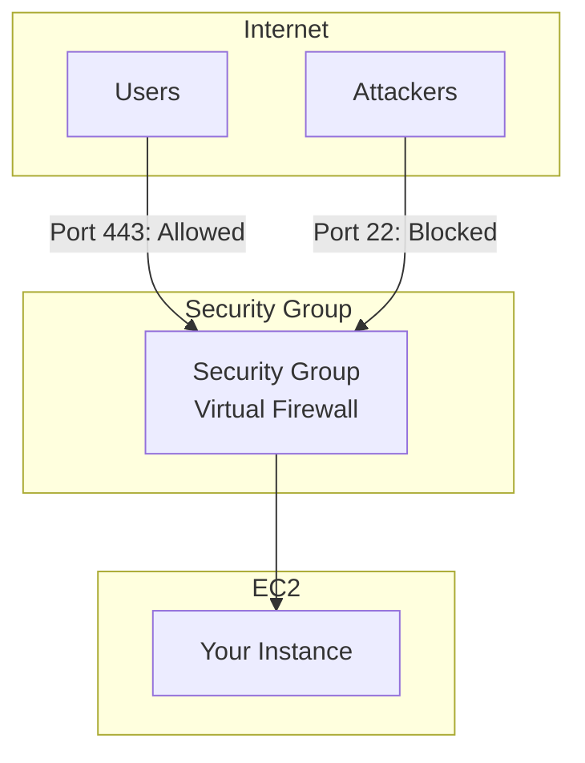
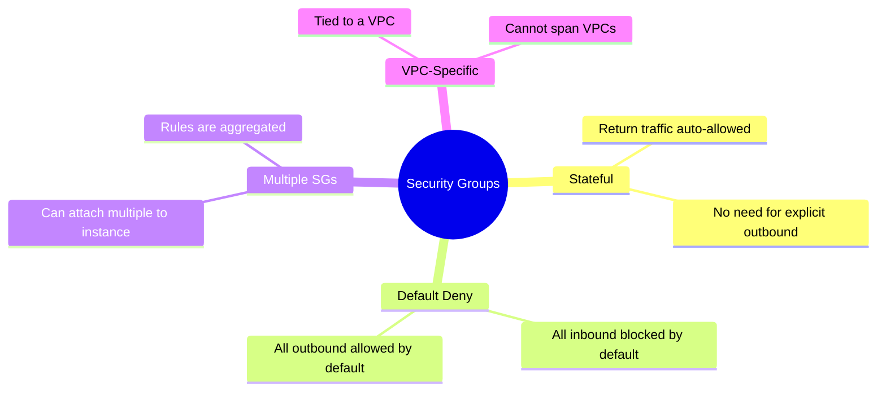
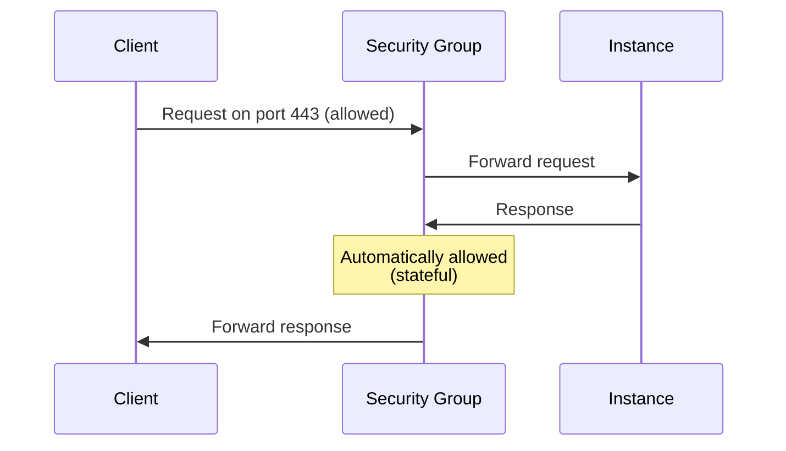
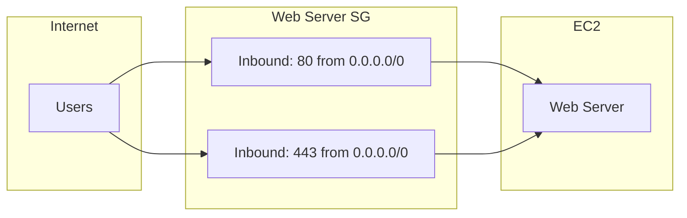
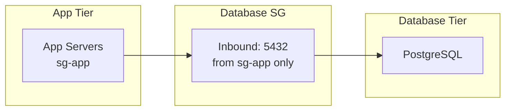
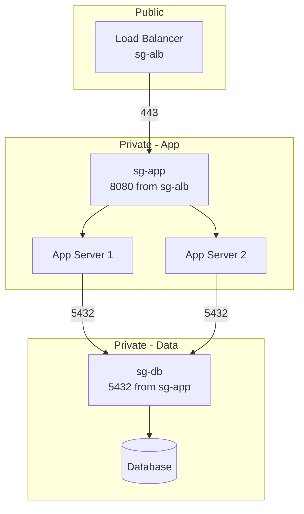
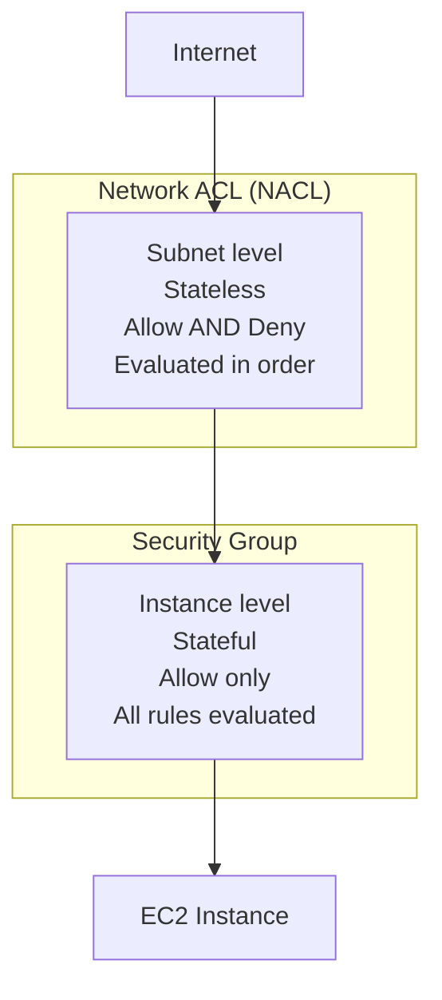

# Security Groups

## Alex's Security Incident

Alex launches the ML server and everything works. Then one morning:

```bash
# Alex checks the server logs
[ec2-user@ip-172-31-45-67 ~]$ sudo tail -f /var/log/secure

sshd: Failed password for invalid user admin from 45.xxx.xxx.xxx
sshd: Failed password for invalid user admin from 45.xxx.xxx.xxx
sshd: Failed password for root from 91.xxx.xxx.xxx
sshd: Failed password for invalid user test from 103.xxx.xxx.xxx
# Thousands of failed attempts!
```

Alex panics: "Someone is trying to break in!"

Sam reviews the security group:

```bash
aws ec2 describe-security-groups --group-ids sg-0123456789abcdef0

# Output shows:
# Inbound: SSH (22) from 0.0.0.0/0  ← PROBLEM!
```

"You opened SSH to the entire internet," Sam says. "Let's fix this and learn about security groups properly."

## What is a Security Group?

A security group is a **virtual firewall** that controls inbound and outbound traffic to your EC2 instances.



## Security Group Characteristics



### Stateful Nature



**Stateful** means: If inbound traffic is allowed, the response is automatically allowed out (and vice versa).

## Creating Security Groups

```bash
# Create a security group
aws ec2 create-security-group \
    --group-name pettracker-ml-sg \
    --description "Security group for PetTracker ML servers" \
    --vpc-id vpc-0123456789abcdef0

# Output: sg-0987654321fedcba0
```

## Inbound Rules

```bash
# Allow HTTPS from anywhere (web traffic)
aws ec2 authorize-security-group-ingress \
    --group-id sg-0987654321fedcba0 \
    --protocol tcp \
    --port 443 \
    --cidr 0.0.0.0/0

# Allow SSH from specific IP only
aws ec2 authorize-security-group-ingress \
    --group-id sg-0987654321fedcba0 \
    --protocol tcp \
    --port 22 \
    --cidr 203.0.113.50/32  # Alex's office IP

# Allow HTTP for health checks from ALB
aws ec2 authorize-security-group-ingress \
    --group-id sg-0987654321fedcba0 \
    --protocol tcp \
    --port 8080 \
    --source-group sg-alb123456  # ALB security group
```

### Rule Components

| Component | Description | Example |
|-----------|-------------|---------|
| Protocol | TCP, UDP, ICMP, or All | TCP |
| Port Range | Single port or range | 443 or 1024-65535 |
| Source/Dest | CIDR, SG, or Prefix List | 10.0.0.0/8 |
| Description | What this rule is for | "HTTPS from internet" |

## Common Patterns

### Web Server Pattern



```bash
# Web server security group
aws ec2 authorize-security-group-ingress \
    --group-id sg-web123 \
    --ip-permissions \
        IpProtocol=tcp,FromPort=80,ToPort=80,IpRanges='[{CidrIp=0.0.0.0/0,Description="HTTP"}]' \
        IpProtocol=tcp,FromPort=443,ToPort=443,IpRanges='[{CidrIp=0.0.0.0/0,Description="HTTPS"}]'
```

### Database Pattern



```bash
# Database security group - only allow app tier
aws ec2 authorize-security-group-ingress \
    --group-id sg-db456 \
    --protocol tcp \
    --port 5432 \
    --source-group sg-app123
```

### Multi-Tier Architecture



## Alex Fixes the Security Group

```bash
# Remove the dangerous rule
aws ec2 revoke-security-group-ingress \
    --group-id sg-0123456789abcdef0 \
    --protocol tcp \
    --port 22 \
    --cidr 0.0.0.0/0

# Add restricted SSH access
aws ec2 authorize-security-group-ingress \
    --group-id sg-0123456789abcdef0 \
    --protocol tcp \
    --port 22 \
    --cidr 203.0.113.50/32 \
    --tag-specifications 'ResourceType=security-group-rule,Tags=[{Key=Description,Value="SSH from Alex office"}]'

# Even better: Use a bastion host or Session Manager
# No SSH needed at all!
```

## Outbound Rules

By default, all outbound traffic is allowed. You can restrict it:

```bash
# Remove default "allow all" outbound
aws ec2 revoke-security-group-egress \
    --group-id sg-0987654321fedcba0 \
    --protocol all \
    --cidr 0.0.0.0/0

# Allow only specific outbound
aws ec2 authorize-security-group-egress \
    --group-id sg-0987654321fedcba0 \
    --protocol tcp \
    --port 443 \
    --cidr 0.0.0.0/0  # HTTPS to internet

aws ec2 authorize-security-group-egress \
    --group-id sg-0987654321fedcba0 \
    --protocol tcp \
    --port 5432 \
    --source-group sg-db456  # PostgreSQL to DB
```

## Security Group Rules Table

Alex's final ML server security group:

| Type | Protocol | Port | Source | Description |
|------|----------|------|--------|-------------|
| Inbound | TCP | 443 | 0.0.0.0/0 | HTTPS API |
| Inbound | TCP | 8080 | sg-alb | Health checks from ALB |
| Inbound | TCP | 22 | sg-bastion | SSH from bastion only |
| Outbound | TCP | 443 | 0.0.0.0/0 | HTTPS to internet |
| Outbound | TCP | 5432 | sg-db | Database access |

## Security Groups vs NACLs



| Feature | Security Group | NACL |
|---------|---------------|------|
| Level | Instance | Subnet |
| State | Stateful | Stateless |
| Rules | Allow only | Allow and Deny |
| Evaluation | All rules | In order (numbered) |
| Default | Deny all in, allow all out | Allow all |

## Best Practices

### 1. Principle of Least Privilege

```bash
# BAD: Allow all traffic
--cidr 0.0.0.0/0 --protocol all

# GOOD: Specific port, specific source
--cidr 10.0.1.0/24 --protocol tcp --port 8080
```

### 2. Use Security Group References

```bash
# BAD: Hardcode IP ranges
--cidr 10.0.1.50/32
--cidr 10.0.1.51/32
--cidr 10.0.1.52/32

# GOOD: Reference the source security group
--source-group sg-app123
```

### 3. Use Descriptive Names and Tags

```bash
aws ec2 create-security-group \
    --group-name "pettracker-ml-prod-sg" \
    --description "Production ML inference servers - allows HTTPS and ALB health checks" \
    --tag-specifications 'ResourceType=security-group,Tags=[
        {Key=Environment,Value=production},
        {Key=Project,Value=PetTracker},
        {Key=Team,Value=ML}
    ]'
```

### 4. Regular Audits

```bash
# Find security groups with 0.0.0.0/0 access
aws ec2 describe-security-groups \
    --query 'SecurityGroups[?IpPermissions[?IpRanges[?CidrIp==`0.0.0.0/0`]]].{
        Name:GroupName,
        ID:GroupId,
        OpenPorts:IpPermissions[?IpRanges[?CidrIp==`0.0.0.0/0`]].FromPort
    }'
```

## Modifying Security Groups

Changes take effect immediately:

```bash
# Add a rule
aws ec2 authorize-security-group-ingress \
    --group-id sg-123456 \
    --protocol tcp \
    --port 8443 \
    --cidr 10.0.0.0/8

# Remove a rule
aws ec2 revoke-security-group-ingress \
    --group-id sg-123456 \
    --protocol tcp \
    --port 8443 \
    --cidr 10.0.0.0/8

# Note: Changes apply to ALL instances using this SG
```

## Exam Tips

**For DVA-C02:**

1. **Security groups are stateful** - return traffic is automatic
2. **Default**: All inbound denied, all outbound allowed
3. **Can reference other security groups** - better than CIDR
4. **Changes take effect immediately**
5. **Can attach multiple SGs** to one instance

**Common scenarios:**

> "Instances can't communicate with each other..."
> → Check security group allows traffic from itself

> "Database accessible from internet..."
> → Security group too permissive; restrict source

> "Need to allow response traffic..."
> → Already allowed (stateful) - no action needed

> "Allow app tier to database..."
> → Use security group reference, not IP

## Key Takeaways

1. **Security groups are virtual firewalls** at the instance level
2. **Stateful** = return traffic automatically allowed
3. **Default deny inbound**, default allow outbound
4. **Use SG references** instead of IP addresses when possible
5. **Apply least privilege** - only open what's needed
6. **Changes are immediate** and affect all attached instances
7. **Audit regularly** for overly permissive rules

---

*Next: Alex learns about key pairs and SSH access management.*
