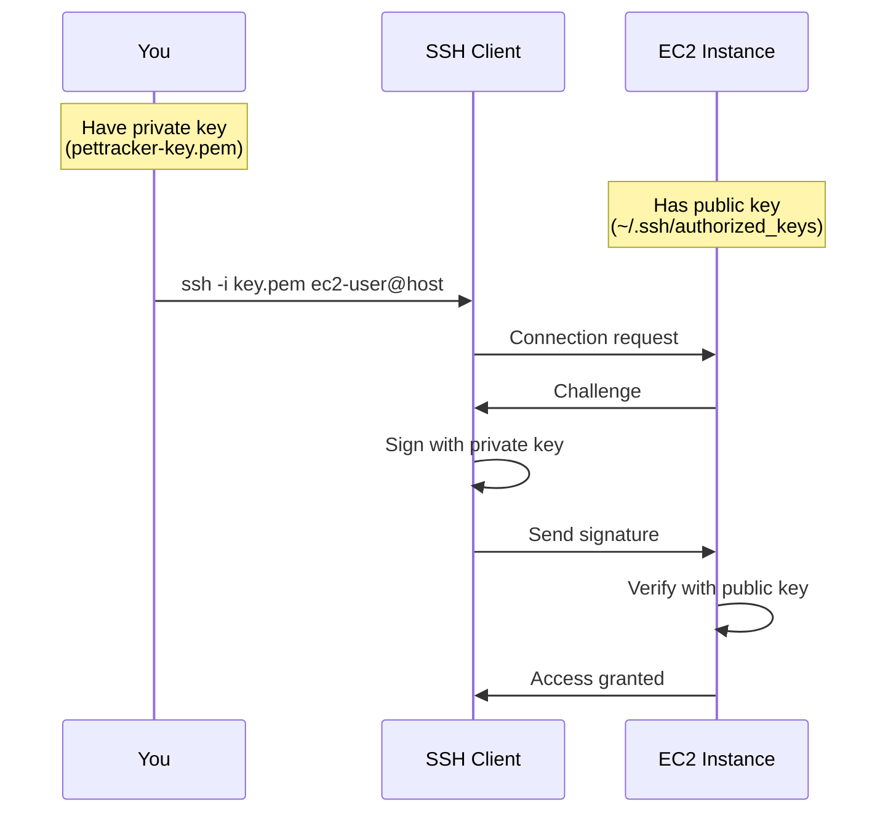
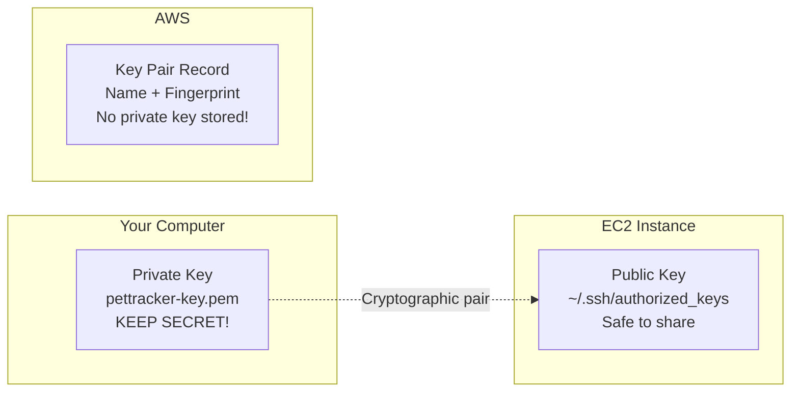
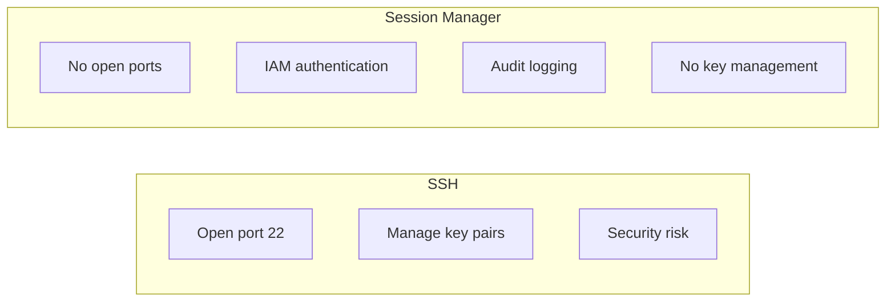

# Key Pairs and SSH Access

## Alex's Key Management Crisis

Alex has been happily SSHing into the ML server. Then disaster strikes:

```bash
$ ssh -i pettracker-key.pem ec2-user@54.123.45.67
@@@@@@@@@@@@@@@@@@@@@@@@@@@@@@@@@@@@@@@@@@@@@@@@@@@@@@@@@@@
@         WARNING: UNPROTECTED PRIVATE KEY FILE!          @
@@@@@@@@@@@@@@@@@@@@@@@@@@@@@@@@@@@@@@@@@@@@@@@@@@@@@@@@@@@
Permissions 0644 for 'pettracker-key.pem' are too open.
```

And then:

```bash
# After accidentally deleting the key
$ ls pettracker-key.pem
ls: cannot access 'pettracker-key.pem': No such file or directory

# Trying to download from AWS
$ aws ec2 describe-key-pairs --key-names pettracker-key
# Only shows fingerprint - private key CANNOT be recovered!
```

Alex is locked out. "How do I get back in?!"

## How SSH Key Pairs Work



### Key Components



## Creating Key Pairs

### Method 1: AWS Creates the Key

```bash
# Create key pair - AWS generates both keys
aws ec2 create-key-pair \
    --key-name pettracker-prod \
    --key-type rsa \
    --query 'KeyMaterial' \
    --output text > pettracker-prod.pem

# Set permissions
chmod 400 pettracker-prod.pem

# THIS IS YOUR ONLY CHANCE TO SAVE THE PRIVATE KEY!
```

### Method 2: Import Your Own Key

```bash
# Generate key pair locally
ssh-keygen -t rsa -b 4096 -f pettracker-prod -C "pettracker-prod-key"

# Import public key to AWS
aws ec2 import-key-pair \
    --key-name pettracker-prod \
    --public-key-material fileb://pettracker-prod.pub

# You keep both keys locally
```

### Key Types

| Type | Security | Compatibility |
|------|----------|---------------|
| RSA (2048) | Good | Best compatibility |
| RSA (4096) | Better | Good compatibility |
| ED25519 | Best | Modern systems only |

```bash
# Create ED25519 key (recommended for new projects)
aws ec2 create-key-pair \
    --key-name pettracker-ed25519 \
    --key-type ed25519 \
    --query 'KeyMaterial' \
    --output text > pettracker-ed25519.pem
```

## SSH Connection

```bash
# Basic connection
ssh -i pettracker-key.pem ec2-user@54.123.45.67

# With verbose output (debugging)
ssh -vvv -i pettracker-key.pem ec2-user@54.123.45.67

# Specify port (if not 22)
ssh -i pettracker-key.pem -p 2222 ec2-user@54.123.45.67

# Execute command without interactive session
ssh -i pettracker-key.pem ec2-user@54.123.45.67 "uname -a"
```

### Default Users by AMI

| AMI | Default User |
|-----|--------------|
| Amazon Linux 2/2023 | ec2-user |
| Ubuntu | ubuntu |
| Debian | admin |
| RHEL | ec2-user or root |
| CentOS | centos or ec2-user |
| SUSE | ec2-user |
| Windows | Administrator (RDP) |

## SSH Config File

Make connections easier with `~/.ssh/config`:

```bash
# ~/.ssh/config
Host pettracker-ml
    HostName 54.123.45.67
    User ec2-user
    IdentityFile ~/.ssh/pettracker-key.pem
    StrictHostKeyChecking no

Host pettracker-bastion
    HostName 54.123.45.68
    User ec2-user
    IdentityFile ~/.ssh/pettracker-key.pem

Host pettracker-db
    HostName 10.0.2.50
    User ec2-user
    IdentityFile ~/.ssh/pettracker-key.pem
    ProxyJump pettracker-bastion
```

```bash
# Now you can just use:
ssh pettracker-ml
ssh pettracker-db  # Goes through bastion automatically
```

## Alex's Recovery Options

### Option 1: EC2 Instance Connect (If Enabled)

```bash
# Push temporary SSH key
aws ec2-instance-connect send-ssh-public-key \
    --instance-id i-1234567890abcdef0 \
    --availability-zone us-east-1a \
    --instance-os-user ec2-user \
    --ssh-public-key file://my-key.pub

# Connect within 60 seconds
ssh -i my-key ec2-user@54.123.45.67
```

### Option 2: Systems Manager Session Manager

```bash
# No SSH key needed! Uses IAM authentication
aws ssm start-session --target i-1234567890abcdef0

# Or through AWS CLI plugin
session-manager-plugin
```

### Option 3: User Data Key Replacement

```bash
# 1. Stop the instance
aws ec2 stop-instances --instance-ids i-1234567890abcdef0

# 2. Detach root volume
# 3. Attach to recovery instance
# 4. Mount and edit ~/.ssh/authorized_keys
# 5. Detach and reattach to original instance
# 6. Start instance
```

### Option 4: Serial Console (Last Resort)

```bash
# Enable serial console access (must be done beforehand)
aws ec2 enable-serial-console-access

# Connect via console
aws ec2-instance-connect send-serial-console-ssh-public-key \
    --instance-id i-1234567890abcdef0 \
    --serial-port 0 \
    --ssh-public-key file://my-key.pub
```

## Session Manager: The Modern Way

Sam recommends Session Manager over SSH:



### Setting Up Session Manager

```bash
# 1. Create IAM role for EC2
cat > trust-policy.json << 'EOF'
{
    "Version": "2012-10-17",
    "Statement": [
        {
            "Effect": "Allow",
            "Principal": {
                "Service": "ec2.amazonaws.com"
            },
            "Action": "sts:AssumeRole"
        }
    ]
}
EOF

aws iam create-role \
    --role-name EC2-SSM-Role \
    --assume-role-policy-document file://trust-policy.json

aws iam attach-role-policy \
    --role-name EC2-SSM-Role \
    --policy-arn arn:aws:iam::aws:policy/AmazonSSMManagedInstanceCore

# 2. Attach to instance profile
aws iam create-instance-profile --instance-profile-name EC2-SSM-Profile
aws iam add-role-to-instance-profile \
    --instance-profile-name EC2-SSM-Profile \
    --role-name EC2-SSM-Role

# 3. Associate with instance
aws ec2 associate-iam-instance-profile \
    --instance-id i-1234567890abcdef0 \
    --iam-instance-profile Name=EC2-SSM-Profile
```

### Using Session Manager

```bash
# Start session
aws ssm start-session --target i-1234567890abcdef0

# Run a command
aws ssm send-command \
    --instance-ids i-1234567890abcdef0 \
    --document-name "AWS-RunShellScript" \
    --parameters 'commands=["df -h","free -m"]'

# Port forwarding (access internal services)
aws ssm start-session \
    --target i-1234567890abcdef0 \
    --document-name AWS-StartPortForwardingSession \
    --parameters '{"portNumber":["8080"],"localPortNumber":["8080"]}'
```

## Key Management Best Practices

### 1. Secure Storage

```bash
# Store in AWS Secrets Manager
aws secretsmanager create-secret \
    --name "ec2/pettracker-prod-key" \
    --secret-string file://pettracker-prod.pem

# Retrieve when needed
aws secretsmanager get-secret-value \
    --secret-id "ec2/pettracker-prod-key" \
    --query 'SecretString' \
    --output text > /tmp/pettracker-prod.pem
chmod 400 /tmp/pettracker-prod.pem
```

### 2. Key Rotation

```bash
#!/bin/bash
# rotate-keys.sh

# Generate new key
NEW_KEY_NAME="pettracker-$(date +%Y%m%d)"
ssh-keygen -t ed25519 -f $NEW_KEY_NAME -N ""

# Add to all instances (via user data or automation)
for instance in $(aws ec2 describe-instances \
    --filters "Name=tag:Project,Values=PetTracker" \
    --query 'Reservations[].Instances[].InstanceId' \
    --output text); do

    aws ssm send-command \
        --instance-ids $instance \
        --document-name "AWS-RunShellScript" \
        --parameters "commands=[
            'echo \"$(cat ${NEW_KEY_NAME}.pub)\" >> /home/ec2-user/.ssh/authorized_keys'
        ]"
done

# Store new key
aws secretsmanager update-secret \
    --secret-id "ec2/pettracker-key" \
    --secret-string file://${NEW_KEY_NAME}
```

### 3. Use Different Keys for Different Environments

```bash
# Development
aws ec2 create-key-pair --key-name pettracker-dev ...

# Staging
aws ec2 create-key-pair --key-name pettracker-staging ...

# Production
aws ec2 create-key-pair --key-name pettracker-prod ...
```

## Exam Tips

**For DVA-C02:**

1. **Private key cannot be recovered** from AWS after creation
2. **EC2 Instance Connect** provides temporary SSH access
3. **Session Manager** doesn't require SSH keys or open ports
4. **Key pairs are region-specific**
5. **Windows uses RDP** with password from private key

**Common scenarios:**

> "Lost SSH key, need to access instance..."
> → Use Session Manager, EC2 Instance Connect, or serial console

> "Audit SSH access to instances..."
> → Session Manager logs all sessions to CloudWatch/S3

> "Secure access without opening port 22..."
> → Use Session Manager

> "Rotate SSH keys across fleet..."
> → Use Systems Manager Run Command

## Key Takeaways

1. **Private keys can't be recovered** - save them securely!
2. **chmod 400** required for private key files
3. **Session Manager** is more secure than SSH
4. **EC2 Instance Connect** provides temporary access
5. **Use different keys** for different environments
6. **Store keys in Secrets Manager** for team access
7. **Consider eliminating SSH** entirely with Session Manager

---

*Next: Alex configures EBS volumes for storage.*

---
*v1.0*
