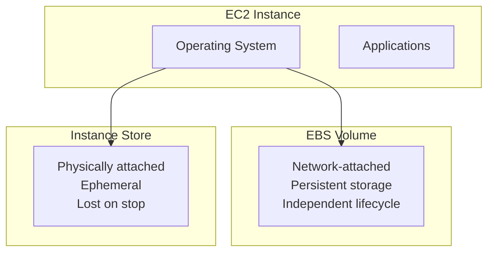
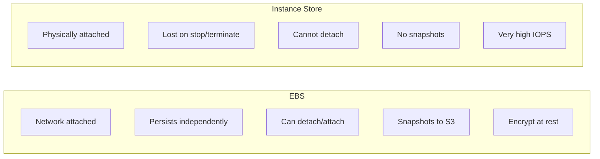
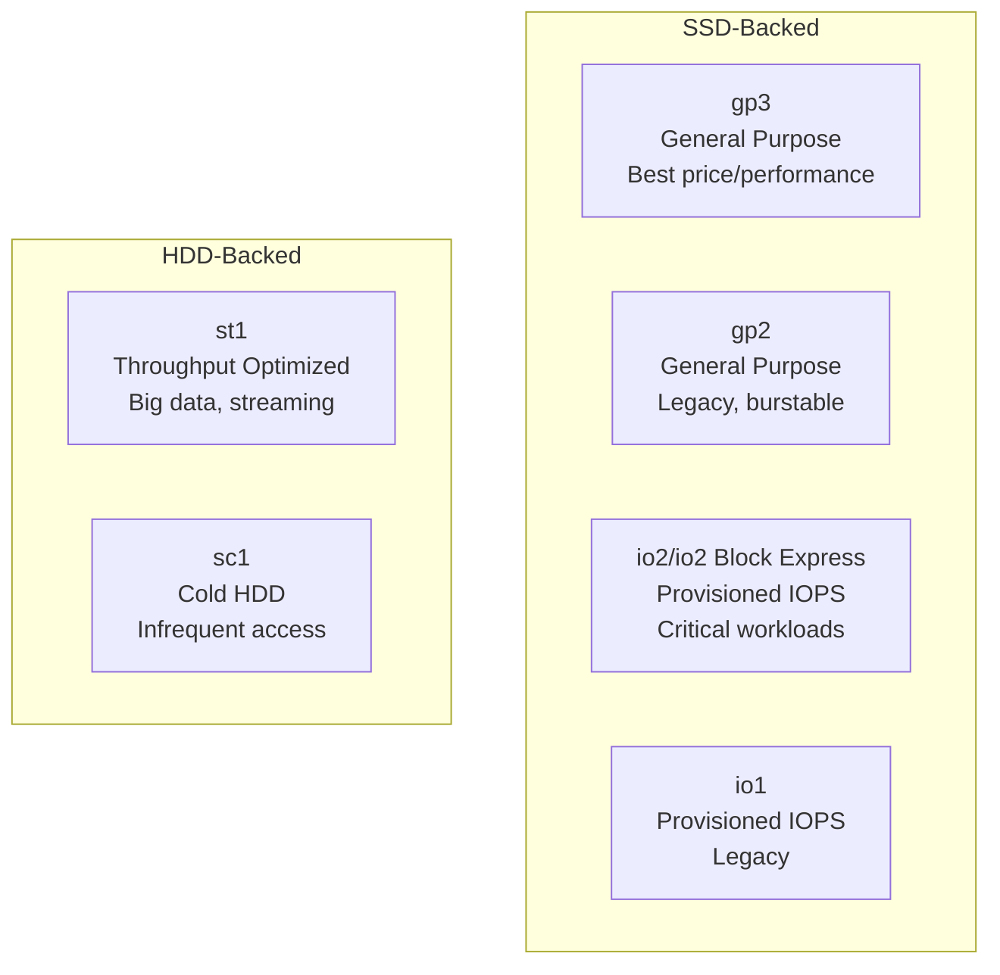
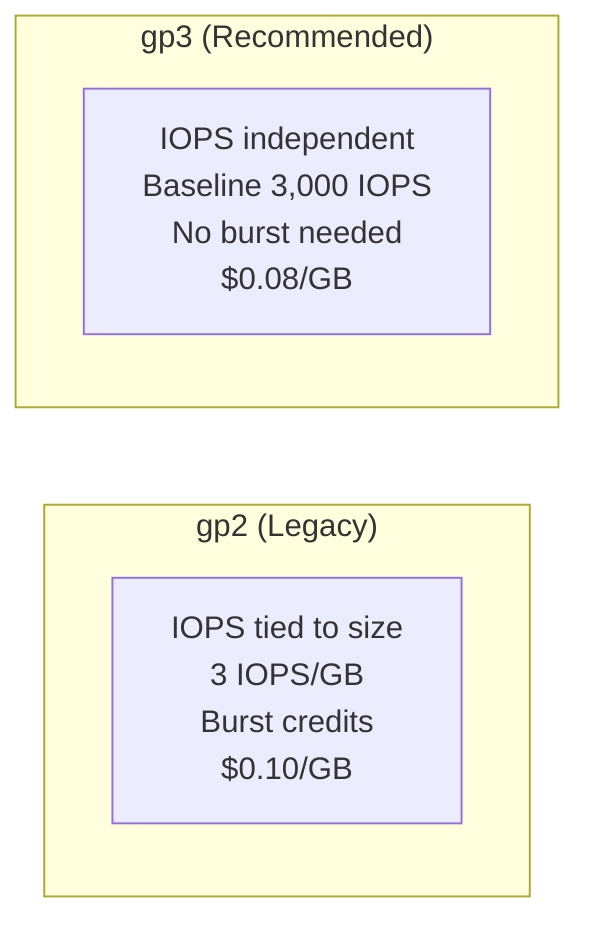
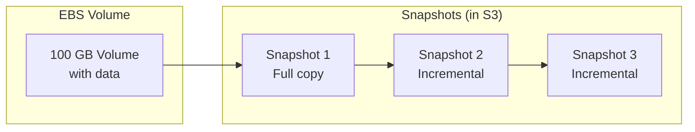
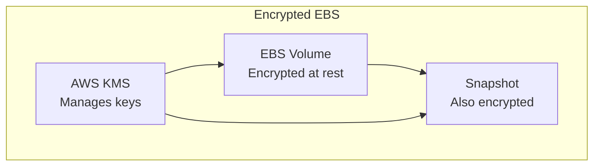
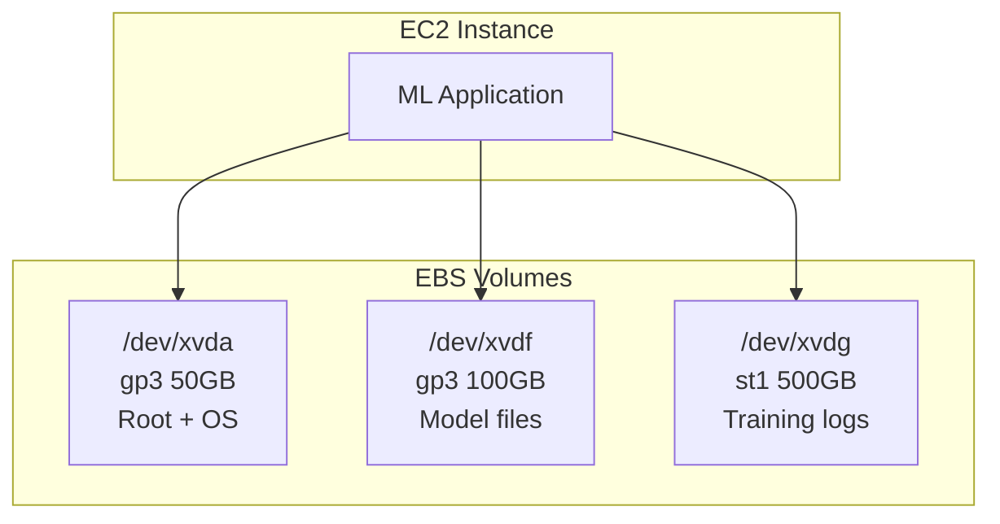

# EBS Volumes and Storage

## Alex's Storage Emergency

The ML server is running great, but Alex notices a problem:

```bash
[ec2-user@ip-172-31-45-67 ~]$ df -h
Filesystem      Size  Used Avail Use% Mounted on
/dev/xvda1      8.0G  7.8G  200M  98% /

# 98% full! The model files and logs filled the disk!
```

Alex panics: "The disk is almost full! What do I do?"

Sam smiles: "This is why we use EBS. You can resize it without stopping the instance."

## What is EBS?

Amazon Elastic Block Store (EBS) provides persistent block storage for EC2 instances.



## EBS vs Instance Store



| Feature | EBS | Instance Store |
|---------|-----|----------------|
| Persistence | Survives stop/restart | Lost on stop |
| Detachable | Yes | No |
| Snapshots | Yes | No |
| Encryption | Yes | Depends |
| Performance | Very good | Excellent |
| Use case | Most workloads | Temp data, caches |

## EBS Volume Types



### Volume Type Comparison

| Type | Max IOPS | Max Throughput | Use Case | Price |
|------|----------|----------------|----------|-------|
| **gp3** | 16,000 | 1,000 MB/s | Most workloads | $0.08/GB |
| gp2 | 16,000 | 250 MB/s | Legacy | $0.10/GB |
| **io2** | 256,000 | 4,000 MB/s | Databases | $0.125/GB + IOPS |
| st1 | 500 | 500 MB/s | Big data | $0.045/GB |
| sc1 | 250 | 250 MB/s | Archives | $0.015/GB |

### gp3 vs gp2



**Always use gp3 for new volumes** - better performance at lower cost.

## Alex Expands the Volume

### Step 1: Modify the Volume

```bash
# Check current volume
aws ec2 describe-volumes \
    --filters "Name=attachment.instance-id,Values=i-1234567890abcdef0" \
    --query 'Volumes[*].{ID:VolumeId,Size:Size,Type:VolumeType}'

# Output: vol-abc123, 8 GB, gp2

# Modify volume (increase size and upgrade to gp3)
aws ec2 modify-volume \
    --volume-id vol-abc123 \
    --size 50 \
    --volume-type gp3 \
    --iops 3000 \
    --throughput 125

# Check modification progress
aws ec2 describe-volumes-modifications \
    --volume-ids vol-abc123
```

### Step 2: Extend the File System

```bash
# SSH into the instance
ssh -i pettracker-key.pem ec2-user@$INSTANCE_IP

# Check block devices
lsblk
# NAME    MAJ:MIN RM SIZE RO TYPE MOUNTPOINT
# xvda    202:0    0  50G  0 disk
# └─xvda1 202:1    0   8G  0 part /   <- Still 8G!

# Extend the partition (for MBR)
sudo growpart /dev/xvda 1

# Check again
lsblk
# xvda1 now shows 50G

# Extend the filesystem
# For ext4:
sudo resize2fs /dev/xvda1

# For XFS (Amazon Linux 2):
sudo xfs_growfs /

# Verify
df -h
# /dev/xvda1      50G  7.8G   42G  16% /
```

## Creating Additional Volumes

```bash
# Create a new volume
VOLUME_ID=$(aws ec2 create-volume \
    --availability-zone us-east-1a \
    --size 100 \
    --volume-type gp3 \
    --iops 3000 \
    --throughput 125 \
    --encrypted \
    --tag-specifications 'ResourceType=volume,Tags=[
        {Key=Name,Value=pettracker-ml-data},
        {Key=Project,Value=PetTracker}
    ]' \
    --query 'VolumeId' \
    --output text)

echo "Created volume: $VOLUME_ID"

# Wait for volume to be available
aws ec2 wait volume-available --volume-ids $VOLUME_ID

# Attach to instance
aws ec2 attach-volume \
    --volume-id $VOLUME_ID \
    --instance-id i-1234567890abcdef0 \
    --device /dev/xvdf
```

### Format and Mount

```bash
# SSH into instance
# Check the new device
lsblk
# xvdf    202:80   0  100G  0 disk

# Format with XFS
sudo mkfs -t xfs /dev/xvdf

# Create mount point
sudo mkdir /data

# Mount
sudo mount /dev/xvdf /data

# Make persistent (add to fstab)
echo '/dev/xvdf /data xfs defaults,nofail 0 2' | sudo tee -a /etc/fstab

# Verify
df -h /data
```

## EBS Snapshots

Snapshots are point-in-time backups stored in S3:



### Creating Snapshots

```bash
# Create a snapshot
SNAPSHOT_ID=$(aws ec2 create-snapshot \
    --volume-id vol-abc123 \
    --description "PetTracker ML data backup $(date +%Y-%m-%d)" \
    --tag-specifications 'ResourceType=snapshot,Tags=[
        {Key=Name,Value=pettracker-ml-backup},
        {Key=Project,Value=PetTracker}
    ]' \
    --query 'SnapshotId' \
    --output text)

echo "Created snapshot: $SNAPSHOT_ID"

# Wait for completion
aws ec2 wait snapshot-completed --snapshot-ids $SNAPSHOT_ID
```

### Restoring from Snapshot

```bash
# Create volume from snapshot
aws ec2 create-volume \
    --availability-zone us-east-1a \
    --snapshot-id snap-abc123 \
    --volume-type gp3 \
    --tag-specifications 'ResourceType=volume,Tags=[
        {Key=Name,Value=pettracker-ml-restored}
    ]'
```

### Automated Snapshots with Data Lifecycle Manager

```bash
# Create lifecycle policy
aws dlm create-lifecycle-policy \
    --description "Daily snapshots of PetTracker volumes" \
    --state ENABLED \
    --execution-role-arn arn:aws:iam::123456789012:role/AWSDataLifecycleManagerDefaultRole \
    --policy-details '{
        "PolicyType": "EBS_SNAPSHOT_MANAGEMENT",
        "ResourceTypes": ["VOLUME"],
        "TargetTags": [{"Key": "Project", "Value": "PetTracker"}],
        "Schedules": [{
            "Name": "Daily",
            "CreateRule": {"Interval": 24, "IntervalUnit": "HOURS", "Times": ["03:00"]},
            "RetainRule": {"Count": 7},
            "CopyTags": true
        }]
    }'
```

## EBS Encryption



```bash
# Create encrypted volume
aws ec2 create-volume \
    --availability-zone us-east-1a \
    --size 100 \
    --volume-type gp3 \
    --encrypted \
    --kms-key-id alias/pettracker-key

# Enable encryption by default for new volumes
aws ec2 enable-ebs-encryption-by-default

# Check status
aws ec2 get-ebs-encryption-by-default
```

### Encrypting Existing Volumes

You cannot encrypt an existing unencrypted volume. Instead:

```bash
# 1. Create snapshot of unencrypted volume
aws ec2 create-snapshot --volume-id vol-unencrypted

# 2. Copy snapshot with encryption
aws ec2 copy-snapshot \
    --source-snapshot-id snap-unencrypted \
    --source-region us-east-1 \
    --encrypted \
    --kms-key-id alias/pettracker-key

# 3. Create new volume from encrypted snapshot
aws ec2 create-volume \
    --snapshot-id snap-encrypted \
    --availability-zone us-east-1a

# 4. Swap volumes on instance
```

## Alex's Storage Architecture



## Exam Tips

**For DVA-C02:**

1. **gp3 is the new default** - independent IOPS, better price
2. **EBS is AZ-specific** - can't attach across AZs
3. **Snapshots are incremental** - only changed blocks stored
4. **Encryption** uses KMS; can enable by default
5. **Can resize volumes** without downtime (online)
6. **Instance store** is ephemeral - lost on stop

**Common scenarios:**

> "Increase disk space without downtime..."
> → Modify volume size, extend filesystem

> "Move volume to another AZ..."
> → Create snapshot, create volume in new AZ

> "Encrypt existing unencrypted volume..."
> → Snapshot → Copy with encryption → New volume

> "High-performance database storage..."
> → io2 with Provisioned IOPS

## Key Takeaways

1. **EBS provides persistent** block storage for EC2
2. **gp3 is recommended** for most workloads
3. **Volumes can be resized** without downtime
4. **Snapshots are incremental** and stored in S3
5. **Encryption** should be enabled by default
6. **Instance store** is fast but ephemeral
7. **Use lifecycle policies** for automated snapshots

---

*Next: Alex explores instance metadata and user data.*

---
*v2.0*
