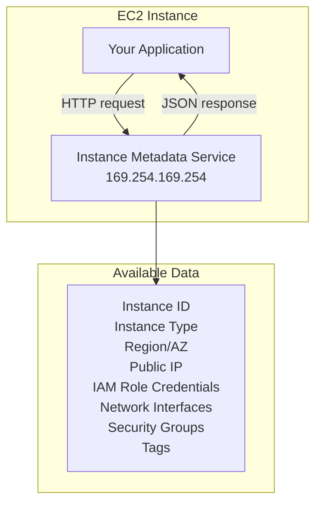
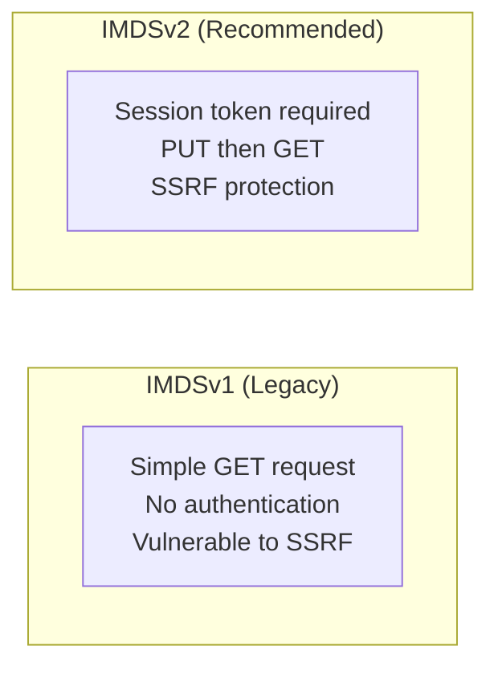
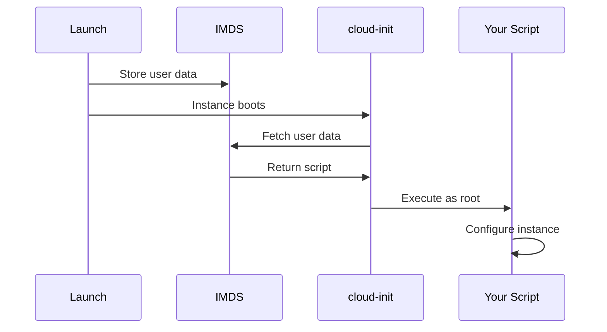
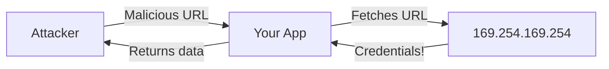

# Instance Metadata and User Data

## Alex's Dynamic Discovery

Alex is configuring the ML server and realizes a problem:

```python
# How does the application know which region it's running in?
# Or its instance ID for logging?
# Or what IAM role it has?

import os

REGION = os.environ.get('AWS_REGION', 'us-east-1')  # Hardcoded fallback - bad!
INSTANCE_ID = 'i-unknown'  # How to get this?
```

Sam introduces Alex to the Instance Metadata Service (IMDS): "Your instance knows everything about itself. You just have to ask."

## What is Instance Metadata?

Instance metadata is information about your EC2 instance that you can access from within the instance itself.



## IMDSv1 vs IMDSv2



### IMDSv1 (Don't Use)

```bash
# Simple but insecure
curl http://169.254.169.254/latest/meta-data/instance-id
```

### IMDSv2 (Always Use)

```bash
# Get a session token first
TOKEN=$(curl -X PUT "http://169.254.169.254/latest/api/token" \
    -H "X-aws-ec2-metadata-token-ttl-seconds: 21600")

# Use token in subsequent requests
curl -H "X-aws-ec2-metadata-token: $TOKEN" \
    http://169.254.169.254/latest/meta-data/instance-id
```

### Enforce IMDSv2

```bash
# For new instances
aws ec2 run-instances \
    --image-id ami-abc123 \
    --instance-type t3.micro \
    --metadata-options "HttpTokens=required,HttpEndpoint=enabled"

# For existing instances
aws ec2 modify-instance-metadata-options \
    --instance-id i-1234567890abcdef0 \
    --http-tokens required \
    --http-endpoint enabled
```

## Commonly Used Metadata

### Instance Information

```bash
TOKEN=$(curl -X PUT "http://169.254.169.254/latest/api/token" \
    -H "X-aws-ec2-metadata-token-ttl-seconds: 21600")

# Instance ID
curl -H "X-aws-ec2-metadata-token: $TOKEN" \
    http://169.254.169.254/latest/meta-data/instance-id
# i-1234567890abcdef0

# Instance type
curl -H "X-aws-ec2-metadata-token: $TOKEN" \
    http://169.254.169.254/latest/meta-data/instance-type
# c5.large

# Availability Zone
curl -H "X-aws-ec2-metadata-token: $TOKEN" \
    http://169.254.169.254/latest/meta-data/placement/availability-zone
# us-east-1a

# Region (derived from AZ)
curl -H "X-aws-ec2-metadata-token: $TOKEN" \
    http://169.254.169.254/latest/meta-data/placement/region
# us-east-1
```

### Network Information

```bash
# Public IP
curl -H "X-aws-ec2-metadata-token: $TOKEN" \
    http://169.254.169.254/latest/meta-data/public-ipv4
# 54.123.45.67

# Private IP
curl -H "X-aws-ec2-metadata-token: $TOKEN" \
    http://169.254.169.254/latest/meta-data/local-ipv4
# 172.31.45.67

# MAC address
curl -H "X-aws-ec2-metadata-token: $TOKEN" \
    http://169.254.169.254/latest/meta-data/mac
# 0e:ab:cd:12:34:56

# Security groups
curl -H "X-aws-ec2-metadata-token: $TOKEN" \
    http://169.254.169.254/latest/meta-data/security-groups
# pettracker-ml-sg
```

### IAM Role Credentials

```bash
# Get role name
curl -H "X-aws-ec2-metadata-token: $TOKEN" \
    http://169.254.169.254/latest/meta-data/iam/security-credentials/
# PetTrackerML-Role

# Get temporary credentials
curl -H "X-aws-ec2-metadata-token: $TOKEN" \
    http://169.254.169.254/latest/meta-data/iam/security-credentials/PetTrackerML-Role
# {
#   "AccessKeyId": "ASIA...",
#   "SecretAccessKey": "...",
#   "Token": "...",
#   "Expiration": "2024-01-15T12:00:00Z"
# }
```

### Instance Tags

Instance tags require additional configuration:

```bash
# Enable instance metadata tags
aws ec2 modify-instance-metadata-options \
    --instance-id i-1234567890abcdef0 \
    --instance-metadata-tags enabled

# Then query tags
curl -H "X-aws-ec2-metadata-token: $TOKEN" \
    http://169.254.169.254/latest/meta-data/tags/instance/
# Environment
# Project

curl -H "X-aws-ec2-metadata-token: $TOKEN" \
    http://169.254.169.254/latest/meta-data/tags/instance/Environment
# production
```

## Alex's Metadata Helper

Alex creates a Python module for metadata access:

```python
# metadata.py
import requests
import json
from functools import lru_cache

class InstanceMetadata:
    """Helper class for EC2 instance metadata (IMDSv2)"""

    BASE_URL = "http://169.254.169.254/latest"
    TOKEN_TTL = 21600  # 6 hours

    def __init__(self):
        self._token = None

    def _get_token(self):
        if not self._token:
            response = requests.put(
                f"{self.BASE_URL}/api/token",
                headers={"X-aws-ec2-metadata-token-ttl-seconds": str(self.TOKEN_TTL)},
                timeout=1
            )
            self._token = response.text
        return self._token

    def _get(self, path):
        response = requests.get(
            f"{self.BASE_URL}/meta-data/{path}",
            headers={"X-aws-ec2-metadata-token": self._get_token()},
            timeout=1
        )
        return response.text

    @property
    @lru_cache()
    def instance_id(self):
        return self._get("instance-id")

    @property
    @lru_cache()
    def instance_type(self):
        return self._get("instance-type")

    @property
    @lru_cache()
    def region(self):
        return self._get("placement/region")

    @property
    @lru_cache()
    def availability_zone(self):
        return self._get("placement/availability-zone")

    @property
    def public_ip(self):
        try:
            return self._get("public-ipv4")
        except:
            return None

    @property
    def private_ip(self):
        return self._get("local-ipv4")

    def get_iam_credentials(self):
        """Get temporary IAM credentials from role"""
        role = self._get("iam/security-credentials/")
        creds_json = self._get(f"iam/security-credentials/{role}")
        return json.loads(creds_json)

# Usage
metadata = InstanceMetadata()
print(f"Instance: {metadata.instance_id}")
print(f"Region: {metadata.region}")
print(f"Type: {metadata.instance_type}")
```

## User Data

User data is a script that runs when the instance first boots:



### Basic User Data Script

```bash
#!/bin/bash
# This runs as root on first boot

# Update system
yum update -y

# Install packages
yum install -y python3.9 python3.9-pip

# Download application
aws s3 cp s3://pettracker-artifacts/ml-server.tar.gz /opt/
tar xzf /opt/ml-server.tar.gz -C /opt/

# Configure service
cat > /etc/systemd/system/pettracker-ml.service << 'EOF'
[Unit]
Description=PetTracker ML Service
After=network.target

[Service]
Type=simple
User=ec2-user
WorkingDirectory=/opt/ml-server
ExecStart=/usr/bin/python3.9 app.py
Restart=always

[Install]
WantedBy=multi-user.target
EOF

systemctl enable pettracker-ml
systemctl start pettracker-ml

# Log completion
echo "User data script completed" >> /var/log/user-data.log
```

### Retrieving User Data

```bash
TOKEN=$(curl -X PUT "http://169.254.169.254/latest/api/token" \
    -H "X-aws-ec2-metadata-token-ttl-seconds: 21600")

# Get user data
curl -H "X-aws-ec2-metadata-token: $TOKEN" \
    http://169.254.169.254/latest/user-data
```

### User Data with Cloud Config

```yaml
#cloud-config
package_update: true
packages:
  - python3.9
  - python3.9-pip
  - git

runcmd:
  - pip3.9 install tensorflow flask gunicorn
  - git clone https://github.com/pettracker/ml-server /opt/ml-server
  - systemctl enable pettracker-ml
  - systemctl start pettracker-ml

write_files:
  - path: /etc/systemd/system/pettracker-ml.service
    content: |
      [Unit]
      Description=PetTracker ML Service
      After=network.target

      [Service]
      Type=simple
      User=ec2-user
      WorkingDirectory=/opt/ml-server
      ExecStart=/usr/bin/python3.9 app.py
      Restart=always

      [Install]
      WantedBy=multi-user.target
```

### Dynamic User Data with Metadata

```bash
#!/bin/bash
# Use metadata in user data script

# Get instance metadata
TOKEN=$(curl -X PUT "http://169.254.169.254/latest/api/token" \
    -H "X-aws-ec2-metadata-token-ttl-seconds: 21600")

INSTANCE_ID=$(curl -H "X-aws-ec2-metadata-token: $TOKEN" \
    http://169.254.169.254/latest/meta-data/instance-id)
REGION=$(curl -H "X-aws-ec2-metadata-token: $TOKEN" \
    http://169.254.169.254/latest/meta-data/placement/region)

# Use in configuration
cat > /opt/ml-server/config.json << EOF
{
    "instance_id": "$INSTANCE_ID",
    "region": "$REGION",
    "log_group": "/pettracker/ml-server/$INSTANCE_ID"
}
EOF

# Register with service discovery
aws servicediscovery register-instance \
    --service-id srv-abc123 \
    --instance-id $INSTANCE_ID \
    --attributes AWS_INSTANCE_ID=$INSTANCE_ID
```

## Security Considerations

### SSRF Attacks

Server-Side Request Forgery can expose metadata:



### Protection

1. **Use IMDSv2** - requires token
2. **Set hop limit** - prevents container escapes
3. **Disable if not needed**

```bash
# Disable IMDS entirely
aws ec2 modify-instance-metadata-options \
    --instance-id i-1234567890abcdef0 \
    --http-endpoint disabled

# Or set hop limit to 1 (blocks containers)
aws ec2 modify-instance-metadata-options \
    --instance-id i-1234567890abcdef0 \
    --http-put-response-hop-limit 1
```

## Exam Tips

**For DVA-C02:**

1. **IMDSv2 requires a token** - PUT to get token, then GET with header
2. **169.254.169.254** is the metadata endpoint
3. **User data** runs only on first boot (by default)
4. **User data limit** is 16KB
5. **IAM credentials** available via metadata service
6. **Instance tags** must be explicitly enabled

**Common scenarios:**

> "Application needs to know its region..."
> → Query instance metadata

> "Get temporary IAM credentials..."
> → Use metadata IAM security-credentials endpoint

> "Configure instance on launch..."
> → Use user data script

> "Prevent SSRF attacks on metadata..."
> → Use IMDSv2, set hop limit

## Key Takeaways

1. **Instance metadata** provides instance information at 169.254.169.254
2. **Always use IMDSv2** for security (token required)
3. **User data** automates instance configuration on first boot
4. **IAM role credentials** are available through metadata
5. **Instance tags** can be queried (if enabled)
6. **Protect against SSRF** with IMDSv2 and hop limits
7. **16KB limit** on user data

---

*Next: Alex learns about EC2 pricing models to optimize costs.*

---
*v2.0*
