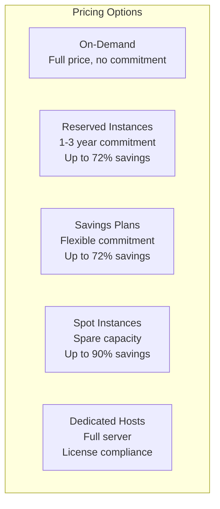
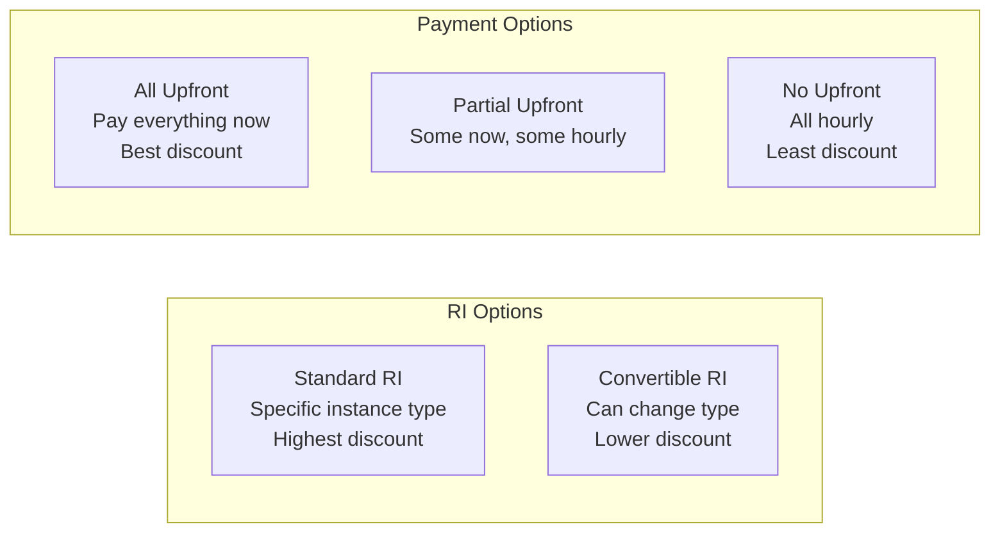
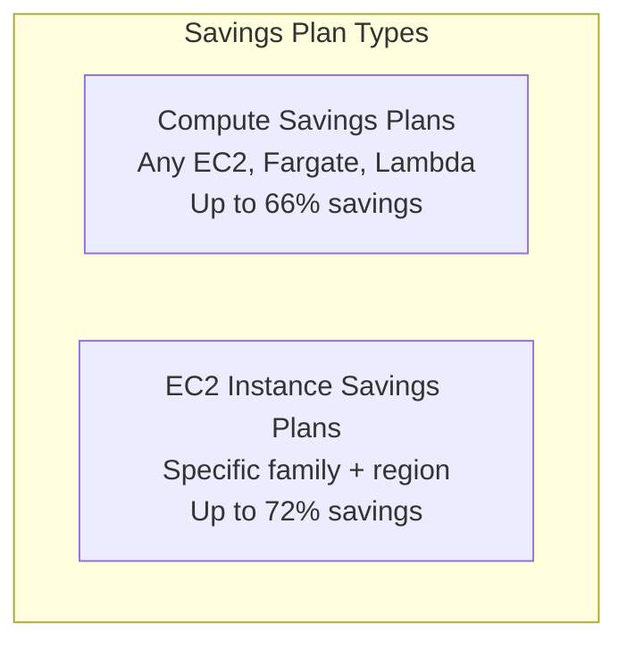
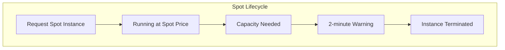
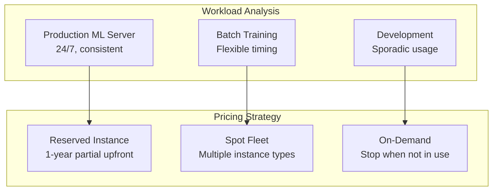

# EC2 Pricing Models

## Alex's Bill Shock

Alex has been running the ML server for a month. Then the AWS bill arrives:

```
AWS Bill - January 2024
─────────────────────────
EC2 (us-east-1)
  c5.large On-Demand     720 hours    $61.20
  g4dn.xlarge On-Demand  720 hours    $378.72  ← Oops!

EBS Volumes
  gp3 - 200 GB                        $16.00

Data Transfer
  Out to Internet - 500 GB            $45.00

Total: $500.92
```

"$500?!" Alex exclaims. "I forgot to terminate the GPU instance after testing!"

Sam reviews the bill: "Let's talk about cost optimization. There are several pricing models that could save you money."

## EC2 Pricing Models



## On-Demand Instances

**Pay by the second** (minimum 60 seconds), no commitment.

```bash
# Check current On-Demand pricing
aws pricing get-products \
    --service-code AmazonEC2 \
    --filters \
        "Type=TERM_MATCH,Field=instanceType,Value=c5.large" \
        "Type=TERM_MATCH,Field=location,Value=US East (N. Virginia)" \
        "Type=TERM_MATCH,Field=operatingSystem,Value=Linux" \
        "Type=TERM_MATCH,Field=tenancy,Value=Shared" \
        "Type=TERM_MATCH,Field=preInstalledSw,Value=NA" \
        "Type=TERM_MATCH,Field=capacitystatus,Value=Used" \
    --region us-east-1
```

**When to use:**
- Short-term, unpredictable workloads
- Development and testing
- Applications being developed or tested
- Workloads that can't be interrupted

**Pros:**
- No commitment
- Start/stop anytime
- Predictable costs

**Cons:**
- Most expensive option
- No discount for usage

## Reserved Instances (RIs)

**Commit to 1 or 3 years** for significant discounts.



### RI Savings Comparison

| Term | Payment | Standard | Convertible |
|------|---------|----------|-------------|
| 1 Year | No Upfront | 36% | 31% |
| 1 Year | Partial Upfront | 40% | 35% |
| 1 Year | All Upfront | 42% | 37% |
| 3 Year | No Upfront | 56% | 50% |
| 3 Year | Partial Upfront | 62% | 56% |
| 3 Year | All Upfront | 72% | 66% |

### Purchasing RIs

```bash
# Search for available RIs
aws ec2 describe-reserved-instances-offerings \
    --instance-type c5.large \
    --product-description "Linux/UNIX" \
    --instance-tenancy default \
    --offering-class standard \
    --filters "Name=duration,Values=31536000"  # 1 year

# Purchase RI
aws ec2 purchase-reserved-instances-offering \
    --reserved-instances-offering-id abc123-def456 \
    --instance-count 2
```

### RI Scope

- **Regional**: Applies to any AZ in region (recommended)
- **Zonal**: Specific AZ, provides capacity reservation

```bash
# Regional RI (flexible)
aws ec2 purchase-reserved-instances-offering \
    --reserved-instances-offering-id abc123 \
    --instance-count 1

# Check RI utilization
aws ce get-reservation-utilization \
    --time-period Start=2024-01-01,End=2024-01-31 \
    --group-by Type=DIMENSION,Key=INSTANCE_TYPE
```

## Savings Plans

**Flexible commitment** to a consistent amount of compute usage.



### How Savings Plans Work

```
Commitment: $10/hour for 1 year

Your usage:
  - c5.large for 10 hours = $0.85  → Savings Plan covers $0.60
  - t3.medium for 5 hours = $0.21 → Savings Plan covers $0.15
  - Lambda invocations        → Savings Plan can cover these too!

Savings Plan automatically applies to get best discount.
```

### Purchasing Savings Plans

```bash
# View available Savings Plans
aws savingsplans describe-savings-plans-offerings \
    --product-type EC2Instance \
    --plan-types "Compute" "EC2Instance" \
    --payment-options "All Upfront" "Partial Upfront" "No Upfront"

# Purchase Savings Plan (use AWS Console for easier experience)
aws savingsplans create-savings-plan \
    --savings-plan-offering-id sp-abc123 \
    --commitment 10.00 \
    --purchase-time "2024-02-01T00:00:00Z"
```

## Spot Instances

**Use spare EC2 capacity** at up to 90% discount.



### Spot Instance Characteristics

- **Up to 90% discount** vs On-Demand
- **Can be interrupted** with 2-minute warning
- **Best for**: Fault-tolerant, flexible workloads

### Requesting Spot Instances

```bash
# Check current Spot prices
aws ec2 describe-spot-price-history \
    --instance-types c5.large \
    --product-descriptions "Linux/UNIX" \
    --start-time $(date -u +%Y-%m-%dT%H:%M:%SZ) \
    --query 'SpotPriceHistory[*].{AZ:AvailabilityZone,Price:SpotPrice}'

# Request Spot Instance
aws ec2 run-instances \
    --image-id ami-abc123 \
    --instance-type c5.large \
    --instance-market-options '{
        "MarketType": "spot",
        "SpotOptions": {
            "SpotInstanceType": "one-time",
            "InstanceInterruptionBehavior": "terminate"
        }
    }'
```

### Spot Fleet

Request multiple instance types to increase availability:

```bash
aws ec2 request-spot-fleet \
    --spot-fleet-request-config '{
        "IamFleetRole": "arn:aws:iam::123456789012:role/aws-ec2-spot-fleet-role",
        "TargetCapacity": 10,
        "SpotPrice": "0.05",
        "AllocationStrategy": "diversified",
        "LaunchSpecifications": [
            {
                "ImageId": "ami-abc123",
                "InstanceType": "c5.large",
                "SubnetId": "subnet-abc123"
            },
            {
                "ImageId": "ami-abc123",
                "InstanceType": "c5a.large",
                "SubnetId": "subnet-abc123"
            },
            {
                "ImageId": "ami-abc123",
                "InstanceType": "c6i.large",
                "SubnetId": "subnet-abc123"
            }
        ]
    }'
```

### Handling Spot Interruptions

```python
# spot_handler.py
import requests
import time
import subprocess

def check_spot_interruption():
    """Check if instance is scheduled for interruption"""
    try:
        token = requests.put(
            "http://169.254.169.254/latest/api/token",
            headers={"X-aws-ec2-metadata-token-ttl-seconds": "21600"},
            timeout=1
        ).text

        response = requests.get(
            "http://169.254.169.254/latest/meta-data/spot/instance-action",
            headers={"X-aws-ec2-metadata-token": token},
            timeout=1
        )

        if response.status_code == 200:
            return response.json()
        return None
    except:
        return None

def graceful_shutdown():
    """Handle graceful shutdown on spot termination"""
    print("Spot interruption detected! Initiating graceful shutdown...")

    # Stop accepting new work
    subprocess.run(["systemctl", "stop", "pettracker-ml"])

    # Save state to S3
    subprocess.run([
        "aws", "s3", "cp", "/opt/ml-server/state.json",
        "s3://pettracker-state/ml-server/"
    ])

    print("Graceful shutdown complete")

# Poll for interruption notice
while True:
    action = check_spot_interruption()
    if action:
        graceful_shutdown()
        break
    time.sleep(5)
```

## Alex's Cost Optimization Strategy



### Alex's Optimized Bill

```
Before Optimization (On-Demand Only):
  c5.large (Production)    720 hrs × $0.085 = $61.20
  c5.xlarge (Training)     100 hrs × $0.170 = $17.00
  t3.medium (Development)  200 hrs × $0.042 = $8.40
  Total: $86.60/month

After Optimization:
  c5.large (1yr RI)        720 hrs × $0.051 = $36.72  ← 40% savings
  c5.xlarge (Spot)         100 hrs × $0.034 = $3.40   ← 80% savings
  t3.medium (On-Demand)    100 hrs × $0.042 = $4.20   ← stopped when unused
  Total: $44.32/month

Monthly Savings: $42.28 (49%)
```

## Cost Management Tools

### AWS Cost Explorer

```bash
# Get cost breakdown by service
aws ce get-cost-and-usage \
    --time-period Start=2024-01-01,End=2024-01-31 \
    --granularity MONTHLY \
    --metrics "UnblendedCost" \
    --group-by Type=DIMENSION,Key=SERVICE
```

### Budgets and Alerts

```bash
# Create budget alert
aws budgets create-budget \
    --account-id 123456789012 \
    --budget '{
        "BudgetName": "PetTracker-Monthly",
        "BudgetLimit": {"Amount": "100", "Unit": "USD"},
        "BudgetType": "COST",
        "TimeUnit": "MONTHLY"
    }' \
    --notifications-with-subscribers '[
        {
            "Notification": {
                "NotificationType": "ACTUAL",
                "ComparisonOperator": "GREATER_THAN",
                "Threshold": 80
            },
            "Subscribers": [
                {"SubscriptionType": "EMAIL", "Address": "alex@pettracker.com"}
            ]
        }
    ]'
```

## Exam Tips

**For DVA-C02:**

1. **On-Demand**: No commitment, highest cost
2. **Reserved**: 1-3 year commitment, up to 72% savings
3. **Spot**: Spare capacity, up to 90% savings, can be interrupted
4. **Savings Plans**: Flexible commitment, auto-applies discounts
5. **Spot interruption**: 2-minute warning via instance metadata

**Common scenarios:**

> "Consistent 24/7 workload, need to reduce costs..."
> → Reserved Instances or Savings Plans

> "Fault-tolerant batch processing, flexible timing..."
> → Spot Instances

> "Development environment, used during business hours..."
> → On-Demand with scheduled start/stop

> "Need capacity guarantee with discount..."
> → Zonal Reserved Instance

## Key Takeaways

1. **On-Demand** for unpredictable, short-term workloads
2. **Reserved Instances** for steady-state, predictable usage
3. **Savings Plans** for flexible, compute commitment
4. **Spot Instances** for fault-tolerant, interruptible workloads
5. **Mix and match** pricing models for best optimization
6. **Monitor costs** with Cost Explorer and budgets
7. **Spot interruption** gives 2-minute warning

---

*Next: Alex learns to monitor and troubleshoot EC2 instances.*
