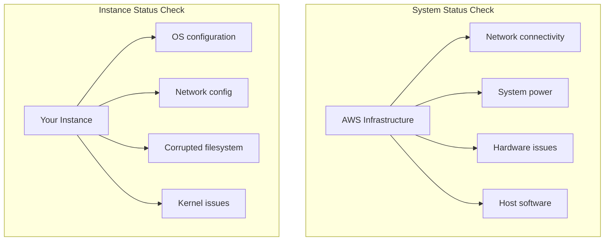
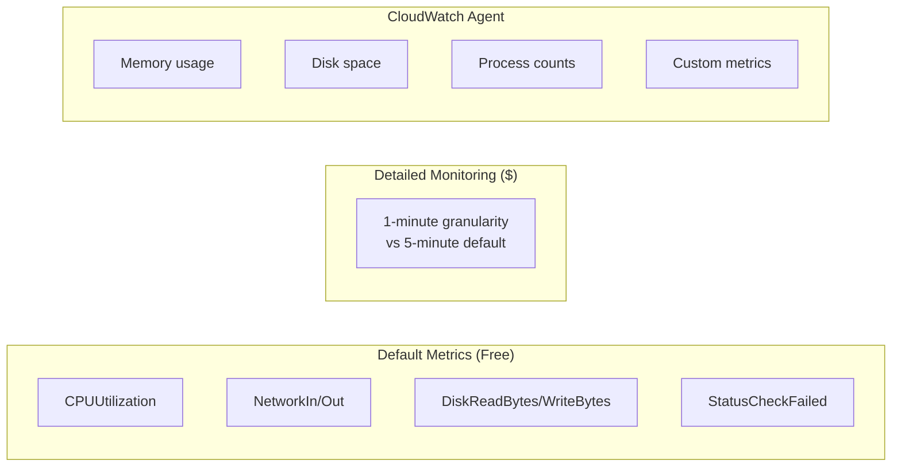
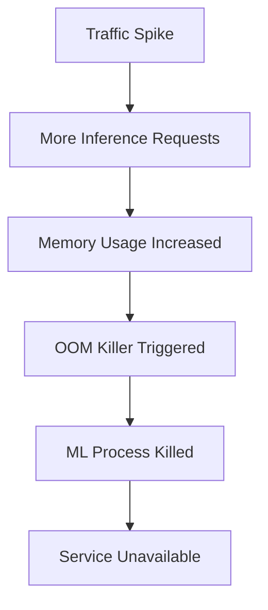
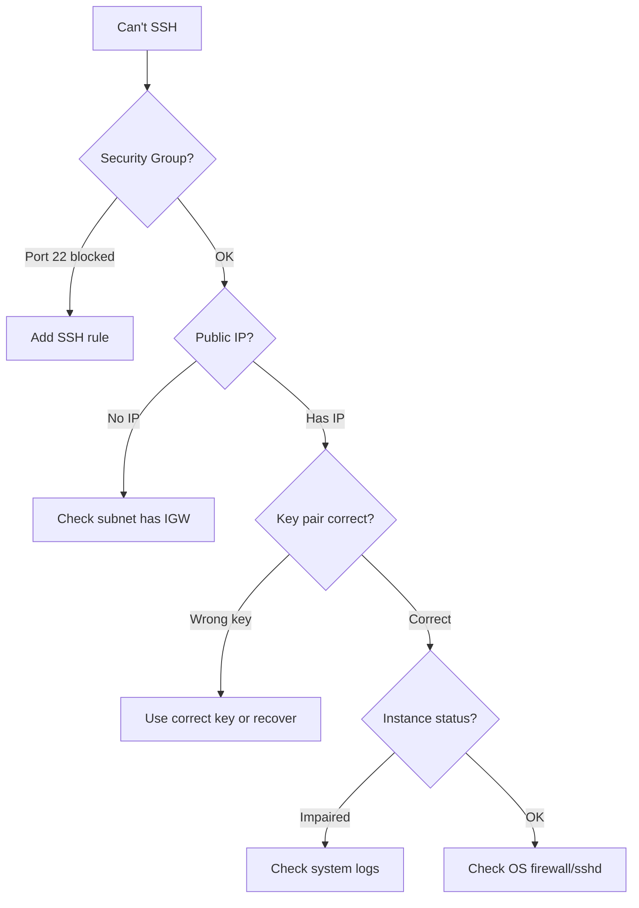

# Monitoring and Troubleshooting

## Alex's 3 AM Wake-Up Call

Alex's phone buzzes at 3 AM:

```
🚨 ALERT: PetTracker ML Server Unresponsive
Status: HTTP 503 - Service Unavailable
Duration: 15 minutes
```

Bleary-eyed, Alex connects to investigate. "What happened? How do I figure this out?"

Marcus, the SRE on call, joins to help: "Let's walk through EC2 monitoring and troubleshooting systematically."

## EC2 Status Checks

Every EC2 instance has two types of status checks:



```bash
# Check instance status
aws ec2 describe-instance-status \
    --instance-ids i-1234567890abcdef0 \
    --query 'InstanceStatuses[*].{
        Instance:InstanceId,
        SystemStatus:SystemStatus.Status,
        InstanceStatus:InstanceStatus.Status
    }'

# Output:
# [
#   {
#     "Instance": "i-1234567890abcdef0",
#     "SystemStatus": "ok",
#     "InstanceStatus": "impaired"  ← Problem!
#   }
# ]
```

### Status Check Failure Actions

| Check | Failed | Action |
|-------|--------|--------|
| System | Yes | Stop and start instance (new hardware) |
| Instance | Yes | Reboot instance, check OS logs |
| Both | Yes | Try both, may need new instance |

```bash
# If system status check fails - stop and start (not reboot!)
aws ec2 stop-instances --instance-ids i-1234567890abcdef0
aws ec2 wait instance-stopped --instance-ids i-1234567890abcdef0
aws ec2 start-instances --instance-ids i-1234567890abcdef0

# If instance status check fails - reboot
aws ec2 reboot-instances --instance-ids i-1234567890abcdef0
```

## CloudWatch Metrics

EC2 sends metrics to CloudWatch automatically:



### Viewing Metrics

```bash
# Get CPU utilization
aws cloudwatch get-metric-statistics \
    --namespace AWS/EC2 \
    --metric-name CPUUtilization \
    --dimensions Name=InstanceId,Value=i-1234567890abcdef0 \
    --start-time $(date -u -d '1 hour ago' +%Y-%m-%dT%H:%M:%SZ) \
    --end-time $(date -u +%Y-%m-%dT%H:%M:%SZ) \
    --period 300 \
    --statistics Average,Maximum

# Check network throughput
aws cloudwatch get-metric-statistics \
    --namespace AWS/EC2 \
    --metric-name NetworkIn \
    --dimensions Name=InstanceId,Value=i-1234567890abcdef0 \
    --start-time $(date -u -d '1 hour ago' +%Y-%m-%dT%H:%M:%SZ) \
    --end-time $(date -u +%Y-%m-%dT%H:%M:%SZ) \
    --period 300 \
    --statistics Sum
```

### CloudWatch Agent for Memory and Disk

Install the CloudWatch Agent to get memory and disk metrics:

```bash
# Install CloudWatch Agent
sudo yum install -y amazon-cloudwatch-agent

# Create configuration
cat > /opt/aws/amazon-cloudwatch-agent/etc/amazon-cloudwatch-agent.json << 'EOF'
{
    "metrics": {
        "metrics_collected": {
            "mem": {
                "measurement": ["mem_used_percent"]
            },
            "disk": {
                "measurement": ["disk_used_percent"],
                "resources": ["/"]
            }
        },
        "append_dimensions": {
            "InstanceId": "${aws:InstanceId}"
        }
    },
    "logs": {
        "logs_collected": {
            "files": {
                "collect_list": [
                    {
                        "file_path": "/var/log/messages",
                        "log_group_name": "/pettracker/ec2/system"
                    },
                    {
                        "file_path": "/opt/ml-server/logs/*.log",
                        "log_group_name": "/pettracker/ml-server"
                    }
                ]
            }
        }
    }
}
EOF

# Start the agent
sudo /opt/aws/amazon-cloudwatch-agent/bin/amazon-cloudwatch-agent-ctl \
    -a fetch-config \
    -m ec2 \
    -s \
    -c file:/opt/aws/amazon-cloudwatch-agent/etc/amazon-cloudwatch-agent.json
```

## CloudWatch Alarms

```bash
# Create CPU alarm
aws cloudwatch put-metric-alarm \
    --alarm-name "pettracker-ml-high-cpu" \
    --alarm-description "Alert when CPU exceeds 80%" \
    --metric-name CPUUtilization \
    --namespace AWS/EC2 \
    --statistic Average \
    --period 300 \
    --threshold 80 \
    --comparison-operator GreaterThanThreshold \
    --evaluation-periods 2 \
    --dimensions Name=InstanceId,Value=i-1234567890abcdef0 \
    --alarm-actions arn:aws:sns:us-east-1:123456789012:pettracker-alerts

# Create status check alarm
aws cloudwatch put-metric-alarm \
    --alarm-name "pettracker-ml-status-check" \
    --alarm-description "Alert on status check failure" \
    --metric-name StatusCheckFailed \
    --namespace AWS/EC2 \
    --statistic Maximum \
    --period 60 \
    --threshold 1 \
    --comparison-operator GreaterThanOrEqualToThreshold \
    --evaluation-periods 2 \
    --dimensions Name=InstanceId,Value=i-1234567890abcdef0 \
    --alarm-actions arn:aws:sns:us-east-1:123456789012:pettracker-alerts

# Auto-recover on system status check failure
aws cloudwatch put-metric-alarm \
    --alarm-name "pettracker-ml-auto-recover" \
    --metric-name StatusCheckFailed_System \
    --namespace AWS/EC2 \
    --statistic Maximum \
    --period 60 \
    --threshold 1 \
    --comparison-operator GreaterThanOrEqualToThreshold \
    --evaluation-periods 2 \
    --dimensions Name=InstanceId,Value=i-1234567890abcdef0 \
    --alarm-actions arn:aws:automate:us-east-1:ec2:recover
```

## Alex's Investigation

Marcus walks Alex through the troubleshooting:

### Step 1: Check Instance Status

```bash
$ aws ec2 describe-instance-status --instance-ids i-1234567890abcdef0
{
    "InstanceStatuses": [{
        "SystemStatus": {"Status": "ok"},
        "InstanceStatus": {"Status": "ok"}
    }]
}
# Status checks pass - instance is running
```

### Step 2: Check CloudWatch Metrics

```bash
$ aws cloudwatch get-metric-statistics \
    --namespace AWS/EC2 \
    --metric-name CPUUtilization \
    --dimensions Name=InstanceId,Value=i-1234567890abcdef0 \
    --start-time 2024-01-15T02:00:00Z \
    --end-time 2024-01-15T03:30:00Z \
    --period 300 \
    --statistics Average

# Shows CPU spiked to 100% at 2:45 AM
```

### Step 3: Check System Logs

```bash
# Connect to instance
ssh -i pettracker-key.pem ec2-user@54.123.45.67

# Check system logs
sudo tail -100 /var/log/messages
# Jan 15 02:45:12 ip-172-31-45-67 kernel: Out of memory: Kill process 1234 (python3)

# Check application logs
tail -100 /opt/ml-server/logs/app.log
# 2024-01-15 02:45:10 ERROR: Memory allocation failed for model inference
# 2024-01-15 02:45:12 CRITICAL: Process killed by OOM killer
```

### Step 4: Check Memory

```bash
$ free -h
              total        used        free      shared  buff/cache   available
Mem:          7.6Gi       7.4Gi       120Mi       0.0Ki        91Mi       120Mi
# Almost no memory available!
```

### Root Cause Found



## Common Troubleshooting Scenarios

### Instance Won't Start

```bash
# Check instance state reason
aws ec2 describe-instances \
    --instance-ids i-1234567890abcdef0 \
    --query 'Reservations[*].Instances[*].StateReason'

# Common causes:
# - InsufficientInstanceCapacity: Try different AZ or instance type
# - VolumeLimitExceeded: Delete unused EBS volumes
# - InvalidSnapshot.NotFound: AMI snapshot deleted
```

### Can't Connect via SSH



```bash
# Debug SSH connection
ssh -vvv -i pettracker-key.pem ec2-user@54.123.45.67

# Check from instance (if you have Session Manager)
# Check if sshd is running
systemctl status sshd

# Check if port is listening
netstat -tlnp | grep 22

# Check local firewall
sudo iptables -L
```

### High CPU

```bash
# Find CPU-hungry processes
top -b -n 1 | head -20

# Check for runaway processes
ps aux --sort=-%cpu | head -10

# Check for CPU steal (noisy neighbor)
vmstat 1 5
# High 'st' column indicates CPU steal
```

### High Memory

```bash
# Check memory usage
free -h

# Find memory-hungry processes
ps aux --sort=-%mem | head -10

# Check for memory leaks over time
watch -n 5 'free -h'
```

### Disk Full

```bash
# Check disk usage
df -h

# Find large files
sudo du -sh /* | sort -rh | head -10

# Find files modified recently (might be logs)
sudo find / -mtime -1 -size +100M -type f 2>/dev/null
```

## Alex's Fix and Prevention

### Immediate Fix

```bash
# Resize to larger instance with more memory
aws ec2 stop-instances --instance-ids i-1234567890abcdef0
aws ec2 modify-instance-attribute \
    --instance-id i-1234567890abcdef0 \
    --instance-type c5.xlarge  # 8GB RAM instead of 4GB
aws ec2 start-instances --instance-ids i-1234567890abcdef0
```

### Prevention: Monitoring and Alerts

```bash
# Add memory alarm (requires CloudWatch Agent)
aws cloudwatch put-metric-alarm \
    --alarm-name "pettracker-ml-memory" \
    --metric-name mem_used_percent \
    --namespace CWAgent \
    --statistic Average \
    --period 300 \
    --threshold 85 \
    --comparison-operator GreaterThanThreshold \
    --evaluation-periods 2 \
    --dimensions Name=InstanceId,Value=i-1234567890abcdef0 \
    --alarm-actions arn:aws:sns:us-east-1:123456789012:pettracker-alerts
```

## Exam Tips

**For DVA-C02:**

1. **Status checks**: System (AWS infrastructure) vs Instance (your OS)
2. **CloudWatch default metrics**: CPU, Network, Disk I/O, Status
3. **CloudWatch Agent**: Required for memory and disk space
4. **System status check failure**: Stop and start (moves to new hardware)
5. **Instance status check failure**: Reboot instance

**Common scenarios:**

> "Instance is running but application unresponsive..."
> → Check CloudWatch metrics, system logs, application logs

> "Status check failed - system..."
> → Stop and start instance (new hardware)

> "Need memory utilization metrics..."
> → Install CloudWatch Agent

> "Auto-heal failing instances..."
> → CloudWatch alarm with EC2 recover action

## Key Takeaways

1. **Two status checks**: System (AWS) and Instance (your OS)
2. **CloudWatch Agent** required for memory and disk metrics
3. **Create alarms** for proactive monitoring
4. **Auto-recovery** can automatically heal instances
5. **Systematic troubleshooting**: Status → Metrics → Logs
6. **Stop/Start** moves instance to new hardware
7. **Document runbooks** for common issues

---

*Next: Alex puts it all together to build a production-ready ML server.*

---
*v1.0*
