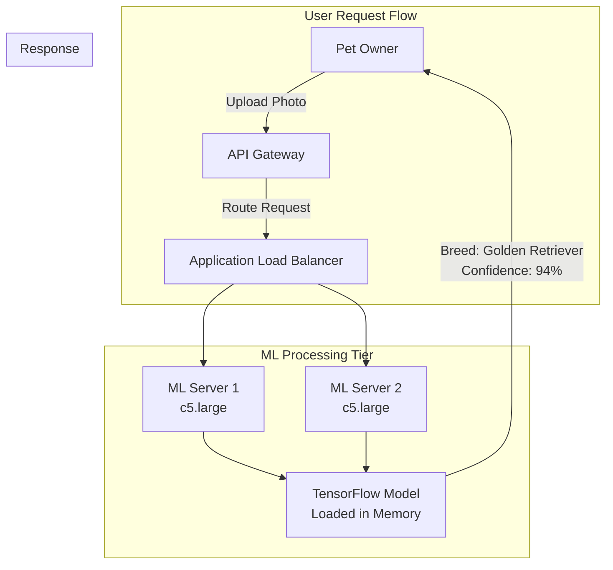
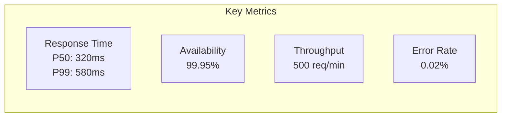
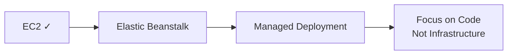

# Alex's Solution: ML Processing Server

## The Complete Picture

It's been two weeks since Alex started learning EC2. The ML breed identification feature is now live and performing beautifully.



## Before and After

```
BEFORE (Lambda):
─────────────────
Cold Start: 30-45 seconds
User Experience: Terrible
Cost: $150/month (provisioned concurrency)
Reviews: 1-2 stars

AFTER (EC2):
────────────
Response Time: 0.3-0.5 seconds
User Experience: Instant
Cost: $90/month (Reserved + Spot)
Reviews: 4.8 stars!
```

## Alex's Final Architecture

### Infrastructure

```bash
# Alex's production setup script
#!/bin/bash
set -e

# Variables
PROJECT="pettracker"
ENV="production"
REGION="us-east-1"

echo "=== Creating PetTracker ML Infrastructure ==="

# 1. Create Security Groups
echo "Creating security groups..."

ALB_SG=$(aws ec2 create-security-group \
    --group-name "${PROJECT}-alb-sg" \
    --description "ALB security group" \
    --vpc-id $VPC_ID \
    --query 'GroupId' --output text)

aws ec2 authorize-security-group-ingress \
    --group-id $ALB_SG \
    --protocol tcp --port 443 --cidr 0.0.0.0/0

ML_SG=$(aws ec2 create-security-group \
    --group-name "${PROJECT}-ml-sg" \
    --description "ML servers security group" \
    --vpc-id $VPC_ID \
    --query 'GroupId' --output text)

aws ec2 authorize-security-group-ingress \
    --group-id $ML_SG \
    --protocol tcp --port 8080 --source-group $ALB_SG

# 2. Create Launch Template
echo "Creating launch template..."

aws ec2 create-launch-template \
    --launch-template-name "${PROJECT}-ml-template" \
    --launch-template-data '{
        "ImageId": "'$AMI_ID'",
        "InstanceType": "c5.large",
        "IamInstanceProfile": {"Name": "'${PROJECT}'-ml-role"},
        "SecurityGroupIds": ["'$ML_SG'"],
        "BlockDeviceMappings": [{
            "DeviceName": "/dev/xvda",
            "Ebs": {
                "VolumeSize": 50,
                "VolumeType": "gp3",
                "Encrypted": true
            }
        }],
        "MetadataOptions": {
            "HttpTokens": "required",
            "HttpEndpoint": "enabled"
        },
        "Monitoring": {"Enabled": true},
        "TagSpecifications": [{
            "ResourceType": "instance",
            "Tags": [
                {"Key": "Name", "Value": "'${PROJECT}'-ml"},
                {"Key": "Environment", "Value": "'$ENV'"},
                {"Key": "Project", "Value": "'$PROJECT'"}
            ]
        }],
        "UserData": "'$(base64 -w 0 user-data.sh)'"
    }'

# 3. Create Auto Scaling Group
echo "Creating Auto Scaling Group..."

aws autoscaling create-auto-scaling-group \
    --auto-scaling-group-name "${PROJECT}-ml-asg" \
    --launch-template LaunchTemplateName="${PROJECT}-ml-template,Version=\$Latest" \
    --min-size 2 \
    --max-size 10 \
    --desired-capacity 2 \
    --target-group-arns $TARGET_GROUP_ARN \
    --vpc-zone-identifier "$SUBNET_1,$SUBNET_2" \
    --health-check-type ELB \
    --health-check-grace-period 300 \
    --tags Key=Name,Value="${PROJECT}-ml",PropagateAtLaunch=true

# 4. Configure Scaling Policies
echo "Configuring scaling policies..."

aws autoscaling put-scaling-policy \
    --auto-scaling-group-name "${PROJECT}-ml-asg" \
    --policy-name "${PROJECT}-scale-up" \
    --policy-type TargetTrackingScaling \
    --target-tracking-configuration '{
        "TargetValue": 70.0,
        "PredefinedMetricSpecification": {
            "PredefinedMetricType": "ASGAverageCPUUtilization"
        },
        "ScaleOutCooldown": 300,
        "ScaleInCooldown": 300
    }'

echo "=== Infrastructure Created Successfully ==="
```

### User Data Script

```bash
#!/bin/bash
# user-data.sh - ML Server Setup

set -e

# Get instance metadata
TOKEN=$(curl -X PUT "http://169.254.169.254/latest/api/token" \
    -H "X-aws-ec2-metadata-token-ttl-seconds: 21600")
INSTANCE_ID=$(curl -H "X-aws-ec2-metadata-token: $TOKEN" \
    http://169.254.169.254/latest/meta-data/instance-id)
REGION=$(curl -H "X-aws-ec2-metadata-token: $TOKEN" \
    http://169.254.169.254/latest/meta-data/placement/region)

# Install CloudWatch Agent
yum install -y amazon-cloudwatch-agent
cat > /opt/aws/amazon-cloudwatch-agent/etc/config.json << 'EOF'
{
    "metrics": {
        "metrics_collected": {
            "mem": {"measurement": ["mem_used_percent"]},
            "disk": {"measurement": ["disk_used_percent"], "resources": ["/"]}
        }
    },
    "logs": {
        "logs_collected": {
            "files": {
                "collect_list": [
                    {"file_path": "/opt/ml-server/logs/*.log", "log_group_name": "/pettracker/ml-server"}
                ]
            }
        }
    }
}
EOF
/opt/aws/amazon-cloudwatch-agent/bin/amazon-cloudwatch-agent-ctl -a fetch-config -m ec2 -s -c file:/opt/aws/amazon-cloudwatch-agent/etc/config.json

# Download latest model from S3
aws s3 cp s3://pettracker-models/breed-model-v2.h5 /opt/ml-server/models/

# Configure application
cat > /opt/ml-server/config.json << EOF
{
    "instance_id": "$INSTANCE_ID",
    "region": "$REGION",
    "model_path": "/opt/ml-server/models/breed-model-v2.h5",
    "port": 8080,
    "workers": 4
}
EOF

# Start the ML service
systemctl enable pettracker-ml
systemctl start pettracker-ml

# Signal health check
curl -X PUT "http://localhost:8080/health/ready"
```

## Performance Metrics

Alex proudly shows the dashboard:



```bash
# Alex's monitoring query
aws cloudwatch get-metric-statistics \
    --namespace "PetTracker/ML" \
    --metric-name "InferenceLatency" \
    --start-time $(date -u -d '24 hours ago' +%Y-%m-%dT%H:%M:%SZ) \
    --end-time $(date -u +%Y-%m-%dT%H:%M:%SZ) \
    --period 3600 \
    --statistics Average p50 p99

# Results show consistent sub-second response times!
```

## Cost Optimization Results

```
Monthly Cost Breakdown:
───────────────────────
EC2 Instances (Reserved, 1-year):
  2x c5.large @ $37/month each     = $74

EBS Volumes:
  2x 50GB gp3                      = $8

Data Transfer:
  500 GB outbound                  = $45

CloudWatch:
  Custom metrics + logs            = $15

Load Balancer:
  ALB + data processing            = $25

Total Monthly Cost: $167

vs Lambda with Provisioned Concurrency: $350/month
Savings: 52%!
```

## Lessons Learned

Alex documents the journey:

### What Went Wrong

```markdown
## Mistakes Made

1. **Left test GPU instance running**
   - Cost: $378 for one month
   - Fix: Set up billing alerts immediately

2. **SSH open to 0.0.0.0/0**
   - Risk: Thousands of brute force attempts
   - Fix: Use Session Manager, restrict SSH to bastion

3. **No memory monitoring**
   - Result: 3 AM OOM incident
   - Fix: CloudWatch Agent + memory alarms

4. **Single instance initially**
   - Result: 15-minute downtime during updates
   - Fix: Auto Scaling Group with minimum 2 instances

5. **Didn't understand T series bursting**
   - Result: Throttled performance during testing
   - Fix: Use consistent performance instances (C/M series)
```

### What Went Right

```markdown
## Successes

1. **Custom AMI with pre-loaded model**
   - New instances ready in 60 seconds
   - Consistent, tested environment

2. **IMDSv2 from the start**
   - Secure metadata access
   - Protected against SSRF

3. **Launch templates for everything**
   - Reproducible deployments
   - Easy rollbacks via version changes

4. **Mixed pricing strategy**
   - Reserved for baseline
   - On-Demand for overflow
   - 52% cost savings

5. **Comprehensive monitoring**
   - Caught issues before users did
   - Clear debugging trail
```

## EC2 Checklist for Production

Alex creates a checklist for future projects:

```markdown
## EC2 Production Checklist

### Security
- [ ] IMDSv2 required (http-tokens=required)
- [ ] Security groups follow least privilege
- [ ] SSH restricted or use Session Manager
- [ ] IAM role with minimal permissions
- [ ] EBS encryption enabled
- [ ] No secrets in user data

### High Availability
- [ ] Multi-AZ deployment
- [ ] Auto Scaling Group configured
- [ ] Health checks configured
- [ ] Launch template with versioning

### Cost Optimization
- [ ] Right-sized instance type
- [ ] Reserved or Savings Plan for steady-state
- [ ] Spot instances for fault-tolerant workloads
- [ ] Scheduled scaling for predictable patterns
- [ ] Budget alerts configured

### Monitoring
- [ ] CloudWatch Agent installed
- [ ] Custom metrics for application
- [ ] Alarms for CPU, memory, disk
- [ ] Status check alarms
- [ ] Log shipping to CloudWatch

### Backup & Recovery
- [ ] AMI backup strategy
- [ ] EBS snapshot lifecycle
- [ ] Tested recovery procedure
- [ ] Documented runbooks
```

## What's Next for Alex

Sam congratulates Alex: "You've come a long way! The ML server is solid. But now let's talk about something interesting..."



"What if I told you there's a way to get all this EC2 power... but with AWS managing the infrastructure for you?"

Alex is intrigued. "Tell me more about Elastic Beanstalk..."

## Chapter Summary

### Key Concepts Mastered

1. **EC2 Fundamentals**
   - Instances, AMIs, instance types
   - When to use EC2 vs Lambda

2. **Instance Types**
   - T (burstable), M (general), C (compute), R (memory), P/G (GPU)
   - Instance naming: family + generation + size

3. **AMIs**
   - Custom images for reproducible deployments
   - Region-specific, can copy cross-region

4. **Security**
   - Security groups (stateful firewall)
   - Key pairs and SSH
   - Session Manager for secure access

5. **Storage**
   - EBS volume types (gp3 recommended)
   - Snapshots for backup
   - Encryption at rest

6. **Instance Metadata**
   - IMDSv2 for secure access
   - User data for bootstrap scripts

7. **Pricing**
   - On-Demand, Reserved, Spot, Savings Plans
   - Cost optimization strategies

8. **Monitoring**
   - Status checks, CloudWatch metrics
   - CloudWatch Agent for memory/disk
   - Troubleshooting methodology

### Exam Preparation

Key topics for DVA-C02:
- Instance types and their use cases
- Security group rules (stateful)
- EBS volume types and characteristics
- User data and instance metadata
- Pricing models
- Status checks and recovery

---

*Next Chapter: Elastic Beanstalk - Let AWS manage your infrastructure while you focus on code.*
