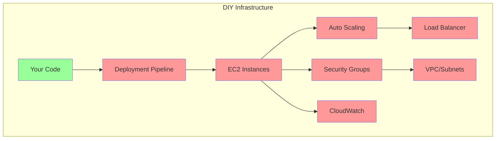
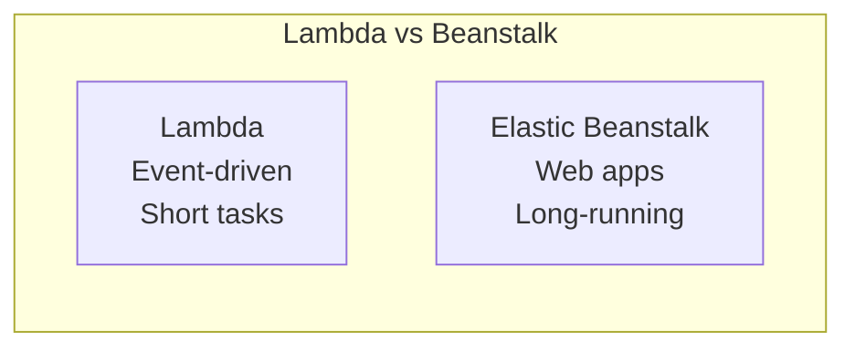
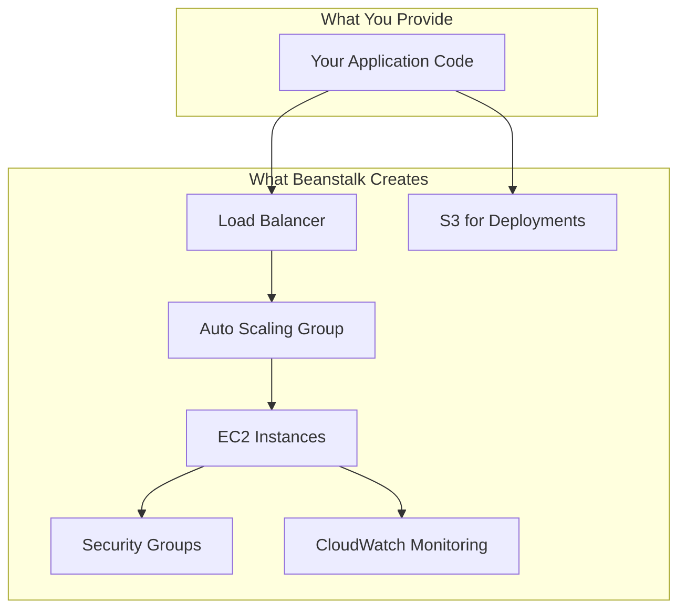
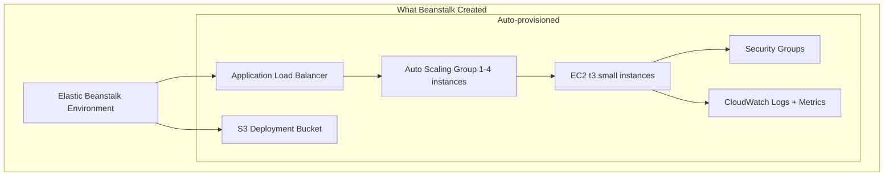
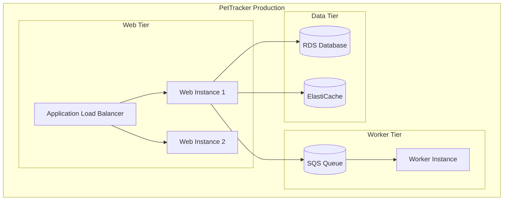
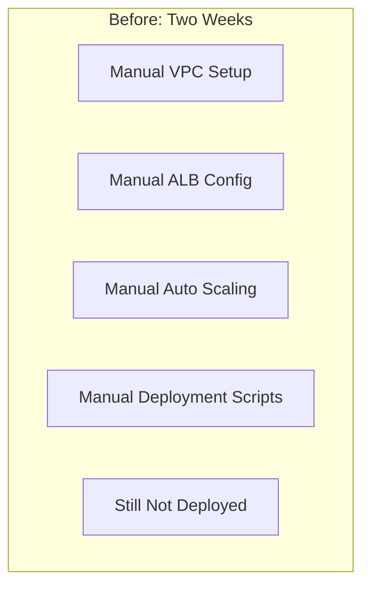
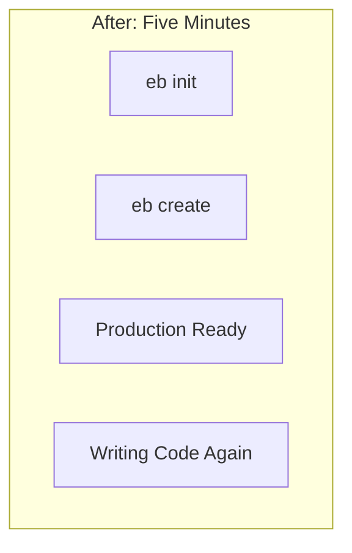

# Elastic Beanstalk: Deploy Without the DevOps Degree

## The Week Alex Almost Quit

It started with a simple goal: deploy PetTracker's web application to production.

Seven days later, Alex had:
- Configured an EC2 Auto Scaling group
- Set up an Application Load Balancer
- Created a VPC with public and private subnets
- Configured security groups (three rounds of fixes)
- Set up CloudWatch alarms
- Created an RDS database
- Configured environment variables
- Written deployment scripts
- Fixed networking issues (twice)
- Still hadn't actually deployed the application

"I just want to put my app on the internet," Alex sighed, staring at yet another CloudFormation error.

Sam walked over. "Show me what you're trying to do."

Alex pulled up the architecture diagram - a beautiful mess of AWS services connected with arrows going everywhere.

"That's a lot of infrastructure for a web app," Sam observed. "Have you considered Elastic Beanstalk?"

---

## "But Why Not Just Use EC2 Directly?"

This is the question experienced AWS users ask. Let's examine why managing your own infrastructure gets complicated fast.

:::floating:right:1/2


When you manage EC2 directly, **you** are responsible for:
- Instance patching
- Auto Scaling configuration
- Load balancer setup
- Health checks
- Deployment orchestration
- Rolling updates
- Rollbacks on failure
- Log aggregation
- Monitoring dashboards
:::

**The hidden costs of DIY:**

```
Week 1: Initial Setup
- VPC with subnets: 4 hours
- Security groups: 2 hours
- Load balancer: 3 hours
- Auto Scaling: 4 hours
- First deployment: 6 hours
Total: 19 hours

Week 2+: Ongoing Operations
- Debugging network issues: 3 hours
- Patching instances: 2 hours
- Investigating failed deployments: 4 hours
- Fixing Auto Scaling: 2 hours
Total: 11 hours/week ongoing
```

"You've spent two weeks on infrastructure," Sam said. "How much code did you write?"

"None."

"That's the problem Elastic Beanstalk solves."

---

## "But Why Not Just Use Lambda?"

Another valid question. Serverless is simpler than EC2, but it has constraints.

**When Lambda doesn't fit:**

| Lambda Constraint | Example |
|-------------------|---------|
| **15-minute timeout** | Long-running batch jobs |
| **10GB memory max** | Memory-intensive processing |
| **No persistent connections** | WebSocket servers |
| **Cold starts** | Consistent low latency needed |
| **CPU-bound limits** | Heavy computation |
| **Specific runtime versions** | Legacy framework requirements |

:::floating:left:1/2


PetTracker's web app needed:
- WebSocket support for real-time GPS tracking
- Long-running video processing
- Specific Node.js version for a legacy dependency

Lambda couldn't handle these requirements. EC2 could, but Alex didn't want to become a full-time DevOps engineer.
:::

---

## What is Elastic Beanstalk?

**Elastic Beanstalk is AWS's Platform-as-a-Service (PaaS). You upload your code, and Beanstalk handles the infrastructure.**



**The key insight:** Beanstalk provisions *real* AWS resources (EC2, ALB, Auto Scaling). You're not locked into a proprietary platform. You can customize everything, but you don't *have* to.

---

## Alex's Five-Minute Deployment

Sam showed Alex the Elastic Beanstalk CLI:

```bash
# Initialize the application
eb init pettracker --platform node.js --region us-east-1

# Create an environment and deploy
eb create pettracker-prod --single

# Application deployed to:
# http://pettracker-prod.us-east-1.elasticbeanstalk.com
```

"Wait, that's it?" Alex was incredulous. "Where's the load balancer config? The Auto Scaling setup?"

"Beanstalk created them for you. Check the console."

:::floating:right:2/3


Alex checked the AWS console. Elastic Beanstalk had created:
- An Application Load Balancer with health checks
- An Auto Scaling group (1-4 instances)
- EC2 instances with the application running
- Security groups for the ALB and instances
- CloudWatch logs and monitoring
- An S3 bucket for deployment artifacts

All in under 5 minutes.
:::

---

## Deployment Strategies

"But what about deploying updates?" Alex asked. "Rolling back if something breaks?"

Beanstalk supports multiple deployment strategies:

| Strategy | Downtime | Risk | Speed |
|----------|----------|------|-------|
| **All at once** | Yes | High | Fastest |
| **Rolling** | No | Medium | Medium |
| **Rolling with batch** | No | Lower | Slower |
| **Immutable** | No | Lowest | Slowest |
| **Blue/Green** | No | Lowest | Variable |

```bash
# Deploy with immutable strategy (safest)
eb deploy --staged --strategy immutable

# If something goes wrong
eb abort  # Cancel in-progress deployment
eb restore  # Restore previous version
```

---

## What You'll Learn in This Chapter

This chapter covers Elastic Beanstalk from basics to production-ready:

- **Environment creation** - Single instance vs load balanced
- **Deployment strategies** - All-at-once to blue/green
- **Configuration** - Environment variables and .ebextensions
- **Customization** - Platform hooks and custom platforms
- **Monitoring** - Health dashboards and logs

| Concept | What It Solves |
|---------|---------------|
| **Environments** | Dev, staging, production isolation |
| **Deployment Strategies** | Zero-downtime updates |
| **.ebextensions** | Custom configuration |
| **Platform Hooks** | Pre/post deployment scripts |
| **Saved Configurations** | Reproducible environments |
| **Worker Tier** | Background job processing |

## The Architecture We're Building

:::floating:right:2/3


By chapter end, PetTracker will have:
- Web tier handling HTTP requests
- Worker tier processing background jobs
- Environment configuration via .ebextensions
- Blue/green deployments for zero-downtime
- CloudWatch integration for monitoring
:::

## Why This Matters for the Exam

Elastic Beanstalk questions appear regularly on DVA-C02. Key topics:

- **Deployment strategies** - Know all five strategies
- **Environment types** - Single instance vs load balanced
- **.ebextensions** - Configuration file format
- **Platform hooks** - Pre/post deployment
- **CLI commands** - eb create, deploy, abort

| Topic | What the Exam Asks |
|-------|-------------------|
| **Deployments** | Strategy selection for scenarios |
| **Configuration** | .ebextensions vs environment variables |
| **Scaling** | When to use which environment type |
| **Updates** | Platform updates vs application updates |
| **Troubleshooting** | Log access, health dashboard |

## Meet the Team

Throughout this chapter:

- **Alex** - Escaping infrastructure complexity
- **Sam** - DevOps mentor with Beanstalk expertise
- **Maya** - Frontend developer who just wants to deploy
- **Marcus** - SRE who appreciates managed platforms
- **Elena** - CTO focused on developer productivity

## Chapter Roadmap

1. **Alex's Challenge** - Infrastructure overload
2. **Beanstalk Fundamentals** - Environments and applications
3. **Creating Environments** - Single instance vs load balanced
4. **Deployment Strategies** - All-at-once to blue/green
5. **Configuration Options** - Environment variables and settings
6. **.ebextensions** - Advanced configuration
7. **Platform Hooks** - Custom deployment scripts
8. **Worker Environments** - Background job processing
9. **Database Integration** - RDS with Beanstalk
10. **Monitoring and Logs** - Health dashboard and CloudWatch
11. **CLI Mastery** - EB CLI commands
12. **Alex's Solution** - Production-ready deployment

---

## The Before and After





---

*Ready to deploy applications without the infrastructure headache? Let's start with Elastic Beanstalk fundamentals and understand how AWS handles the heavy lifting.*

---
*v2.0*
