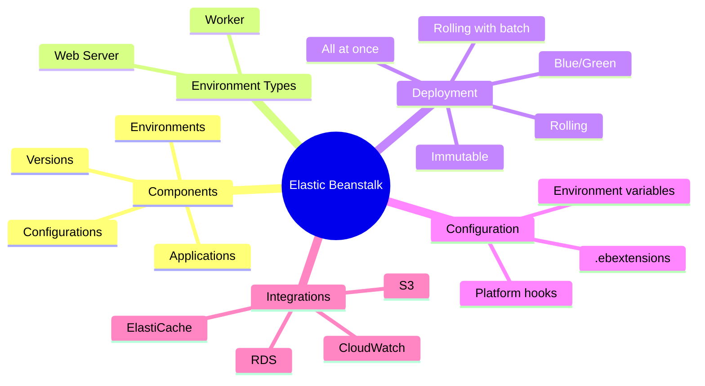

# Elastic Beanstalk

Elastic Beanstalk is AWS's Platform as a Service (PaaS) offering that handles the deployment complexity while giving you full control over the underlying resources. It's the perfect middle ground between the full control of EC2 and the managed simplicity of serverless.

## Alex's Story: Deployment Fatigue

Alex has the ML server running on EC2, but deployments are becoming a nightmare. Every code change requires:
- SSHing into servers
- Pulling code manually
- Restarting services
- Hoping nothing breaks

"There has to be a better way," Alex sighs after a 2 AM deployment gone wrong. The web application team uses Elastic Beanstalk and raves about it. Maybe it's time to learn.

Maya, the frontend developer, introduces Alex to the team's deployment workflow: "I just run `eb deploy` and grab coffee. AWS handles the rest."

## What You'll Learn

By the end of this chapter, you'll understand:

- Elastic Beanstalk architecture and components
- Environment types and deployment strategies
- Application lifecycle management
- Configuration and customization with .ebextensions
- Blue/green deployments and rolling updates
- Worker environments for background processing
- Monitoring and troubleshooting Beanstalk applications

## Chapter Architecture

## Why This Matters for the Exam

Elastic Beanstalk is heavily tested on the DVA-C02 exam:

- Deployment strategies and their trade-offs
- .ebextensions configuration syntax
- Environment types (Web Server vs Worker)
- Blue/Green deployment patterns
- Troubleshooting common issues
- Integration with other AWS services

Understanding when to use Beanstalk vs. raw EC2 vs. containers is essential for the exam.

## Characters in This Chapter

- **Alex** - Learning Beanstalk to simplify deployments
- **Maya** - Frontend developer who loves Beanstalk's simplicity
- **Sam** - DevOps mentor helping with advanced configurations
- **The QA Team** - Very interested in staging environments

---
*v1.0*
