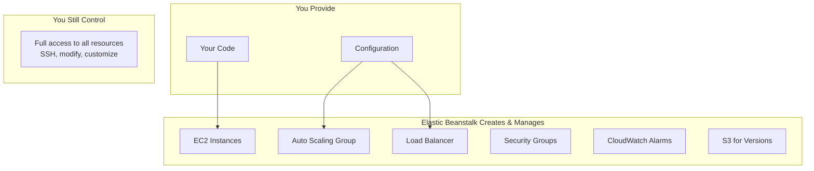
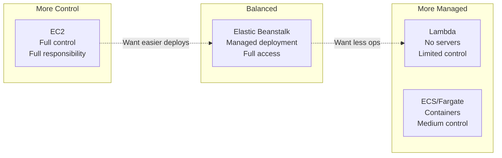

# Alex's Challenge: Deployment Fatigue

## The 2 AM Deployment Disaster

It's 2 AM. Alex is trying to deploy a critical bug fix to the ML server.

```bash
# Alex's "deployment process"
$ ssh -i pettracker-key.pem ec2-user@ml-server-1.pettracker.com
$ cd /opt/ml-server
$ git pull origin main
fatal: unable to access 'https://github.com/pettracker/ml-server.git/':
Could not resolve host: github.com

# DNS issue? Let's try again...
$ sudo systemctl restart network
$ git pull origin main
# Success!

$ pip install -r requirements.txt
# 5 minutes later...

$ sudo systemctl restart pettracker-ml
$ curl localhost:8080/health
# Connection refused

# What broke?!
$ sudo journalctl -u pettracker-ml -f
# ImportError: tensorflow version mismatch
```

Alex realizes the new code requires a newer TensorFlow version, but the production requirements.txt wasn't updated. Now it's 2:30 AM and the server is down.

## The Rollback Nightmare

```bash
# Trying to rollback
$ git log --oneline -5
abc1234 Fix breed detection bug
def5678 Add new model weights
ghi9012 Update API endpoints

$ git checkout def5678
$ pip install -r requirements.txt
# Another 5 minutes...

$ sudo systemctl restart pettracker-ml
$ curl localhost:8080/health
{"status": "ok"}

# Finally! But wait... there are TWO servers!

$ ssh ec2-user@ml-server-2.pettracker.com
# Do it all again...
```

It's 3:15 AM. Alex is exhausted.

## The Daily Burden

Alex's typical deployment checklist:

```markdown
## Manual Deployment Checklist

### Pre-Deployment
- [ ] SSH into each server (currently 2, soon 5)
- [ ] Check disk space
- [ ] Check running processes
- [ ] Backup current code

### Deployment
- [ ] Pull latest code
- [ ] Install dependencies
- [ ] Run database migrations
- [ ] Update configuration files
- [ ] Restart application
- [ ] Verify health check

### Post-Deployment
- [ ] Check logs for errors
- [ ] Verify metrics in CloudWatch
- [ ] Test critical endpoints
- [ ] Update deployment log

Estimated time: 45 minutes per server
Total for 2 servers: 1.5 hours
Risk level: High (manual = error-prone)
```

## The Breaking Point

The next morning, Alex meets with Elena (CTO):

> **Elena**: "Alex, the ML service had 30 minutes of downtime last night. Users couldn't identify their pet breeds. What happened?"
>
> **Alex**: "A deployment went wrong. I had to manually fix it on each server."
>
> **Elena**: "We're adding 3 more servers next month for the product launch. How will you handle deployments then?"
>
> **Alex**: "I... don't know."
>
> **Elena**: "Talk to Maya. Her team deploys 10 times a day without breaking a sweat."

## Maya's Secret

Alex finds Maya at her desk:

```bash
# Maya's "deployment process"
$ eb deploy
Creating application version archive "app-v47".
Uploading pettracker-web/app-v47.zip to S3.
Environment update in progress...
2024-01-15 10:15:23    INFO    Deploying new version to instances.
2024-01-15 10:16:45    INFO    New application version running on all instances.

# That's it. Done.
```

"Wait, that's it?" Alex asks incredulously.

Maya grins: "Elastic Beanstalk handles everything. Load balancer, auto scaling, health checks, rollbacks. I just write code and deploy. AWS handles the infrastructure."

## What Is Elastic Beanstalk?



### The Magic

Elastic Beanstalk is a **Platform as a Service (PaaS)** that:
- Automatically provisions infrastructure
- Handles deployments with zero downtime
- Manages scaling and load balancing
- Monitors application health
- Provides easy rollbacks
- **But still gives you full access to all underlying resources**

## Alex's Requirements

Alex lists what the ML deployment needs:

```markdown
## Deployment Requirements

### Must Have
- [ ] One-command deployments
- [ ] Zero-downtime updates
- [ ] Easy rollbacks
- [ ] Works with multiple servers
- [ ] Health monitoring

### Nice to Have
- [ ] Blue/green deployments
- [ ] Environment cloning (staging/prod)
- [ ] Background job processing
- [ ] Custom platform configuration

### Constraints
- Keep full control over EC2 instances
- Must be able to SSH for debugging
- Keep existing security groups
- Budget: Can't add significant cost
```

## Elastic Beanstalk vs. Other Options



| Aspect | EC2 | Elastic Beanstalk | Lambda |
|--------|-----|-------------------|--------|
| Server management | You | AWS (but accessible) | None |
| Deployment | Manual | Automated | Automated |
| Scaling | Manual/ASG | Automatic | Automatic |
| Control | Full | Full | Limited |
| Best for | Custom needs | Web apps, APIs | Event-driven |

## The Plan

Maya helps Alex outline the migration:

```markdown
## Migration to Elastic Beanstalk

### Phase 1: Learn the Basics
1. Understand EB components (applications, environments, versions)
2. Set up EB CLI
3. Create first environment

### Phase 2: Configure Environment
1. Set up .ebextensions for custom config
2. Configure environment variables
3. Set up health checks

### Phase 3: Deployment Strategy
1. Choose deployment policy (rolling, immutable)
2. Set up blue/green for major releases
3. Configure automatic rollbacks

### Phase 4: Production Migration
1. Test in staging environment
2. Migrate production
3. Decommission manual EC2 setup
```

## Alex's Mindset Shift

```
Old Thinking:
"I need to manage every server manually"
"More control = better"
"PaaS is for beginners"

New Thinking:
"Let AWS manage infrastructure, I'll manage code"
"Right level of abstraction = productivity"
"PaaS + full access = best of both worlds"
```

## What's Coming


Over the next lessons, Alex will learn how to:
- Create and manage Beanstalk applications
- Deploy with different strategies
- Customize environments with .ebextensions
- Set up worker environments for background jobs
- Implement blue/green deployments
- Monitor and troubleshoot issues

## Key Takeaway

> **"Elastic Beanstalk is not about giving up control - it's about automating the tedious parts while keeping full access to everything. You get the deployment experience of a PaaS with the flexibility of IaaS."**

---

*Next: Alex learns the core concepts of Elastic Beanstalk - applications, environments, and versions.*

---
*v1.0*
