# Elastic Beanstalk Fundamentals

## The Core Concepts

Maya explains Elastic Beanstalk's architecture to Alex:


### Key Components

| Component | Description | Example |
|-----------|-------------|---------|
| **Application** | Container for all EB resources | pettracker-ml |
| **Environment** | Running instance of your app | pettracker-ml-prod |
| **Application Version** | Specific code version | v1.2.3 |
| **Environment Configuration** | Settings for an environment | Instance type, scaling |
| **Platform** | OS + runtime + web server | Python 3.9 on Amazon Linux 2 |

## Applications

An application is a logical container for your Elastic Beanstalk resources:

```bash
# Create an application
aws elasticbeanstalk create-application \
    --application-name pettracker-ml \
    --description "PetTracker ML breed identification service"

# List applications
aws elasticbeanstalk describe-applications \
    --query 'Applications[*].[ApplicationName,Description]' \
    --output table
```

## Application Versions

Each deployment creates an application version stored in S3:


```bash
# Create an application version
aws elasticbeanstalk create-application-version \
    --application-name pettracker-ml \
    --version-label v1.2.3 \
    --source-bundle S3Bucket=elasticbeanstalk-us-east-1-123456789012,S3Key=pettracker-ml/v1.2.3.zip \
    --description "Added new breed detection model"

# List versions
aws elasticbeanstalk describe-application-versions \
    --application-name pettracker-ml \
    --query 'ApplicationVersions[*].[VersionLabel,DateCreated,Status]' \
    --output table
```

### Version Lifecycle

```bash
# Configure version lifecycle (keep last 10 versions)
aws elasticbeanstalk update-application-resource-lifecycle \
    --application-name pettracker-ml \
    --resource-lifecycle-config '{
        "VersionLifecycleConfig": {
            "MaxCountRule": {
                "Enabled": true,
                "MaxCount": 10,
                "DeleteSourceFromS3": true
            }
        },
        "ServiceRole": "arn:aws:iam::123456789012:role/aws-elasticbeanstalk-service-role"
    }'
```

## Environments

Environments run your application versions:


### Creating an Environment

```bash
# Create a web server environment
aws elasticbeanstalk create-environment \
    --application-name pettracker-ml \
    --environment-name pettracker-ml-prod \
    --solution-stack-name "64bit Amazon Linux 2 v3.5.0 running Python 3.9" \
    --option-settings \
        Namespace=aws:autoscaling:launchconfiguration,OptionName=InstanceType,Value=c5.large \
        Namespace=aws:autoscaling:asg,OptionName=MinSize,Value=2 \
        Namespace=aws:autoscaling:asg,OptionName=MaxSize,Value=10 \
        Namespace=aws:elasticbeanstalk:environment,OptionName=EnvironmentType,Value=LoadBalanced
```

### Environment Tiers


## Supported Platforms

Elastic Beanstalk supports many platforms:

```bash
# List all available platforms
aws elasticbeanstalk list-available-solution-stacks \
    --query 'SolutionStacks[?contains(@, `Python`)]'

# Common platforms:
# - Python on Amazon Linux 2
# - Node.js on Amazon Linux 2
# - Java SE / Tomcat
# - .NET Core on Linux / Windows
# - Go
# - Ruby
# - PHP
# - Docker
# - Multi-container Docker
```

### Platform Versions

```
Platform naming convention:
64bit Amazon Linux 2 v3.5.0 running Python 3.9
│     │              │              │
│     │              │              └── Language/Runtime version
│     │              └── Platform version
│     └── OS
└── Architecture
```

## Alex Creates First Application

```bash
# Step 1: Create the application
aws elasticbeanstalk create-application \
    --application-name pettracker-ml \
    --description "ML breed identification service"

# Step 2: Prepare the code
# Create application.py (the entry point)
cat > application.py << 'EOF'
from flask import Flask, jsonify
import tensorflow as tf

application = Flask(__name__)
model = tf.keras.models.load_model('breed_model.h5')

@application.route('/health')
def health():
    return jsonify({'status': 'healthy'})

@application.route('/predict', methods=['POST'])
def predict():
    # Prediction logic here
    return jsonify({'breed': 'Golden Retriever', 'confidence': 0.94})

if __name__ == '__main__':
    application.run()
EOF

# Step 3: Create requirements.txt
cat > requirements.txt << 'EOF'
flask==2.3.0
tensorflow==2.13.0
gunicorn==21.2.0
EOF

# Step 4: Create ZIP for deployment
zip -r pettracker-ml-v1.0.0.zip application.py requirements.txt breed_model.h5

# Step 5: Upload to S3
aws s3 cp pettracker-ml-v1.0.0.zip s3://elasticbeanstalk-us-east-1-123456789012/pettracker-ml/

# Step 6: Create application version
aws elasticbeanstalk create-application-version \
    --application-name pettracker-ml \
    --version-label v1.0.0 \
    --source-bundle S3Bucket=elasticbeanstalk-us-east-1-123456789012,S3Key=pettracker-ml/pettracker-ml-v1.0.0.zip

# Step 7: Create environment
aws elasticbeanstalk create-environment \
    --application-name pettracker-ml \
    --environment-name pettracker-ml-prod \
    --version-label v1.0.0 \
    --solution-stack-name "64bit Amazon Linux 2 v3.5.0 running Python 3.9" \
    --option-settings file://env-options.json
```

### Environment Options File

```json
// env-options.json
[
    {
        "Namespace": "aws:autoscaling:launchconfiguration",
        "OptionName": "InstanceType",
        "Value": "c5.large"
    },
    {
        "Namespace": "aws:autoscaling:asg",
        "OptionName": "MinSize",
        "Value": "2"
    },
    {
        "Namespace": "aws:autoscaling:asg",
        "OptionName": "MaxSize",
        "Value": "10"
    },
    {
        "Namespace": "aws:elasticbeanstalk:environment",
        "OptionName": "EnvironmentType",
        "Value": "LoadBalanced"
    },
    {
        "Namespace": "aws:elasticbeanstalk:application:environment",
        "OptionName": "MODEL_PATH",
        "Value": "/var/app/current/breed_model.h5"
    }
]
```

## What Beanstalk Creates

When Alex creates the environment, Beanstalk provisions:


```bash
# View all resources created for environment
aws elasticbeanstalk describe-environment-resources \
    --environment-name pettracker-ml-prod

# Output shows:
# - LoadBalancers
# - AutoScalingGroups
# - Instances
# - LaunchTemplates
# - Triggers
```

## Environment URL

Every environment gets a URL:

```bash
# Get environment info
aws elasticbeanstalk describe-environments \
    --environment-names pettracker-ml-prod \
    --query 'Environments[0].[CNAME,EndpointURL,Status,Health]'

# Output:
# pettracker-ml-prod.us-east-1.elasticbeanstalk.com
# awseb-xxx.us-east-1.elb.amazonaws.com
# Ready
# Green
```

## Health Status

```mermaid
graph LR
    subgraph "Health Colors"
        Green[🟢 Green<br/>All instances passing]
        Yellow[🟡 Yellow<br/>Some issues]
        Red[🔴 Red<br/>Critical problems]
        Grey[⚪ Grey<br/>Updating]
    end
```



```bash
# Check environment health
aws elasticbeanstalk describe-environment-health \
    --environment-name pettracker-ml-prod \
    --attribute-names All

# Detailed instance health
aws elasticbeanstalk describe-instances-health \
    --environment-name pettracker-ml-prod
```

## Exam Tips

**For DVA-C02:**

1. **Application**: Container for environments and versions
2. **Environment**: Running resources (EC2, ELB, ASG)
3. **Application Version**: Code snapshot in S3
4. **Platform**: OS + runtime + web server
5. **Tiers**: Web Server (HTTP) vs Worker (SQS)

**Common scenarios:**

> "Need to deploy same app to dev, staging, prod..."
> → One application, three environments

> "Need to process background jobs..."
> → Worker tier environment with SQS

> "Running out of S3 space for versions..."
> → Configure application version lifecycle

## Key Takeaways

1. **Application** is a logical container for all resources
2. **Environments** run application versions
3. **Versions** are code snapshots stored in S3
4. **Platforms** define the runtime environment
5. **All resources remain accessible** - you can SSH, modify, customize
6. **Health monitoring** is built-in

---

*Next: Alex learns about web server and worker environment types.*
