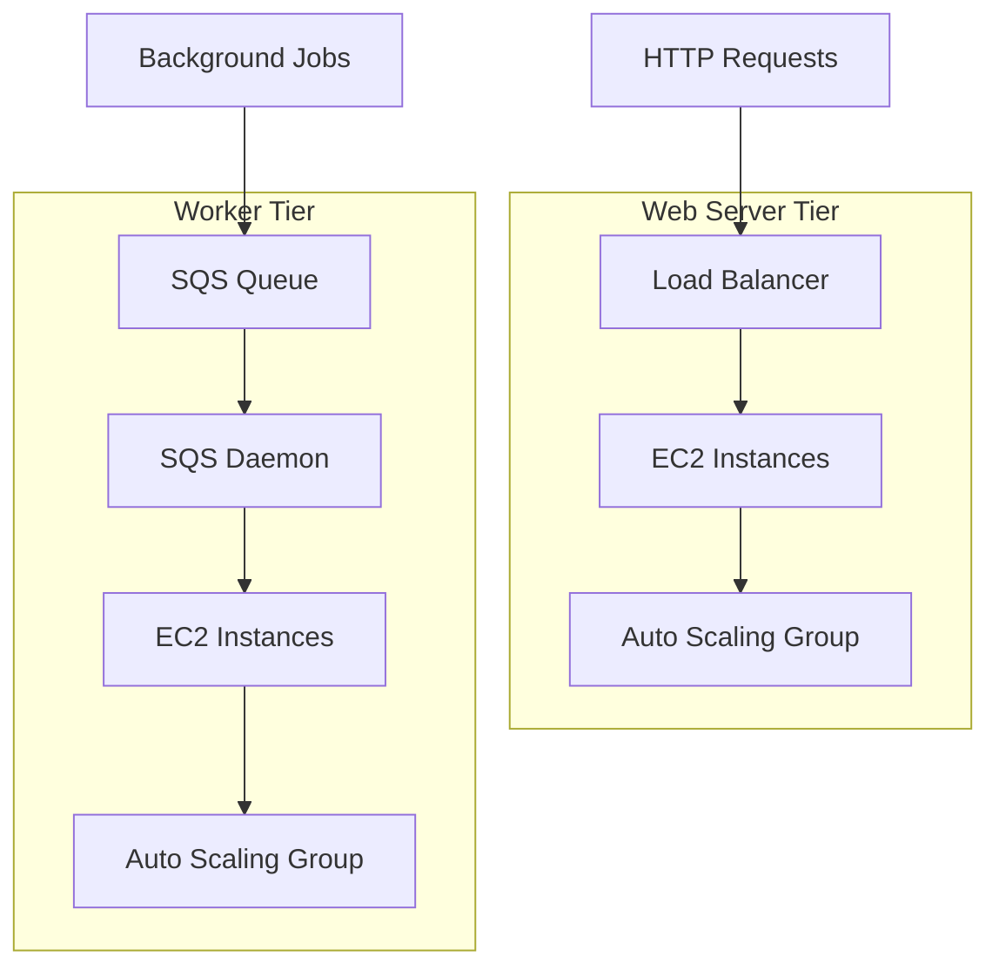
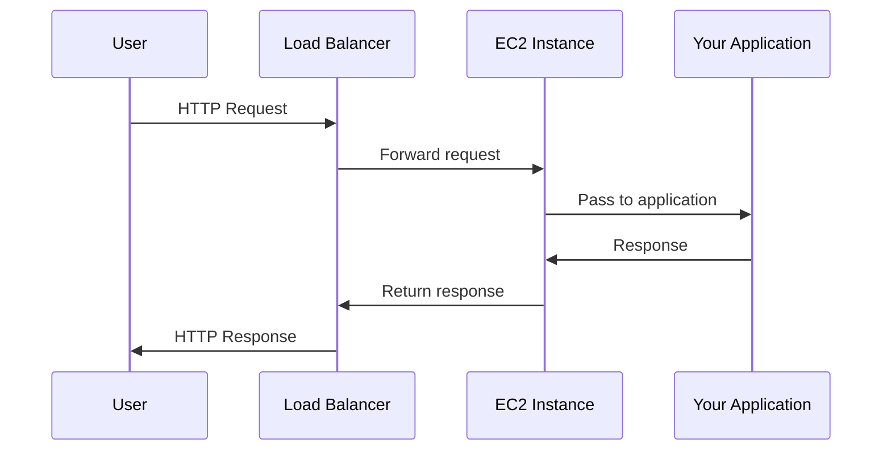
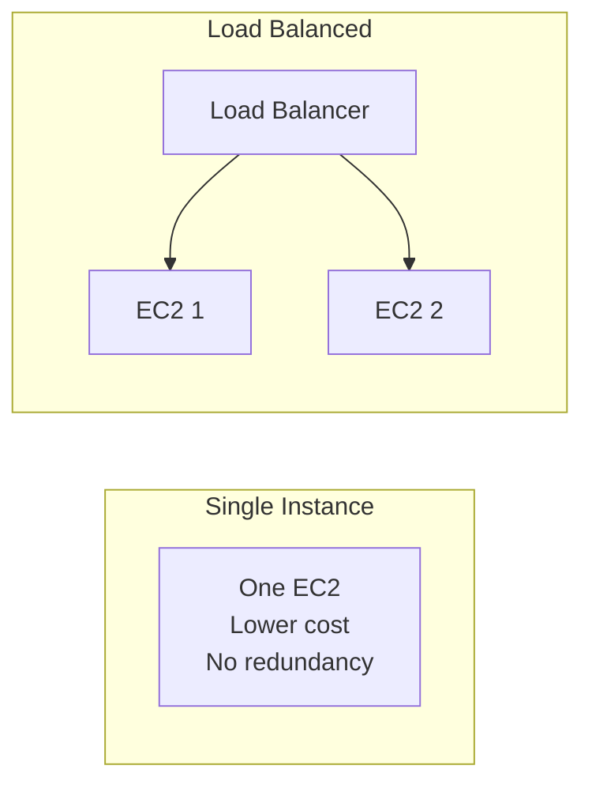
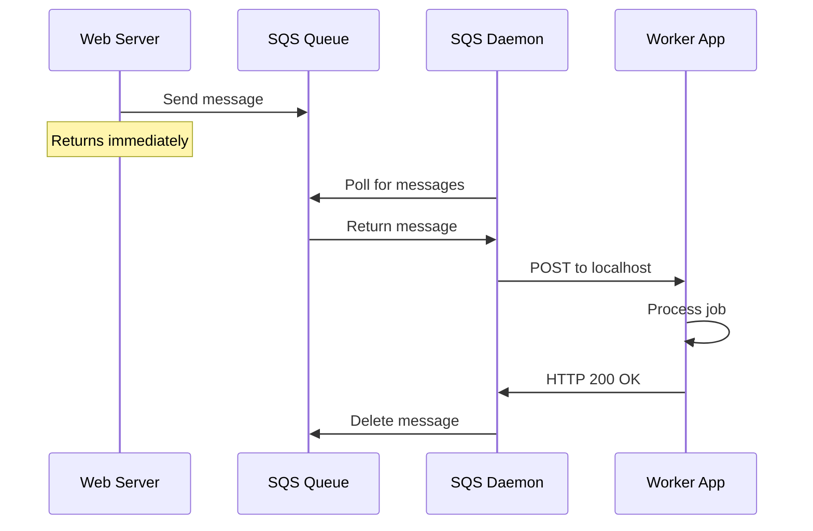
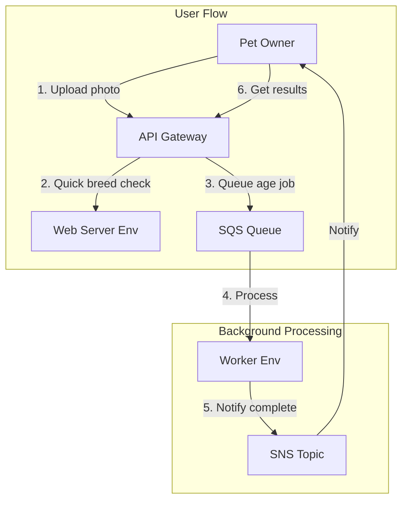
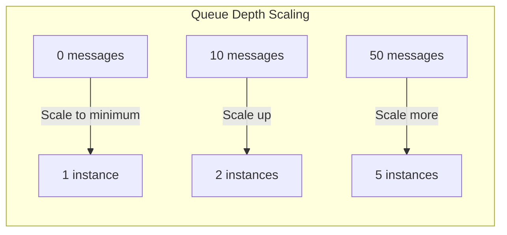
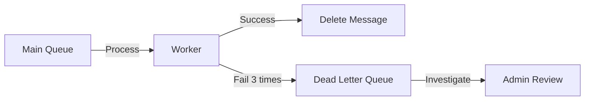

# Environment Types: Web Server and Worker

## Alex's New Requirement

The breed identification feature is live, but users want more:

> "Can you identify the breed AND estimate the pet's age from the photo?"

Alex realizes age estimation needs a different, larger ML model that takes 30 seconds to process. "I can't make users wait 30 seconds for a response!"

Sam suggests: "Use a worker environment. Accept the request immediately, process in the background, notify when done."

## Two Environment Tiers



### Key Differences

| Feature | Web Server | Worker |
|---------|------------|--------|
| Receives | HTTP requests | SQS messages |
| Load Balancer | Yes | No |
| Scaling trigger | Request count, CPU | Queue depth |
| Use case | APIs, websites | Background jobs |
| URL | Public endpoint | None |

## Web Server Tier

The standard tier for handling HTTP traffic:

```bash
# Create web server environment
aws elasticbeanstalk create-environment \
    --application-name pettracker-ml \
    --environment-name pettracker-ml-web \
    --tier Name=WebServer,Type=Standard \
    --solution-stack-name "64bit Amazon Linux 2 v3.5.0 running Python 3.9" \
    --option-settings \
        Namespace=aws:elasticbeanstalk:environment,OptionName=EnvironmentType,Value=LoadBalanced
```

### Web Server Architecture



### Single Instance vs Load Balanced



```bash
# Single instance (development)
--option-settings \
    Namespace=aws:elasticbeanstalk:environment,OptionName=EnvironmentType,Value=SingleInstance

# Load balanced (production)
--option-settings \
    Namespace=aws:elasticbeanstalk:environment,OptionName=EnvironmentType,Value=LoadBalanced
```

## Worker Tier

For background processing without HTTP:



### How Worker Tier Works

1. **SQS Queue** receives messages
2. **SQS Daemon** (runs on each instance) polls the queue
3. **Daemon POSTs** message to your application at `http://localhost/`
4. **Your app processes** and returns HTTP 200
5. **Daemon deletes** message from queue

### Creating a Worker Environment

```bash
# Create worker environment
aws elasticbeanstalk create-environment \
    --application-name pettracker-ml \
    --environment-name pettracker-ml-worker \
    --tier Name=Worker,Type=SQS/HTTP \
    --solution-stack-name "64bit Amazon Linux 2 v3.5.0 running Python 3.9" \
    --option-settings \
        Namespace=aws:elasticbeanstalk:sqsd,OptionName=WorkerQueueURL,Value=https://sqs.us-east-1.amazonaws.com/123456789012/pettracker-jobs \
        Namespace=aws:elasticbeanstalk:sqsd,OptionName=HttpPath,Value=/ \
        Namespace=aws:elasticbeanstalk:sqsd,OptionName=InactivityTimeout,Value=299 \
        Namespace=aws:elasticbeanstalk:sqsd,OptionName=VisibilityTimeout,Value=300
```

### Worker Application Code

```python
# application.py for worker tier
from flask import Flask, request, jsonify
import json
import boto3
import tensorflow as tf

application = Flask(__name__)
model = tf.keras.models.load_model('age_model.h5')
sns = boto3.client('sns')

@application.route('/', methods=['POST'])
def process_job():
    """Handle SQS messages from the daemon"""
    message = request.get_json()

    job_id = message['job_id']
    image_url = message['image_url']
    callback_topic = message['callback_topic']

    try:
        # Download and process image
        image = download_image(image_url)

        # Run age estimation (takes ~30 seconds)
        age_estimate = model.predict(image)

        # Notify completion via SNS
        sns.publish(
            TopicArn=callback_topic,
            Message=json.dumps({
                'job_id': job_id,
                'status': 'completed',
                'age_estimate': float(age_estimate),
                'confidence': 0.87
            })
        )

        return jsonify({'status': 'processed'}), 200

    except Exception as e:
        return jsonify({'error': str(e)}), 500


def download_image(url):
    # Image download logic
    pass


if __name__ == '__main__':
    application.run()
```

## Alex's Architecture: Web + Worker



### Web Server Queues the Job

```python
# Web server application.py
from flask import Flask, request, jsonify
import boto3
import uuid
import json

application = Flask(__name__)
sqs = boto3.client('sqs')
WORKER_QUEUE_URL = 'https://sqs.us-east-1.amazonaws.com/123456789012/pettracker-jobs'

@application.route('/analyze', methods=['POST'])
def analyze_pet():
    image_url = request.json['image_url']

    # Quick breed identification (fast model)
    breed = identify_breed(image_url)

    # Queue age estimation (slow model) for background
    job_id = str(uuid.uuid4())
    sqs.send_message(
        QueueUrl=WORKER_QUEUE_URL,
        MessageBody=json.dumps({
            'job_id': job_id,
            'image_url': image_url,
            'callback_topic': 'arn:aws:sns:us-east-1:123456789012:pettracker-results'
        })
    )

    # Return immediately with breed + job ID for age
    return jsonify({
        'breed': breed,
        'confidence': 0.94,
        'age_job_id': job_id,
        'age_status': 'processing'
    })


@application.route('/job/<job_id>', methods=['GET'])
def get_job_status(job_id):
    # Check job status in DynamoDB or cache
    return jsonify({
        'job_id': job_id,
        'status': 'completed',
        'age_estimate': '3-4 years',
        'confidence': 0.87
    })
```

## Worker Scaling

Workers scale based on queue depth:

```bash
# Configure worker scaling
aws elasticbeanstalk update-environment \
    --environment-name pettracker-ml-worker \
    --option-settings \
        Namespace=aws:autoscaling:trigger,OptionName=MeasureName,Value=ApproximateNumberOfMessagesVisible \
        Namespace=aws:autoscaling:trigger,OptionName=Statistic,Value=Average \
        Namespace=aws:autoscaling:trigger,OptionName=Unit,Value=Count \
        Namespace=aws:autoscaling:trigger,OptionName=LowerThreshold,Value=0 \
        Namespace=aws:autoscaling:trigger,OptionName=UpperThreshold,Value=10 \
        Namespace=aws:autoscaling:trigger,OptionName=BreachDuration,Value=5
```



## Periodic Tasks with cron.yaml

Workers can run scheduled tasks:

```yaml
# cron.yaml
version: 1
cron:
  - name: "daily-model-update"
    url: "/tasks/update-model"
    schedule: "0 2 * * *"  # 2 AM daily

  - name: "hourly-stats"
    url: "/tasks/calculate-stats"
    schedule: "0 * * * *"  # Every hour

  - name: "weekly-cleanup"
    url: "/tasks/cleanup-old-jobs"
    schedule: "0 0 * * 0"  # Sunday midnight
```

```python
# Handle scheduled tasks in worker
@application.route('/tasks/update-model', methods=['POST'])
def update_model():
    # Download latest model from S3
    s3.download_file('pettracker-models', 'latest/age_model.h5', '/tmp/new_model.h5')
    # Reload model
    global model
    model = tf.keras.models.load_model('/tmp/new_model.h5')
    return jsonify({'status': 'model updated'})
```

## Dead Letter Queue

Handle failed messages:

```bash
# Configure DLQ for worker
aws elasticbeanstalk update-environment \
    --environment-name pettracker-ml-worker \
    --option-settings \
        Namespace=aws:elasticbeanstalk:sqsd,OptionName=ErrorVisibilityTimeout,Value=300
```



## Exam Tips

**For DVA-C02:**

1. **Web Server**: HTTP requests, has load balancer
2. **Worker**: SQS messages, no load balancer
3. **SQS Daemon**: Runs on worker, POSTs to localhost
4. **cron.yaml**: Scheduled tasks for workers
5. **Scaling**: Web = CPU/requests, Worker = queue depth

**Common scenarios:**

> "Process long-running jobs without blocking users..."
> → Worker tier with SQS

> "Run scheduled background tasks..."
> → Worker tier with cron.yaml

> "Need both API and background processing..."
> → Web server + Worker tier environments

> "Worker keeps processing same message..."
> → Visibility timeout too short, or app not returning 200

## Key Takeaways

1. **Web Server tier** handles HTTP requests with load balancer
2. **Worker tier** processes SQS messages without load balancer
3. **SQS Daemon** automatically delivers messages to your app
4. **cron.yaml** enables scheduled tasks
5. **Workers scale** based on queue depth
6. **Combine both** for complete async architectures

---

*Next: Alex learns to use the EB CLI for faster deployments.*
