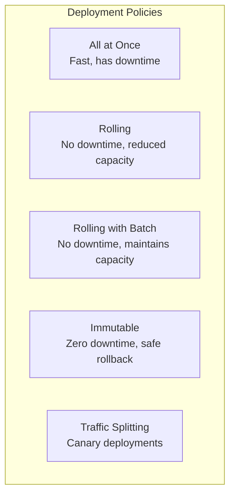
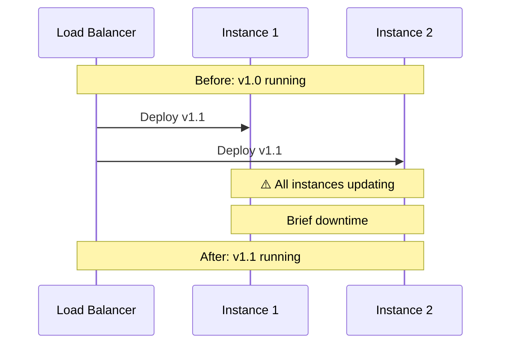
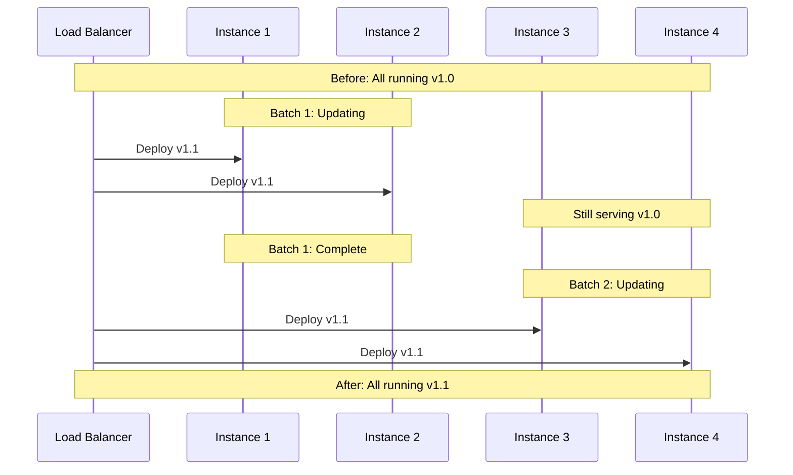
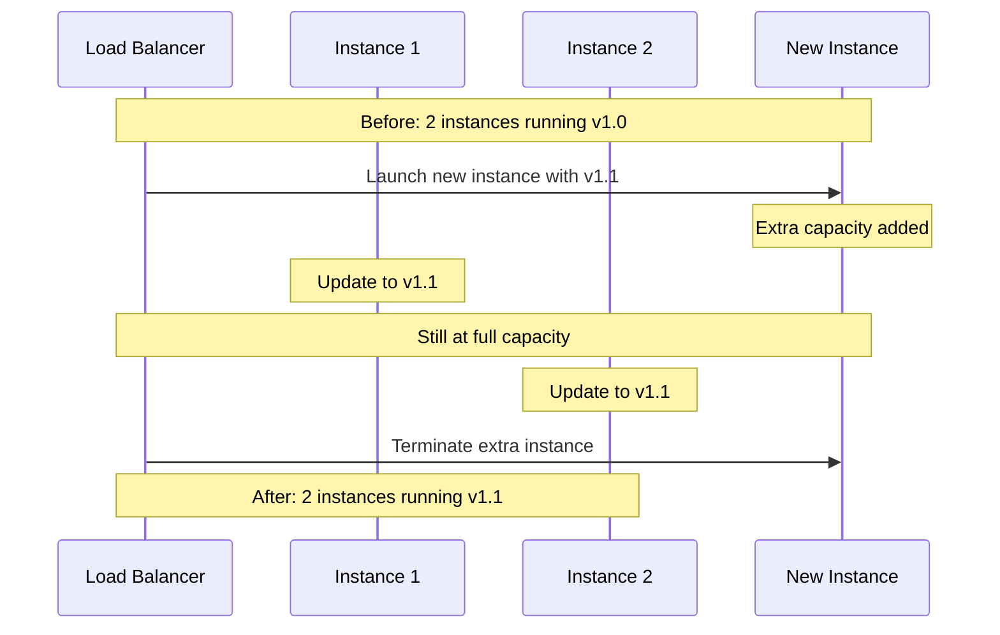
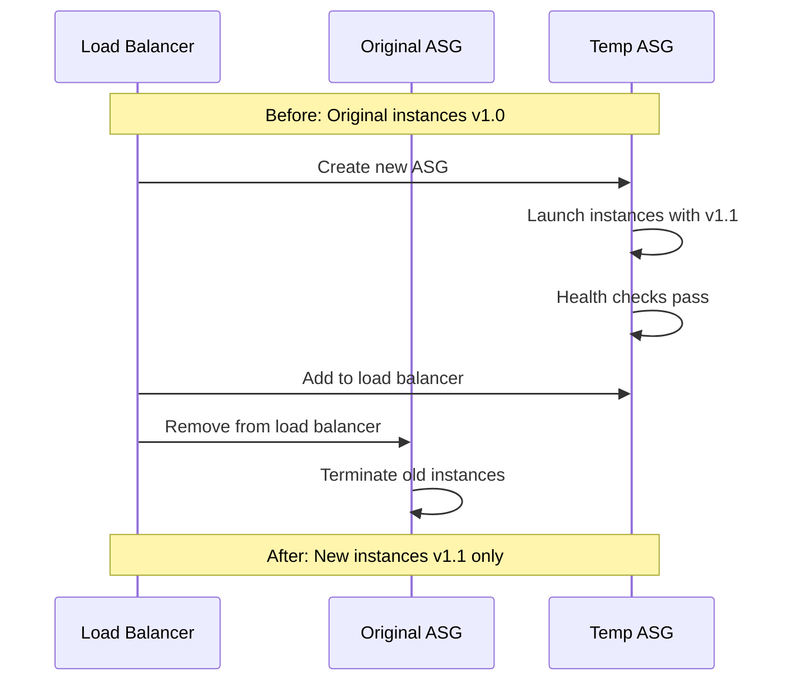
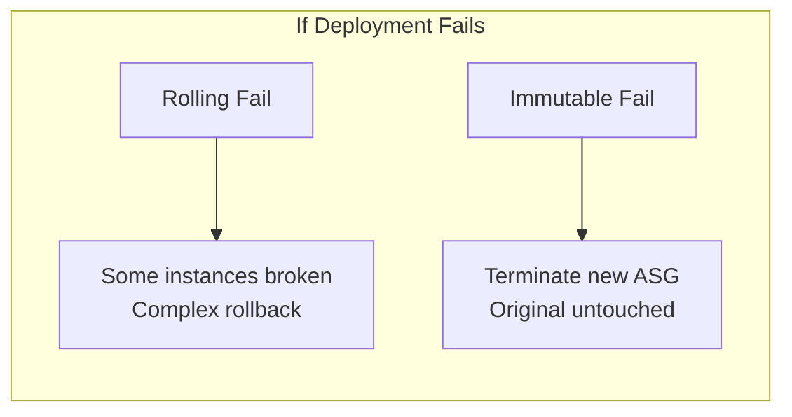
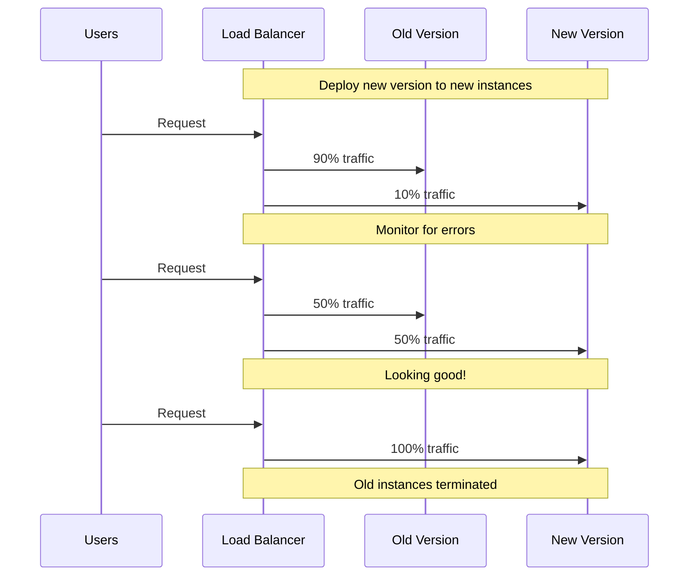
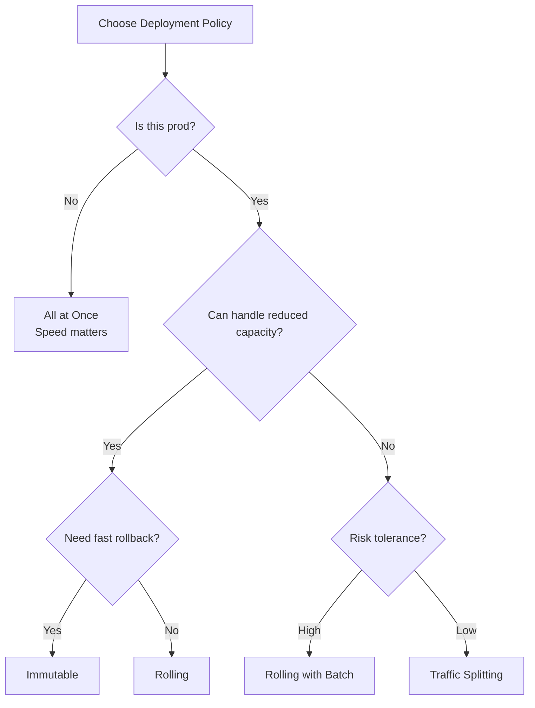

# Deployment Strategies

## Alex's Deployment Dilemma

Alex is about to deploy a major update to the ML model. Maya warns:

"Be careful with your deployment strategy. Last month, someone used 'All at once' for a production update. All instances went down at the same time. 5 minutes of downtime, angry users, CTO not happy."

Alex asks: "What strategy should I use?"

## Available Deployment Policies



## All at Once

Deploys to all instances simultaneously.



### Characteristics

| Aspect | Value |
|--------|-------|
| Downtime | Yes (brief) |
| Deploy time | Fastest |
| Rollback | Redeploy previous version |
| Cost | No additional cost |
| Best for | Development environments |

```bash
# Configure all-at-once deployment
aws elasticbeanstalk update-environment \
    --environment-name pettracker-ml-dev \
    --option-settings \
        Namespace=aws:elasticbeanstalk:command,OptionName=DeploymentPolicy,Value=AllAtOnce
```

## Rolling

Deploys in batches, keeping some instances serving traffic.



### Characteristics

| Aspect | Value |
|--------|-------|
| Downtime | No |
| Deploy time | Moderate |
| Capacity | Reduced during deployment |
| Rollback | Redeploy (takes time) |
| Cost | No additional cost |
| Best for | Non-critical production |

```bash
# Configure rolling deployment
aws elasticbeanstalk update-environment \
    --environment-name pettracker-ml-staging \
    --option-settings \
        Namespace=aws:elasticbeanstalk:command,OptionName=DeploymentPolicy,Value=Rolling \
        Namespace=aws:elasticbeanstalk:command,OptionName=BatchSizeType,Value=Percentage \
        Namespace=aws:elasticbeanstalk:command,OptionName=BatchSize,Value=25
```

### Batch Size Options

```bash
# Percentage (25% of instances at a time)
Namespace=aws:elasticbeanstalk:command,OptionName=BatchSizeType,Value=Percentage
Namespace=aws:elasticbeanstalk:command,OptionName=BatchSize,Value=25

# Fixed number (2 instances at a time)
Namespace=aws:elasticbeanstalk:command,OptionName=BatchSizeType,Value=Fixed
Namespace=aws:elasticbeanstalk:command,OptionName=BatchSize,Value=2
```

## Rolling with Additional Batch

Launches new instances first, maintains full capacity throughout.



### Characteristics

| Aspect | Value |
|--------|-------|
| Downtime | No |
| Deploy time | Moderate to slow |
| Capacity | Maintained (temporarily higher) |
| Rollback | Redeploy (takes time) |
| Cost | Temporarily higher |
| Best for | Production with capacity concerns |

```bash
# Configure rolling with additional batch
aws elasticbeanstalk update-environment \
    --environment-name pettracker-ml-prod \
    --option-settings \
        Namespace=aws:elasticbeanstalk:command,OptionName=DeploymentPolicy,Value=RollingWithAdditionalBatch \
        Namespace=aws:elasticbeanstalk:command,OptionName=BatchSizeType,Value=Fixed \
        Namespace=aws:elasticbeanstalk:command,OptionName=BatchSize,Value=1
```

## Immutable

Creates entirely new instances, swaps when healthy.



### Characteristics

| Aspect | Value |
|--------|-------|
| Downtime | No |
| Deploy time | Slowest |
| Capacity | Doubled temporarily |
| Rollback | Instant (just terminate new ASG) |
| Cost | Double during deployment |
| Best for | Critical production, risk-averse |

```bash
# Configure immutable deployment
aws elasticbeanstalk update-environment \
    --environment-name pettracker-ml-prod \
    --option-settings \
        Namespace=aws:elasticbeanstalk:command,OptionName=DeploymentPolicy,Value=Immutable
```

### Why Immutable is Safest



## Traffic Splitting (Canary)

Gradually shift traffic to new version.



### Characteristics

| Aspect | Value |
|--------|-------|
| Downtime | No |
| Deploy time | Configurable |
| Capacity | Extra during evaluation |
| Rollback | Instant |
| Cost | Higher during evaluation |
| Best for | High-risk changes, A/B testing |

```bash
# Configure traffic splitting
aws elasticbeanstalk update-environment \
    --environment-name pettracker-ml-prod \
    --option-settings \
        Namespace=aws:elasticbeanstalk:command,OptionName=DeploymentPolicy,Value=TrafficSplitting \
        Namespace=aws:elasticbeanstalk:trafficsplitting,OptionName=NewVersionPercent,Value=10 \
        Namespace=aws:elasticbeanstalk:trafficsplitting,OptionName=EvaluationTime,Value=5
```

## Comparison Table

| Policy | Downtime | Speed | Cost | Rollback | Risk |
|--------|----------|-------|------|----------|------|
| All at Once | Yes | ⚡ Fast | $ | Slow | High |
| Rolling | No | 🐢 Moderate | $ | Slow | Medium |
| Rolling + Batch | No | 🐢 Moderate | $$ | Slow | Medium |
| Immutable | No | 🐌 Slow | $$$ | ⚡ Fast | Low |
| Traffic Split | No | 🐌 Slow | $$$ | ⚡ Fast | Lowest |

## Alex's Decision Matrix



Alex's choices:
- **Development**: All at Once (fast iteration)
- **Staging**: Rolling (test deployments)
- **Production**: Immutable (safe rollback)

## Configuration Examples

### Via .ebextensions

```yaml
# .ebextensions/deployment.config
option_settings:
  aws:elasticbeanstalk:command:
    DeploymentPolicy: Immutable
    Timeout: 600
    IgnoreHealthCheck: false

  aws:autoscaling:updatepolicy:rollingupdate:
    RollingUpdateEnabled: true
    RollingUpdateType: Immutable
```

### Via EB CLI

```bash
# Create config file for different environments
cat > .elasticbeanstalk/deploy-prod.yml << 'EOF'
option_settings:
  aws:elasticbeanstalk:command:
    DeploymentPolicy: Immutable
EOF

# Apply to environment
eb config put deploy-prod
eb config --cfg deploy-prod
```

## Health Check During Deployment

```bash
# Configure health check settings
aws elasticbeanstalk update-environment \
    --environment-name pettracker-ml-prod \
    --option-settings \
        Namespace=aws:elasticbeanstalk:command,OptionName=IgnoreHealthCheck,Value=false \
        Namespace=aws:elasticbeanstalk:environment:process:default,OptionName=HealthCheckPath,Value=/health \
        Namespace=aws:elasticbeanstalk:environment:process:default,OptionName=HealthCheckInterval,Value=15 \
        Namespace=aws:elasticbeanstalk:environment:process:default,OptionName=HealthyThresholdCount,Value=2
```

## Exam Tips

**For DVA-C02:**

1. **All at Once**: Fastest, has downtime
2. **Rolling**: No downtime, reduced capacity
3. **Rolling with Batch**: Maintains full capacity
4. **Immutable**: New ASG, safest rollback
5. **Traffic Splitting**: Canary deployment

**Common scenarios:**

> "Zero downtime, must maintain full capacity..."
> → Rolling with additional batch or Immutable

> "Need instant rollback capability..."
> → Immutable or Traffic Splitting

> "Development environment, speed matters..."
> → All at Once

> "Gradually test new version with real traffic..."
> → Traffic Splitting

## Key Takeaways

1. **All at Once** for development (fast but risky)
2. **Rolling** for staging (no downtime, some risk)
3. **Rolling with Batch** maintains capacity during deployment
4. **Immutable** safest for production (instant rollback)
5. **Traffic Splitting** for canary deployments
6. **Choose based on** risk tolerance, speed needs, and cost

---

*Next: Alex learns to customize environments with .ebextensions.*
