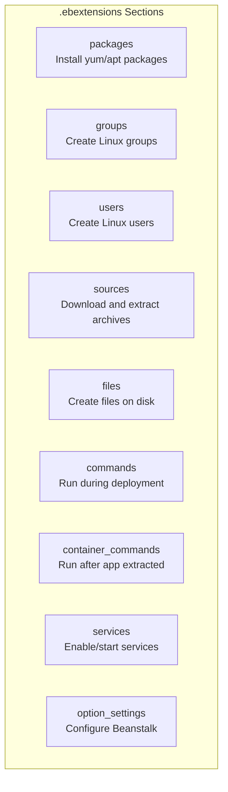
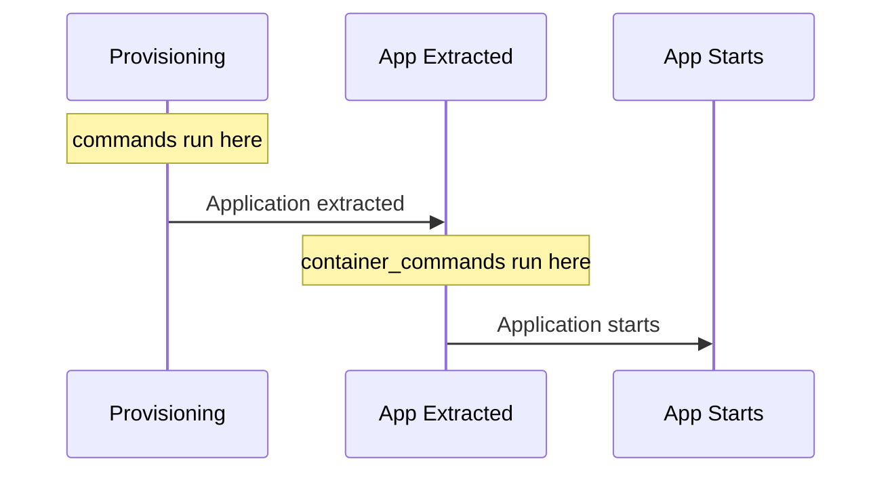

# Configuration with .ebextensions

## Alex's Customization Needs

Alex's ML application has specific requirements:
- Custom Python packages that need compilation
- System packages (libGL for image processing)
- Environment variables for model configuration
- Specific nginx configuration for large file uploads
- Startup script to warm up the model

"How do I customize the Beanstalk environment?" Alex asks Maya.

".ebextensions," Maya answers. "It's how you tell Beanstalk exactly what you need."

## What is .ebextensions?

A directory containing YAML configuration files that customize your Beanstalk environment:

```
pettracker-ml/
├── .ebextensions/
│   ├── 01-packages.config
│   ├── 02-files.config
│   ├── 03-commands.config
│   ├── 04-services.config
│   └── 05-options.config
├── application.py
├── requirements.txt
└── ...
```

**Key rules:**
- Files must be in `.ebextensions/` directory
- Files must end in `.config`
- Files are processed in **alphabetical order**
- YAML format (indentation matters!)

## Configuration Sections



## packages

Install operating system packages:

```yaml
# .ebextensions/01-packages.config
packages:
  yum:
    gcc: []
    python3-devel: []
    mesa-libGL: []
    mesa-libGL-devel: []

  # For multiple package managers
  rpm:
    epel-release: "https://dl.fedoraproject.org/pub/epel/epel-release-latest-7.noarch.rpm"
```

## files

Create files on the instance:

```yaml
# .ebextensions/02-files.config
files:
  # Create nginx config for large uploads
  "/etc/nginx/conf.d/proxy.conf":
    mode: "000644"
    owner: root
    group: root
    content: |
      client_max_body_size 50M;
      proxy_read_timeout 300;
      proxy_connect_timeout 300;
      proxy_send_timeout 300;

  # Create application config from environment variable
  "/opt/pettracker/config.json":
    mode: "000644"
    owner: webapp
    group: webapp
    content: |
      {
        "model_path": "/var/app/current/models",
        "log_level": "INFO"
      }

  # Download file from S3
  "/opt/pettracker/ml-model.h5":
    mode: "000644"
    owner: webapp
    group: webapp
    source: https://pettracker-models.s3.amazonaws.com/breed-model-v2.h5
    authentication: S3Access

Resources:
  AWSEBAutoScalingGroup:
    Metadata:
      AWS::CloudFormation::Authentication:
        S3Access:
          type: S3
          roleName: aws-elasticbeanstalk-ec2-role
          buckets:
            - pettracker-models
```

## commands

Run commands during instance provisioning:

```yaml
# .ebextensions/03-commands.config
commands:
  01_install_pip_packages:
    command: pip3 install --upgrade pip setuptools wheel
    ignoreErrors: false

  02_create_directories:
    command: mkdir -p /opt/pettracker/logs /opt/pettracker/cache
    test: "[ ! -d /opt/pettracker ]"

  03_set_permissions:
    command: chown -R webapp:webapp /opt/pettracker
```

### Command Options

```yaml
commands:
  my_command:
    command: "echo 'Hello World'"
    cwd: /home/ec2-user          # Working directory
    env:                          # Environment variables
      MY_VAR: "value"
    test: "[ -f /path/to/file ]"  # Only run if test passes
    ignoreErrors: true            # Continue on failure
    leader_only: true             # Only run on leader instance
```

## container_commands

Run **after** the application is extracted but **before** it starts:

```yaml
# .ebextensions/04-container-commands.config
container_commands:
  01_migrate_database:
    command: python manage.py migrate --noinput
    leader_only: true  # Only run on one instance

  02_collect_static:
    command: python manage.py collectstatic --noinput

  03_warm_model:
    command: python warm_model.py
    cwd: /var/app/staging

  04_run_tests:
    command: python -m pytest tests/ --tb=short
    ignoreErrors: true
```

### commands vs container_commands



| Feature | commands | container_commands |
|---------|----------|-------------------|
| When | During provisioning | After app extraction |
| App access | No | Yes |
| leader_only | No | Yes |
| Use for | System setup | App initialization |

## option_settings

Configure Beanstalk environment options:

```yaml
# .ebextensions/05-options.config
option_settings:
  # Environment variables
  aws:elasticbeanstalk:application:environment:
    MODEL_PATH: /var/app/current/models
    PYTHONPATH: /var/app/current
    LOG_LEVEL: INFO
    MAX_WORKERS: 4

  # Auto Scaling configuration
  aws:autoscaling:asg:
    MinSize: 2
    MaxSize: 10
    Cooldown: 300

  aws:autoscaling:launchconfiguration:
    InstanceType: c5.large
    RootVolumeSize: 50

  # Load balancer settings
  aws:elasticbeanstalk:environment:
    EnvironmentType: LoadBalanced
    LoadBalancerType: application

  aws:elbv2:listener:443:
    Protocol: HTTPS
    SSLCertificateArns: arn:aws:acm:us-east-1:123456789012:certificate/abc123

  # Health check
  aws:elasticbeanstalk:environment:process:default:
    HealthCheckPath: /health
    HealthCheckInterval: 15
    HealthyThresholdCount: 2
    UnhealthyThresholdCount: 3

  # Deployment policy
  aws:elasticbeanstalk:command:
    DeploymentPolicy: Immutable
    Timeout: 600
```

## services

Manage system services:

```yaml
# .ebextensions/06-services.config
services:
  sysvinit:
    nginx:
      enabled: true
      ensureRunning: true
      files:
        - "/etc/nginx/nginx.conf"
        - "/etc/nginx/conf.d/proxy.conf"
      sources:
        - "/var/app/current"

    pettracker-worker:
      enabled: true
      ensureRunning: true
      files:
        - "/etc/systemd/system/pettracker-worker.service"
```

## Alex's Complete Configuration

```yaml
# .ebextensions/pettracker.config
packages:
  yum:
    gcc: []
    python3-devel: []
    mesa-libGL: []

files:
  "/etc/nginx/conf.d/upload.conf":
    mode: "000644"
    owner: root
    group: root
    content: |
      client_max_body_size 100M;

  "/opt/aws/amazon-cloudwatch-agent/etc/config.json":
    mode: "000644"
    owner: root
    group: root
    content: |
      {
        "logs": {
          "logs_collected": {
            "files": {
              "collect_list": [
                {
                  "file_path": "/var/log/web.stdout.log",
                  "log_group_name": "/pettracker/web"
                }
              ]
            }
          }
        }
      }

commands:
  01_cloudwatch_agent:
    command: |
      yum install -y amazon-cloudwatch-agent
      /opt/aws/amazon-cloudwatch-agent/bin/amazon-cloudwatch-agent-ctl \
        -a fetch-config -m ec2 -s \
        -c file:/opt/aws/amazon-cloudwatch-agent/etc/config.json

container_commands:
  01_download_model:
    command: aws s3 cp s3://pettracker-models/breed-model-v2.h5 /var/app/staging/models/
    leader_only: false  # All instances need the model

  02_warm_model:
    command: python warm_model.py
    cwd: /var/app/staging

option_settings:
  aws:elasticbeanstalk:application:environment:
    MODEL_PATH: /var/app/current/models/breed-model-v2.h5
    PYTHONPATH: /var/app/current

  aws:elasticbeanstalk:environment:process:default:
    HealthCheckPath: /health
    HealthCheckInterval: 10

  aws:autoscaling:launchconfiguration:
    InstanceType: c5.large

services:
  sysvinit:
    nginx:
      enabled: true
      ensureRunning: true
```

## Common Patterns

### Database Migration

```yaml
container_commands:
  01_migrate:
    command: python manage.py migrate
    leader_only: true  # Only one instance runs migrations
```

### Custom Logging

```yaml
files:
  "/etc/awslogs/config/webapp.conf":
    content: |
      [/var/log/webapp.log]
      log_group_name = /pettracker/webapp
      log_stream_name = {instance_id}
      datetime_format = %Y-%m-%d %H:%M:%S
```

### SSL/HTTPS Setup

```yaml
option_settings:
  aws:elbv2:listener:443:
    Protocol: HTTPS
    SSLCertificateArns: arn:aws:acm:region:account:certificate/id

  aws:elbv2:listener:80:
    Protocol: HTTP
    Rules: default
```

## Debugging .ebextensions

```bash
# Check config file syntax
python -c "import yaml; yaml.safe_load(open('.ebextensions/config.config'))"

# View logs after deployment
eb logs
# Look in /var/log/cfn-init.log for ebextension errors

# SSH and check manually
eb ssh
sudo cat /var/log/cfn-init.log
sudo cat /var/log/eb-engine.log
```

## Exam Tips

**For DVA-C02:**

1. **Files must end in .config** and be YAML format
2. **Processed alphabetically** (use number prefixes)
3. **commands** run before app extraction
4. **container_commands** run after, support `leader_only`
5. **option_settings** configures Beanstalk options

**Common scenarios:**

> "Install system packages for app..."
> → packages section

> "Run database migrations once..."
> → container_commands with leader_only: true

> "Create configuration files..."
> → files section

> "Set environment variables..."
> → option_settings: aws:elasticbeanstalk:application:environment

## Key Takeaways

1. **.ebextensions** customizes Beanstalk environments
2. **YAML format** with specific sections
3. **commands** for system setup, **container_commands** for app init
4. **leader_only** ensures one-time operations
5. **option_settings** configures all Beanstalk options
6. **Debug with logs** in /var/log/cfn-init.log

---

*Next: Alex learns about platform hooks for even more customization.*

---
*v2.0*
