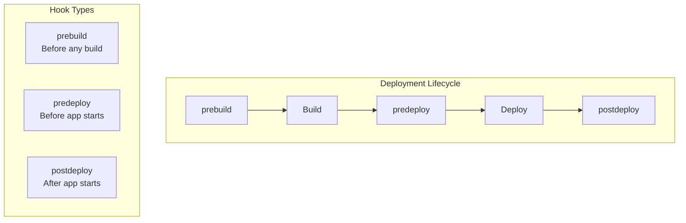
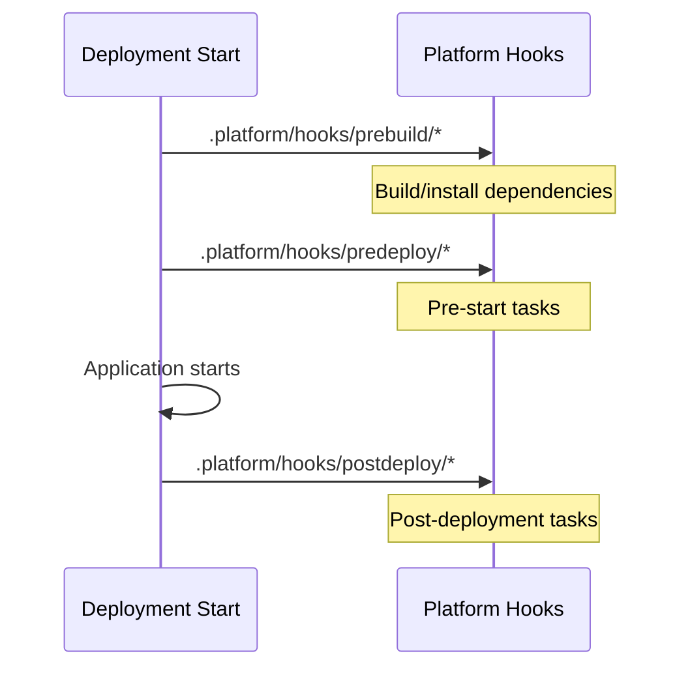
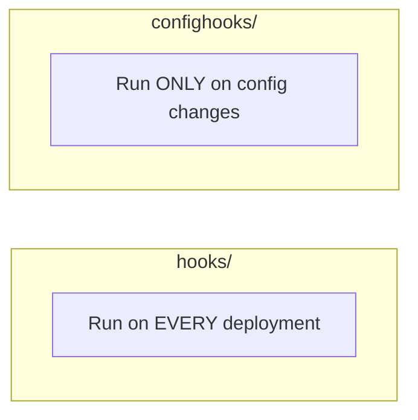

# Platform Hooks and Customization

## Beyond .ebextensions

Alex's deployment needs are growing more complex:
- Run a specific script when deployment starts
- Clean up old files before new deployment
- Validate configuration after deployment
- Run custom health checks

Maya introduces platform hooks: "These give you precise control over the deployment lifecycle."

## Platform Hooks Overview



## Hook Directory Structure

```
.platform/
├── hooks/
│   ├── prebuild/        # Before build phase
│   │   └── 01_install_deps.sh
│   ├── predeploy/       # Before deployment
│   │   └── 01_warm_cache.sh
│   └── postdeploy/      # After deployment
│       └── 01_notify_slack.sh
├── confighooks/
│   ├── prebuild/        # On config changes only
│   ├── predeploy/
│   └── postdeploy/
├── nginx/
│   └── conf.d/
│       └── custom.conf  # Custom nginx configs
└── httpd/
    └── conf.d/
        └── custom.conf  # Custom Apache configs
```

## Hook Execution Order



### Full Lifecycle

| Phase | When | Use For |
|-------|------|---------|
| prebuild | Before anything | System deps, tools |
| predeploy | Before app starts | Warmup, validation |
| postdeploy | After app starts | Notifications, cleanup |

## Creating Hooks

Hooks are shell scripts:

```bash
# .platform/hooks/prebuild/01_install_tools.sh
#!/bin/bash
set -e

echo "Installing additional tools..."
yum install -y jq htop

# Install custom Python packages
pip3 install tensorflow==2.13.0 --no-cache-dir
```

```bash
# .platform/hooks/predeploy/01_warm_model.sh
#!/bin/bash
set -e

echo "Warming up ML model..."
cd /var/app/staging

# Pre-load model into memory cache
python3 << 'EOF'
import tensorflow as tf
model = tf.keras.models.load_model('breed_model.h5')
# Run a dummy prediction to warm up
import numpy as np
dummy = np.zeros((1, 224, 224, 3))
model.predict(dummy)
print("Model warmed up successfully")
EOF
```

```bash
# .platform/hooks/postdeploy/01_notify_slack.sh
#!/bin/bash
set -e

# Get deployment info from instance metadata
TOKEN=$(curl -X PUT "http://169.254.169.254/latest/api/token" \
    -H "X-aws-ec2-metadata-token-ttl-seconds: 21600")
INSTANCE_ID=$(curl -H "X-aws-ec2-metadata-token: $TOKEN" \
    http://169.254.169.254/latest/meta-data/instance-id)

# Send Slack notification
curl -X POST "$SLACK_WEBHOOK_URL" \
    -H "Content-Type: application/json" \
    -d "{
        \"text\": \"Deployment complete on $INSTANCE_ID\",
        \"channel\": \"#deployments\"
    }"
```

### Making Hooks Executable

**Important**: Hooks must be executable!

```bash
# Make all hooks executable
chmod +x .platform/hooks/prebuild/*.sh
chmod +x .platform/hooks/predeploy/*.sh
chmod +x .platform/hooks/postdeploy/*.sh

# Or set in git
git update-index --chmod=+x .platform/hooks/prebuild/01_install_tools.sh
```

## Config Hooks vs Regular Hooks



```bash
# .platform/confighooks/postdeploy/01_reload_nginx.sh
#!/bin/bash
# Only runs when configuration changes
systemctl reload nginx
```

## Custom Nginx Configuration

```nginx
# .platform/nginx/conf.d/elasticbeanstalk/
# Files here extend the default nginx config

# .platform/nginx/conf.d/custom.conf
# Large file uploads
client_max_body_size 100M;

# Longer timeouts for ML inference
proxy_read_timeout 300;
proxy_connect_timeout 60;
proxy_send_timeout 300;

# Custom headers
add_header X-Frame-Options "SAMEORIGIN" always;
add_header X-Content-Type-Options "nosniff" always;
```

### Complete Nginx Override

```nginx
# .platform/nginx/nginx.conf
# Complete nginx configuration override

user nginx;
worker_processes auto;
error_log /var/log/nginx/error.log;
pid /run/nginx.pid;

events {
    worker_connections 1024;
}

http {
    include /etc/nginx/mime.types;
    default_type application/octet-stream;

    log_format main '$remote_addr - $remote_user [$time_local] "$request" '
                    '$status $body_bytes_sent "$http_referer" '
                    '"$http_user_agent" "$http_x_forwarded_for"';

    access_log /var/log/nginx/access.log main;

    sendfile on;
    keepalive_timeout 65;

    include /etc/nginx/conf.d/*.conf;

    server {
        listen 80;
        server_name _;

        location / {
            proxy_pass http://127.0.0.1:5000;
            proxy_set_header Host $host;
            proxy_set_header X-Real-IP $remote_addr;
            proxy_set_header X-Forwarded-For $proxy_add_x_forwarded_for;
        }

        location /health {
            proxy_pass http://127.0.0.1:5000/health;
            proxy_read_timeout 5;
        }
    }
}
```

## Procfile

Define how your application starts:

```procfile
# Procfile
web: gunicorn --bind 127.0.0.1:5000 --workers 4 --timeout 120 application:application
```

### Multiple Processes

```procfile
# Procfile for multiple processes
web: gunicorn --bind 127.0.0.1:5000 application:application
worker: python worker.py
scheduler: python scheduler.py
```

## Alex's Complete Platform Configuration

```
.platform/
├── hooks/
│   ├── prebuild/
│   │   └── 01_install_system_deps.sh
│   ├── predeploy/
│   │   ├── 01_download_model.sh
│   │   └── 02_warm_model.sh
│   └── postdeploy/
│       ├── 01_health_check.sh
│       └── 02_notify_team.sh
├── nginx/
│   └── conf.d/
│       └── pettracker.conf
└── Procfile
```

### prebuild/01_install_system_deps.sh

```bash
#!/bin/bash
set -e
echo "Installing system dependencies..."
yum install -y mesa-libGL mesa-libGL-devel
```

### predeploy/01_download_model.sh

```bash
#!/bin/bash
set -e
echo "Downloading latest model from S3..."

MODEL_VERSION=${MODEL_VERSION:-latest}
aws s3 cp "s3://pettracker-models/${MODEL_VERSION}/breed-model.h5" \
    /var/app/staging/models/breed-model.h5
```

### predeploy/02_warm_model.sh

```bash
#!/bin/bash
set -e
echo "Warming up model..."

cd /var/app/staging
python3 -c "
import tensorflow as tf
import numpy as np
model = tf.keras.models.load_model('models/breed-model.h5')
model.predict(np.zeros((1, 224, 224, 3)))
print('Model warm-up complete')
"
```

### postdeploy/01_health_check.sh

```bash
#!/bin/bash
set -e

echo "Running post-deployment health check..."

# Wait for app to start
sleep 10

# Check health endpoint
response=$(curl -s -o /dev/null -w "%{http_code}" http://localhost:5000/health)

if [ "$response" != "200" ]; then
    echo "Health check failed with status: $response"
    exit 1
fi

echo "Health check passed"
```

### postdeploy/02_notify_team.sh

```bash
#!/bin/bash
set -e

# Skip on non-production environments
if [ "$ENVIRONMENT" != "production" ]; then
    echo "Skipping notification for non-production"
    exit 0
fi

curl -X POST "$SLACK_WEBHOOK" \
    -H "Content-Type: application/json" \
    -d '{
        "text": "PetTracker ML deployed successfully!",
        "attachments": [{
            "color": "good",
            "fields": [
                {"title": "Environment", "value": "'"$ENVIRONMENT"'", "short": true},
                {"title": "Version", "value": "'"$APP_VERSION"'", "short": true}
            ]
        }]
    }'
```

### nginx/conf.d/pettracker.conf

```nginx
# Upload size for pet photos
client_max_body_size 50M;

# Longer timeout for ML inference
proxy_read_timeout 120;

# Gzip compression
gzip on;
gzip_types application/json;
```

## Debugging Platform Hooks

```bash
# View hook execution logs
eb ssh
sudo cat /var/log/eb-hooks.log

# View specific phase logs
sudo cat /var/log/cfn-init.log
sudo cat /var/log/eb-engine.log

# Test hook manually
sudo /var/app/staging/.platform/hooks/predeploy/01_warm_model.sh
```

## .ebextensions vs .platform

| Feature | .ebextensions | .platform |
|---------|--------------|-----------|
| Format | YAML config files | Shell scripts |
| Timing | Various sections | Specific lifecycle phases |
| Nginx | Through files: section | Direct config files |
| Use | General config | Lifecycle hooks |

**Use both together:**
- `.ebextensions` for Beanstalk options and environment variables
- `.platform` for lifecycle hooks and nginx/httpd configuration

## Exam Tips

**For DVA-C02:**

1. **.platform/hooks/** for deployment lifecycle scripts
2. **prebuild** → **predeploy** → **postdeploy** order
3. **confighooks** only run on configuration changes
4. **.platform/nginx/** for nginx customization
5. **Procfile** defines how application starts

**Common scenarios:**

> "Run script before application starts..."
> → .platform/hooks/predeploy/

> "Custom nginx configuration..."
> → .platform/nginx/conf.d/

> "Notify team after deployment..."
> → .platform/hooks/postdeploy/

## Key Takeaways

1. **Platform hooks** provide lifecycle customization
2. **Three phases**: prebuild, predeploy, postdeploy
3. **confighooks** only run on config changes
4. **Nginx configs** go in .platform/nginx/
5. **Procfile** defines application startup
6. **Scripts must be executable**

---

*Next: Alex learns about environment configuration management.*

---
*v1.0*
