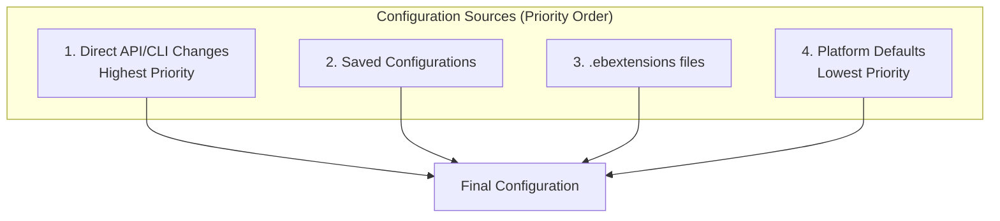

# Environment Configuration

## Alex's Multi-Environment Challenge

PetTracker now needs three environments:
- **Development**: For testing new features
- **Staging**: For QA before production
- **Production**: Live user traffic

"Each environment needs different settings," Alex realizes. "Dev needs debugging, staging needs test database, prod needs high availability."

## Environment Variables

### Setting Environment Variables

```bash
# Via EB CLI
eb setenv \
    MODEL_PATH=/var/app/current/models/breed-model.h5 \
    DEBUG=false \
    DB_HOST=prod-db.cluster-xyz.us-east-1.rds.amazonaws.com \
    MAX_WORKERS=4

# Via AWS CLI
aws elasticbeanstalk update-environment \
    --environment-name pettracker-ml-prod \
    --option-settings \
        Namespace=aws:elasticbeanstalk:application:environment,OptionName=MODEL_PATH,Value=/var/app/current/models/breed-model.h5 \
        Namespace=aws:elasticbeanstalk:application:environment,OptionName=DEBUG,Value=false
```

### Viewing Environment Variables

```bash
# Via EB CLI
eb printenv
Environment Variables:
  DB_HOST = prod-db.cluster-xyz.us-east-1.rds.amazonaws.com
  DEBUG = false
  MAX_WORKERS = 4
  MODEL_PATH = /var/app/current/models/breed-model.h5

# Via AWS CLI
aws elasticbeanstalk describe-configuration-settings \
    --application-name pettracker-ml \
    --environment-name pettracker-ml-prod \
    --query 'ConfigurationSettings[0].OptionSettings[?Namespace==`aws:elasticbeanstalk:application:environment`]'
```

### Environment-Specific Configurations

```yaml
# .ebextensions/env-vars.config

# Use conditional logic based on environment name
option_settings:
  aws:elasticbeanstalk:application:environment:
    APP_NAME: pettracker-ml
    LOG_LEVEL: INFO
```

```python
# application.py - Use environment variables
import os

DEBUG = os.environ.get('DEBUG', 'false').lower() == 'true'
DB_HOST = os.environ.get('DB_HOST', 'localhost')
MODEL_PATH = os.environ.get('MODEL_PATH', './models/breed-model.h5')
MAX_WORKERS = int(os.environ.get('MAX_WORKERS', '2'))
```

## Saved Configurations

Save and reuse environment configurations:

```bash
# Save current environment configuration
eb config save pettracker-ml-prod --cfg production-config

# Creates: .elasticbeanstalk/saved_configs/production-config.cfg.yml
```

### Saved Configuration File

```yaml
# .elasticbeanstalk/saved_configs/production-config.cfg.yml
EnvironmentConfigurationMetadata:
  Description: Production configuration for PetTracker ML
  DateCreated: '1705329600000'
  DateModified: '1705329600000'

Platform:
  PlatformArn: arn:aws:elasticbeanstalk:us-east-1::platform/Python 3.9 running on 64bit Amazon Linux 2/3.5.0

OptionSettings:
  aws:autoscaling:asg:
    MaxSize: '10'
    MinSize: '2'

  aws:autoscaling:launchconfiguration:
    InstanceType: c5.large
    RootVolumeSize: '50'
    RootVolumeType: gp3

  aws:elasticbeanstalk:command:
    DeploymentPolicy: Immutable
    Timeout: '600'

  aws:elasticbeanstalk:environment:
    EnvironmentType: LoadBalanced
    LoadBalancerType: application

  aws:elasticbeanstalk:environment:process:default:
    HealthCheckPath: /health
    HealthCheckInterval: '15'

  aws:elasticbeanstalk:application:environment:
    DEBUG: 'false'
    LOG_LEVEL: INFO
    MAX_WORKERS: '4'
```

### Using Saved Configurations

```bash
# Create new environment from saved config
eb create pettracker-ml-staging --cfg production-config

# Apply saved config to existing environment
eb config pettracker-ml-staging --cfg production-config

# Update saved config
eb config save pettracker-ml-prod --cfg production-config
```

## Configuration Hierarchy



When the same setting exists in multiple places, **higher priority wins**.

## Alex's Environment Matrix

| Setting | Development | Staging | Production |
|---------|-------------|---------|------------|
| Instance Type | t3.small | c5.large | c5.large |
| Min Instances | 1 | 2 | 2 |
| Max Instances | 2 | 5 | 10 |
| Deployment | All at Once | Rolling | Immutable |
| DEBUG | true | true | false |
| LOG_LEVEL | DEBUG | INFO | WARNING |
| DB_HOST | dev-db | staging-db | prod-db |

### Development Configuration

```yaml
# .elasticbeanstalk/saved_configs/development.cfg.yml
OptionSettings:
  aws:autoscaling:launchconfiguration:
    InstanceType: t3.small

  aws:autoscaling:asg:
    MinSize: '1'
    MaxSize: '2'

  aws:elasticbeanstalk:command:
    DeploymentPolicy: AllAtOnce

  aws:elasticbeanstalk:environment:
    EnvironmentType: SingleInstance

  aws:elasticbeanstalk:application:environment:
    DEBUG: 'true'
    LOG_LEVEL: DEBUG
    DB_HOST: dev-db.internal
```

### Staging Configuration

```yaml
# .elasticbeanstalk/saved_configs/staging.cfg.yml
OptionSettings:
  aws:autoscaling:launchconfiguration:
    InstanceType: c5.large

  aws:autoscaling:asg:
    MinSize: '2'
    MaxSize: '5'

  aws:elasticbeanstalk:command:
    DeploymentPolicy: Rolling

  aws:elasticbeanstalk:application:environment:
    DEBUG: 'true'
    LOG_LEVEL: INFO
    DB_HOST: staging-db.internal
```

### Production Configuration

```yaml
# .elasticbeanstalk/saved_configs/production.cfg.yml
OptionSettings:
  aws:autoscaling:launchconfiguration:
    InstanceType: c5.large

  aws:autoscaling:asg:
    MinSize: '2'
    MaxSize: '10'

  aws:elasticbeanstalk:command:
    DeploymentPolicy: Immutable

  aws:elasticbeanstalk:application:environment:
    DEBUG: 'false'
    LOG_LEVEL: WARNING
    DB_HOST: prod-db.cluster-xyz.us-east-1.rds.amazonaws.com
```

## Scaling Configuration

```yaml
# .ebextensions/scaling.config
option_settings:
  # Auto Scaling Group
  aws:autoscaling:asg:
    MinSize: 2
    MaxSize: 10
    Cooldown: 300

  # Scaling Triggers
  aws:autoscaling:trigger:
    MeasureName: CPUUtilization
    Statistic: Average
    Unit: Percent
    UpperThreshold: 70
    LowerThreshold: 30
    UpperBreachScaleIncrement: 2
    LowerBreachScaleIncrement: -1
    BreachDuration: 5
    Period: 1

  # Launch Configuration
  aws:autoscaling:launchconfiguration:
    InstanceType: c5.large
    MonitoringInterval: 1 minute
```

### Target Tracking Scaling

```yaml
# More sophisticated scaling
option_settings:
  aws:autoscaling:trigger:
    MeasureName: RequestCount
    Statistic: Sum
    Unit: Count
    Period: 1
    BreachDuration: 1
    UpperThreshold: 1000
    LowerThreshold: 100
```

## Load Balancer Configuration

```yaml
# .ebextensions/loadbalancer.config
option_settings:
  # Use Application Load Balancer
  aws:elasticbeanstalk:environment:
    LoadBalancerType: application

  # Configure listener
  aws:elbv2:listener:default:
    Protocol: HTTP
    ListenerEnabled: true

  # HTTPS listener
  aws:elbv2:listener:443:
    Protocol: HTTPS
    SSLCertificateArns: arn:aws:acm:us-east-1:123456789012:certificate/abc123
    SSLPolicy: ELBSecurityPolicy-TLS-1-2-2017-01

  # Health check
  aws:elasticbeanstalk:environment:process:default:
    HealthCheckPath: /health
    HealthCheckInterval: 15
    HealthCheckTimeout: 5
    HealthyThresholdCount: 2
    UnhealthyThresholdCount: 3
    MatcherHTTPCode: 200

  # Stickiness
  aws:elasticbeanstalk:environment:process:default:
    StickinessEnabled: true
    StickinessLBCookieDuration: 86400
```

## VPC Configuration

```yaml
# .ebextensions/vpc.config
option_settings:
  aws:ec2:vpc:
    VPCId: vpc-12345678
    Subnets: subnet-private1,subnet-private2
    ELBSubnets: subnet-public1,subnet-public2
    AssociatePublicIpAddress: false
    ELBScheme: public

  aws:autoscaling:launchconfiguration:
    SecurityGroups: sg-ml-servers
```

## Notifications

```yaml
# .ebextensions/notifications.config
option_settings:
  aws:elasticbeanstalk:sns:topics:
    Notification Endpoint: alex@pettracker.com
    Notification Protocol: email
    Notification Topic ARN: arn:aws:sns:us-east-1:123456789012:pettracker-alerts
```

## Configuration Templates for Teams

Alex creates a setup script for new team members:

```bash
#!/bin/bash
# setup-environments.sh

echo "Setting up PetTracker Beanstalk environments..."

# Initialize EB CLI
eb init pettracker-ml \
    --platform "Python 3.9 running on 64bit Amazon Linux 2" \
    --region us-east-1

# Create development environment
echo "Creating development environment..."
eb create pettracker-ml-dev \
    --cfg development \
    --single

# Create staging environment
echo "Creating staging environment..."
eb create pettracker-ml-staging \
    --cfg staging \
    --scale 2

# Create production environment
echo "Creating production environment..."
eb create pettracker-ml-prod \
    --cfg production \
    --scale 2

echo "All environments created!"
eb list
```

## Exam Tips

**For DVA-C02:**

1. **Environment variables** via option_settings namespace
2. **Saved configurations** are reusable templates
3. **Configuration priority**: API > Saved > .ebextensions > Platform
4. **Scaling triggers** can use various CloudWatch metrics
5. **ALB configuration** via aws:elbv2 namespace

**Common scenarios:**

> "Different settings for dev/staging/prod..."
> → Use saved configurations

> "Configure HTTPS on load balancer..."
> → aws:elbv2:listener:443 with certificate ARN

> "Scale based on request count..."
> → Configure aws:autoscaling:trigger

## Key Takeaways

1. **Environment variables** configure applications dynamically
2. **Saved configurations** enable consistent environments
3. **Priority order** determines which settings win
4. **Scaling triggers** automate capacity management
5. **Load balancer settings** control traffic handling
6. **Use configurations** for environment parity

---

*Next: Alex integrates databases with Elastic Beanstalk.*
