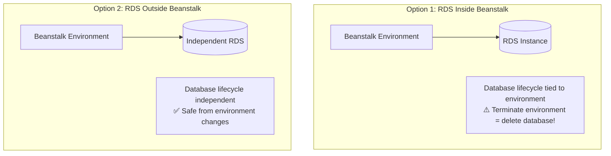
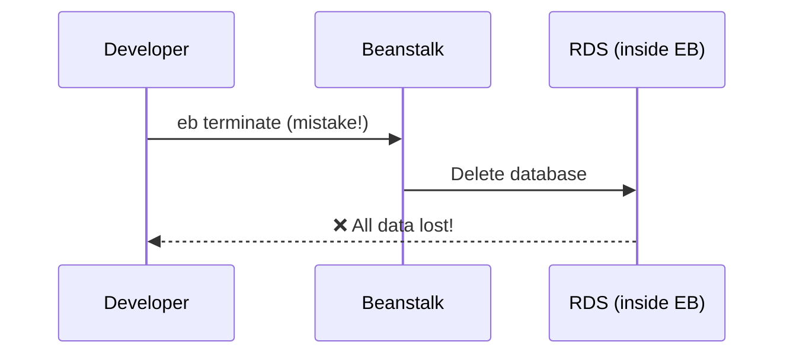
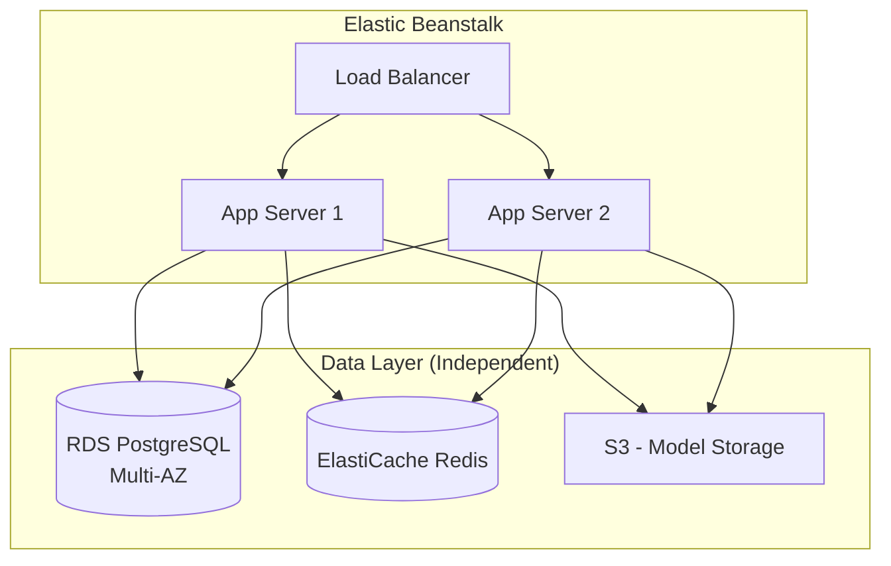

# Database Integration

## Alex's Database Dilemma

The ML server needs to store prediction results and user history. Alex asks: "Should I add the database directly to the Beanstalk environment?"

Sam warns: "Be very careful. There are two approaches, and choosing wrong can cause data loss."

## Two Approaches to RDS



### Comparison

| Aspect | RDS Inside EB | RDS Outside EB |
|--------|---------------|----------------|
| Setup | Easier | More steps |
| Lifecycle | Tied to environment | Independent |
| Terminate env | **Deletes database!** | Database safe |
| Blue/green deploy | Complicated | Simple |
| Best for | Development only | Staging/Production |

## Option 1: RDS Inside Beanstalk (Development Only)

```yaml
# .ebextensions/rds.config
# ⚠️ WARNING: Only for development!

Resources:
  AWSEBRDSDatabase:
    Type: AWS::RDS::DBInstance
    Properties:
      DBName: pettracker
      Engine: postgres
      DBInstanceClass: db.t3.micro
      AllocatedStorage: 20
      MasterUsername: pettracker
      MasterUserPassword: !Ref DBPassword

Parameters:
  DBPassword:
    Type: String
    NoEcho: true
    Default: MyDevPassword123

option_settings:
  aws:rds:dbinstance:
    DBEngine: postgres
    DBEngineVersion: 14.9
    DBInstanceClass: db.t3.micro
    DBAllocatedStorage: 20
    DBDeletionPolicy: Delete  # ⚠️ Deletes on terminate
    MultiAZDatabase: false
```

### Why This Is Dangerous for Production



## Option 2: RDS Outside Beanstalk (Recommended)

### Step 1: Create RDS Independently

```bash
# Create RDS instance
aws rds create-db-instance \
    --db-instance-identifier pettracker-prod-db \
    --db-instance-class db.t3.medium \
    --engine postgres \
    --engine-version 14.9 \
    --master-username pettracker \
    --master-user-password "SecurePassword123!" \
    --allocated-storage 50 \
    --storage-type gp3 \
    --vpc-security-group-ids sg-rds-pettracker \
    --db-subnet-group-name pettracker-db-subnet \
    --multi-az \
    --backup-retention-period 7 \
    --no-publicly-accessible

# Wait for creation
aws rds wait db-instance-available \
    --db-instance-identifier pettracker-prod-db

# Get endpoint
aws rds describe-db-instances \
    --db-instance-identifier pettracker-prod-db \
    --query 'DBInstances[0].Endpoint.Address' \
    --output text
# pettracker-prod-db.xyz.us-east-1.rds.amazonaws.com
```

### Step 2: Configure Security Groups

```bash
# Get Beanstalk security group
EB_SG=$(aws elasticbeanstalk describe-environment-resources \
    --environment-name pettracker-ml-prod \
    --query 'EnvironmentResources.Instances[0].SecurityGroups[0]' \
    --output text)

# Allow EB to connect to RDS
aws ec2 authorize-security-group-ingress \
    --group-id sg-rds-pettracker \
    --protocol tcp \
    --port 5432 \
    --source-group $EB_SG
```

### Step 3: Pass Connection to Beanstalk

```bash
# Set environment variables
eb setenv \
    DB_HOST=pettracker-prod-db.xyz.us-east-1.rds.amazonaws.com \
    DB_PORT=5432 \
    DB_NAME=pettracker \
    DB_USER=pettracker
```

### Step 4: Store Password Securely

Use Secrets Manager for the password:

```bash
# Store password in Secrets Manager
aws secretsmanager create-secret \
    --name pettracker/prod/db-password \
    --secret-string "SecurePassword123!"

# Grant Beanstalk access to secret
# Add to instance role policy
```

```python
# application.py - Retrieve secret
import boto3
import json

def get_db_password():
    client = boto3.client('secretsmanager')
    response = client.get_secret_value(SecretId='pettracker/prod/db-password')
    return response['SecretString']

# Use in connection
db_password = get_db_password()
```

## Database Connection in Application

```python
# application.py
import os
import psycopg2
from flask import Flask

application = Flask(__name__)

def get_db_connection():
    return psycopg2.connect(
        host=os.environ['DB_HOST'],
        port=os.environ.get('DB_PORT', 5432),
        database=os.environ['DB_NAME'],
        user=os.environ['DB_USER'],
        password=get_db_password()
    )

@application.route('/predictions', methods=['POST'])
def save_prediction():
    conn = get_db_connection()
    cursor = conn.cursor()
    cursor.execute(
        "INSERT INTO predictions (breed, confidence) VALUES (%s, %s)",
        (breed, confidence)
    )
    conn.commit()
    cursor.close()
    conn.close()
    return {'status': 'saved'}
```

## Database Migrations

```yaml
# .ebextensions/migrations.config
container_commands:
  01_migrate:
    command: python manage.py db upgrade
    leader_only: true  # Only run on one instance!
```

### Migration Script

```python
# migrations.py
from flask_migrate import Migrate
from application import application, db

migrate = Migrate(application, db)

# Run: flask db upgrade
```

## ElastiCache Integration

For caching predictions:

```bash
# Create ElastiCache cluster
aws elasticache create-cache-cluster \
    --cache-cluster-id pettracker-cache \
    --engine redis \
    --cache-node-type cache.t3.micro \
    --num-cache-nodes 1 \
    --security-group-ids sg-elasticache-pettracker
```

```python
# application.py
import redis
import os

cache = redis.Redis(
    host=os.environ['REDIS_HOST'],
    port=6379,
    decode_responses=True
)

@application.route('/predict', methods=['POST'])
def predict():
    image_hash = hash_image(request.files['image'])

    # Check cache
    cached = cache.get(f"prediction:{image_hash}")
    if cached:
        return json.loads(cached)

    # Run prediction
    result = model.predict(image)

    # Cache for 1 hour
    cache.setex(f"prediction:{image_hash}", 3600, json.dumps(result))

    return result
```

## Alex's Production Database Architecture



### Configuration

```yaml
# .ebextensions/data-layer.config
option_settings:
  aws:elasticbeanstalk:application:environment:
    # Database
    DB_HOST: pettracker-prod-db.xyz.us-east-1.rds.amazonaws.com
    DB_PORT: '5432'
    DB_NAME: pettracker
    DB_USER: pettracker

    # Cache
    REDIS_HOST: pettracker-cache.xyz.cache.amazonaws.com
    REDIS_PORT: '6379'

    # Storage
    MODEL_BUCKET: pettracker-models
    MODEL_PATH: models/breed-model-v2.h5
```

## Connection Pooling

Important for Beanstalk with multiple instances:

```python
# Use connection pooling
from psycopg2 import pool

# Create pool at startup
db_pool = pool.ThreadedConnectionPool(
    minconn=2,
    maxconn=10,
    host=os.environ['DB_HOST'],
    database=os.environ['DB_NAME'],
    user=os.environ['DB_USER'],
    password=get_db_password()
)

def get_db_connection():
    return db_pool.getconn()

def return_db_connection(conn):
    db_pool.putconn(conn)
```

## Exam Tips

**For DVA-C02:**

1. **RDS inside Beanstalk**: Tied to environment lifecycle
2. **RDS outside Beanstalk**: Independent, recommended for production
3. **Terminate environment with RDS inside = data loss**
4. **Security groups**: Must allow EB to connect to RDS
5. **Environment variables**: Pass connection details safely

**Common scenarios:**

> "Need database that survives environment termination..."
> → Create RDS outside Beanstalk

> "Run migrations during deployment..."
> → container_commands with leader_only: true

> "Store database credentials securely..."
> → Use Secrets Manager or Parameter Store

## Key Takeaways

1. **Never use RDS inside Beanstalk for production**
2. **Create RDS independently** for production databases
3. **Use environment variables** for connection details
4. **Store passwords in Secrets Manager**
5. **Use leader_only** for one-time migration commands
6. **Connection pooling** is important for multiple instances

---

*Next: Alex learns about blue/green deployments for zero-risk releases.*

---
*v1.0*
