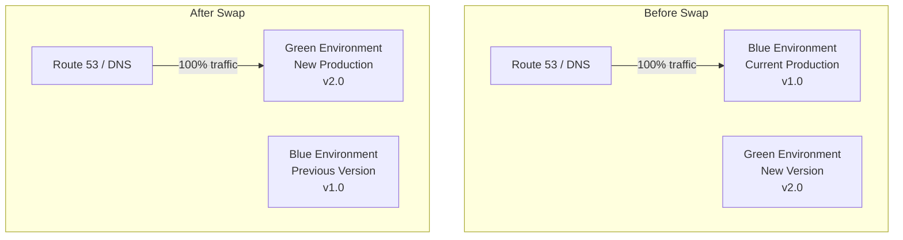
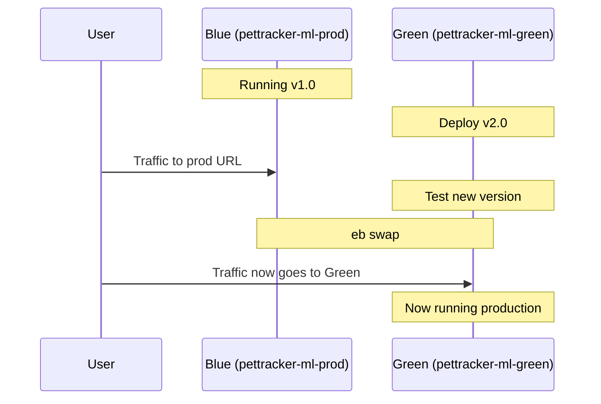
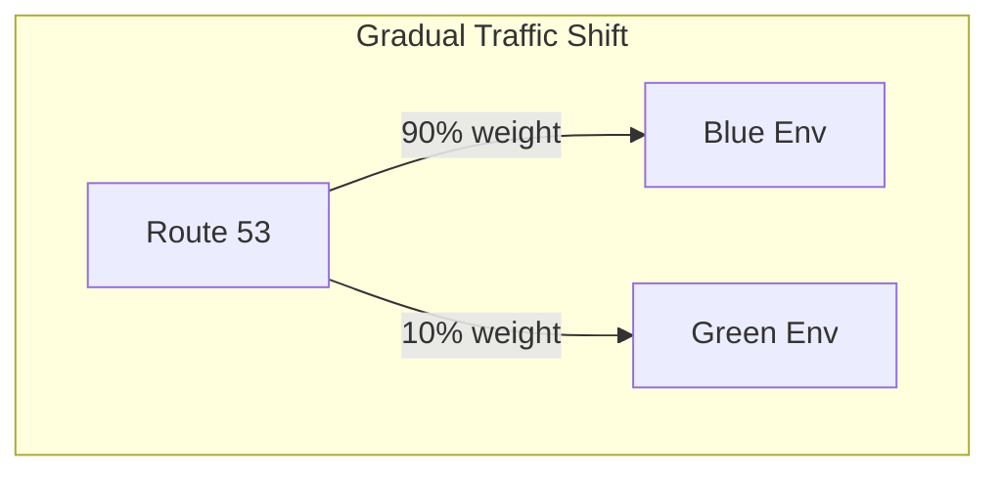
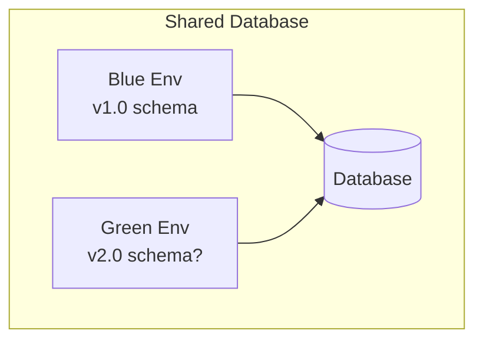

# Blue/Green Deployments

## Alex's Zero-Downtime Dream

Alex has a major update coming: new ML model with improved accuracy and API changes. The stakes are high.

"What if the new version has a critical bug?" Alex worries. "Rolling back Immutable deployment still takes minutes."

Maya suggests: "For major releases, use blue/green deployment. Keep your current production running while you deploy and test the new version. Then swap in seconds."

## What is Blue/Green Deployment?



### Characteristics

| Aspect | Value |
|--------|-------|
| Downtime | Zero (DNS swap is instant) |
| Rollback | Instant (swap back) |
| Risk | Lowest |
| Cost | Double during deployment |
| Testing | Full testing before swap |

## Blue/Green with Beanstalk

### Method 1: Clone and Swap URLs



#### Step 1: Clone Environment

```bash
# Create green environment from blue
eb clone pettracker-ml-prod --clone_name pettracker-ml-green --exact

# Or create new with latest code
eb create pettracker-ml-green \
    --cfg production \
    --scale 2
```

#### Step 2: Deploy New Version to Green

```bash
# Switch to green environment
eb use pettracker-ml-green

# Deploy new version
eb deploy --label v2.0

# Wait for deployment
eb events -f
```

#### Step 3: Test Green Environment

```bash
# Get green environment URL
eb status pettracker-ml-green
# URL: pettracker-ml-green.us-east-1.elasticbeanstalk.com

# Run tests against green
curl https://pettracker-ml-green.us-east-1.elasticbeanstalk.com/health

# Run integration tests
pytest tests/integration/ --base-url=https://pettracker-ml-green.us-east-1.elasticbeanstalk.com
```

#### Step 4: Swap URLs

```bash
# Swap blue and green environment URLs
eb swap pettracker-ml-prod --destination_name pettracker-ml-green

# This swaps the CNAME records
# - pettracker-ml-prod.elasticbeanstalk.com now points to Green's resources
# - pettracker-ml-green.elasticbeanstalk.com now points to Blue's resources
```

#### Step 5: Verify and Cleanup

```bash
# Verify production is working
curl https://pettracker-ml-prod.us-east-1.elasticbeanstalk.com/health

# Keep blue running for quick rollback (if needed)
# After confidence period, terminate old environment
eb terminate pettracker-ml-green --force  # This is now the OLD version
```

### Method 2: Route 53 Weighted Routing

For more control over traffic shifting:



```bash
# Create weighted record set
aws route53 change-resource-record-sets \
    --hosted-zone-id Z123456 \
    --change-batch '{
        "Changes": [{
            "Action": "CREATE",
            "ResourceRecordSet": {
                "Name": "ml.pettracker.com",
                "Type": "CNAME",
                "SetIdentifier": "blue",
                "Weight": 90,
                "TTL": 60,
                "ResourceRecords": [{"Value": "pettracker-ml-prod.us-east-1.elasticbeanstalk.com"}]
            }
        }, {
            "Action": "CREATE",
            "ResourceRecordSet": {
                "Name": "ml.pettracker.com",
                "Type": "CNAME",
                "SetIdentifier": "green",
                "Weight": 10,
                "TTL": 60,
                "ResourceRecords": [{"Value": "pettracker-ml-green.us-east-1.elasticbeanstalk.com"}]
            }
        }]
    }'
```

## Alex's Blue/Green Procedure

```bash
#!/bin/bash
# blue-green-deploy.sh

set -e

BLUE_ENV="pettracker-ml-prod"
GREEN_ENV="pettracker-ml-green"
VERSION=$1

echo "=== Starting Blue/Green Deployment ==="
echo "Deploying version: $VERSION"

# Step 1: Check blue environment health
echo "Checking current production health..."
BLUE_HEALTH=$(aws elasticbeanstalk describe-environment-health \
    --environment-name $BLUE_ENV \
    --attribute-names Status \
    --query 'Status' --output text)

if [ "$BLUE_HEALTH" != "Ready" ]; then
    echo "Error: Blue environment is not healthy ($BLUE_HEALTH)"
    exit 1
fi

# Step 2: Create or update green environment
echo "Preparing green environment..."
GREEN_EXISTS=$(aws elasticbeanstalk describe-environments \
    --environment-names $GREEN_ENV \
    --query 'Environments[0].Status' --output text 2>/dev/null || echo "None")

if [ "$GREEN_EXISTS" == "None" ] || [ "$GREEN_EXISTS" == "Terminated" ]; then
    echo "Creating green environment..."
    eb create $GREEN_ENV --cfg production --scale 2
else
    echo "Green environment exists, updating..."
    eb use $GREEN_ENV
fi

# Step 3: Deploy new version to green
echo "Deploying $VERSION to green..."
eb deploy $GREEN_ENV --label $VERSION

# Wait for deployment
echo "Waiting for deployment to complete..."
aws elasticbeanstalk wait environment-updated --environment-name $GREEN_ENV

# Step 4: Run tests on green
echo "Running tests on green environment..."
GREEN_URL=$(aws elasticbeanstalk describe-environments \
    --environment-names $GREEN_ENV \
    --query 'Environments[0].CNAME' --output text)

# Health check
HTTP_STATUS=$(curl -s -o /dev/null -w "%{http_code}" "http://$GREEN_URL/health")
if [ "$HTTP_STATUS" != "200" ]; then
    echo "Error: Health check failed on green ($HTTP_STATUS)"
    exit 1
fi

# Run integration tests
pytest tests/integration/ --base-url="http://$GREEN_URL"

# Step 5: Swap environments
echo "All tests passed! Swapping environments..."
eb swap $BLUE_ENV --destination_name $GREEN_ENV

echo "=== Deployment Complete ==="
echo "New production: $GREEN_ENV (was green, now has prod URL)"
echo "Standby: $BLUE_ENV (was prod, now has green URL)"
echo ""
echo "To rollback, run: eb swap $GREEN_ENV --destination_name $BLUE_ENV"
```

## Database Considerations

Blue/green with databases requires extra care:



### Handling Schema Changes

```python
# Approach 1: Backwards-compatible migrations
# Old schema: users (id, name)
# New schema: users (id, name, email)

# Migration that works with both versions:
ALTER TABLE users ADD COLUMN email VARCHAR(255) DEFAULT NULL;

# New code handles NULL email, old code ignores it
```

```python
# Approach 2: Expand-Contract pattern
# Phase 1: Add new column (green deploys)
# Phase 2: Both environments running (green writes to both)
# Phase 3: Swap to green (now production)
# Phase 4: Remove old column (contract)
```

### Feature Flags

```python
# Use feature flags for gradual rollout
import os

NEW_MODEL_ENABLED = os.environ.get('NEW_MODEL_ENABLED', 'false') == 'true'

def predict(image):
    if NEW_MODEL_ENABLED:
        return new_model.predict(image)
    else:
        return old_model.predict(image)
```

## Rollback Procedure

If issues are detected after swap:

```bash
# Immediate rollback - just swap back!
eb swap pettracker-ml-prod --destination_name pettracker-ml-green

# Traffic immediately returns to previous version
```

## Cost Optimization

Blue/green doubles costs during deployment:

```bash
# Minimize cost window
# 1. Deploy to green
# 2. Test quickly but thoroughly
# 3. Swap
# 4. Monitor for issues (30 min - 1 hour)
# 5. Terminate old environment

# Or scale down the standby
aws elasticbeanstalk update-environment \
    --environment-name pettracker-ml-green \
    --option-settings \
        Namespace=aws:autoscaling:asg,OptionName=MinSize,Value=1 \
        Namespace=aws:autoscaling:asg,OptionName=MaxSize,Value=1
```

## Exam Tips

**For DVA-C02:**

1. **eb swap** swaps environment CNAMEs
2. **URL swap is instant** - no DNS propagation for EB URLs
3. **Rollback is instant** - just swap back
4. **Database shared** - must handle schema compatibility
5. **Costs double** during blue/green period

**Common scenarios:**

> "Zero-downtime deployment with instant rollback..."
> → Blue/Green deployment

> "Test new version with production data..."
> → Clone environment, test with read replica

> "Gradual traffic shift between versions..."
> → Route 53 weighted routing

## Key Takeaways

1. **Blue/Green** provides zero-downtime deployments
2. **eb swap** instantly switches traffic
3. **Rollback is instant** - swap back
4. **Test thoroughly** on green before swapping
5. **Database changes** require careful handling
6. **Keep standby** for quick rollback capability

---

*Next: Alex masters monitoring and troubleshooting Beanstalk applications.*
