# Monitoring and Troubleshooting

## Alex's Debugging Session

Alex's deployment looked successful, but users report slow responses. The EB console shows "Yellow" health. Time to investigate.

## Environment Health

### Health Colors

```mermaid
graph LR
    subgraph "Health Status"
        Green[🟢 Green<br/>All instances healthy]
        Yellow[🟡 Yellow<br/>Some instances with warnings]
        Red[🔴 Red<br/>Many/all instances failing]
        Grey[⚪ Grey<br/>Environment updating]
    end
```



### Enhanced Health Reporting

```bash
# Enable enhanced health
aws elasticbeanstalk update-environment \
    --environment-name pettracker-ml-prod \
    --option-settings \
        Namespace=aws:elasticbeanstalk:healthreporting:system,OptionName=SystemType,Value=enhanced

# View enhanced health
eb health
# Shows per-instance health, request stats, and causes
```

### Health Dashboard

```bash
eb health pettracker-ml-prod --refresh

# Output:
Environment Health:  Yellow (Warning)
                     Instance Health
instance-id         status     cause                    cpu    memory  load   requests  p99
i-abc123           Warning    High response time       45%    78%     2.1    125       2.8s
i-def456           Ok                                  32%    65%     1.5    118       0.5s

Overall             Warning    1 instance with high response time
```

## CloudWatch Logs

### View Logs via EB CLI

```bash
# Get recent logs
eb logs

# Stream logs in real-time
eb logs --stream

# Get all logs (bundled)
eb logs --all

# Specific log file
eb logs --log-group /aws/elasticbeanstalk/pettracker-ml-prod/var/log/web.stdout.log
```

### Log Locations

```bash
# SSH to instance and view directly
eb ssh

# Application logs
tail -f /var/log/web.stdout.log

# EB engine logs
tail -f /var/log/eb-engine.log

# Nginx logs
tail -f /var/log/nginx/access.log
tail -f /var/log/nginx/error.log

# Deployment logs
tail -f /var/log/eb-activity.log

# cfn-init logs (.ebextensions)
tail -f /var/log/cfn-init.log
tail -f /var/log/cfn-init-cmd.log
```

### Configure Log Streaming to CloudWatch

```yaml
# .ebextensions/logging.config
option_settings:
  aws:elasticbeanstalk:cloudwatch:logs:
    StreamLogs: true
    DeleteOnTerminate: false
    RetentionInDays: 30
```

## Common Issues and Solutions

### Issue 1: Deployment Failed

```bash
# Check deployment events
eb events

# Sample error:
2024-01-15 10:30:45    ERROR   During an aborted deployment, some instances may have deployed
                               the new application version. To restore a consistent state,
                               do one of the following: [...redeploy previous version...]
```

**Solution**: Check `.ebextensions` syntax, review logs

```bash
# View cfn-init logs for .ebextensions errors
eb ssh --command "sudo cat /var/log/cfn-init.log | tail -100"
```

### Issue 2: Health Check Failing

```bash
# Check health check path
curl -v http://localhost:8080/health

# Sample error:
< HTTP/1.1 503 Service Unavailable
```

**Solutions**:

```yaml
# .ebextensions/health.config
option_settings:
  # Increase health check timeout
  aws:elasticbeanstalk:environment:process:default:
    HealthCheckPath: /health
    HealthCheckTimeout: 10
    HealthCheckInterval: 15

  # Or match your actual health endpoint
  aws:elasticbeanstalk:application:
    Application Healthcheck URL: /api/health
```

### Issue 3: High Response Time

```bash
# Check instance metrics
eb health --refresh

# instance i-abc123 showing high response time (p99: 5.2s)
```

**Investigation**:

```bash
# SSH and check processes
eb ssh
top  # Check CPU usage
free -h  # Check memory

# Check application logs for slow queries
grep "slow" /var/log/web.stdout.log

# Check nginx logs for timeouts
grep "504" /var/log/nginx/error.log
```

**Solutions**:

```yaml
# Scale up instance type
option_settings:
  aws:autoscaling:launchconfiguration:
    InstanceType: c5.xlarge

# Or add more instances
option_settings:
  aws:autoscaling:asg:
    MinSize: 4
```

### Issue 4: Out of Memory

```bash
# Check for OOM killer
eb ssh --command "dmesg | grep -i 'out of memory'"
```

**Solution**:

```yaml
# Increase instance size
option_settings:
  aws:autoscaling:launchconfiguration:
    InstanceType: r5.large  # Memory optimized
```

### Issue 5: Deployment Stuck

```bash
eb events
# Shows "Deployment is still in progress"
```

**Solutions**:

```bash
# Check instance count
aws elasticbeanstalk describe-environment-resources \
    --environment-name pettracker-ml-prod

# If instances stuck in pending, might be capacity issue
# Try different AZ or instance type

# Abort stuck deployment
aws elasticbeanstalk abort-environment-update \
    --environment-name pettracker-ml-prod
```

## CloudWatch Metrics

### Built-in Metrics

```bash
# View available metrics
aws cloudwatch list-metrics \
    --namespace AWS/ElasticBeanstalk \
    --dimensions Name=EnvironmentName,Value=pettracker-ml-prod

# Key metrics:
# - EnvironmentHealth
# - InstancesOk
# - InstancesWarning
# - InstancesSevere
# - ApplicationRequestsTotal
# - ApplicationRequests2xx/4xx/5xx
# - ApplicationLatencyP99
```

### Custom CloudWatch Alarms

```yaml
# .ebextensions/alarms.config
Resources:
  HighLatencyAlarm:
    Type: AWS::CloudWatch::Alarm
    Properties:
      AlarmName: pettracker-ml-high-latency
      AlarmDescription: P99 latency too high
      Namespace: AWS/ElasticBeanstalk
      MetricName: ApplicationLatencyP99
      Dimensions:
        - Name: EnvironmentName
          Value: { "Ref": "AWSEBEnvironmentName" }
      Statistic: Average
      Period: 300
      EvaluationPeriods: 2
      Threshold: 2
      ComparisonOperator: GreaterThanThreshold
      AlarmActions:
        - arn:aws:sns:us-east-1:123456789012:pettracker-alerts

  HighErrorRateAlarm:
    Type: AWS::CloudWatch::Alarm
    Properties:
      AlarmName: pettracker-ml-errors
      MetricName: ApplicationRequests5xx
      Namespace: AWS/ElasticBeanstalk
      Dimensions:
        - Name: EnvironmentName
          Value: { "Ref": "AWSEBEnvironmentName" }
      Statistic: Sum
      Period: 60
      EvaluationPeriods: 5
      Threshold: 100
      ComparisonOperator: GreaterThanThreshold
```

## Alex's Troubleshooting Runbook

```markdown
## PetTracker ML Troubleshooting Guide

### Yellow Health
1. Run `eb health --refresh` to identify problem instance
2. Check `eb logs` for application errors
3. SSH and check CPU/memory: `top`, `free -h`
4. Check nginx errors: `/var/log/nginx/error.log`
5. Verify health endpoint: `curl localhost:8080/health`

### Red Health
1. Check `eb events` for deployment errors
2. View `/var/log/cfn-init.log` for .ebextensions issues
3. Check `/var/log/eb-engine.log` for platform errors
4. Verify security groups allow health check traffic
5. Consider rolling back: `eb deploy --version <previous>`

### Deployment Failed
1. Check `eb events` for specific error
2. Verify .ebextensions YAML syntax
3. Check `/var/log/cfn-init-cmd.log` for command failures
4. Test container_commands locally
5. Verify IAM role permissions

### High Latency
1. Check CloudWatch metrics for CPU/memory
2. Review application logs for slow operations
3. Check database connection pool
4. Verify instance type is appropriate
5. Consider scaling horizontally
```

## Proactive Monitoring Setup

```yaml
# .ebextensions/monitoring.config
option_settings:
  # Enhanced health reporting
  aws:elasticbeanstalk:healthreporting:system:
    SystemType: enhanced
    HealthCheckSuccessThreshold: Ok

  # CloudWatch logs
  aws:elasticbeanstalk:cloudwatch:logs:
    StreamLogs: true
    RetentionInDays: 14

  # Environment notifications
  aws:elasticbeanstalk:sns:topics:
    Notification Endpoint: ops@pettracker.com
    Notification Protocol: email

Resources:
  # Dashboard
  MonitoringDashboard:
    Type: AWS::CloudWatch::Dashboard
    Properties:
      DashboardName: pettracker-ml-dashboard
      DashboardBody: !Sub |
        {
          "widgets": [
            {
              "type": "metric",
              "properties": {
                "metrics": [
                  ["AWS/ElasticBeanstalk", "ApplicationLatencyP99", "EnvironmentName", "${AWSEBEnvironmentName}"]
                ],
                "title": "P99 Latency"
              }
            }
          ]
        }
```

## Exam Tips

**For DVA-C02:**

1. **eb logs** retrieves application and platform logs
2. **Enhanced health** provides detailed instance metrics
3. **cfn-init.log** shows .ebextensions errors
4. **Health colors**: Green (ok), Yellow (warning), Red (severe)
5. **eb events** shows environment activity timeline

**Common scenarios:**

> "Deployment failed, need to find cause..."
> → Check eb events, /var/log/cfn-init.log

> "Application slow but health is green..."
> → Check CloudWatch metrics, application logs

> "Want notifications on environment issues..."
> → Configure SNS notifications in option_settings

## Key Takeaways

1. **Enhanced health** provides detailed diagnostics
2. **eb logs** is the first stop for debugging
3. **Multiple log files** for different components
4. **CloudWatch integration** for metrics and alarms
5. **Create runbooks** for common issues
6. **Proactive monitoring** prevents surprises

---

*Next: Alex brings it all together with a complete production setup.*
