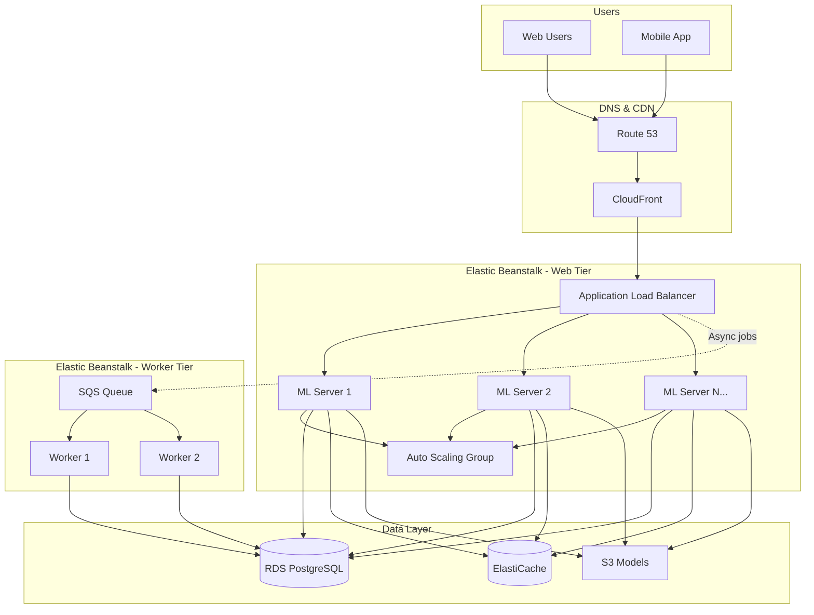

# Alex's Solution: Automated Deployments

## The Transformation

It's been three weeks since Alex started with Elastic Beanstalk. The contrast is striking.

### Before: Manual EC2 Deployments

```
Time to deploy: 45 minutes per server
Servers: 2 (soon 5)
Total deployment time: 1.5 hours (soon 3+ hours)
Deployment frequency: Once a week (scared to deploy more)
Rollback time: 30+ minutes (manual process)
Success rate: ~85% (manual errors)
3 AM deployments: Yes, frequently
```

### After: Elastic Beanstalk

```
Time to deploy: 5 minutes (eb deploy)
Servers: Auto-managed (2-10)
Total deployment time: 5 minutes regardless of server count
Deployment frequency: Multiple times daily
Rollback time: Instant (eb swap or eb deploy --version)
Success rate: 99%+ (automated, tested process)
3 AM deployments: None (confident in process)
```

## Alex's Production Architecture



## Project Structure

```
pettracker-ml/
├── .ebextensions/
│   ├── 01-packages.config
│   ├── 02-environment.config
│   ├── 03-scaling.config
│   ├── 04-healthcheck.config
│   └── 05-logging.config
├── .elasticbeanstalk/
│   ├── config.yml
│   └── saved_configs/
│       ├── development.cfg.yml
│       ├── staging.cfg.yml
│       └── production.cfg.yml
├── .platform/
│   ├── hooks/
│   │   ├── prebuild/
│   │   │   └── 01_install_deps.sh
│   │   ├── predeploy/
│   │   │   └── 01_warm_model.sh
│   │   └── postdeploy/
│   │       └── 01_notify.sh
│   └── nginx/
│       └── conf.d/
│           └── proxy.conf
├── application.py
├── requirements.txt
├── Procfile
├── cron.yaml
└── scripts/
    ├── deploy.sh
    └── blue-green.sh
```

## Configuration Files

### .ebextensions/01-packages.config

```yaml
packages:
  yum:
    gcc: []
    python3-devel: []
    mesa-libGL: []
```

### .ebextensions/02-environment.config

```yaml
option_settings:
  aws:elasticbeanstalk:application:environment:
    PYTHONPATH: /var/app/current
    MODEL_PATH: /var/app/current/models
    LOG_LEVEL: INFO

  aws:elasticbeanstalk:environment:
    EnvironmentType: LoadBalanced
    LoadBalancerType: application
```

### .ebextensions/03-scaling.config

```yaml
option_settings:
  aws:autoscaling:asg:
    MinSize: 2
    MaxSize: 10
    Cooldown: 300

  aws:autoscaling:trigger:
    MeasureName: CPUUtilization
    Statistic: Average
    Unit: Percent
    UpperThreshold: 70
    LowerThreshold: 30
    UpperBreachScaleIncrement: 2
    LowerBreachScaleIncrement: -1

  aws:autoscaling:launchconfiguration:
    InstanceType: c5.large
    RootVolumeType: gp3
    RootVolumeSize: 50
```

### .ebextensions/04-healthcheck.config

```yaml
option_settings:
  aws:elasticbeanstalk:environment:process:default:
    HealthCheckPath: /health
    HealthCheckInterval: 15
    HealthCheckTimeout: 5
    HealthyThresholdCount: 2
    UnhealthyThresholdCount: 3
    MatcherHTTPCode: 200

  aws:elasticbeanstalk:command:
    DeploymentPolicy: Immutable
    Timeout: 600
```

### .ebextensions/05-logging.config

```yaml
option_settings:
  aws:elasticbeanstalk:cloudwatch:logs:
    StreamLogs: true
    DeleteOnTerminate: false
    RetentionInDays: 30

  aws:elasticbeanstalk:healthreporting:system:
    SystemType: enhanced
```

## Deployment Scripts

### scripts/deploy.sh

```bash
#!/bin/bash
set -e

ENV=${1:-staging}
VERSION=$(git describe --tags --always)

echo "Deploying $VERSION to $ENV..."

# Validate environment
if [[ ! "$ENV" =~ ^(staging|production)$ ]]; then
    echo "Invalid environment. Use: staging or production"
    exit 1
fi

# Run tests first
echo "Running tests..."
pytest tests/ --tb=short

# Deploy
eb use pettracker-ml-$ENV
eb deploy --label $VERSION --message "Deployed by $(whoami)"

# Verify
echo "Verifying deployment..."
URL=$(eb status | grep CNAME | awk '{print $2}')
HTTP_CODE=$(curl -s -o /dev/null -w "%{http_code}" "http://$URL/health")

if [ "$HTTP_CODE" != "200" ]; then
    echo "Health check failed! Rolling back..."
    eb deploy --version $(eb list --all | head -2 | tail -1)
    exit 1
fi

echo "Deployment successful!"
```

### scripts/blue-green.sh

```bash
#!/bin/bash
set -e

BLUE="pettracker-ml-prod"
GREEN="pettracker-ml-green"
VERSION=$(git describe --tags --always)

echo "=== Blue/Green Deployment ==="
echo "Version: $VERSION"

# Step 1: Ensure green environment exists
echo "Step 1: Preparing green environment..."
GREEN_STATUS=$(aws elasticbeanstalk describe-environments \
    --environment-names $GREEN \
    --query 'Environments[0].Status' --output text 2>/dev/null || echo "None")

if [ "$GREEN_STATUS" == "None" ] || [ "$GREEN_STATUS" == "Terminated" ]; then
    eb clone $BLUE --clone_name $GREEN --exact
fi

# Step 2: Deploy to green
echo "Step 2: Deploying to green..."
eb use $GREEN
eb deploy --label $VERSION

# Step 3: Test green
echo "Step 3: Testing green environment..."
GREEN_URL=$(eb status | grep CNAME | awk '{print $2}')
pytest tests/integration/ --base-url="http://$GREEN_URL"

# Step 4: Swap
echo "Step 4: Swapping environments..."
read -p "Ready to swap? (yes/no): " confirm
if [ "$confirm" != "yes" ]; then
    echo "Aborted."
    exit 0
fi

eb swap $BLUE --destination_name $GREEN

echo "=== Swap Complete ==="
echo "Rollback command: eb swap $GREEN --destination_name $BLUE"
```

## CI/CD Integration

### GitHub Actions Workflow

```yaml
# .github/workflows/deploy.yml
name: Deploy to Elastic Beanstalk

on:
  push:
    branches: [main]
  workflow_dispatch:
    inputs:
      environment:
        description: 'Environment to deploy to'
        required: true
        default: 'staging'
        type: choice
        options:
          - staging
          - production

jobs:
  test:
    runs-on: ubuntu-latest
    steps:
      - uses: actions/checkout@v3
      - name: Set up Python
        uses: actions/setup-python@v4
        with:
          python-version: '3.9'
      - name: Install dependencies
        run: pip install -r requirements.txt -r requirements-dev.txt
      - name: Run tests
        run: pytest tests/ --tb=short

  deploy:
    needs: test
    runs-on: ubuntu-latest
    steps:
      - uses: actions/checkout@v3

      - name: Configure AWS credentials
        uses: aws-actions/configure-aws-credentials@v2
        with:
          aws-access-key-id: ${{ secrets.AWS_ACCESS_KEY_ID }}
          aws-secret-access-key: ${{ secrets.AWS_SECRET_ACCESS_KEY }}
          aws-region: us-east-1

      - name: Deploy to Elastic Beanstalk
        uses: einaregilsson/beanstalk-deploy@v21
        with:
          aws_access_key: ${{ secrets.AWS_ACCESS_KEY_ID }}
          aws_secret_key: ${{ secrets.AWS_SECRET_ACCESS_KEY }}
          application_name: pettracker-ml
          environment_name: pettracker-ml-${{ github.event.inputs.environment || 'staging' }}
          version_label: ${{ github.sha }}
          region: us-east-1
          deployment_package: deploy.zip

      - name: Verify deployment
        run: |
          sleep 60
          curl -f http://pettracker-ml-${{ github.event.inputs.environment || 'staging' }}.us-east-1.elasticbeanstalk.com/health
```

## Lessons Learned

### What Went Wrong (And How Alex Fixed It)

```markdown
## Mistakes and Fixes

1. **Used RDS inside Beanstalk for staging**
   - Lost test data when recreating environment
   - Fix: Always use external RDS, even for staging

2. **Forgot .ebignore, deployed node_modules**
   - Deployment took 15 minutes
   - Fix: Created comprehensive .ebignore

3. **Health check path didn't exist**
   - Environment stayed "Yellow" forever
   - Fix: Verify health endpoint before deploying

4. **Leader_only missing on migrations**
   - Database migrations ran on every instance
   - Fix: container_commands with leader_only: true

5. **Wrong deployment policy for production**
   - Used Rolling, had brief period with mixed versions
   - Fix: Switched to Immutable for clean deployments
```

### Best Practices Checklist

```markdown
## Production Readiness Checklist

### Configuration
- [ ] Saved configurations for each environment
- [ ] Environment variables via AWS Console (not in code)
- [ ] Secrets in Secrets Manager/Parameter Store
- [ ] .ebignore configured properly

### Deployment
- [ ] Immutable deployment policy for production
- [ ] Health check endpoint configured
- [ ] Deployment tested in staging first
- [ ] Blue/green for major changes

### Security
- [ ] HTTPS configured with ACM certificate
- [ ] Security groups restrict access appropriately
- [ ] IAM roles follow least privilege
- [ ] Secrets not in environment variables

### Monitoring
- [ ] Enhanced health reporting enabled
- [ ] CloudWatch logs streaming
- [ ] Alarms for latency, errors, health
- [ ] SNS notifications configured

### Database
- [ ] RDS created outside Beanstalk
- [ ] Multi-AZ for production
- [ ] Backup retention configured
- [ ] Migrations run with leader_only
```

## The Team's Reaction

Maya: "Alex, you've gone from dreading deployments to deploying multiple times a day. Impressive!"

Sam: "I especially like the blue/green setup for major releases. Very professional."

Elena (CTO): "The ML service uptime went from 99.5% to 99.95% since the migration. Great work."

Alex: "It's not just about Beanstalk. It's about having a systematic approach to deployments. The tooling just makes it easier."

## Chapter Summary

### Key Concepts Mastered

1. **Beanstalk Fundamentals**
   - Applications, environments, versions
   - Web server vs worker tiers

2. **Deployment Strategies**
   - All at once, rolling, immutable, blue/green
   - When to use each strategy

3. **Configuration**
   - .ebextensions for customization
   - .platform for hooks and nginx
   - Saved configurations for consistency

4. **Database Integration**
   - External RDS (production)
   - Connection management
   - Migration handling

5. **Monitoring & Troubleshooting**
   - Enhanced health reporting
   - CloudWatch integration
   - Log analysis

### Exam Preparation

Key topics for DVA-C02:
- Deployment policies and their characteristics
- .ebextensions syntax and sections
- container_commands vs commands
- Blue/green deployment with eb swap
- Worker tier with SQS integration
- Health check configuration

---

*Next Chapter: S3 Storage - Alex learns to store pet images and ML models efficiently.*

---
*v1.0*
