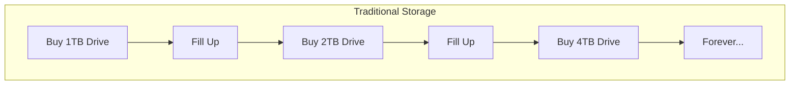
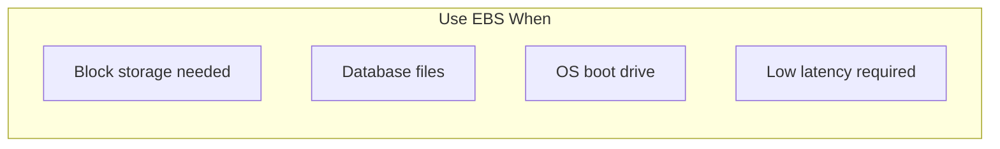
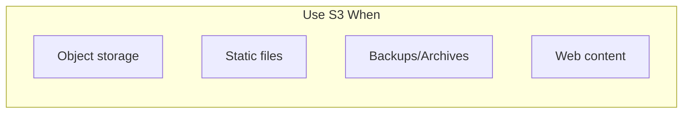
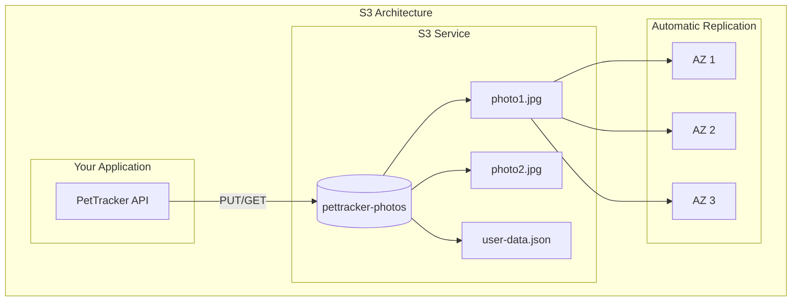
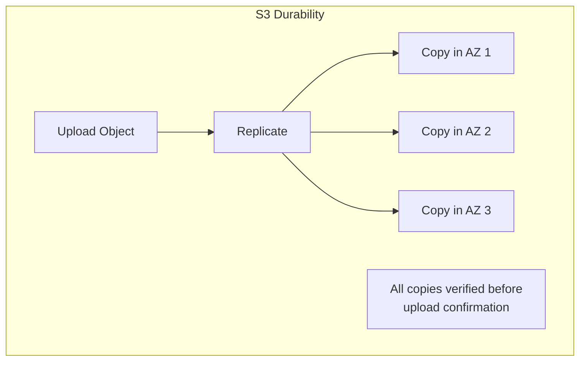
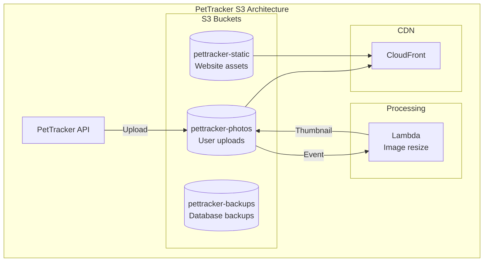
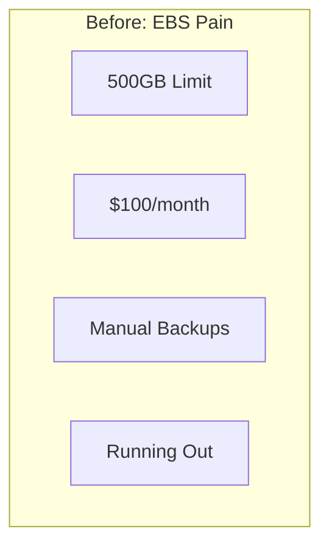
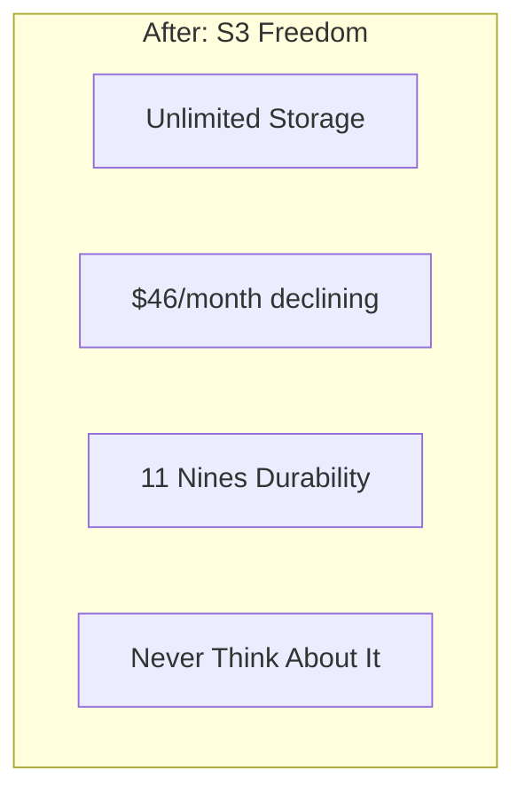

# S3 Storage: The Infinite Hard Drive in the Cloud

## The Problem With Pet Photos

PetTracker was going viral. Users loved uploading photos of their pets - morning walks, silly poses, nap time. What started as a cute feature became a storage nightmare.

"We're at 97% disk utilization," Alex announced at the team standup. "Again."

The PetTracker server ran on a 500GB EBS volume. It seemed like plenty when they launched. Three months later, they'd upgraded twice - 200GB, then 500GB - and were still running out of space.

"How much are users uploading?" Elena asked.

Alex pulled up the metrics: "About 50GB per week. At this rate, we'll need a terabyte by next month, and 5TB by year end."

"And the cost?"

"$100/month for the 500GB volume. A 5TB volume would be... $500/month. And we'd still run out eventually."

---

## "But Why Not Just Get Bigger Servers?"

This is the traditional approach to storage. Buy bigger drives. Buy more servers. Keep buying.

:::floating:right:1/2


The problems with this approach:

**Cost scales linearly** - Double the storage, double the cost. No economies of scale.

**Capacity planning is guessing** - How much will you need in 2 years? Guess wrong and you either waste money or run out of space.

**Availability is your problem** - Disk fails? Hope you have backups. Data center floods? Hope you have offsite backups.

**Performance degrades** - More files = slower directory listings, slower backups, slower everything.
:::

"We need a different approach," Sam said. "One where storage scales infinitely, costs scale with usage, and we never think about disks again."

"That sounds like magic."

"It's called S3."

---

## "But Why Not Just Use EBS?"

EBS volumes are great for certain use cases. Let's examine when S3 is better.

**EBS vs S3 Comparison:**

| Factor | EBS | S3 |
|--------|-----|-----|
| **Capacity** | Up to 64TB per volume | Unlimited |
| **Access** | Must attach to EC2 | HTTP/HTTPS from anywhere |
| **Durability** | 99.999% | 99.999999999% (11 nines) |
| **Concurrent access** | One instance (or EBS Multi-Attach) | Unlimited concurrent readers |
| **Cost (1TB)** | ~$100/month | ~$23/month |
| **Latency** | Microseconds | Milliseconds |

:::floating:left:1/2




For PetTracker's photos, S3 is the clear choice:
- Files accessed via HTTP
- Unlimited storage needed
- Cost efficiency matters
- 11 nines durability (vs 5 nines)
:::

---

## What is S3?

**Amazon Simple Storage Service (S3) is an object store that scales infinitely, costs pennies per gigabyte, and survives data center failures automatically.**



**Key S3 Concepts:**

| Concept | What It Is | Example |
|---------|-----------|---------|
| **Bucket** | Container for objects | `pettracker-photos` |
| **Object** | File + metadata | `pets/max/photo1.jpg` |
| **Key** | Object's unique identifier | `pets/max/photo1.jpg` |
| **Region** | Where bucket is created | `us-east-1` |
| **Storage Class** | Price/access tier | Standard, IA, Glacier |

---

## Alex's S3 Migration

With Sam's help, Alex migrated PetTracker's photos to S3:

```python
import boto3

s3 = boto3.client('s3')

# Upload a pet photo
def upload_pet_photo(user_id, pet_id, photo_file):
    key = f"users/{user_id}/pets/{pet_id}/{photo_file.filename}"

    s3.upload_fileobj(
        photo_file,
        'pettracker-photos',
        key,
        ExtraArgs={
            'ContentType': photo_file.content_type,
            'Metadata': {
                'uploaded-by': user_id,
                'pet-id': pet_id
            }
        }
    )

    return f"https://pettracker-photos.s3.amazonaws.com/{key}"
```

The results were immediate:

```
Before S3:
- Storage: 500GB EBS volume
- Cost: $100/month
- Capacity: Running out
- Backups: Manual, scary

After S3:
- Storage: Currently 2TB, scales infinitely
- Cost: $46/month (and dropping with lifecycle policies)
- Capacity: Unlimited
- Durability: 99.999999999% automatic
```

---

## The 11 Nines Promise

"What does 99.999999999% durability even mean?" Alex asked.

Sam did the math: "If you store 10 million objects, you can expect to lose one object every 10,000 years."

:::floating:right:1/2


**How S3 achieves 11 nines:**
- Objects automatically replicated across 3+ AZs
- Integrity checks on every read/write
- Automatic repair of corrupted data
- No single point of failure
:::

"S3 doesn't acknowledge your upload until it's safely replicated across multiple facilities," Sam explained. "By the time you get a success response, your data is protected against data center failures."

---

## What You'll Learn in This Chapter

This chapter covers S3 from basics to advanced patterns:

- **Bucket configuration** - Naming, regions, and settings
- **Object operations** - Upload, download, and presigned URLs
- **Security** - Bucket policies, ACLs, and encryption
- **Storage classes** - Optimizing cost with lifecycle policies
- **Performance** - Multipart uploads and transfer acceleration

| Concept | What It Solves |
|---------|---------------|
| **Bucket Policies** | Fine-grained access control |
| **Presigned URLs** | Time-limited access to private objects |
| **Versioning** | Protect against accidental deletion |
| **Lifecycle Policies** | Automatic cost optimization |
| **Replication** | Cross-region disaster recovery |
| **Event Notifications** | Trigger actions on uploads |

## The Architecture We're Building

:::floating:right:2/3


By chapter end, PetTracker will have:
- Photo uploads to S3 with presigned URLs
- Automatic thumbnail generation via Lambda
- CloudFront distribution for fast delivery
- Lifecycle policies moving old photos to cheaper storage
- Cross-region replication for disaster recovery
:::

## Why This Matters for the Exam

S3 is one of the most heavily tested services on DVA-C02:

- **5-8 direct questions** about S3 features
- **Architecture questions** involving S3 as storage
- **Security questions** about bucket policies and encryption
- **Cost optimization** with storage classes

| Topic | What the Exam Asks |
|-------|-------------------|
| **Access Control** | Bucket policies vs ACLs vs IAM |
| **Presigned URLs** | When and how to use them |
| **Storage Classes** | Which class for which use case |
| **Versioning** | Delete markers, MFA delete |
| **Encryption** | SSE-S3 vs SSE-KMS vs SSE-C |
| **Events** | Trigger Lambda, SQS, SNS |

## Meet the Team

Throughout this chapter:

- **Alex** - Learning cloud-native storage
- **Sam** - DevOps mentor who loves S3
- **Maya** - Frontend developer implementing uploads
- **Jordan** - Security consultant reviewing bucket policies
- **Finance Team** - Happy about the cost savings

## Chapter Roadmap

1. **Alex's Challenge** - The photo storage problem
2. **S3 Fundamentals** - Buckets, objects, and keys
3. **Uploading Objects** - SDK, CLI, and presigned URLs
4. **Bucket Policies** - Access control with JSON policies
5. **Presigned URLs** - Time-limited secure access
6. **Versioning** - Protecting against mistakes
7. **Storage Classes** - Standard, IA, Glacier, and more
8. **Lifecycle Policies** - Automated cost optimization
9. **Encryption** - Server-side and client-side options
10. **S3 Events** - Triggering Lambda on upload
11. **Performance** - Multipart uploads and optimization
12. **Alex's Solution** - The complete photo storage system

---

## The Before and After





---

*Ready to learn S3 and never worry about storage limits again? Let's start with understanding buckets, objects, and how S3's architecture makes infinite storage possible.*

---
*v2.0*
